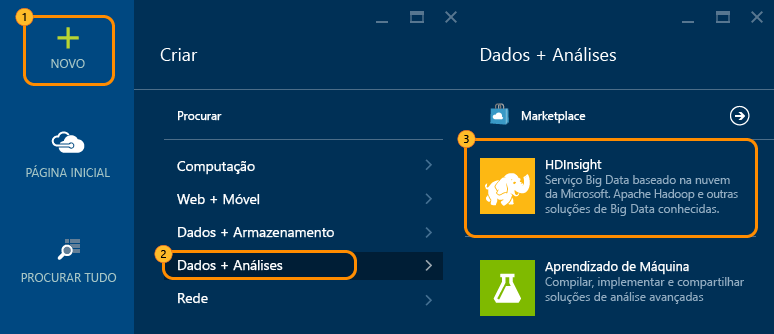
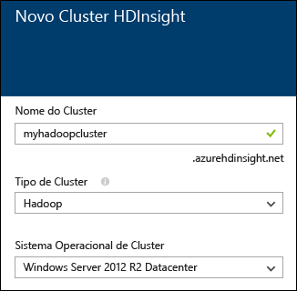
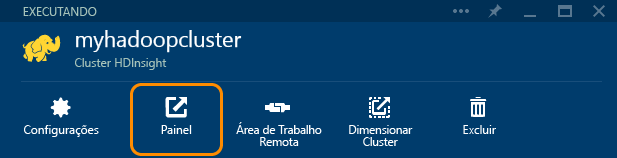

<properties
   pageTitle="Tutorial do Hadoop: Introdução ao Hadoop no Windows | Microsoft Azure"
   description="Introdução ao Hadoop no HDInsight. Saiba como criar clusters Hadoop no Windows, executar uma consulta de Hive nos dados e analisar a saída no Excel."
   keywords="tutorial do hadoop, hadoop no windows, cluster hadoop, aprender o hadoop, consulta do hive"
   services="hdinsight"
   documentationCenter=""
   authors="nitinme"
   manager="paulettm"
   editor="cgronlun"
   tags="azure-portal"/>

<tags
   ms.service="hdinsight"
   ms.devlang="na"
   ms.topic="hero-article"
   ms.tgt_pltfrm="na"
   ms.workload="big-data"
   ms.date="11/13/2015"
   ms.author="nitinme"/>

# Tutorial de hadoop: Introdução ao uso do Hadoop no HDInsight no Windows

> [AZURE.SELECTOR]
- [Windows](../hdinsight-hadoop-tutorial-get-started-windows.md)
- [Linux](../hdinsight-hadoop-linux-tutorial-get-started.md)

Para ajudá-lo a conhecer o Hadoop no Windows e começar a usar o HDInsight, este tutorial mostra como executar uma consulta de Hive em dados não estruturados em um cluster Hadoop e, em seguida, analisar os resultados no Microsoft Excel.

Suponha que você tenha um grande conjunto de dados não estruturado e deseje executar uma consulta de Hive nele para extrair algumas informações importantes. É exatamente isso que vamos fazer neste tutorial. Veja como fazer isso:

   !["Tutorial do Hadoop: criar uma conta; criar um cluster Hadoop; enviar uma consulta de Hive; analisar os dados no Excel.][image-hdi-getstarted-flow]

Assista a um vídeo de demonstração deste tutorial para aprender sobre o Hadoop no HDInsight:

![Vídeo de um primeiro tutorial do Hadoop: Enviar uma consulta de Hive em um cluster Hadoop e analisar os resultados no Excel.][img-hdi-getstarted-video]

**[Assista ao tutorial do Hadoop para HDInsight no YouTube](https://www.youtube.com/watch?v=Y4aNjnoeaHA&list=PLDrz-Fkcb9WWdY-Yp6D4fTC1ll_3lU-QS)**

Em conjunto com a disponibilidade geral do Azure HDInsight, a Microsoft também oferece o Emulador do HDInsight para o Azure, anteriormente conhecido como *Microsoft HDInsight Developer Preview*. O Emulador tem como alvo os cenários de desenvolvedor e só dá suporte a implantações de um único nó. Para obter informações sobre como usar o Emulador do HDInsight, consulte [Introdução ao Emulador do HDInsight][hdinsight-emulator].

### Pré-requisitos

Antes de começar este tutorial para Hadoop no Windows, você deve ter o seguinte:

- **Uma assinatura do Azure**. Consulte [Obter a avaliação gratuita do Azure](https://azure.microsoft.com/documentation/videos/get-azure-free-trial-for-testing-hadoop-in-hdinsight/).
- **Um computador estação de trabalho** com Office 2013 Professional Plus, Office 365 Pro Plus, Excel 2013 Standalone ou Office 2010 Professional Plus.

##Criar clusters do Hadoop

Quando cria um cluster, você cria recursos de computação do Azure que contêm o Hadoop e os aplicativos relacionados. Nesta seção, você criará um cluster do HDInsight versão 3.2. Você também pode criar clusters de Hadoop para outras versões. Para obter instruções, consulte [Criar clusters HDInsight usando opções personalizadas][hdinsight-provision]. Para obter informações sobre as versões do HDInsight e seus SLAs, consulte [Controle de versão de componentes do HDInsight](hdinsight-component-versioning.md).

**Para criar um cluster Hadoop**

1. Entre no [Portal do Azure](https://ms.portal.azure.com/).
2. Clique em **NOVO**, em **Análises de Dados** e em **HDInsight**. O portal abre uma folha **Novo Cluster HDInsight**.

    

3. Digite ou selecione o seguinte:

	
	
	|Nome do campo| Valor|
	|----------|------|
	|Nome do cluster| Um nome exclusivo para identificar o cluster|
	|Tipo de cluster| Selecione **Hadoop** para este tutorial. |
	|Sistema operacional do cluster| Selecione **Windows Server 2012 R2 Datacenter** para este tutorial.|
	|Versão do HDInsight| Selecione a versão mais recente para este tutorial.|
	|Assinatura| Selecione a assinatura do Azure que será usada para o cluster.|
	|Grupo de recursos | Selecione um grupo de recursos do Azure existente ou crie um novo. Um cluster HDInsight básico contém um cluster e sua conta de armazenamento padrão. Você pode agrupar os dois em um grupo de recursos para facilitar o gerenciamento.|
	|Credenciais| Insira o nome de logon do usuário do cluster e a senha. O cluster baseado em Windows pode ter duas contas de usuário. O usuário do cluster (ou o usuário HTTP) é usado para gerenciar o cluster e para enviar trabalhos. Opcionalmente, você pode criar uma conta de usuário de área de trabalho remota (RDP) para se conectar ao cluster remotamente. Se você optar por habilitar a área de trabalho remota, criará a conta de usuário RDP.|
	|Fonte de dados| Clique em Criar Nova para criar uma nova conta de armazenamento padrão do Azure. Use o nome do cluster como o nome de contêiner padrão. Todos os clusters HDinsight têm um contêiner de Blob padrão em uma conta de armazenamento do Azure. O local da conta de armazenamento do Azure padrão determina o local do cluster HDInsight.|
	|Tipos de preço de nó| Use um ou dois nós de trabalho com tipo de preço de nó de trabalho e de nó de cabeçalho padrão para este tutorial.|
	|Configuração opcional| Ignore esta parte.|

9. Na folha **Novo Cluster HDInsight**, certifique-se de que a opção **Fixar no Quadro Inicial** está marcada e clique em **Criar**. Isso criará o cluster e adicionará um bloco para o mesmo para o quadro inicial do seu Portal do Azure. O ícone indica que o cluster está sendo criado e que será alterado para exibir o ícone do HDInsight após a conclusão da criação.

	| Durante a criação | Criação concluída |
	| ------------------ | --------------------- |
	|  |  |

	> [AZURE.NOTE] Levará algum tempo para que o cluster seja criado, geralmente, cerca de 15 minutos. Use o bloco no Quadro Inicial ou a entrada **Notificações** à esquerda da página para verificar o processo de criação.

10. Quando a criação for concluída, clique no bloco para o cluster no quadro inicial para iniciar a folha de cluster.

## Executar uma consulta do Hive do portal
Agora que você criou um cluster HDInsight, a próxima etapa é executar um trabalho do Hive para consultar uma tabela Hive de exemplo. Vamos usar *hivesampletable*, que vem com o HDInsight. A tabela contém dados sobre fabricantes, plataformas e modelos de dispositivos móveis. Uma consulta de Hive nessa tabela recupera dados para dispositivos móveis de um fabricante específico.

> [AZURE.NOTE] As Ferramentas do HDInsight para Visual Studio vem com o SDK do Azure para .NET versão 2.5 ou posterior. Usando as ferramentas no Visual Studio, você pode se conectar ao cluster HDInsight, criar tabelas Hive e executar consultas Hive. Para obter mais informações, consulte [Introdução ao uso das ferramentas do HDInsight Hadoop para Visual Studio][1].

**Para executar um trabalho do Hive pelo painel do cluster**

1. Entre no [Portal do Azure](https://ms.portal.azure.com/).
2. Clique em **PROCURAR TUDO** e em **Clusters HDInsight** para ver uma lista de clusters, incluindo o cluster que você criou na seção anterior.
3. Clique no nome do cluster que deseja usar para executar o trabalho do Hive e clique em **Painel** na parte superior da folha.
4. Uma página da Web é aberta em uma guia diferente do navegador. Insira a conta e a senha do usuário do Hadoop. O nome de usuário padrão é **admin**; a senha é a que você inseriu durante a criação do cluster.
5. No painel, clique na guia **Editor do Hive**. A página da Web mostrada abaixo é aberta.

	![Guia Editor do Hive no painel do cluster HDInsight.][img-hdi-dashboard]

	Há várias guias na parte superior da página. A guia padrão é **Editor do Hive** e as outras guias são **Histórico de Trabalhos** e **Navegador de Arquivos**. Usando o painel, você pode enviar consultas Hive, conferir os logs de trabalho do Hadoop e procurar arquivos no armazenamento.

	> [AZURE.NOTE] Observe que a URL da página da Web é *&lt;NomeDoCluster&gt;.azurehdinsight.net*. Então, em vez de abrir o painel pelo portal, você pode usar a URL para abrir o painel em um navegador da Web.

6. Na guia **Editor do Hive**, de **Nome da Consulta**, insira **HTC20**. O nome da consulta é o cargo. No painel de consulta, insira a consulta de Hive, conforme mostrado na imagem:

	![Consulta de Hive inserida no painel de consulta do Editor do Hive.][img-hdi-dashboard-query-select]

4. Clique em **Enviar**. Demora alguns minutos para obter os resultados. A tela é atualizada a cada 30 segundos. Você também pode clicar em **Atualizar** para atualizar a tela.

    ![Resultados de uma consulta Hive listadas na parte inferior do painel do cluster.][img-hdi-dashboard-query-select-result]

5. Depois que o status mostrar que o trabalho está concluído, clique no nome de consulta na tela para ver a saída. Anote a **Hora de Início do Trabalho (UTC)**. Você precisará dela mais tarde.

    ![Hora de Início do Trabalho listada na guia Histórico de Trabalhos do painel do cluster HDInsight.][img-hdi-dashboard-query-select-result-output]

    A página também mostra a **Saída do Trabalho** e o **Log do Trabalho**. Além disso, você tem a opção de baixar o arquivo de saída (\_stdout) e o arquivo de log (\_stderr).

**Para navegar até o arquivo de saída**

1. No painel do cluster, clique em **Navegador de Arquivos**.
2. Clique no nome da conta de armazenamento, clique no nome do contêiner (que é o mesmo que o nome do cluster) e clique em **usuário**.
3. Clique em **admin** e clique na GUID que apresenta a hora da última modificação (um pouco depois da hora de início do trabalho que você anotou anteriormente). Copie esse GUID. Você precisará dele na próxima seção.

   	![O GUID do arquivo de saída da consulta de Hive listado na guia Navegador de Arquivos.][img-hdi-dashboard-query-browse-output]

##Conectar-se às ferramentas de business intelligence da Microsoft para Excel

Você pode usar o suplemento Power Query para importar a saída de trabalho do HDInsight para o Microsoft Excel, onde as ferramentas de business intelligence da Microsoft podem ser usadas para analisar os resultados mais detalhadamente.

Você deve ter o Excel 2013 ou 2010 instalado para concluir esta parte do tutorial.

**Para baixar o Microsoft Power Query para Excel**

- Baixe o Microsoft Power Query para Excel no [Centro de Download da Microsoft](http://www.microsoft.com/download/details.aspx?id=39379) e instale-o.

**Para importar dados do HDInsight**

1. Abra o Excel e crie uma nova pasta de trabalho.
3. Clique no menu **Power Query**, clique em **De Outras Fontes** e, em seguida, clique em **Do Azure HDInsight**.

	![Menu Importar do Excel PowerQuery aberto para o Azure HDInsight.][image-hdi-gettingstarted-powerquery-importdata]

3. Insira o **Nome da Conta** da conta de armazenamento de Blob do Azure que está associada ao cluster e clique em **OK**. (É a conta de armazenamento que você criou no tutorial.)
4. Insira a **Chave de Conta** da conta de armazenamento de Blob do Azure e clique em **Salvar**.
5. No painel direito, clique duas vezes no nome do blob. Por padrão, o nome do blob é idêntico ao nome do cluster.

6. Localize **stdout** na coluna **Nome**. Verifique se o GUID na coluna **Caminho da Pasta** correspondente coincide com o GUID que você copiou anteriormente. Valores correspondentes sugerem que os dados de saída correspondem ao trabalho enviado. Clique em **Binário** na coluna à esquerda de **stdout**.

	![Localizar a saída de dados pelo GUID na lista de conteúdo.][image-hdi-gettingstarted-powerquery-importdata2]

9. Clique em **Fechar e Carregar**, no canto superior esquerdo, para importar a saída de trabalho para o Excel.

##Executar amostras

Um cluster de HDInsight fornece um console de consulta que inclui uma Galeria de Introdução para executar os exemplos diretamente do portal. Você pode usar os exemplos para saber como trabalhar com o HDInsight analisando alguns cenários básicos. Esses exemplos vêm com todos os componentes necessários, como os dados para analisar e as consultas para executar nos dados. Para saber mais sobre os exemplos na Galeria de Introdução, consulte [Saiba mais sobre Hadoop no HDInsight usando a Galeria de Introdução do HDInsight](hdinsight-learn-hadoop-use-sample-gallery.md).

**Para executar a amostra**

1. No quadro inicial do Portal do Azure, clique no bloco para o cluster que você acabou de criar.
 
2. Na folha do novo cluster, clique em **Painel**. Quando solicitado, insira o nome de usuário e a senha de administrador para o cluster.

	
 
3. Na página da Web aberta, clique na guia **Galeria de Introdução** e, na categoria **Soluções com dados de exemplo**, clique no exemplo que deseja executar. Siga as instruções na página da Web para concluir o exemplo. A tabela a seguir lista alguns exemplos e fornece mais informações sobre o que cada exemplo faz.

Amostra | O que ela faz?
------ | ---------------
[Análise de dados de sensor][hdinsight-sensor-data-sample] | Aprenda a usar o HDInsight para processar dados históricos produzidos por sistemas de aquecimento, ventilação e ar-condicionado a fim de identificar sistemas que não estão conseguindo manter uma temperatura definida.
[Análise de log do site][hdinsight-weblogs-sample] | Aprenda a usar o HDInsight para analisar arquivos de log de um site para obter informações sobre a frequência de visitas provenientes de sites externos e um resumo dos erros que os usuários enfrentam no site.
[Análise de tendências do Twitter](hdinsight-analyze-twitter-data.md) | Aprenda a usar o HDInsight para analisar tendências no Twitter.

##Próximas etapas
Neste tutorial do Hadoop, você aprendeu a criar um cluster Hadoop no Windows em HDInsight, executar uma consulta de Hive nos dados e importar os resultados para o Excel, onde eles podem ser processados e exibidos graficamente usando ferramentas de business intelligence. Para saber mais, consulte os seguintes tutoriais:

- [Introdução ao uso das Ferramentas do HDInsight Hadoop para Visual Studio][1]
- [Introdução ao Emulador do HDInsight][hdinsight-emulator]
- [Usar o armazenamento de Blob do Azure com o HDInsight][hdinsight-storage]
- [Administrar o HDInsight usando o PowerShell][hdinsight-admin-powershell]
- [Carregar dados no HDInsight][hdinsight-upload-data]
- [Usar o MapReduce com o HDInsight][hdinsight-use-mapreduce]
- [Usar o Hive com o HDInsight][hdinsight-use-hive]
- [Usar o Pig com o HDInsight][hdinsight-use-pig]
- [Usar o Oozie com o HDInsight][hdinsight-use-oozie]
- [Desenvolver programas de streaming do Hadoop em C# para o HDInsight][hdinsight-develop-streaming]
- [Desenvolver programas MapReduce em Java para HDInsight][hdinsight-develop-mapreduce]

[1]: ../HDInsight/hdinsight-hadoop-visual-studio-tools-get-started.md

[hdinsight-versions]: hdinsight-component-versioning.md

[hdinsight-provision]: hdinsight-provision-clusters.md
[hdinsight-admin-powershell]: hdinsight-administer-use-powershell.md
[hdinsight-upload-data]: hdinsight-upload-data.md
[hdinsight-use-mapreduce]: hdinsight-use-mapreduce.md
[hdinsight-use-hive]: hdinsight-use-hive.md
[hdinsight-use-pig]: hdinsight-use-pig.md
[hdinsight-use-oozie]: hdinsight-use-oozie.md
[hdinsight-storage]: hdinsight-hadoop-use-blob-storage.md
[hdinsight-emulator]: hdinsight-hadoop-emulator-get-started.md
[hdinsight-develop-streaming]: hdinsight-hadoop-develop-deploy-streaming-jobs.md
[hdinsight-develop-mapreduce]: hdinsight-develop-deploy-java-mapreduce.md
[hadoop-hdinsight-intro]: hdinsight-hadoop-introduction.md
[hdinsight-weblogs-sample]: hdinsight-hive-analyze-website-log.md
[hdinsight-sensor-data-sample]: hdinsight-hive-analyze-sensor-data.md

[azure-purchase-options]: http://azure.microsoft.com/pricing/purchase-options/
[azure-member-offers]: http://azure.microsoft.com/pricing/member-offers/
[azure-free-trial]: http://azure.microsoft.com/pricing/free-trial/
[azure-management-portal]: https://ms.portal.azure.com/
[azure-create-storageaccount]: ../storage-create-storage-account.md

[apache-hadoop]: http://go.microsoft.com/fwlink/?LinkId=510084
[apache-hive]: http://go.microsoft.com/fwlink/?LinkId=510085
[apache-mapreduce]: http://go.microsoft.com/fwlink/?LinkId=510086
[apache-hdfs]: http://go.microsoft.com/fwlink/?LinkId=510087
[hdinsight-hbase-custom-provision]: hdinsight-hbase-tutorial-get-started.md

[powershell-download]: http://go.microsoft.com/fwlink/p/?linkid=320376&clcid=0x409
[powershell-install-configure]: powershell-install-configure.md
[powershell-open]: powershell-install-configure.md#step-1-install

[img-hdi-dashboard]: ./media/hdinsight-hadoop-tutorial-get-started-windows/HDI.dashboard.png
[img-hdi-dashboard-query-select]: ./media/hdinsight-hadoop-tutorial-get-started-windows/HDI.dashboard.query.select.png
[img-hdi-dashboard-query-select-result]: ./media/hdinsight-hadoop-tutorial-get-started-windows/HDI.dashboard.query.select.result.png
[img-hdi-dashboard-query-select-result-output]: ./media/hdinsight-hadoop-tutorial-get-started-windows/HDI.dashboard.query.select.result.output.png
[img-hdi-dashboard-query-browse-output]: ./media/hdinsight-hadoop-tutorial-get-started-windows/HDI.dashboard.query.browse.output.png

[img-hdi-getstarted-video]: ./media/hdinsight-hadoop-tutorial-get-started-windows/hdi-get-started-video.png

[image-hdi-storageaccount-quickcreate]: ./media/hdinsight-hadoop-tutorial-get-started-windows/HDI.StorageAccount.QuickCreate.png
[image-hdi-clusterstatus]: ./media/hdinsight-hadoop-tutorial-get-started-windows/HDI.ClusterStatus.png
[image-hdi-quickcreatecluster]: ./media/hdinsight-hadoop-tutorial-get-started-windows/HDI.QuickCreateCluster.png
[image-hdi-getstarted-flow]: ./media/hdinsight-hadoop-tutorial-get-started-windows/HDI.GetStartedFlow.png

[image-hdi-gettingstarted-powerquery-importdata]: ./media/hdinsight-hadoop-tutorial-get-started-windows/HDI.GettingStarted.PowerQuery.ImportData.png
[image-hdi-gettingstarted-powerquery-importdata2]: ./media/hdinsight-hadoop-tutorial-get-started-windows/HDI.GettingStarted.PowerQuery.ImportData2.png
 

<!---HONumber=AcomDC_0218_2016-->