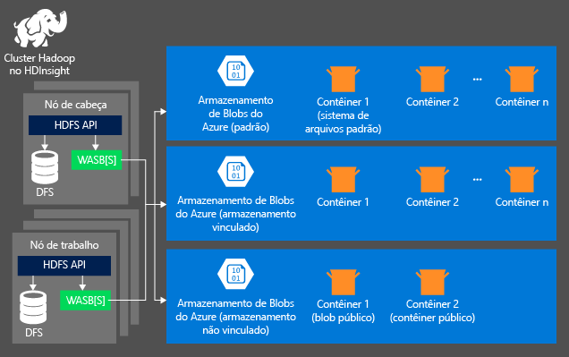

<properties
	pageTitle="Consultar dados do armazenamento de blob compatível com o HDFS | Microsoft Azure"
	description="O HDInsight usa armazenamento de Blob como armazenamento de big data para HDFS. Aprenda a consultar dados do armazenamento de blob e armazenar os resultados da análise."
	keywords="blob storage,hdfs,structured data,unstructured data"
	services="hdinsight,storage"
	documentationCenter=""
	authors="mumian"
	manager="paulettm"
	editor="cgronlun"/>

<tags
	ms.service="hdinsight"
	ms.workload="big-data"
	ms.tgt_pltfrm="na"
	ms.devlang="na"
	ms.topic="article"
	ms.date="06/10/2015"
	ms.author="jgao"/>

#Usar o armazenamento de blob do Azure compatível com HDFS com o Hadoop no HDInsight

Neste tutorial, Aprenda a usar o armazenamento de blob do Azure de baixo custo com o HDInsight, criar contas de armazenamento do Azure e contêineres de armazenamento de Blob e tratar dos dados contidos.

O armazenamento de blob do Azure é uma solução de armazenamento de uso geral que se integra perfeitamente com o HDInsight. Através de uma interface HDFS (Sistema de Arquivos Distribuído Hadoop), o conjunto completo de componentes em HDInsight pode operar diretamente sobre os dados não estruturados do armazenamento de Blob.

O armazenamento de dados no armazenamento de blob permite que os clusters HDInsight usados para cálculo sejam excluídos com segurança sem que ocorra perda de dados do usuário.

> [AZURE.NOTE]A sintaxe *asv://* não tem suporte em clusters HDInsight versão 3.0. Isso significa que qualquer trabalho enviado para um cluster HDInsight 3.0 que use explicitamente a sintaxe *asv://* falhará. Em vez disso, a sintaxe *wasb://* deve ser usada. Além disso, os trabalhos enviados para qualquer cluster HDInsight 3.0 que foram criados com um metastore existente que contenha referências explícitas a recursos usando a sintaxe asv:// falharão. Esses metastores precisarão ser recriados usando a sintaxe “wasb://” para endereçar recursos.

> Atualmente, o HDInsight dá suporte apenas a blobs de bloco.

> A maioria dos comandos HDFS (como <b>ls</b>, <b>copyFromLocal</b> e <b>mkdir</b>) ainda funciona conforme o esperado. Apenas os comandos específicos à implementação nativa do HDFS (que é conhecida como DFS), como <b>fschk</b> e <b>dfsadmin</b> terão um comportamento diferente no armazenamento de blob do Azure.

Para saber mais sobre como provisionar um cluster HDInsight, confira [Introdução ao HDInsight][hdinsight-get-started] ou [Provisionar clusters HDInsight][hdinsight-provision].

##Arquitetura de armazenamento do HDInsight
O diagrama a seguir fornece uma exibição abstrata da arquitetura de armazenamento do HDInsight:

O HDInsight fornece acesso ao sistema de arquivos distribuídos que está anexado localmente aos nós de computação. Esse sistema de arquivos pode ser acessado usando o URI totalmente qualificado, por exemplo:

	hdfs://<namenodehost>/<path>

Além disso, o HDInsight fornece a capacidade de acessar dados armazenados no armazenamento de blob do Azure. A sintaxe do é:

	wasb[s]://<containername>@<accountname>.blob.core.windows.net/<path>

O Hadoop dá suporte a uma noção do sistema de arquivos padrão. O sistema de arquivos padrão implica esquema e autoridade padrões. Ele também pode ser usado para resolver caminhos relativos. Durante o processo de provisionamento do HDInsight, uma conta de armazenamento do Azure e um contêiner de armazenamento de blob do Azure específicos dessa conta são designados como o sistema de arquivos padrão.

Além dessa conta de armazenamento, você pode adicionar mais contas de armazenamento da mesma assinatura do Azure ou de diferentes assinaturas do Azure durante o processo de provisionamento. Para saber mais sobre como adicionar mais contas de armazenamento, confira [Provisionar clusters HDInsight][hdinsight-provision].

- **Contêineres nas contas de armazenamento que estão conectadas a um cluster:** como o nome e a chave da conta são associados ao cluster durante o provisionamento, você tem acesso total aos blobs nesses contêineres.

- **Contêineres públicos ou blobs públicos nas contas de armazenamento que NÃO estão conectadas a um cluster:** você tem permissão somente leitura para os blobs nos contêineres.

	> [AZURE.NOTE]> Um contêiner público permite obter uma lista de todos os blobs disponíveis nesse contêiner e obter metadados do contêiner. Um blob público somente permite acessar os blobs se você souber a URL exata. Para saber mais, confira <a href="http://msdn.microsoft.com/library/windowsazure/dd179354.aspx">Restringir o acesso a contêineres e blobs</a>.

- **Contêineres privados nas contas de armazenamento que NÃO estão conectadas a um cluster:** não é possível acessar os blobs nos contêineres, a menos que você defina a conta de armazenamento quando envia os trabalhos do WebHCat. Isso será explicado mais adiante neste artigo.

As contas de armazenamento definidas no processo de provisionamento e suas chaves são armazenadas em % HADOOP_HOME%/conf/core-site.xml nos nós do cluster. O comportamento padrão do HDInsight é usar as contas de armazenamento definidas no arquivo core-site.xml. Não é recomendável editar o arquivo core-site.xml porque o nó principal do cluster (mestre) poderá ter outra imagem criada ou ser migrado a qualquer hora, sendo que as alterações realizadas a esses arquivos serão perdidas.

Vários trabalhos do WebHCat, incluindo Hive, MapReduce, streaming de Hadoop e Pig, podem conter uma descrição de contas de armazenamento e metadados (normalmente funciona para Pig com contas de armazenamento, mas não para metadados). (Isso funciona atualmente com o Pig para contas de armazenamento, mas não para metadados.) Na seção [Acessar blobs usando o PowerShell do Azure](#powershell) deste artigo, há um exemplo desse recurso. Para obter mais informações, consulte [Usando um Cluster HDInsight com metastores e contas de armazenamento alternativas](http://social.technet.microsoft.com/wiki/contents/articles/23256.using-an-hdinsight-cluster-with-alternate-storage-accounts-and-metastores.aspx).

O armazenamento de blob pode ser usado para dados estruturados e não estruturados. Os contêineres de armazenamento de blob armazenam dados como pares de chave/valor, e não há nenhuma hierarquia de diretório. No entanto, o caractere "/" pode ser usado dentro do nome de chave para parecer que um arquivo está armazenado em uma estrutura de diretório. Por exemplo, a chave de um blob pode ser *input/log1.txt*. Não existe nenhum diretório de *entrada* real, mas, devido à presença do caractere "/" no nome da chave, ele parece um caminho de arquivo.

###Benefícios do armazenamento de blob do Azure
O custo de desempenho implícito de não ter computação e armazenamento colocalizados é reduzido pela forma como os clusters de computação são provisionados próximos aos recursos da conta de armazenamento no datacenter do Azure, onde a rede de alta velocidade torna os nós de computação muito eficientes para acessarem os dados no armazenamento de blob do Azure.

Há vários benefícios associados ao armazenamento de dados no armazenamento de Blob em vez de no HDFS:

* **Compartilhamento e reutilização de dados:** os dados no HDFS estão localizados dentro do cluster de computação. Apenas os aplicativos que têm acesso ao cluster de computação podem usar os dados usando a API HDFS. Os dados no armazenamento de blob podem ser acessados por meio de APIs HDFS ou por meio de [APIs REST do armazenamento de Blob][blob-storage-restAPI]. Assim, um conjunto maior de aplicativos (incluindo outros clusters HDInsight) e ferramentas podem ser usados para produzir e consumir os dados.
* **Arquivamento de dados:** o armazenamento de dados no armazenamento de blob permite que os clusters HDInsight usados para cálculo sejam excluídos com segurança sem que ocorra perda de dados do usuário.
* **Custo do armazenamento de dados:** o armazenamento de dados no DFS a longo prazo é mais caro do que o armazenamento de dados no armazenamento de blob do Azure, uma vez que o custo de um cluster de computação é mais alto do que o custo de um contêiner de armazenamento de blob do Azure. Além disso, como os dados não precisam ser recarregados para cada geração de cluster de computação, você está economizando em custos de carregamento de dados.
* **Expansão elástica:** embora o HDFS forneça um sistema de arquivos expandido, a escala é determinada pelo número de nós que você provisiona para seu cluster. A alteração da escala pode se tornar um processo mais complicado do que depender dos recursos de dimensionamento elástico do armazenamento de blob do Azure que você obtém automaticamente.
* **Replicação Geográfica:** seus contêineres de armazenamento de blob do Azure podem ser replicados geograficamente através do Portal do Azure. Embora isso forneça redundância de dados e recuperação geográfica, um failover para o local replicado geograficamente afetará seriamente o desempenho e poderá incorrer em custos adicionais. Portanto, nossa recomendação é escolher a replicação geográfica com sabedoria e somente se o valor dos dados compensar o custo adicional.

Determinados trabalhos e pacotes do MapReduce podem criar resultados intermediários que você não deseja realmente armazenar no contêiner de armazenamento de blob do Azure. Nesse caso, você ainda pode optar por armazenar os dados no HDFS local. Na verdade, o HDInsight usa o DFS para vários desses resultados intermediários em trabalhos Hive e outros processos.

##Criar um contêiner de blob

Para usar blobs, primeiro você deve criar uma [conta de armazenamento][azure-storage-create] do Azure. Como parte desse processo, você deve especificar um datacenter do Azure para armazenar os objetos criados usando essa conta. O cluster e a conta de armazenamento devem ser hospedados no mesmo datacenter. O banco de dados SQL Server do metastore do Hive e o banco de dados SQL do metastore do Oozie também devem estar localizados no mesmo datacenter.

Independentemente de onde estiverem, cada blob que você criar pertencerá a um contêiner na sua conta de armazenamento do Azure. Esse contêiner pode ser um contêiner de armazenamento de blob existente criado fora do HDInsight, ou pode ser um contêiner criado para um cluster HDInsight.

Não compartilhe um contêiner de armazenamento padrão com vários clusters HDInsight. Se você precisar usar um contêiner compartilhado para fornecer acesso a dados para vários clusters HDInsight, ele deve ser adicionado como uma conta de armazenamento adicional na configuração do cluster. Para saber mais, confira [Provisionar clusters HDInsight][hdinsight-provision]. No entanto, você pode reutilizar um contêiner de armazenamento padrão depois que o cluster HDInsight original for excluído. Para clusters HBase, você pode efetivamente reter os dados e o esquema de tabela do HBase provisionando um novo cluster HBase com o uso do contêiner de armazenamento de blob padrão que é usado por um cluster HBase excluído.

###Usando o portal do Azure

Ao provisionar um cluster HDInsight no Portal do Azure, há duas opções: **Criação Rápida** e **Criação Personalizada**. A opção de criação rápida exige que a conta de Armazenamento do Azure já tenha sido criada. Para obter instruções, consulte [Como criar uma conta de armazenamento][azure-storage-create].

Usando a opção de criação rápida, você pode escolher uma conta de armazenamento existente. O processo de provisionamento cria um novo contêiner com o mesmo nome que o nome do cluster HDInsight. Se já existir um contêiner com o mesmo nome, <clusterName>-<x> será utilizado. Por exemplo, *myHDIcluster-1*. Esse contêiner é usado como o sistema de arquivos padrão.

![Usando a Criação Rápida para um novo cluster Hadoop no HDInsight no portal do Azure.][img-hdi-quick-create]

Ao usar a criação personalizada, você tem uma das opções a seguir para a conta de armazenamento padrão:

- Usar armazenamento existente
- Criar novo armazenamento
- Usar armazenamento de outra assinatura,

Você também tem a opção de criar seu próprio contêiner ou usar outro já existente.

![Opção de usar uma conta de armazenamento existente para o cluster HDInsight.][img-hdi-custom-create-storage-account]

###Usando a CLI do Azure

Se você tiver [instalado e configurado a CLI do Azure](../xplat-cli.md), o comando a seguir pode ser usado para uma conta de armazenamento e o contêiner.

	azure storage account create <storageaccountname> --type LRS

> [AZURE.NOTE]O parâmetro `--type` indica como a conta de armazenamento será replicada. Para saber mais, consulte [Replicação do armazenamento do Azure](../storage-redundancy.md)

Você será solicitado a especificar a região geográfica em que a conta de armazenamento estará localizada. Você deve criar a conta de armazenamento na mesma região em que pretende criar o cluster HDInsight.

Quando a conta de armazenamento tiver sido criada, use o seguinte comando para recuperar as chaves de conta de armazenamento:

	azure storage account keys list <storageaccountname>

Para criar um novo contêiner, use o seguinte comando:

	azure storage container create <containername> --account-name <storageaccountname> --account-key <storageaccountkey>

###Usando o PowerShell do Azure

Se tiver [instalado e configurado o PowerShell do Azure][powershell-install], você pode usar o seguinte no prompt do PowerShell do Azure para criar uma conta de armazenamento e o contêiner:

	$subscriptionName = "<SubscriptionName>"	# Azure subscription name
	$storageAccountName = "<AzureStorageAccountName>" # The storage account that you will create
	$containerName="<BlobContainerToBeCreated>" # The Blob container name that you will create

	# Connect to your Azure account and selec the current subscription
	Add-AzureAccount # The connection will expire in 12 hours.
	Select-AzureSubscription $subscriptionName #only required if you have multiple subscriptions

	# Create a storage context object
	$storageAccountkey = get-azurestoragekey $storageAccountName | %{$_.Primary}
	$destContext = New-AzureStorageContext -StorageAccountName $storageAccountName -StorageAccountKey $storageAccountKey  

	# Create a Blob storage container
	New-AzureStorageContainer -Name $containerName -Context $destContext

##Endereçar arquivos no armazenamento de blob

O esquema de URI para acessar arquivos no armazenamento de blob do HDInsight é:

	wasb[s]://<BlobStorageContainerName>@<StorageAccountName>.blob.core.windows.net/<path>

> [AZURE.NOTE]A sintaxe para endereçamento de arquivos no emulador de armazenamento (em execução no emulador do HDInsight) é <i>wasb://&lt;ContainerName&gt;@storageemulator</i>.

O esquema de URI fornece acesso sem criptografia (com o prefixo *wasb:*) e acesso criptografado SSL (com *wasbs*). É recomendável usar *wasbs* sempre que possível, mesmo ao acessar dados que residem dentro do mesmo datacenter do Azure.

O &lt;BlobStorageContainerName&gt; identifica o nome do contêiner de armazenamento de blob do Azure. O &lt;StorageAccountName&gt; identifica o nome da conta de armazenamento do Azure. Um FQDN (nome de domínio totalmente qualificado) é necessário.

Se o &lt;BlobStorageContainerName&gt; ou o &lt;StorageAccountName&gt; não for especificado, o sistema de arquivos padrão será usado. Para os arquivos no sistema de arquivos padrão, você pode usar um caminho absoluto ou um caminho relativo. Por exemplo, o arquivo *hadoop-mapreduce-examples.jar* fornecido com clusters HDInsight pode ser referenciado para usar um dos seguintes procedimentos:

	wasb://mycontainer@myaccount.blob.core.windows.net/example/jars/hadoop-mapreduce-examples.jar
	wasb:///example/jars/hadoop-mapreduce-examples.jar
	/example/jars/hadoop-mapreduce-examples.jar

> [AZURE.NOTE]O nome do arquivo é <i>hadoop-examples.jar</i> em clusters HDInsight versões 2.1 e 1.6.

O &lt;path&gt; é o nome do caminho do HDFS do arquivo ou do diretório. Como os contêineres de armazenamento de blob do Azure são apenas um repositório de chave-valor, não há nenhum sistema de arquivos hierárquico verdadeiro. Um caractere "/" dentro de uma chave de blob é interpretado como um separador de diretório. Por exemplo, o nome do blob para *hadoop-mapreduce-examples.jar* é:

	example/jars/hadoop-mapreduce-examples.jar

> [AZURE.NOTE]Ao trabalhar com blobs fora do HDInsight, a maioria dos utilitários não reconhecem o formato WASB e, em vez disso, esperam um formato de caminho básico, como `example/jars/hadoop-mapreduce-examples.jar`.

##Acessar blobs com a CLI do Azure

Use o comando a seguir para listar os comandos relacionados ao blob:

	azure storage blob

**Exemplo de como usar a CLI do Azure para carregar um arquivo**

	azure storage blob upload <sourcefilename> <containername> <blobname> --account-name <storageaccountname> --account-key <storageaccountkey>

**Exemplo de como usar a CLI do Azure para baixar um arquivo**

	azure storage blob download <containername> <blobname> <destinationfilename> --account-name <storageaccountname> --account-key <storageaccountkey>

**Exemplo de como usar a CLI do Azure para excluir um arquivo**

	azure storage blob delete <containername> <blobname> --account-name <storageaccountname> --account-key <storageaccountkey>

**Exemplo de como usar a CLI do Azure para listar arquivos**

	azure storage blob list <containername> <blobname|prefix> --account-name <storageaccountname> --account-key <storageaccountkey>

##Acessar blobs com o PowerShell do Azure

> [AZURE.NOTE]Os comandos nesta seção fornecem um exemplo básico de como usar o PowerShell para acessar dados armazenados em blobs. Para obter um exemplo mais completo que é personalizado para trabalhar com o HDInsight, consulte as [Ferramentas do HDInsight](https://github.com/Blackmist/hdinsight-tools).

Use o seguinte comando para listar os cmdlets relacionados ao blob:

	Get-Command *blob*

![Lista de cmdlets do PowerShell relacionados ao blob.][img-hdi-powershell-blobcommands]

**Exemplo de como usar o PowerShell do Azure para carregar um arquivo**

Consulte [Carregar dados no HDInsight][hdinsight-upload-data].

**Exemplo de como usar o PowerShell do Azure para baixar um arquivo**

O script a seguir baixa blob de blocos na pasta atual. Antes de executar o script, altere o diretório de uma pasta na qual você tenha permissão de gravação.

	$storageAccountName = "<AzureStorageAccountName>"   # The storage account used for the default file system specified at provision.
	$containerName = "<BlobStorageContainerName>"  # The default file system container has the same name as the cluster.
	$blob = "example/data/sample.log" # The name of the blob to be downloaded.

	# Use Add-AzureAccount if you haven't connected to your Azure subscription
	#Add-AzureAccount # The connection is good for 12 hours

	# Use these two commands if you have multiple subscriptions
	#$subscriptionName = "<SubscriptionName>"
	#Select-AzureSubscription $subscriptionName

	Write-Host "Create a context object ... " -ForegroundColor Green
	$storageAccountKey = Get-AzureStorageKey $storageAccountName | %{ $_.Primary }
	$storageContext = New-AzureStorageContext -StorageAccountName $storageAccountName -StorageAccountKey $storageAccountKey  

	Write-Host "Download the blob ..." -ForegroundColor Green
	Get-AzureStorageBlobContent -Container $ContainerName -Blob $blob -Context $storageContext -Force

	Write-Host "List the downloaded file ..." -ForegroundColor Green
	cat "./$blob"

**Exemplo de como usar o PowerShell do Azure para excluir um arquivo**

O script a seguir mostra como excluir um arquivo.

	$storageAccountName = "<AzureStorageAccountName>"   # The storage account used for the default file system specified at provision.
	$containerName = "<BlobStorageContainerName>"  # The default file system container has the same name as the cluster.
	$blob = "example/data/sample.log" # The name of the blob to be downloaded.

	# Use Add-AzureAccount if you haven't connected to your Azure subscription
	#Add-AzureAccount # The connection is good for 12 hours

	# Use these two commands if you have multiple subscriptions
	#$subscriptionName = "<SubscriptionName>"
	#Select-AzureSubscription $subscriptionName

	Write-Host "Create a context object ... " -ForegroundColor Green
	$storageAccountKey = Get-AzureStorageKey $storageAccountName | %{ $_.Primary }
	$storageContext = New-AzureStorageContext -StorageAccountName $storageAccountName -StorageAccountKey $storageAccountKey  

	Write-Host "Delete the blob ..." -ForegroundColor Green
	Remove-AzureStorageBlob -Container $containerName -Context $storageContext -blob $blob

**Exemplo de como usar o PowerShell do Azure para listar os arquivos em uma pasta**

O script a seguir mostra como listar arquivos dentro de uma pasta. (O exemplo a seguir mostra como usar o cmdlet **Invoke-Hive** para executar o comando **dfs ls** para uma lista ou pasta.)

	$storageAccountName = "<AzureStorageAccountName>"   # The storage account used for the default file system specified at provision.
	$containerName = "<BlobStorageContainerName>"  # The default file system container has the same name as the cluster.
	$blobPrefix = "example/data/"

	# Use Add-AzureAccount if you haven't connected to your Azure subscription
	#Add-AzureAccount # The connection is good for 12 hours

	# Use these two commands if you have multiple subscriptions
	#$subscriptionName = "<SubscriptionName>"
	#Select-AzureSubscription $subscriptionName

	Write-Host "Create a context object ... " -ForegroundColor Green
	$storageAccountKey = Get-AzureStorageKey $storageAccountName | %{ $_.Primary }
	$storageContext = New-AzureStorageContext -StorageAccountName $storageAccountName -StorageAccountKey $storageAccountKey  

	Write-Host "List the files in $blobPrefix ..."
	Get-AzureStorageBlob -Container $containerName -Context $storageContext -prefix $blobPrefix

**Exemplo de como usar o PowerShell do Azure para executar uma consulta de Hive com uma conta de armazenamento indefinida**

Este exemplo mostra como listar uma pasta por meio de uma conta de armazenamento que não é definida durante o processo de provisionamento $clusterName = "<HDInsightClusterName>"

	$undefinedStorageAccount = "<UnboundedStorageAccountUnderTheSameSubscription>"
	$undefinedContainer = "<UnboundedBlobContainerAssociatedWithTheStorageAccount>"

	$undefinedStorageKey = Get-AzureStorageKey $undefinedStorageAccount | %{ $_.Primary }

	Use-AzureHDInsightCluster $clusterName

	$defines = @{}
	$defines.Add("fs.azure.account.key.$undefinedStorageAccount.blob.core.windows.net", $undefinedStorageKey)

	Invoke-Hive -Defines $defines -Query "dfs -ls wasb://$undefinedContainer@$undefinedStorageAccount.blob.core.windows.net/;"

##Próximas etapas

Neste artigo, você aprendeu a usar o armazenamento de blob do Azure compatível com o HDInsight, e que esse armazenamento de blob do Azure é um componente fundamental do HDInsight. Isso permite que você crie soluções de aquisição de dados para arquivamento de longo prazo escalável com o armazenamento de blob do Azure e use o HDInsight para desbloquear as informações nos dados armazenados estruturados e não estruturados.

Para saber mais, consulte os seguintes artigos:

* [Introdução ao Azure HDInsight][hdinsight-get-started]
* [Carregar dados no HDInsight][hdinsight-upload-data]
* [Usar o Hive com o HDInsight][hdinsight-use-hive]
* [Usar o Pig com o HDInsight][hdinsight-use-pig]

[powershell-install]: ../install-configure-powershell.md
[hdinsight-provision]: hdinsight-provision-clusters.md
[hdinsight-get-started]: hdinsight-hadoop-tutorial-get-started-windows.md
[hdinsight-upload-data]: hdinsight-upload-data.md
[hdinsight-use-hive]: hdinsight-use-hive.md
[hdinsight-use-pig]: hdinsight-use-pig.md

[blob-storage-restAPI]: http://msdn.microsoft.com/library/windowsazure/dd135733.aspx
[azure-storage-create]: ../storage-create-storage-account.md

[img-hdi-powershell-blobcommands]: ./media/hdinsight-hadoop-use-blob-storage/HDI.PowerShell.BlobCommands.png
[img-hdi-quick-create]: ./media/hdinsight-hadoop-use-blob-storage/HDI.QuickCreateCluster.png
[img-hdi-custom-create-storage-account]: ./media/hdinsight-hadoop-use-blob-storage/HDI.CustomCreateStorageAccount.png
 

<!---HONumber=July15_HO2-->