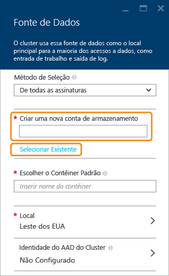

<properties
	pageTitle="Consultar dados do armazenamento de blob compatível com o HDFS | Microsoft Azure"
	description="O HDInsight usa armazenamento de Blob como armazenamento de Big Data para HDFS. Aprenda a consultar dados do armazenamento de blob e armazenar os resultados da análise."
	keywords="blob de armazenamento, hdfs, dados estruturados, dados não estruturados"
	services="hdinsight,storage"
	documentationCenter=""
	tags="azure-portal"
	authors="mumian"
	manager="paulettm"
	editor="cgronlun"/>

<tags
	ms.service="hdinsight"
	ms.workload="big-data"
	ms.tgt_pltfrm="na"
	ms.devlang="na"
	ms.topic="get-started-article"
	ms.date="01/29/2016"
	ms.author="jgao"/>

# Usar o armazenamento de blob do Azure compatível com HDFS com o Hadoop no HDInsight

Saiba como usar o armazenamento de blob de baixo custo do Azure com HDInsight, criar contas de armazenamento do Azure e contêineres de armazenamento de blob, e tratar os dados aí contidos.

O armazenamento de blob do Azure é uma solução de armazenamento de uso geral que se integra perfeitamente com o HDInsight. Através de uma interface HDFS (Sistema de Arquivos Distribuído Hadoop), o conjunto completo de componentes em HDInsight pode operar diretamente sobre os dados não estruturados do armazenamento de Blobs.

O armazenamento de dados no armazenamento de blob permite que os clusters HDInsight usados para cálculo sejam excluídos com segurança sem que ocorra perda de dados do usuário.

> [AZURE.NOTE]	A sintaxe **asv://* não tem suporte em clusters HDInsight versão 3.0. Isso significa que qualquer trabalho enviado para um cluster HDInsight 3.0 que use explicitamente a sintaxe **asv://* falhará. Em vez disso, a sintaxe **wasb://* deve ser usada. Além disso, os trabalhos enviados para qualquer cluster HDInsight 3.0 que foram criados com um metastore existente que contenha referências explícitas a recursos usando a sintaxe asv:// falharão. Esses metastores precisarão ser recriados usando a sintaxe wasb:// para endereçar recursos.

> Atualmente, o HDInsight dá suporte apenas a blobs de bloco.

> A maioria dos comandos HDFS (como <b>ls</b>, <b>copyFromLocal</b> e <b>mkdir</b>) ainda funciona conforme o esperado. Apenas os comandos específicos à implementação nativa do HDFS (que é conhecida como DFS), como <b>fschk</b> e <b>dfsadmin</b> terão um comportamento diferente no armazenamento de blob do Azure.

Para saber mais sobre como criar um cluster HDInsight, confira [Introdução ao HDInsight][hdinsight-get-started] ou [Criar clusters HDInsight][hdinsight-creation].

## Arquitetura de armazenamento do HDInsight
O diagrama a seguir fornece uma exibição abstrata da arquitetura de armazenamento do HDInsight:

O HDInsight fornece acesso ao sistema de arquivos distribuídos que está anexado localmente aos nós de computação. Esse sistema de arquivos pode ser acessado usando o URI totalmente qualificado, por exemplo:

	hdfs://<namenodehost>/<path>

Além disso, o HDInsight fornece a capacidade de acessar dados armazenados no armazenamento de blob do Azure. A sintaxe do é:

	wasb[s]://<containername>@<accountname>.blob.core.windows.net/<path>

O Hadoop dá suporte a uma noção do sistema de arquivos padrão. O sistema de arquivos padrão implica esquema e autoridade padrões. Ele também pode ser usado para resolver caminhos relativos. Durante o processo de criação do HDInsight, uma conta do Armazenamento do Azure e um contêiner de armazenamento de Blob do Azure específico dessa conta são designados como o sistema de arquivos padrão.

Além dessa conta de armazenamento, você pode adicionar mais contas de armazenamento da mesma assinatura do Azure ou de diferentes assinaturas do Azure durante o processo de criação. Para obter instruções sobre como adicionar mais contas de armazenamento, veja [Criar clusters HDInsight][hdinsight-creation].

- **Contêineres nas contas de armazenamento que estão conectadas a um cluster:** como o nome e a chave da conta são associados ao cluster durante a criação, você tem acesso completo aos blobs nesses contêineres.

- **Contêineres públicos ou blobs públicos nas contas de armazenamento que NÃO estão conectadas a um cluster:** você tem permissão somente leitura para os blobs nos contêineres.

	> [AZURE.NOTE]
        > Um contêiner público permite obter uma lista de todos os blobs disponíveis nesse contêiner e obter metadados do contêiner. Um blob público somente permite acessar os blobs se você souber a URL exata. Para saber mais, confira <a href="http://msdn.microsoft.com/library/windowsazure/dd179354.aspx">Restringir o acesso a contêineres e blobs</a>.

- **Contêineres privados nas contas de armazenamento que NÃO estão conectadas a um cluster:** não é possível acessar os blobs nos contêineres, a menos que você defina a conta de armazenamento ao enviar os trabalhos do WebHCat. Isso será explicado mais adiante neste artigo.

As contas de armazenamento definidas no processo de criação e suas chaves são armazenadas em %HADOOP\_HOME%/conf/core-site.xml nos nós do cluster. O comportamento padrão do HDInsight é usar as contas de armazenamento definidas no arquivo core-site.xml. Não é recomendável editar o arquivo core-site.xml porque o nó principal do cluster (mestre) poderá ter outra imagem criada ou ser migrado a qualquer hora, sendo que as alterações realizadas a esses arquivos serão perdidas.

Vários trabalhos do WebHCat, incluindo Hive, MapReduce, streaming de Hadoop e Pig, podem conter uma descrição de contas de armazenamento e metadados (normalmente funciona para Pig com contas de armazenamento, mas não para metadados). (Isso funciona atualmente com o Pig para contas de armazenamento, mas não para metadados.) Na seção [Acessar blobs usando o PowerShell do Azure](#powershell) deste artigo, há um exemplo desse recurso. Para obter mais informações, consulte [Usando um Cluster HDInsight com metastores e contas de armazenamento alternativas](http://social.technet.microsoft.com/wiki/contents/articles/23256.using-an-hdinsight-cluster-with-alternate-storage-accounts-and-metastores.aspx).

O armazenamento de blob pode ser usado para dados estruturados e não estruturados. Os contêineres de armazenamento de blob armazenam dados como pares de chave/valor, e não há nenhuma hierarquia de diretório. No entanto, o caractere "/" pode ser usado dentro do nome de chave para parecer que um arquivo está armazenado em uma estrutura de diretório. Por exemplo, a chave de um blob pode ser *input/log1.txt*. Não existe nenhum diretório de *entrada* real, mas, devido à presença do caractere "/" no nome da chave, ele parece um caminho de arquivo.

###Benefícios do armazenamento de blob do Azure
O custo de desempenho implícito de não ter clusters de cálculo e recursos de armazenamento colocalizados é reduzido pela forma como os clusters de cálculo são criados próximos aos recursos da conta de armazenamento na região do Azure, no qual a rede de alta velocidade torna os nós de computação muito eficientes para acessarem os dados no armazenamento de Blobs do Azure.

Há vários benefícios associados ao armazenamento de dados no armazenamento de Blob em vez de no HDFS:

* **Compartilhamento e reutilização de dados:** os dados no HDFS estão localizados dentro do cluster de computação. Apenas os aplicativos que têm acesso ao cluster de computação podem usar os dados usando a API HDFS. Os dados no armazenamento de blob podem ser acessados por meio de APIs HDFS ou por meio de [APIs REST do armazenamento de Blob][blob-storage-restAPI]. Assim, um conjunto maior de aplicativos (incluindo outros clusters HDInsight) e ferramentas podem ser usados para produzir e consumir os dados.
* **Arquivamento de dados:** o armazenamento de dados no armazenamento de blob permite que os clusters HDInsight usados para cálculo sejam excluídos com segurança sem que ocorra perda de dados do usuário.
* **Custo do armazenamento de dados:** o armazenamento de dados no DFS a longo prazo é mais caro do que o armazenamento de dados no armazenamento de blob do Azure, uma vez que o custo de um cluster de computação é mais alto do que o custo de um contêiner de armazenamento de blob do Azure. Além disso, como os dados não precisam ser recarregados para cada geração de cluster de computação, você está economizando em custos de carregamento de dados.
* **Escala horizontal elástica:** embora o HDFS forneça um sistema de arquivos escalado horizontalmente, a escala é determinada pelo número de nós que você cria para o seu cluster. A alteração da escala pode se tornar um processo mais complicado do que depender dos recursos de dimensionamento elástico do armazenamento de blob do Azure que você obtém automaticamente.
* **Replicação geográfica:** seus contêineres de armazenamento de blob do Azure podem ser replicados geograficamente. Embora isso forneça redundância de dados e recuperação geográfica, um failover para o local replicado geograficamente afetará seriamente o desempenho e poderá incorrer em custos adicionais. Portanto, nossa recomendação é escolher a replicação geográfica com sabedoria e somente se o valor dos dados compensar o custo adicional.

Determinados trabalhos e pacotes do MapReduce podem criar resultados intermediários que você não deseja realmente armazenar no contêiner de armazenamento de blob do Azure. Nesse caso, você ainda pode optar por armazenar os dados no HDFS local. Na verdade, o HDInsight usa o DFS para vários desses resultados intermediários em trabalhos Hive e outros processos.

## Criar contêineres de blob

Para usar blobs, primeiro você deve criar uma [conta de armazenamento][azure-storage-create] do Azure. Como parte desse processo, você deve especificar uma região do Azure para armazenar os objetos criados usando essa conta. O cluster e a conta de armazenamento devem ser hospedados na mesma região. O banco de dados SQL Server do metastore do Hive e o banco de dados SQL do metastore do Oozie também devem estar localizados na mesma região.

Independentemente de onde estiverem, cada blob que você criar pertencerá a um contêiner na sua conta de armazenamento do Azure. Esse contêiner pode ser um contêiner de armazenamento de blob existente criado fora do HDInsight, ou pode ser um contêiner criado para um cluster HDInsight.

O contêiner de blob padrão armazena informações específicas do cluster como logs e o histórico do trabalho. Não compartilhe um contêiner de armazenamento de blob padrão com vários clusters HDInsight. Isso pode corromper o histórico de trabalho e o cluster se comportará de forma inadequada. É recomendável usar um contêiner diferente para cada cluster e colocar os dados compartilhados em uma conta de armazenamento vinculada especificada na implantação de todos os clusters relevantes, e não na conta de armazenamento padrão. Para obter mais informações sobre como configurar contas de armazenamento vinculadas, veja [Criar clusters HDInsight][hdinsight-creation]. No entanto, você pode reutilizar um contêiner de armazenamento padrão depois que o cluster HDInsight original for excluído. Para clusters HBase, você pode realmente manter os dados e o esquema de tabela do HBase criando um novo cluster HBase com o contêiner de armazenamento de blob padrão usado por um cluster HBase que foi excluído.

### Usando o Portal do Azure

Ao criar um cluster HDInsight no Portal, você tem as opções de usar uma conta de armazenamento existente ou criar uma nova conta de armazenamento:

###Usando a CLI do Azure

[AZURE.INCLUDE [use-latest-version](../../includes/hdinsight-use-latest-cli.md)]

Se você tiver [instalado e configurado a CLI do Azure](../xplat-cli-install.md), o comando a seguir pode ser usado para uma conta de armazenamento e o contêiner.

	azure storage account create <storageaccountname> --type LRS

> [AZURE.NOTE] O parâmetro `--type` indica como a conta de armazenamento será replicada. Para saber mais, veja [Replicação do Armazenamento do Azure](../storage/storage-redundancy.md). Não use ZRS, pois o ZRS não dá suporte ao blob de páginas, arquivo, tabela ou fila.

Você será solicitado a especificar a região geográfica em que a conta de armazenamento estará localizada. Você deve criar a conta de armazenamento na mesma região em que pretende criar o cluster HDInsight.

Assim que a conta de armazenamento for criada, use o seguinte comando para recuperar as chaves de conta de armazenamento:

	azure storage account keys list <storageaccountname>

Para criar um novo contêiner, use o seguinte comando:

	azure storage container create <containername> --account-name <storageaccountname> --account-key <storageaccountkey>

### Usando o PowerShell do Azure

Se você [instalou e configurou o Azure PowerShell][powershell-install], pode usar o seguinte no prompt do Azure PowerShell para criar uma conta de armazenamento e o contêiner:

[AZURE.INCLUDE [upgrade-powershell](../../includes/hdinsight-use-latest-powershell.md)]

	$SubscriptionID = "<Your Azure Subscription ID>"
	$ResourceGroupName = "<New Azure Resource Group Name>"
	$Location = "EAST US 2"
	
	$StorageAccountName = "<New Azure Storage Account Name>"
	$containerName = "<New Azure Blob Container Name>"
	
	Add-AzureRmAccount
	Select-AzureRmSubscription -SubscriptionId $SubscriptionID
	
	# Create resource group
	New-AzureRmResourceGroup -name $ResourceGroupName -Location $Location
	
	# Create default storage account
	New-AzureRmStorageAccount -ResourceGroupName $ResourceGroupName -Name $StorageAccountName -Location $Location -Type Standard_LRS 
	
	# Create default blob containers
	$storageAccountKey = Get-AzureRmStorageAccountKey -ResourceGroupName $resourceGroupName -StorageAccountName $StorageAccountName |  %{ $_.Key1 }
	$destContext = New-AzureStorageContext -StorageAccountName $storageAccountName -StorageAccountKey $storageAccountKey  
	New-AzureStorageContainer -Name $containerName -Context $destContext

## Arquivos de endereços no armazenamento de Blob

O esquema de URI para acessar arquivos no armazenamento de blob do HDInsight é:

	wasb[s]://<BlobStorageContainerName>@<StorageAccountName>.blob.core.windows.net/<path>

> [AZURE.NOTE] A sintaxe para endereçamento de arquivos no emulador de armazenamento (em execução no emulador do HDInsight) é <i>wasb://&lt;ContainerName&gt;@storageemulator</i>.

O esquema de URI fornece acesso sem criptografia (com o prefixo *wasb:*) e acesso criptografado SSL (com *wasbs*). Recomendamos usar *wasbs* sempre que possível, mesmo ao acessar dados que residem dentro da mesma região do Azure.

O &lt;BlobStorageContainerName&gt; identifica o nome do contêiner de armazenamento de blob do Azure. O &lt;StorageAccountName&gt; identifica o nome da conta de armazenamento do Azure. Um FQDN (nome de domínio totalmente qualificado) é necessário.

Se o &lt;BlobStorageContainerName&gt; ou o &lt;StorageAccountName&gt; não for especificado, o sistema de arquivos padrão será usado. Para os arquivos no sistema de arquivos padrão, você pode usar um caminho absoluto ou um caminho relativo. Por exemplo, o arquivo *hadoop-mapreduce-examples.jar* fornecido com clusters HDInsight pode ser referenciado para usar um dos seguintes procedimentos:

	wasb://mycontainer@myaccount.blob.core.windows.net/example/jars/hadoop-mapreduce-examples.jar
	wasb:///example/jars/hadoop-mapreduce-examples.jar
	/example/jars/hadoop-mapreduce-examples.jar

> [AZURE.NOTE] O nome do arquivo é <i>hadoop-examples.jar</i> em clusters HDInsight versões 2.1 e 1.6.

O &lt;path&gt; é o nome do caminho do HDFS do arquivo ou do diretório. Como os contêineres de armazenamento de blob do Azure são apenas um repositório de chave-valor, não há nenhum sistema de arquivos hierárquico verdadeiro. Um caractere "/" dentro de uma chave de blob é interpretado como um separador de diretório. Por exemplo, o nome do blob para *hadoop-mapreduce-examples.jar* é:

	example/jars/hadoop-mapreduce-examples.jar

> [AZURE.NOTE] Ao trabalhar com blobs fora do HDInsight, a maioria dos utilitários não reconhecem o formato WASB e, em vez disso, esperam um formato de caminho básico, como `example/jars/hadoop-mapreduce-examples.jar`.

## Acessar blobs com a CLI do Azure

Use o comando a seguir para listar os comandos relacionados ao blob:

	azure storage blob

**Exemplo de como usar a CLI do Azure para carregar um arquivo**

	azure storage blob upload <sourcefilename> <containername> <blobname> --account-name <storageaccountname> --account-key <storageaccountkey>

**Exemplo de como usar a CLI do Azure para baixar um arquivo**

	azure storage blob download <containername> <blobname> <destinationfilename> --account-name <storageaccountname> --account-key <storageaccountkey>

**Exemplo de como usar a CLI do Azure para excluir um arquivo**

	azure storage blob delete <containername> <blobname> --account-name <storageaccountname> --account-key <storageaccountkey>

**Exemplo de como usar a CLI do Azure para listar arquivos**

	azure storage blob list <containername> <blobname|prefix> --account-name <storageaccountname> --account-key <storageaccountkey>

## Acessar blobs usando o Azure PowerShell

> [AZURE.NOTE] Os comandos nesta seção fornecem um exemplo básico de como usar o PowerShell para acessar dados armazenados em blobs. Para obter um exemplo mais completo que é personalizado para trabalhar com o HDInsight, consulte as [Ferramentas do HDInsight](https://github.com/Blackmist/hdinsight-tools).

Use o seguinte comando para listar os cmdlets relacionados ao blob:

	Get-Command *blob*

![Lista de cmdlets do PowerShell relacionados ao blob.][img-hdi-powershell-blobcommands]

###Carregar arquivos

Consulte [Carregar dados no HDInsight][hdinsight-upload-data].

###Baixar arquivos

O script a seguir baixa blob de blocos na pasta atual. Antes de executar o script, altere o diretório de uma pasta na qual você tenha permissão de gravação.

	$resourceGroupName = "<AzureResourceGroupName>"
	$storageAccountName = "<AzureStorageAccountName>"   # The storage account used for the default file system specified at creation.
	$containerName = "<BlobStorageContainerName>"  # The default file system container has the same name as the cluster.
	$blob = "example/data/sample.log" # The name of the blob to be downloaded.
	
	# Use Add-AzureAccount if you haven't connected to your Azure subscription
	Login-AzureRmAccount 
	Select-AzureRmSubscription -SubscriptionID "<Your Azure Subscription ID>"
	
	Write-Host "Create a context object ... " -ForegroundColor Green
	$storageAccountKey = Get-AzureRmStorageAccountKey -ResourceGroupName $resourceGroupName -Name $storageAccountName | %{ $_.key1 }
	$storageContext = New-AzureStorageContext -StorageAccountName $storageAccountName -StorageAccountKey $storageAccountKey  
	
	Write-Host "Download the blob ..." -ForegroundColor Green
	Get-AzureStorageBlobContent -Container $ContainerName -Blob $blob -Context $storageContext -Force
	
	Write-Host "List the downloaded file ..." -ForegroundColor Green
	cat "./$blob"

Ao fornecer o nome do grupo de recursos e o nome do cluster, é possível usar o seguinte código:

	$resourceGroupName = "<AzureResourceGroupName>"
	$clusterName = "<HDInsightClusterName>"
	$blob = "example/data/sample.log" # The name of the blob to be downloaded.
	
	$cluster = Get-AzureRmHDInsightCluster -ResourceGroupName $resourceGroupName -ClusterName $clusterName
	$defaultStorageAccount = $cluster.DefaultStorageAccount -replace '.blob.core.windows.net'
	$defaultStorageAccountKey = Get-AzureRmStorageAccountKey -ResourceGroupName $resourceGroupName -Name $defaultStorageAccount |  %{ $_.Key1 }
	$defaultStorageContainer = $cluster.DefaultStorageContainer
	$storageContext = New-AzureStorageContext -StorageAccountName $defaultStorageAccount -StorageAccountKey $defaultStorageAccountKey 
	
	Write-Host "Download the blob ..." -ForegroundColor Green
	Get-AzureStorageBlobContent -Container $defaultStorageContainer -Blob $blob -Context $storageContext -Force

###Excluir arquivos

	Remove-AzureStorageBlob -Container $containerName -Context $storageContext -blob $blob

###Listar arquivos

	Get-AzureStorageBlob -Container $containerName -Context $storageContext -prefix "example/data/"

###Executar consultas do Hive usando uma conta de armazenamento indefinida

Este exemplo mostra como listar uma pasta em uma conta de armazenamento que não é definida durante o processo de criação. $clusterName = "<HDInsightClusterName>"

	$undefinedStorageAccount = "<UnboundedStorageAccountUnderTheSameSubscription>"
	$undefinedContainer = "<UnboundedBlobContainerAssociatedWithTheStorageAccount>"

	$undefinedStorageKey = Get-AzureStorageKey $undefinedStorageAccount | %{ $_.Primary }

	Use-AzureRmHDInsightCluster $clusterName

	$defines = @{}
	$defines.Add("fs.azure.account.key.$undefinedStorageAccount.blob.core.windows.net", $undefinedStorageKey)

	Invoke-AzureRmHDInsightHiveJob -Defines $defines -Query "dfs -ls wasb://$undefinedContainer@$undefinedStorageAccount.blob.core.windows.net/;"

## Próximas etapas

Neste artigo, você aprendeu a usar o armazenamento de blob do Azure compatível com o HDInsight, e que esse armazenamento de blob do Azure é um componente fundamental do HDInsight. Isso permite que você crie soluções de aquisição de dados para arquivamento de longo prazo escalável com o armazenamento de blob do Azure e use o HDInsight para desbloquear as informações nos dados armazenados estruturados e não estruturados.

Para obter mais informações, consulte:

* [Introdução ao Azure HDInsight][hdinsight-get-started]
* [Carregar dados no HDInsight][hdinsight-upload-data]
* [Usar o Hive com o HDInsight][hdinsight-use-hive]
* [Usar o Pig com o HDInsight][hdinsight-use-pig]
* [Usar assinaturas de acesso compartilhado do Armazenamento do Azure para restringir o acesso a dados com o HDInsight][hdinsight-use-sas]

[hdinsight-use-sas]: hdinsight-storage-sharedaccesssignature-permissions.md
[powershell-install]: ../powershell-install-configure.md
[hdinsight-creation]: hdinsight-provision-clusters.md
[hdinsight-get-started]: hdinsight-hadoop-tutorial-get-started-windows.md
[hdinsight-upload-data]: hdinsight-upload-data.md
[hdinsight-use-hive]: hdinsight-use-hive.md
[hdinsight-use-pig]: hdinsight-use-pig.md

[blob-storage-restAPI]: http://msdn.microsoft.com/library/windowsazure/dd135733.aspx
[azure-storage-create]: ../storage/storage-create-storage-account.md

[img-hdi-powershell-blobcommands]: ./media/hdinsight-hadoop-use-blob-storage/HDI.PowerShell.BlobCommands.png
[img-hdi-quick-create]: ./media/hdinsight-hadoop-use-blob-storage/HDI.QuickCreateCluster.png
[img-hdi-custom-create-storage-account]: ./media/hdinsight-hadoop-use-blob-storage/HDI.CustomCreateStorageAccount.png

<!---HONumber=AcomDC_0427_2016-->