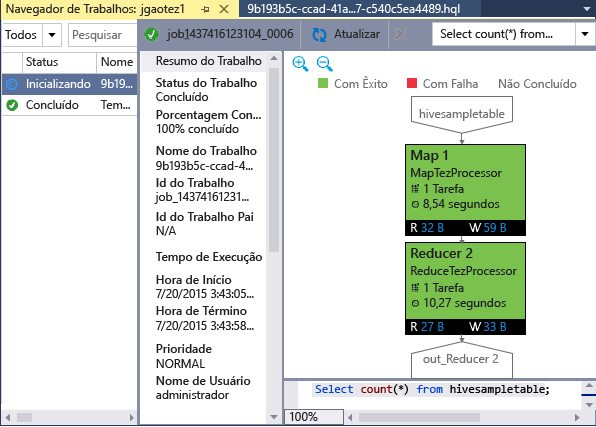

<properties
	pageTitle="Aprenda a usar as ferramentas do Hadoop do Visual Studio para o HDInsight | Microsoft Azure"
	description="Saiba como instalar e usar ferramentas do Hadoop do Visual Studio para o HDInsight para se conectar a um cluster Hadoop e executar uma consulta de Hive."
	keywords="hadoop tools,hive query,visual studio"
	services="HDInsight"
	documentationCenter=""
	tags="azure-portal"
	authors="mumian"
	manager="paulettm"
	editor="cgronlun"/>

<tags
	ms.service="hdinsight"
	ms.devlang="na"
	ms.topic="get-started-article"
	ms.tgt_pltfrm="na"
	ms.workload="big-data"
	ms.date="09/21/2015"
	ms.author="jgao"/>

# Começar a usar as ferramentas Hadoop para HDInsight do Visual Studio para executar uma consulta de Hive

Saiba como usar ferramentas o HDInsight para o Visual Studio para se conectar ao clusters HDInsight e enviar consultas Hive. Para obter mais informações sobre como usar o HDInsight, consulte [Introdução ao HDInsight][hdinsight.introduction] e [Começar a usar o HDInsight][hdinsight.get.started]. Para obter mais informações sobre como se conectar ao cluster Storm, consulte [Desenvolver topologias C# para Apache Storm no HDInsight usando o Visual Studio][hdinsight.storm.visual.studio.tools].

**Pré-requisitos**

Para concluir este tutorial e usar as ferramentas do Hadoop no Visual Studio, você precisará do seguinte:

- Um cluster Azure do HDInsight: um cluster baseado em Windows ou Linux funcionará com as etapas neste documento. Consulte o seguinte para obter informações sobre como criar um cluster:

	- [Introdução ao HDInsight baseado em Linux](hdinsight-hadoop-linux-tutorial-get-started.md)
	- [Introdução ao HDInsight baseado no Windows](hdinsight-hadoop-tutorial-get-started-windows.md)

- Uma estação de trabalho com o seguinte software:

	- Windows 8.1, Windows 8 ou Windows 7
	- Visual Studio (uma das versões a seguir):
		- Visual Studio 2013 Community/Professional/Premium/Ultimate com [Atualização 4](https://www.microsoft.com/download/details.aspx?id=44921)
		- Visual Studio 2015 (Community/Enterprise)

	>[AZURE.NOTE]Atualmente, as ferramentas de HDInsight para o Visual Studio são fornecidas apenas na versão em inglês.

## Instalar ferramentas do HDInsight para Visual Studio

As Ferramentas HDInsight para Visual Studio e o Driver ODBC do Microsoft Hive são fornecidas com o SDK do Microsoft Azure para .NET versão 2.5.1 ou posterior. Você pode instalá-lo usando o [Web Platform Installer](http://go.microsoft.com/fwlink/?LinkId=255386). Você deve escolher aquela que corresponde à sua versão do Visual Studio. Se você não tiver instalado o Visual Studio, você pode instalar a mais recente Visual Studio Community e SDK do Azure usando o [Web Platform Installer](http://go.microsoft.com/fwlink/?LinkId=255386) ou usando os links a seguir:

- [Visual Studio Community 2015 com o SDK do Microsoft Azure](https://www.microsoft.com/web/handlers/webpi.ashx/getinstaller/VS2015CommunityAzurePack.appids) 
- [Visual Studio Community 2013 com o SDK do Microsoft Azure](https://www.microsoft.com/web/handlers/webpi.ashx/getinstaller/VS2013CommunityAzurePack.appids) 
- [SDK do Microsoft Azure para .NET (VS 2015)](https://www.microsoft.com/web/handlers/webpi.ashx/getinstaller/VWDOrVs2015AzurePack.appids) 
- [SDK do Microsoft Azure para .NET (VS 2013)](https://www.microsoft.com/web/handlers/webpi.ashx/getinstaller/VWDOrVs2013AzurePack.appids) 

![Ferramentas Hadoop: Web Platform Installer de ferramentas do HDinsight para Visual Studio.][1]

## Conectar-se a assinaturas do Azure
As ferramentas do HDInsight para o Visual Studio permitem que você se conecte a seus clusters de HDInsight, execute algumas operações básicas de gerenciamento e execute consultas Hive.

>[AZURE.NOTE]Para usar o emulador de HDInsight, consulte [Introdução ao emulador do HDInsight](../hdinsight-get-started-emulator.md/#vstools).

>[AZURE.NOTE]Para obter informações sobre como se conectar a um cluster Hadoop genérico (visualização), consulte [escrever e enviar consultas Hive usando o Visual Studio](http://blogs.msdn.com/b/xiaoyong/archive/2015/05/04/how-to-write-and-submit-hive-queries-using-visual-studio.aspx).

**Para conectar-se à sua assinatura do Azure**

1.	Abra o Visual Studio.
2.	No menu **Exibir**, clique em **Gerenciador de Servidores** para abrir a janela Gerenciador de Servidores.
3.	Expanda **Azure**, então expanda **HDInsight**.

	>[AZURE.NOTE]Observe que a janela **Lista de tarefas do HDInsight** deve estar aberta. Se não estiver, clique em **Outras Janelas** no menu **Exibição** e depois clique na **Janela de Lista de Tarefas do HDInsight** para abri-la.  
4.	Insira suas credenciais de assinatura do Azure e, em seguida, clique em **Entrar**. Isso só será necessário se você nunca tiver se conectado à assinatura do Azure pelo Visual Studio nesta estação de trabalho.
5.	No Gerenciador de Servidores, você verá uma lista de clusters existentes do HDInsight. Se você não tiver nenhum cluster, poderá provisionar um usando o portal de visualização do Azure, o Azure PowerShell ou o SDK do HDInsight. Para obter mais informações, consulte [Provisionar clusters do HDInsight][hdinsight-provision].

	![Ferramentas Hadoop: lista de clusters do Gerenciador de Servidores das ferramentas do HDinsight para Visual Studio][5]
6.	Expanda um cluster do HDInsight. Você verá **Bancos de Dados do Hive**, uma conta de armazenamento padrão, contas de armazenamento vinculadas e o **Log de Serviço do Hadoop**. Você pode expandir mais as entidades.

Depois de se conectar à sua assinatura do Azure, você poderá fazer o seguinte:

**Conectar-se ao portal do Azure pelo Visual Studio**

- No Gerenciador de Servidores, expanda **Azure**, **HDInsight**, clique com o botão direito do mouse em um cluster do HDInsight e, em seguida, clique em **Gerenciar Cluster no Portal do Azure**.

**Para fazer perguntas e comentários sobre o Visual Studio**

- No menu **Ferramentas**, clique em **HDInsight** e, em seguida, clique em **Fórum do MSDN** para fazer perguntas, ou clique em **Fazer Comentários**.

## Navegue nos recursos vinculados

No Gerenciador de Servidores, pode-se visualizar a conta de armazenamento padrão e quaisquer contas de armazenamento vinculadas. Se você expandir a conta de armazenamento padrão, visualizará os contêineres na conta de armazenamento. Tanto a conta de armazenamento padrão como o contêiner padrão estão marcados. Também é possível clicar com botão direito do mouse em qualquer um dos contêineres para ver o conteúdo.

![Lista de clusters do Gerenciador de Servidores das ferramentas do HDinsight para Visual Studio][2]

## Executar um trabalho do Hive
O [Apache Hive][apache.hive] é uma infraestrutura de armazenamento de dados criado com base no Hadoop para fornecer resumo de dados, consultas e análises. As ferramentas do HDInsight para o Visual Studio dão suporte às consultas Hive em execução do Visual Studio. Para obter mais informações sobre o Hive, consulte [Usar o Hive com o HDInsight][hdinsight.hive].

Leva tempo testar o script do Hive em um cluster HDInsight. Pode levar vários minutos ou mais. As Ferramentas do HDInsight para Visual Studio podem validar o script do Hive localmente sem se conectar a um cluster ativo.

As Ferramentas do HDInsight para Visual Studio também permitem que os usuários vejam o que há dentro do trabalho do Hive coletando e identificando os logs do YARN de determinados trabalhos do Hive.

### Exibir a tabela **hivesampletable**
Todos os clusters HDInsight são fornecidos com uma tabela Hive de exemplo chamada *hivesampletable*. Usaremos esta tabela para mostrar como listar tabelas Hive, exibir os esquemas de tabela e listar as linhas da tabela Hive.

**Listar tabelas Hive e exibir o esquema da tabela Hive**

1.	De **Gerenciador de Servidores**, expanda **Azure** > **HDInsight** > o cluster de sua escolha > **Bancos de dados do Hive** > **Padrão** > **hivesampletable** para ver o esquema da tabela.
4.	Clique com o botão direito do mouse em **hivesampletable** e, em seguida, clique em **Exibir as 100 primeiras linhas** para listá-las. É o equivalente a executar a seguinte consulta Hive usando o driver ODBC do Hive:

		SELECT * FROM hivesampletable LIMIT 100

	É possível personalizar a contagem de linhas.

	![Ferramentas Hadoop: consulta de esquema do Hive do HDinsight para Visual Studio][6]

### Criar tabelas Hive

É possível usar a GUI para criar uma tabela Hive ou usar consultas Hive. Para obter informações sobre como usar consultas de Hive, consulte [Executar consultas Hive](#run.queries).

**Para criar uma tabela Hive**

1. No **Gerenciador de Servidores**, expanda **Azure**, **Clusters HDInsight**, um cluster do HDInsight, **Bancos de dados Hive**, clique com o botão direito do mouse em **Padrão** e, em seguida, clique em **Criar Tabela**.
2. Configure a tabela.
3. Clique em **Criar Tabela** para enviar o trabalho para a criação de uma nova tabela Hive.

	![Ferramentas Hadoop: criar tabela hive das ferramentas do hdinsight para visual studio][7]

### Validar e executar consultas do Hive
Há duas maneiras de criar e executar consultas Hive:

- Criar consultas locais
- Criar um aplicativo Hive

**Para criar, validar e executar consultas locais**

1. No **Gerenciador de Servidores**, expanda **Azure** e, em seguida, expanda **Clusters HDInsight**.
2. Clique com o botão direito do mouse no cluster em que você deseja executar a consulta e, em seguida, clique em **Escrever uma consulta Hive**.
3. Digite as consultas Hive. Observe que o editor Hive dá suporte a IntelliSense. Agora as Ferramentas do HDInsight para Visual Studio dão suporte à obtenção de metadados remotos quando você estiver editando o script do Hive. Por exemplo, quando você digitar "SELECT * FROM", o IntelliSense listará todos os nomes de tabela sugeridos. Quando um nome de tabela for especificado, os nomes de coluna serão listados pelo IntelliSense. A ferramenta dá suporte a quase todas as instruções DML Hive, subconsultas e UDFs internos.

	![Ferramentas Hadoop: Ferramentas do Visual Studio IntelliSense para HDInsight][13]

	![Ferramentas Hadoop: Ferramentas do Visual Studio IntelliSense para HDInsight][14]

	> [AZURE.NOTE]Apenas os metadados dos clusters selecionados na barra de ferramentas de HDInsight serão sugeridos.
4. (Opcional): clique em **Validar Script** para verificar os erros de sintaxe do script.

	![Ferramentas Hadoop: validação local das ferramentas do HDinsight para Visual Studio][10]

4. Clique em **Enviar** ou **Enviar (Avançado)**. Com a opção de envio avançado, você configurará **Nome do Trabalho**, **Argumentos**, **Configurações Adicionais** e **Diretório de Status** do script:

	![consulta de hive do hadoop hdinsight][9]

	Depois de enviar o trabalho, é possível ver uma janela **Resumo de Trabalhos do Hive**.

	![Resumo de uma consulta de Hive do HDInsight Hadoop][8]
5. Use o botão **Atualizar** para atualizar o status até que o status do trabalho seja alterado para **Concluído**.
6. Clique nos links na parte inferior para ver **Consulta de Trabalho**, **Saída de Trabalho**, **Log do Trabalho** ou **Log do Yarn**.

**Para criar e executar uma solução de Hive**

1. No menu **Arquivo**, clique em **Novo** e, em seguida, clique em **Projeto**.
2. Selecione **HDInsight** no painel esquerdo, selecione **Aplicativo Hive** no painel do meio, insira as propriedades e, em seguida, clique em **OK**.

	![Ferramentas Hadoop: novo projeto hive das ferramentas do hdinsight para visual studio][11]
3. No **Gerenciador de Soluções**, clique duas vezes em **Script.hql** para abri-lo.
4. Para validar o script do Hive, você pode clicar no botão **Validar Script** ou clicar com o botão direito do mouse no editor do Hive e clicar em **Validar Script** no menu de contexto.

### Exibir trabalhos Hive
Você pode exibir consultas de trabalho, saída do trabalho, logs de trabalho e logs do Yarn para trabalhos do Hive. Para obter mais informações, consulte a captura de tela anterior.

A versão mais recente da ferramenta permite que você veja o que está dentro de seus trabalhos do Hive coletando e identificando logs do YARN. Um log do YARN pode ajudar você investigar problemas de desempenho. Para obter mais informações sobre como o HDInsight coleta logs do YARN, consulte [Acessar Logs de Aplicativo do HDInsight Programaticamente][hdinsight.access.application.logs].

**Para exibir os trabalhos Hive**

1. No **Gerenciador de Servidores**, expanda **Azure** e, em seguida, expanda **HDInsight**.
2. Clique com o botão direito do mouse em um cluster HDInsight e em **Exibir Trabalhos**. Você verá uma lista dos trabalhos do Hive executados no cluster.
3. Clique em um trabalho na lista de trabalhos para selecioná-lo e use a janela **Resumo do Trabalho do Hive** para abrir **Consulta do Trabalho**, **Saída do Trabalho**, **Log do Trabalho** ou **Log do Yarn**.

	![Ferramentas Hadoop: exibir projetos hive das ferramentas do HDInsight para o Visual Studio][12]

### Gráfico de desempenho do trabalho do Tez Hive

As Ferramentas do Visual Studio para HDInsight dão suporte para mostrar gráficos de desempenho para os trabalhos de Hive executados pelo mecanismo de execução Tez. Para obter informações sobre como habilitar Tez, consulte [usar Hive no HDInsight][hdinsight.hive]. Depois de enviar um trabalho do Hive no Visual Studio, o Visual Studio mostrará o gráfico quando o trabalho for concluído. Talvez seja necessário clicar no botão **Atualizar** para obter o status mais recente do trabalho.

> [AZURE.NOTE]Esse recurso só está disponível para o cluster HDInsight versão acima de 3.2.4.593 e só pode funcionar para trabalhos concluídos. Isso funciona para clusters baseados em Windows e Linux.

Para ajudar você a entender melhor a consulta do Hive, a ferramenta adiciona a Exibição de Operador do Hive nesta versão. Basta clicar duas vezes nos vértices do gráfico do trabalho para ver todos os operadores dentro do vértice. Você também pode passar o mouse sobre um operador específico para exibir mais detalhes desse operador.

## Executar scripts do Pig

As Ferramentas HDInsight para Visual Studio dão suporte à criação e envio de scripts Pig para clusters do HDInsight. Os usuários podem criar um projeto Pig por meio de um modelo e então enviar o script para clusters do HDInsight.

## Próximas etapas
Neste artigo, você aprendeu como se conectar a clusters HDInsight no Visual Studio usando o pacote de ferramentas Hadoop e como executar consultas Hive. Para obter mais informações, consulte:

- [Usar o Hive do Hadoop no HDInsight][hdinsight.hive]
- [Introdução ao uso do Hadoop no HDInsight][hdinsight.get.started]
- [Enviar trabalhos Hadoop no HDInsight][hdinsight.submit.jobs]
- [Analisar dados do Twitter com Hadoop no HDInsight][hdinsight.analyze.twitter.data]

<!--Anchors-->
[Installation]: #installation
[Connect to your Azure subscription]: #connect-to-your-azure-subscription
[Navigate the linked resources]: #navigate-the-linked-resources
[Run Hive queries]: #run-hive-queries
[Next steps]: #next-steps

<!--Image references-->
[1]: ./media/hdinsight-hadoop-visual-studio-tools-get-started/hdinsight.visual.studio.tools.wpi.png
[2]: ./media/hdinsight-hadoop-visual-studio-tools-get-started/hdinsight.visual.studio.tools.linked.resources.png
[5]: ./media/hdinsight-hadoop-visual-studio-tools-get-started/hdinsight.visual.studio.tools.server.explorer.png
[6]: ./media/hdinsight-hadoop-visual-studio-tools-get-started/hdinsight.visual.studio.tools.hive.schema.png
[7]: ./media/hdinsight-hadoop-visual-studio-tools-get-started/hdinsight.visual.studio.tools.create.hive.table.png
[8]: ./media/hdinsight-hadoop-visual-studio-tools-get-started/hdinsight.visual.studio.tools.run.hive.job.summary.png
[9]: ./media/hdinsight-hadoop-visual-studio-tools-get-started/hdinsight.visual.studio.tools.submit.jobs.advanced.png
[10]: ./media/hdinsight-hadoop-visual-studio-tools-get-started/hdinsight.visual.studio.tools.validate.hive.script.png
[11]: ./media/hdinsight-hadoop-visual-studio-tools-get-started/hdinsight.visual.studio.tools.new.hive.project.png
[12]: ./media/hdinsight-hadoop-visual-studio-tools-get-started/hdinsight.visual.studio.tools.view.hive.jobs.png
[13]: ./media/hdinsight-hadoop-visual-studio-tools-get-started/hdinsight.visual.studio.tools.intellisense.table.names.png
[14]: ./media/hdinsight-hadoop-visual-studio-tools-get-started/hdinsight.visual.studio.tools.intellisense.column.names.png

<!--Link references-->
[hdinsight-provision]: ../hdinsight/hdinsight-provision-clusters.md
[hdinsight.introduction]: ../hdinsight-introduction.md
[hdinsight.get.started]: ../hdinsight-get-started.md
[hdinsight.hive]: ../hdinsight/hdinsight-use-hive.md
[hdinsight.submit.jobs]: ../hdinsight/hdinsight-submit-hadoop-jobs-programmatically.md
[hdinsight.analyze.twitter.data]: ../hdinsight/hdinsight-analyze-twitter-data.md
[hdinsight.storm.visual.studio.tools]: ../hdinsight/hdinsight-storm-develop-csharp-visual-studio-topology.md
[hdinsight.access.application.logs]: ../hdinsight/hdinsight-hadoop-access-yarn-app-logs.md

[apache.hive]: http://hive.apache.org

<!---HONumber=Sept15_HO4-->