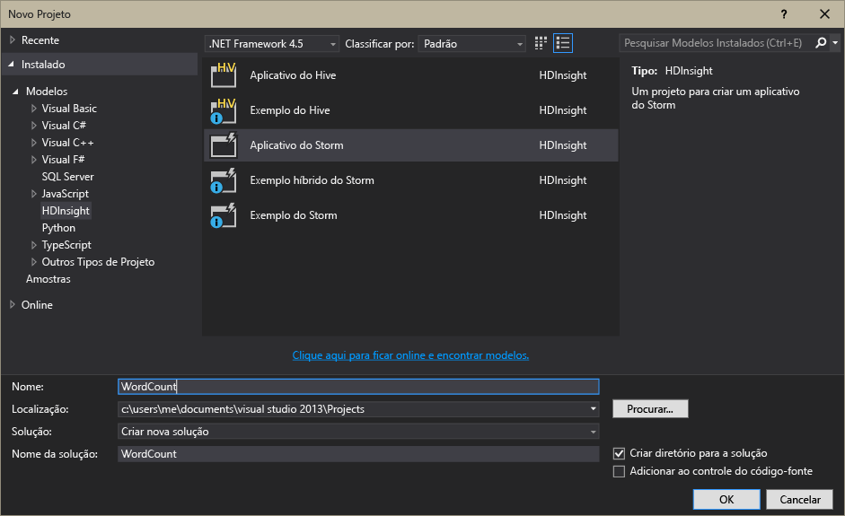

<properties
	pageTitle="Introdução ao Apache Storm no HDInsight | Microsoft Azure"
	description="Obtenha uma introdução ao Apache Storm e saiba como usar o Apache Storm no HDInsight para criar soluções de análise de dados em tempo real na nuvem."
	services="hdinsight"
	documentationCenter=""
	authors="Blackmist"
	manager="paulettm"
	editor="cgronlun"
	tags="azure-portal"/>

<tags
   ms.service="hdinsight"
   ms.devlang="na"
   ms.topic="article"
   ms.tgt_pltfrm="na"
   ms.workload="big-data"
   ms.date="11/06/2015"
   ms.author="larryfr"/>

#Introdução ao Apache Storm no HDInsight: análise em tempo real para o Hadoop

O Apache Storm no HDInsight permite que você crie soluções de análise em tempo real distribuídas no ambiente do Azure usando o [Apache Hadoop](http://hadoop.apache.org).

##O que é o Apache Storm?

O Apache Storm é um sistema de computação distribuído e tolerante a falhas, sendo um software livre, que permite processar dados em tempo real com o Hadoop. As soluções do Storm também podem oferecer um processamento de dados garantido, com a capacidade de reproduzir dados que não tenham sido processados com sucesso da primeira vez.

##Por que usar o Storm no HDInsight?

O Apache Storm no HDInsight é um cluster gerenciado integrado ao ambiente do Azure. Ele fornece os principais benefícios abaixo:

* Executa como um serviço gerenciado com um SLA de 99,9% de tempo de atividade

* Usa a sua linguagem preferida: fornece suporte para componentes Storm escritos em **Java**, **C#** e **Python**

	* Suporta uma mistura de linguagens de programação: lê dados usando o Java e os processa usando C#
	
		> [AZURE.NOTE]As topologias de c# têm suporte somente em clusters HDInsight baseados no Windows.

	* Usa a interface Java **Trident** para criar topologias Storm que dão suporte ao processamento de mensagens "exatamente uma vez", à persistência de armazenamento de dados "transacional" e a um conjunto de operações de análise de fluxo comuns

* Inclui recursos internos para escalar e reduzir verticalmente: dimensione um cluster HDInsight sem afetar a execução de topologias Storm

* Faz a integração com outros serviços do Azure, incluindo o Hub de Eventos, a Rede Virtual do Azure, o Banco de Dados SQL, o armazenamento de Blob e o Banco de Dados de Documentos

	* Combine as funcionalidades de vários clusters HDInsight usando a Rede Virtual do Azure: crie pipelines analíticas que usam clusters Hadoop, HBase ou HDInsight

Para obter uma lista de empresas que estão usando o Apache Storm em suas soluções de análise em tempo real, consulte [Empresas que estão usando o Apache Storm](https://storm.apache.org/documentation/Powered-By.html).

Para começar a usar o Storm, consulte [Introdução ao uso do Storm no HDInsight][gettingstarted].

###Facilidade de provisionamento

Você pode provisionar um novo Storm no cluster HDInsight em minutos. Especifique o nome do cluster, o tamanho, a conta de administrador e a conta de armazenamento. O Azure vai criar o cluster com topologias de exemplo e um painel de gerenciamento da Web.

> [AZURE.NOTE]Você também pode provisionar clusters Storm usando a [CLI do Azure](../xplat-cli-install.md) ou o [Azure PowerShell](../powershell-install-configure.md).

Após 15 minutos do envio da solicitação, você terá um novo cluster Storm em execução e pronto para o primeiro pipeline de análise em tempo real.

###Fácil de usar

__Para Storm baseado em Linux nos cluster HDInsight__, você pode se conectar ao cluster usando o SSH e usar o `storm` comando para iniciar e gerenciar topologias. Além disso, você pode usar a Ambari para monitorar o serviço Storm e a profusão de IU para monitorar e gerenciar as topologias em execução.

Para obter mais informações sobre como trabalhar com clusters Storm baseados em Linux, consulte [Introdução ao Apache Storm no HDInsight baseado em Linux](hdinsight-apache-storm-tutorial-get-started-linux.md).

__Para Storm baseado no Windows nos cluster HDInsight__, as ferramentas HDInsight para o Visual Studio permitem que você crie topologias C# e C#/Java, e em seguida as envie para o seu Storm no cluster HDInsight.

As Ferramentas HDInsight para Visual Studio também fornecem uma interface que permite que você monitore e gerencie topologias Storm em um cluster.

Para obter um exemplo de uso das Ferramentas HDInsight para criar um aplicativo Storm, consulte [Desenvolver topologias Storm em C# com as Ferramentas HDInsight para Visual Studio](hdinsight-storm-develop-csharp-visual-studio-topology.md).

Para saber mais sobre as Ferramentas do HDInsight para Visual Studio, consulte [Introdução ao uso das Ferramentas do HDInsight para Visual Studio](../HDInsight/hdinsight-hadoop-visual-studio-tools-get-started.md).

Cada Storm no cluster HDInsight também fornece um Painel Storm baseado na Web que permite que você envie, monitore e gerencie topologias Storm em execução no cluster.

Para obter mais informações sobre como usar o painel Storm, consulte [Implantar e gerenciar topologias Apache Storm no HDInsight](hdinsight-storm-deploy-monitor-topology.md).

O Storm no HDInsight também facilita a integração com Hubs de Eventos do Azure através do **Spout de Hub de Eventos**. Isso está disponível em cada cluster Storm em **%STORM\_HOME%\\examples\\eventhubspout\\eventhubs-storm-spout-0.9-jar-with-dependencies.jar**. Para exemplos de como usar esse spout em uma topologia Storm, consulte os seguintes documentos:

* [Desenvolver uma topologia de C# que usa os Hubs de eventos do Azure](hdinsight-storm-develop-csharp-event-hub-topology.md)

* [Desenvolver uma topologia Java que usa os Hubs de eventos do Azure](hdinsight-storm-develop-java-event-hub-topology.md)

###Confiabilidade

O Apache Storm sempre faz com que cada mensagem de entrada seja totalmente processada, mesmo quando a análise de dados é difundida por centenas de nós.

O **nó Nimbus** fornece funcionalidade semelhante ao Hadoop JobTracker e atribui tarefas a outros nós no cluster através do **Zookeeper**. Os Nós do Zookeeper fazem a coordenação do cluster e facilitam a comunicação entre o Nimbus e o processo **Supervisor** nos nós de trabalho. Quando um nó de processamento falha, o nó Nimbus é informado e atribui a tarefa e os dados associados a outro nó.

A configuração padrão do Apache Storm é ter apenas um nó Nimbus. O Storm no HDInsight executa dois nós Nimbus. Se o nó primário falhar, o cluster HDInsight alternará para o nó secundário enquanto o nó primário é recuperado.

###Escala

Embora você possa especificar o número de nós no cluster durante a criação, convém aumentar ou reduzir o cluster de acordo com a carga de trabalho. Todos os clusters HDInsight permitem que você altere o número de nós no cluster, mesmo durante o processamento de dados.

> [AZURE.NOTE]Para tirar proveito dos novos nós adicionados por meio do dimensionamento, você precisará balancear novamente as topologias iniciadas antes do tamanho do cluster ser aumentado.

###Suporte

O Storm no HDInsight é fornecido com suporte completo de nível empresarial 24 horas por dia, 7 dias por semana. O Storm no HDInsight também tem um SLA de 99,9%. Isso significa que garantimos que o cluster terá conectividade externa em, no mínimo, 99,9% do tempo.

##Casos de uso comuns de análise em tempo real

Abaixo estão alguns cenários comuns em que você pode usar o Apache Storm no HDInsight. Para obter informações sobre cenários reais, leia [Como as empresas estão usando o Storm](https://storm.incubator.apache.org/documentation/Powered-By.html).

* Internet das coisas (IoT)
* Detecção de fraude
* Análise das redes sociais
* ETL (extrair, transformar e carregar)
* Monitoramento de rede
* Pesquisar
* Mobile Engagement

##Como os dados no HDInsight Storm são processados?

O Apache Storm processa **topologias** em vez dos trabalhos do MapReduce com que você pode estar familiarizado no HDInsight ou no Hadoop. Um cluster Storm no HDInsight contém dois tipos de nós: os nós principais, que executam o **Nimbus**, e os nós de trabalho, que executam o **Supervisor**.

* **Nimbus**: semelhante ao JobTracker no Hadoop, é responsável por distribuir o código no cluster, atribuindo tarefas às máquinas virtuais e monitorando falhas. O HDInsight oferece dois nós Nimbus, de forma que não haja um único ponto de falha para Storm no HDInsight

* **Supervisor**: o supervisor de cada nó de trabalho é responsável por iniciar e interromper os **processos de trabalho** no nó.

* **Processo de trabalho**: executa um subconjunto de uma **topologia**. Uma topologia em execução é distribuída entre vários processos de trabalho no cluster.

* **Topologia**: define um gráfico de computação que processa **fluxos** de dados. Diferentemente dos trabalhos do MapReduce, as topologias são executadas até que você as interrompa.

* **Fluxo**: uma coleção não vinculada de **tuplas**. Os fluxos são produzidos por **spouts** e **bolts** e consumidos por **bolts**.

* **Tupla**: uma lista nomeada de valores inseridos dinamicamente.

* **Spout**: consome dados de uma fonte de dados e emite um ou mais **fluxos**.

	> [AZURE.NOTE]Em muitos casos, os dados são lidos de uma fila, como Kafka, filas de Barramento de Serviço do Azure ou Hubs de Eventos. A fila assegura que os dados sejam persistidos em caso de interrupção.

* **Bolt**: consome **fluxos**, realiza o processamento em **tuplas** e pode emitir **fluxos**. Os bolts também são responsáveis por gravar dados em armazenamentos externos, como uma fila, o HBase, o HDInsight, um blob ou outro armazenamento de dados.

* **Apache Thrift**: é uma estrutura de software para o desenvolvimento de serviço escalável em qualquer idioma. Ele permite que você compile serviços que funcionam entre C++, Java, Python, PHP, Ruby, Erlang, Perl, Haskell, C#, Cocoa, JavaScript, Node.js, Smalltalk e outras linguagens.

	* O **Nimbus** é um serviço do Thrift e uma **topologia** é uma definição do Thrift. Por isso, é possível desenvolver topologias usando uma variedade de linguagens de programação.

Para obter mais informações sobre os componentes do Storm, consulte o [Tutorial do Storm][apachetutorial] em apache.org.

##Quais linguagens de programação posso usar?

O Storm no cluster HDInsight dá suporte para C#, Java e Python.

### C&#35;

As Ferramentas do HDInsight para Visual Studio permitem que os desenvolvedores do .NET projetem e implementem uma topologia em C#. Você também pode criar topologias híbridas que usam componentes Java e C#.

Para obter mais informações, consulte [Desenvolver topologias C# para o Apache Storm no HDInsight usando o Visual Studio](hdinsight-storm-develop-csharp-visual-studio-topology.md).

###Java

A maioria dos exemplos com Java encontrados envolvem Java simples ou Trident. Trident é uma abstração de alto nível que torna mais fácil realizar coisas como junções, agregações, agrupamentos e filtragens. No entanto, o Trident age em lotes de tuplas, ao passo que uma solução bruta em Java processa um fluxo com uma tupla de cada vez.

Para obter mais informações sobre o Trident, consulte o [Tutorial do Trident](https://storm.incubator.apache.org/documentation/Trident-tutorial.html) em apache.org.

Para obter exemplos de topologias Java e Trident, consulte o [lista de exemplo de topologias Storm](hdinsight-storm-example-topology.md) ou os exemplos Storm-Starter no seu cluster HDInsight.

Os exemplos de Storm-Starter estão localizados no diretório\_ /usr/hdp/current/storm-client/contrib/storm-starter\_\_em cluster baseados em Linux e o diretório **%storm\_home%\\contrib\\storm-starter** nos cluster baseados no Windows.

##Quais são alguns dos padrões de desenvolvimento comuns?

###Processamento de mensagem garantido

O Storm pode oferecer diferentes níveis de processamento de mensagem garantido. Por exemplo, um aplicativo básico Storm pode garantir um processamento pelo menos uma vez e o Trident pode garantir o processamento exatamente uma vez.

Para obter mais informações, consulte [Garantias do processamento de dados](https://storm.apache.org/about/guarantees-data-processing.html) em apache.org.

###IBasicBolt

O padrão de leitura de uma tupla de entrada, emitindo zero ou mais tuplas e depois confirmando a tupla de entrada imediatamente no final do método de execução, é muito comum, e o Storm oferece a interface [IBasicBolt](https://storm.apache.org/apidocs/backtype/storm/topology/IBasicBolt.html) para automatizar esse padrão.

###Junções

A junção de dois fluxos de dados variará entre aplicativos. Por exemplo, você pode juntar cada tupla de vários fluxos em um novo fluxo ou pode juntar somente lotes de tuplas para uma janela específica. De qualquer forma, a junção pode ser realizada usando [fieldsGrouping](http://javadox.com/org.apache.storm/storm-core/0.9.1-incubating/backtype/storm/topology/InputDeclarer.html#fieldsGrouping%28java.lang.String,%20backtype.storm.tuple.Fields%29), que é uma maneira de definir como as tuplas são roteadas aos bolts.

No exemplo de Java a seguir, fieldsGrouping é usado para rotear tuplas provenientes dos componentes "1", "2" e "3" para o bolt **MyJoiner**.

	builder.setBolt("join", new MyJoiner(), parallelism) .fieldsGrouping("1", new Fields("joinfield1", "joinfield2")) .fieldsGrouping("2", new Fields("joinfield1", "joinfield2")) .fieldsGrouping("3", new Fields("joinfield1", "joinfield2"));

###Envio em lote

O envio em lote pode ser realizado de várias maneiras. Com uma topologia Java básica do Storm, você pode usar um contador simples para enviar em lote um número X de tuplas antes de emiti-las ou usar um mecanismo de cronometragem interno conhecido como “tupla em escala” para emitir um lote a cada X segundos.

Para obter um exemplo de como usar tuplas em escala, consulte [Analisando dados do sensor com o Storm e o HBase no HDInsight](hdinsight-storm-sensor-data-analysis.md).

Se estiver usando o Trident, ele se baseia no processamento de lotes de tuplas.

###Cache

O cache na memória geralmente é usado como um mecanismo para acelerar o processamento, uma vez que mantém os ativos usados com mais frequência na memória. Já que uma topologia é distribuída entre vários nós e entre vários processos dentro de cada nó, você deve considerar usar [fieldsGrouping](http://javadox.com/org.apache.storm/storm-core/0.9.1-incubating/backtype/storm/topology/InputDeclarer.html#fieldsGrouping%28java.lang.String,%20backtype.storm.tuple.Fields%29) para verificar se as tuplas contendo os campos usados para consulta em cache são sempre roteadas para o mesmo processo. Isso evita a duplicação de entradas de cache entre os processos.

###Transmitindo os principais valores N

Quando a sua topologia depende do cálculo de um valor “N principal”, como os 5 principais tópicos no Twitter, você deve calcular o valor N principal paralelamente e depois mesclar o resultado desses cálculos em um valor global. Isso pode ser feito usando [fieldsGrouping](http://javadox.com/org.apache.storm/storm-core/0.9.1-incubating/backtype/storm/topology/InputDeclarer.html#fieldsGrouping%28java.lang.String,%20backtype.storm.tuple.Fields%29) para rotear por campo para os bolts paralelos (o que particiona os dados por valor de campo) e depois rotear para um bolt que determina globalmente o valor N principal.

Para obter um exemplo disso, consulte o exemplo [RollingTopWords](https://github.com/nathanmarz/storm-starter/blob/master/src/jvm/storm/starter/RollingTopWords.java).

##Próximas etapas

Saiba mais sobre as soluções de análise em tempo real com o Apache Storm no HDInsight:

* [Introdução ao Storm no HDInsight][gettingstarted]

* [Topologias de exemplo para Storm no HDInsight](hdinsight-storm-example-topology.md)

[stormtrident]: https://storm.incubator.apache.org/documentation/Trident-API-Overview.html
[samoa]: http://yahooeng.tumblr.com/post/65453012905/introducing-samoa-an-open-source-platform-for-mining
[apachetutorial]: https://storm.incubator.apache.org/documentation/Tutorial.html
[gettingstarted]: hdinsight-apache-storm-tutorial-get-started-linux.md

<!---HONumber=Nov15_HO3-->