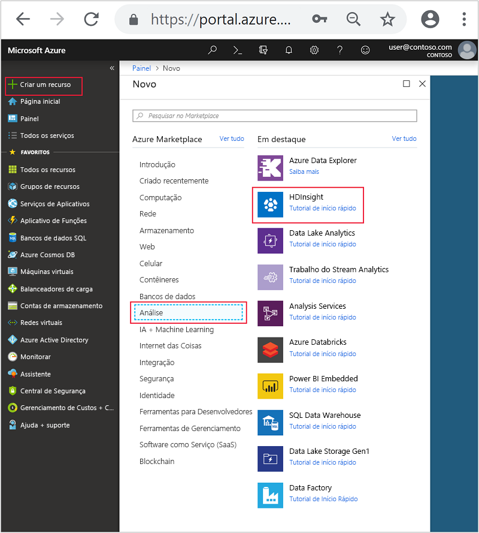
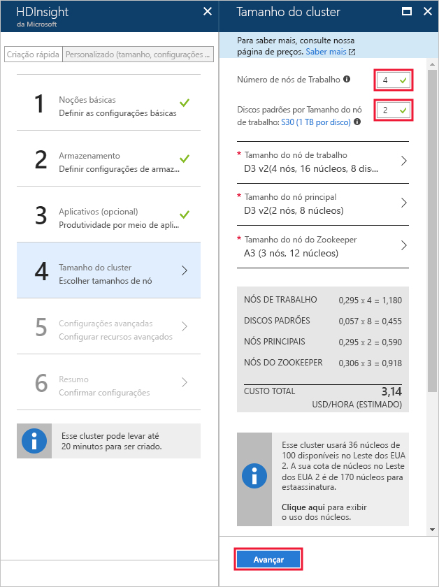

# <a name="start-with-apache-kafka-on-hdinsight"></a>Começar com o Apache Kafka no HDInsight

Saiba como criar e usar um cluster do [Apache Kafka](https://kafka.apache.org) no Azure HDInsight. O Kafka é uma plataforma de streaming distribuída de software livre que está disponível com o HDInsight. Ela é geralmente usada como um agente de mensagens, pois fornece funcionalidade semelhante a uma fila de mensagens para publicação e assinatura. O Kafka é frequentemente usado com o Apache Spark e Apache Storm para sistemas de mensagens, rastreamento de atividades, agregação de fluxo ou transformação de dados.

[!INCLUDE [delete-cluster-warning](../../../includes/hdinsight-delete-cluster-warning.md)]

## <a name="create-a-kafka-cluster"></a>Criar um cluster Kafka

Para criar um Kafka no cluster do HDInsight, use as seguintes etapas:

1. No [Portal do Azure](https://portal.azure.com), selecione **+ Criar um recurso**, **Dados + Análise** e selecione **HDInsight**.
   
    

2. Em **Noções Básicas**, insira as seguintes informações:

    * **Nome do cluster**: o nome do cluster HDInsight. Esse nome deve ser exclusivo.
    * **Assinatura**: selecione a assinatura a ser utilizada.
    * **Nome de usuário de logon do cluster** e **Senha de logon do cluster**: logon ao acessar o cluster por HTTPS. Você pode usar essas credenciais para acessar serviços como a interface do usuário da Web do Ambari ou a API REST.
    * **Nome de usuário do SSH (Secure Shell)**: o logon usado ao acessar o cluster via SSH. Por padrão, a senha é a mesma do logon do cluster.
    * **Grupo de Recursos**: o grupo de recursos para criar o cluster.
    * **Local**: a região do Azure para criar o cluster.

        > [!IMPORTANT]
        > Para alta disponibilidade dos dados, recomendamos selecionar um local (região) que contenha __três domínios de falha__. Para saber mais, veja a seção de [Alta disponibilidade de dados](#data-high-availability).
   
 

3. Selecione **Tipo de cluster** e defina os seguintes valores em **Configuração do cluster**:
   
    * **Tipo de Cluster**: Kafka
    * **Versão**: Kafka 0.10.0 (HDI 3.6)

    Por fim, use o botão **Selecionar** para salvar as configurações.
     
 

4. Depois de selecionar o tipo de cluster, use o botão __Selecionar__ para definir o tipo de cluster. Em seguida, use o botão __Avançar__ para concluir a configuração básica.

5. Em **Armazenamento**, selecione ou crie uma Conta de armazenamento. Para as etapas neste documento, deixe os outros campos com os valores padrão. Use o botão __Avançar__ para salvar a configuração de armazenamento.

    

6. Em __Aplicativos (opcionais)__, selecione __Avançar__ para continuar. Nenhum aplicativo é necessário neste exemplo.

7. Em __Tamanho do cluster__, selecione __Avançar__ para continuar.

    > [!WARNING]
    > Para garantir a disponibilidade do Kafka no HDInsight, o cluster deve conter pelo menos três nós de trabalho. Para saber mais, veja a seção de [Alta disponibilidade de dados](#data-high-availability).

    

    > [!IMPORTANT]
    > A entrada dos **discos por nó de trabalho** configura a escalabilidade do Kafka no HDInsight. O Kafka no HDInsight usa o disco local das máquinas virtuais no cluster. Como o Kafka tem E/S bastante pesadas, os [Discos Gerenciados do Azure](../../virtual-machines/windows/managed-disks-overview.md) são usados para fornecer a alta taxa de transferência e fornecer mais armazenamento por nó. O tipo de disco gerenciado pode ser __Standard__ (HDD) ou __Premium__ (SSD). Os discos Premium são usados com as VMs das séries DS e GS. Todos os outros tipos VM usam o padrão.

8. Em __Configurações avançadas__, selecione __Avançar__ para continuar.

9. Em **Resumo**, examine a configuração do cluster. Use os links __Editar__ para alterar as configurações que estão incorretas. Por fim, use o botão __Criar__ para criar o cluster.
   
    
   
    > [!NOTE]
    > Pode levar até 20 minutos para criar o cluster.

## <a name="connect-to-the-cluster"></a>Conectar-se ao cluster

> [!IMPORTANT]
> Ao executar as etapas a seguir, você deve usar um cliente SSH. Para saber mais, consulte o documento [Usar SSH com HDInsight](../hdinsight-hadoop-linux-use-ssh-unix.md).

Para se conectar ao cluster usando SSH, você deve fornecer o nome da conta de usuário SSH e o nome do cluster. No exemplo a seguir, substitua `sshuser` e `clustername` pelo nome da sua conta e do seu cluster:

```ssh sshuser@clustername-ssh.azurehdinsight.net```

Quando solicitado, digite a senha usada para a conta SSH.

Para obter informações, consulte [Usar SSH com HDInsight](../hdinsight-hadoop-linux-use-ssh-unix.md).

## <a id="getkafkainfo"></a>Obter as informações de host do Zookeeper e Broker

Ao trabalhar com Kafka, você deve conhecer os hosts *Zookeeper* e os hosts *Broker*. Esses hosts são usados com a API Kafka e muitos dos utilitários fornecidos com o Kafka.

Para criar as variáveis de ambiente que contêm as informações de host, use as etapas a seguir:

1. Em uma conexão SSH ao cluster, use o comando a seguir para instalar o utilitário `jq`. Esse utilitário é usado para analisar documentos JSON e é útil para recuperar as informações do host de agente:
   
    ```bash
    sudo apt -y install jq
    ```

2. Para definir uma variável de ambiente para o nome do cluster, use o seguinte comando:

    ```bash
    read -p "Enter the HDInsight cluster name: " CLUSTERNAME
    ```

3. Para definir uma variável de ambiente com informações de host Zookeeper, use o seguinte comando:

    ```bash
    export KAFKAZKHOSTS=`curl -sS -u admin -G https://$CLUSTERNAME.azurehdinsight.net/api/v1/clusters/$CLUSTERNAME/services/ZOOKEEPER/components/ZOOKEEPER_SERVER | jq -r '["\(.host_components[].HostRoles.host_name):2181"] | join(",")' | cut -d',' -f1,2`
    ```

    Quando solicitado, insira a senha para a conta de logon do cluster (admin).

4. Para verificar se a variável de ambiente é definida corretamente, use o seguinte comando:

    ```bash
     echo '$KAFKAZKHOSTS='$KAFKAZKHOSTS
    ```

    Esse comando retorna informações semelhantes ao seguinte texto:

    `zk0-kafka.eahjefxxp1netdbyklgqj5y1ud.ex.internal.cloudapp.net:2181,zk2-kafka.eahjefxxp1netdbyklgqj5y1ud.ex.internal.cloudapp.net:2181`

5. Para definir uma variável de ambiente com informações de host Broker do Kafka, use o seguinte comando:

    ```bash
    export KAFKABROKERS=`curl -sS -u admin -G https://$CLUSTERNAME.azurehdinsight.net/api/v1/clusters/$CLUSTERNAME/services/KAFKA/components/KAFKA_BROKER | jq -r '["\(.host_components[].HostRoles.host_name):9092"] | join(",")' | cut -d',' -f1,2`
    ```

    Quando solicitado, insira a senha para a conta de logon do cluster (admin).

6. Para verificar se a variável de ambiente é definida corretamente, use o seguinte comando:

    ```bash   
    echo '$KAFKABROKERS='$KAFKABROKERS
    ```

    Esse comando retorna informações semelhantes ao seguinte texto:
   
    `wn1-kafka.eahjefxxp1netdbyklgqj5y1ud.cx.internal.cloudapp.net:9092,wn0-kafka.eahjefxxp1netdbyklgqj5y1ud.cx.internal.cloudapp.net:9092`
   
> [!WARNING]
> Não tome como certo que as informações retornadas nessa sessão sempre são precisas. Ao dimensionar o cluster, novos agentes são adicionados ou removidos. Se ocorrer uma falha e um nó for substituído, o nome do host para o nó poderá ser alterado.
>
> Você deve recuperar as informações dos hosts Zookeeper e Broker logo antes de usá-los para garantir que tenha informações válidas.

## <a name="create-a-topic"></a>Criar um tópico

O Kafka armazena fluxos de dados em categorias chamadas *tópicos*. Em uma conexão SSH a um nó principal de cluster, use um script fornecido com o Kafka para criar um tópico:

```bash
/usr/hdp/current/kafka-broker/bin/kafka-topics.sh --create --replication-factor 3 --partitions 8 --topic test --zookeeper $KAFKAZKHOSTS
```

Esse comando se conecta ao Zookeeper usando as informações de host armazenadas em `$KAFKAZKHOSTS`. Depois, ele cria um tópico Kafka chamado **teste**. Você pode verificar se o tópico foi criado usando o seguinte script para listar tópicos:

```bash
/usr/hdp/current/kafka-broker/bin/kafka-topics.sh --list --zookeeper $KAFKAZKHOSTS
```

A saída desse comando lista os tópicos do Kafka no cluster.

## <a name="produce-and-consume-records"></a>Produzir e consumir registros

O Kafka armazena *registros* nos tópicos. Os registros são produzidos por *produtores* e consumidos por *consumidores*. Os produtores produzem registros para os *agentes* kafka. Cada nó de trabalho no cluster HDInsight é um agente do Kafka.

Para armazenar registros no tópico teste criado anteriormente e lê-los usando um consumidor, use as seguintes etapas:

1. Na sessão SSH, use um script fornecido com o Kafka para gravar registros no tópico:
   
    ```bash
    /usr/hdp/current/kafka-broker/bin/kafka-console-producer.sh --broker-list $KAFKABROKERS --topic test
    ```
   
    Após esse comando, você chega em uma linha em branco.

2. Digite uma mensagem de texto na linha em branco e pressione enter. Insira algumas mensagens dessa forma e depois use **Ctrl + C** para retornar ao prompt normal. Cada linha é enviada como um registro separado para o tópico Kafka.

3. Use um script fornecido com o Kafka para ler registros do tópico:
   
    ```bash
    /usr/hdp/current/kafka-broker/bin/kafka-console-consumer.sh --bootstrap-server $KAFKABROKERS --topic test --from-beginning
    ```
   
    Esse comando recupera os registros do tópico e os exibe. O uso de `--from-beginning` instrui o consumidor a começar do início do fluxo, para que todos os registros sejam recuperados.

    > [!NOTE]
    > Se estiver usando uma versão mais antiga do Kafka, substitua `--bootstrap-server $KAFKABROKERS` por `--zookeeper $KAFKAZKHOSTS`.

4. Use __Ctrl + C__ para interromper o consumidor.

Você também pode criar programaticamente produtores e consumidores. Para obter um exemplo de como usar essa API, consulte o documento [API do Produtor e Consumidor Kafka com HDInsight](apache-kafka-producer-consumer-api.md).

## <a name="data-high-availability"></a>Alta disponibilidade de dados

Cada região do Azure (local) fornece _domínios de falha_. Um domínio de falha é um agrupamento lógico de hardware subjacente em um data center do Azure. Cada domínio de falha tem um comutador de rede e uma fonte de alimentação em comum. As máquinas virtuais e os discos gerenciados que implementam os nós em um cluster HDInsight são distribuídos entre esses domínios de falha. Essa arquitetura limita o possível impacto de falhas físicas de hardware.

Para obter informações sobre o número de domínios de falha em uma região, consulte o documento [Disponibilidade de máquinas virtuais do Linux](../../virtual-machines/windows/manage-availability.md#use-managed-disks-for-vms-in-an-availability-set).

> [!IMPORTANT]
> Se possível, use uma região do Azure que contenha três domínios de falha e crie tópicos com um fator de replicação de 3.

Se você usa uma região que contém apenas dois domínios de falha, use um fator de replicação de 4 para distribuir as réplicas uniformemente entre os dois domínios de falha.

### <a name="kafka-and-fault-domains"></a>Kafka e domínios de falhas

O Kafka não está ciente dos domínios de falha. Durante a criação de réplicas da partição para tópicos, ele não poderá distribuir réplicas corretamente para alta disponibilidade. Para garantir a alta disponibilidade, use a [ferramenta de rebalanceio de partição Kafka](https://github.com/hdinsight/hdinsight-kafka-tools). Essa ferramenta deve ser executada em uma sessão SSH para o nó principal do cluster Kafka.

Para garantir a mais alta disponibilidade de seus dados do Kafka, você deve rebalancear as réplicas de partição do tópico quando:

* Você criar um novo tópico ou partição

* Você escalar um cluster verticalmente

## <a name="delete-the-cluster"></a>Excluir o cluster

[!INCLUDE [delete-cluster-warning](../../../includes/hdinsight-delete-cluster-warning.md)]

## <a name="troubleshoot"></a>Solucionar problemas

Se você tiver problemas com a criação de clusters HDInsight, confira os [requisitos de controle de acesso](../hdinsight-administer-use-portal-linux.md#create-clusters).

## <a name="next-steps"></a>Próximas etapas

Neste documento, você aprendeu os fundamentos do trabalho com o Apache Kafka no HDInsight. Confira o seguinte para obter mais informações sobre como trabalhar com o Kafka:

* [Analisar logs do Kafka](apache-kafka-log-analytics-operations-management.md)
* [Replicar dados entre clusters de Kafka](apache-kafka-mirroring.md)
* [API do Produtor e Consumidor Kafka com HDInsight](apache-kafka-producer-consumer-api.md)
* [API de Streams do Kafka com HDInsight](apache-kafka-streams-api.md)
* [Use streaming do Apache Spark (DStream) com o Kafka no HDInsight](../hdinsight-apache-spark-with-kafka.md)
* [Use fluxo estruturado do Apache Spark com o Kafka no HDInsight](../hdinsight-apache-kafka-spark-structured-streaming.md)
* [Usar o streaming estruturado do Apache Spark para mover dados do Kafka no HDInsight para o Cosmos DB](../apache-kafka-spark-structured-streaming-cosmosdb.md)
* [Usar Apache Storm com Kafka no HDInsight](../hdinsight-apache-storm-with-kafka.md)
* [Conectar-se ao Kafka por meio de uma Rede Virtual do Azure](apache-kafka-connect-vpn-gateway.md)
* [Usar o Kafka com o Serviço de Contêiner do Azure](apache-kafka-azure-container-services.md)
* [Usar o Kafka com Aplicativos de funções do Azure](apache-kafka-azure-functions.md)
