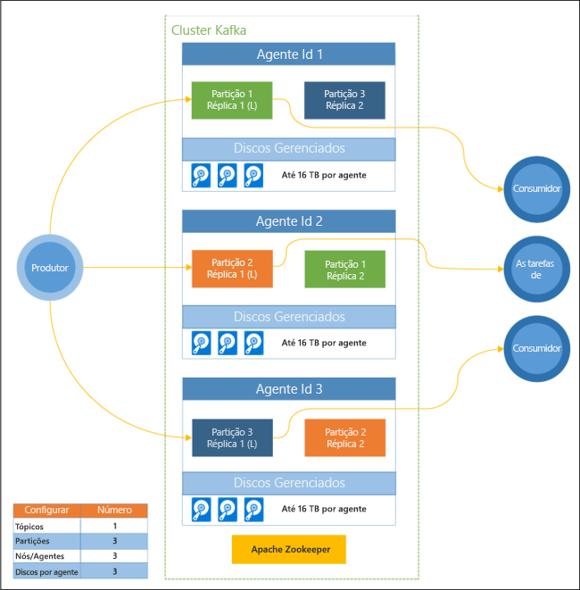

# Introdução ao Apache Kafka no HDInsight

O [Apache Kafka](https://kafka.apache.org) é uma plataforma de streaming distribuída de software livre que pode ser usada para compilar pipelines e aplicativos de dados de streaming em tempo real. O Kafka também fornece funcionalidade de agente de mensagem semelhante a uma fila de mensagens, onde você pode publicar e assinar os fluxos de dados nomeados. O Kafka no HDInsight oferece um serviço gerenciado, altamente escalonável e altamente disponível na nuvem do Microsoft Azure.

## Por que usar o Kafka no HDInsight?

O Kafka no HDInsight oferece os seguintes recursos:

* __Contrato de Nível de Serviço (SLA) 99% no tempo de atividade do Kafka__: Para obter mais informações, consulte o documento [informações de SLA para HDInsight](https://azure.microsoft.com/support/legal/sla/hdinsight/v1_0/).

* __Reconhecimento de tolerância a falhas e rack__: O Kafka foi desenvolvido com uma exibição dimensional única de um rack que funciona bem em alguns ambientes. No entanto, em ambientes como o Azure, um rack é separado em duas dimensões: domínios de atualização (UDs) e domínios de falha (FDs). A Microsoft fornece ferramentas que garantem a redistribuição de partições e réplicas Kafka por UDs e FDs. 

    Para obter mais informações, consulte [Alta disponibilidade com Kafka no HDInsight](apache-kafka-high-availability.md).

* **Integração com os Managed Disks do Azure**: Os discos gerenciados fornecem maior escala e taxa de transferência pelo Kafka no HDInsight, até 16 TB por nó no cluster.

    Para saber mais sobre como configurar discos gerenciados com o Kafka no HDInsight, veja [Aumentar a escalabilidade do Kafka no HDInsight](apache-kafka-scalability.md).

    Para saber mais sobre discos gerenciados, veja [Azure Managed Disks](../../virtual-machines/windows/managed-disks-overview.md).

* **Alertas, monitoramento e manutenção preditiva**: O Azure Log Analytics pode ser usado para monitorar o Kafka no HDInsight. O Log Analytics expõe as informações do nível da máquina virtual, como o disco e as métricas NIC e as métricas JMX do Kafka.

    Para obter mais informações, consulte [Analisar logs do Kafka no HDInsight](apache-kafka-log-analytics-operations-management.md).

* **Replicação de dados Kafka**: O Kafka fornece o utilitário MirrorMaker, que replica os dados entre os clusters do Kafka.

    Para obter informações sobre como usar o MirrorMaker, consulte [Replicar tópicos Kafka com Kafka no HDInsight](apache-kafka-mirroring.md).

* **Dimensionamento do cluster**: O HDInsight permite que você altere o número de nós de trabalho (que hospedam o agente do Kafka) após a criação do cluster. Escalar verticalmente um cluster conforme as cargas de trabalho aumentam ou reduzir verticalmente para reduzir os custos. O dimensionamento pode ser executado a partir do portal do Azure, do Azure PowerShell e de outras interfaces de gerenciamento do Azure. Para Kafka você deve redistribuir as réplicas de partição após as operações de dimensionamento. Redistribuir as partições permite ao Kafka aproveitar o novo número de nós de trabalho.

    Para obter mais informações, consulte [Alta disponibilidade com Kafka no HDInsight](apache-kafka-high-availability.md).

* **Padrão de mensagens publicar-assinar**: O Kafka fornece uma API de Produtor para publicação de registros em um tópico do Kafka. A API de Consumidor é usada na assinatura de um tópico.

    Para obter mais informações, consulte [Introdução ao Kafka no HDInsight](apache-kafka-get-started.md).

* **Processamento de fluxo**: O Kafka é frequentemente usado com o Apache Storm ou o Spark para processamento de fluxo em tempo real. O Kafka 0.10.0.0 (HDInsight versão 3.5 e 3.6) introduziu uma API de streaming que permite que você crie soluções de transmissão sem a necessidade do Storm ou do Spark.

    Para obter mais informações, consulte [Introdução ao Kafka no HDInsight](apache-kafka-get-started.md).

* **Escala horizontal**: O Kafka particiona fluxos entre os nós no cluster HDInsight. Os processos do Consumidor podem ser associados a partições individuais para fornecer balanceamento de carga ao consumir registros.

    Para obter mais informações, consulte [Introdução ao Kafka no HDInsight](apache-kafka-get-started.md).

* **Entrega em ordem**: Dentro de cada partição, os registros são armazenados no fluxo na ordem em que foram recebidos. Ao associar um processo do consumidor por partição, você pode garantir que os registros sejam processados na ordem.

    Para obter mais informações, consulte [Introdução ao Kafka no HDInsight](apache-kafka-get-started.md).

## Casos de uso

* **Mensagens**: já que ele oferece suporte ao padrão de mensagem publicar-assinar, o Kafka geralmente é usado como um agente de mensagem.

* **Rastreamento de atividades**: como o Kafka oferece o registro em log ordenado de registros, pode ser usado para rastrear e recriar as atividades. Por exemplo, as ações do usuário em um site ou em um aplicativo.

* **Agregação**: usando processamento de fluxo, você pode agregar informações de fluxos diferentes para combinar e centralizar as informações em dados operacionais.

* **Transformação**: usando processamento de fluxo, você pode combinar e enriquecer dados de vários tópicos de entrada em um ou mais tópicos de saída.

## Arquitetura

Este diagrama mostra uma configuração típica de Kafka que usa grupos de consumidores, particionamento e a replicação oferece leitura paralela de eventos com tolerância a falhas. O Apache ZooKeeper é criado para transações simultâneas, flexíveis e de baixa latência, já que ele gerencia o estado do cluster Kafka. O Kafka armazena registros em *tópicos*. Os registros são produzidos por *produtores* e consumidos por *consumidores*. Os produtores recuperam registros de *agentes* do Kafka. Cada nó de trabalho no cluster HDInsight é um agente do Kafka. Uma partição é criada para cada consumidor, permitindo que o processamento paralelo de fluxo de dados. A replicação é utilizada para distribuir as partições entre os nós, protegendo contra falhas de nó (agente). Uma partição marcada com um *(L)* é líder para determinada partição. O produtor tráfego é roteado para o preenchimento de cada nó, usando o estado gerenciado pelo ZooKeeper.

Cada agente Kafka usa Azure Managed Disks. O número de discos é definido pelo usuário e pode fornecer até 16 TB de armazenamento por agente.

> [!IMPORTANT]
> O Kafka não está ciente do hardware subjacente (rack) no data center do Azure. Para garantir que partições sejam balanceadas corretamente do hardware subjacente, consulte o documento [Configurar a alta disponibilidade de dados (Kafka)](apache-kafka-high-availability.md).

## Próximas etapas

Use os links a seguir para aprender a usar o Apache Kafka no HDInsight:

* [Introdução ao Kafka no HDInsight](apache-kafka-get-started.md)

* [Use MirrorMaker para criar uma réplica de Kafka no HDInsight](apache-kafka-mirroring.md)

* [Usar Apache Storm com Kafka no HDInsight](../hdinsight-apache-storm-with-kafka.md)

* [Usar o Apache Spark com o Kafka no HDInsight](../hdinsight-apache-spark-with-kafka.md)

* [Conectar-se ao Kafka por meio de uma Rede Virtual do Azure](apache-kafka-connect-vpn-gateway.md)