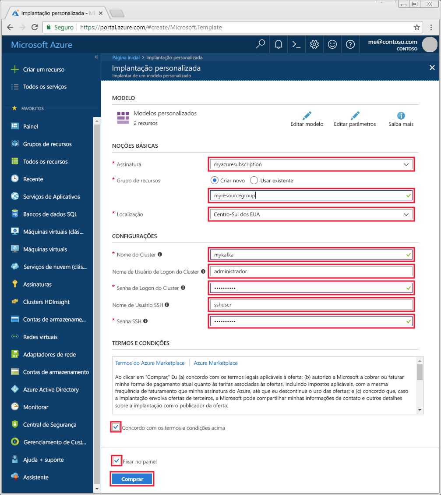

# <a name="quickstart-create-an-apache-kafka-on-hdinsight-cluster"></a>Início Rápido: Criar um Apache Kafka no cluster do HDInsight

O [Apache Kafka](https://kafka.apache.org/) é uma plataforma de streaming distribuída de software livre. Ela é geralmente usada como um agente de mensagens, pois fornece funcionalidade semelhante a uma fila de mensagens para publicação e assinatura. 

Neste início rápido, você aprenderá a criar um cluster [Apache Kafka](https://kafka.apache.org) usando o modelo do Azure Resource Manager. Você também aprenderá a usar os utilitários incluídos para enviar e receber mensagens usando o Kafka. Modelos semelhantes podem ser exibidos nos [modelos de início rápido do Azure](https://azure.microsoft.com/resources/templates/?resourceType=Microsoft.Hdinsight&pageNumber=1&sort=Popular). A referência de modelo pode ser encontrada [aqui](https://docs.microsoft.com/azure/templates/microsoft.hdinsight/allversions).

[!INCLUDE [delete-cluster-warning](../../../includes/hdinsight-delete-cluster-warning.md)]

> [!IMPORTANT]  
> A API do Kafka só pode ser acessada por recursos dentro da mesma rede virtual. Neste início rápido, você acessará o cluster diretamente no SSH. Para conectar a outros serviços, redes ou máquinas virtuais ao Kafka, primeiro crie uma rede virtual e, depois, crie os recursos na rede.
>
> Para saber mais, confira o documento [Conectar-se ao Apache Kafka usando uma rede virtual](apache-kafka-connect-vpn-gateway.md).

## <a name="prerequisites"></a>Pré-requisitos

* Uma assinatura do Azure. Se você não tiver uma assinatura do Azure, crie uma [conta gratuita](https://azure.microsoft.com/free/?WT.mc_id=A261C142F) antes de começar.

* Um cliente SSH. As etapas neste documento usam SSH para se conectar ao cluster.

    O comando `ssh` é fornecido por padrão nos sistemas Linux, Unix e macOS. No Windows 10, use um dos métodos a seguir para instalar o comando `ssh`:

  * Use o [Azure Cloud Shell](https://docs.microsoft.com/azure/cloud-shell/quickstart). O cloud shell fornece o comando `ssh` e pode ser configurado para usar o Bash ou o PowerShell como o ambiente de shell.

  * [Instale o Subsistema do Windows para Linux](https://docs.microsoft.com/windows/wsl/install-win10). As distribuições do Linux disponíveis por meio da Microsoft Store fornecem o comando `ssh`.

    > [!IMPORTANT]  
    > As etapas neste documento pressupõem que você esteja usando um dos clientes SSH mencionados acima. Se você estiver usando um cliente SSH diferente e encontrar problemas, consulte a documentação de seu cliente SSH.
    >
    > Para saber mais, consulte o documento [Usar SSH com HDInsight](../hdinsight-hadoop-linux-use-ssh-unix.md).

## <a name="create-an-apache-kafka-cluster"></a>Criar um cluster do Apache Kafka

1. Clique na imagem a seguir para abrir o modelo no portal do Azure.

    <a href="https://portal.azure.com/#create/Microsoft.Template/uri/https%3A%2F%2Fraw.githubusercontent.com%2FAzure-Samples%2Fhdinsight-kafka-java-get-started%2Fmaster%2Fazuredeploy.json" target="_blank"></a>

2. Para criar um cluster Kafka, use os seguintes valores:

    | Propriedade | Valor |
    | --- | --- |
    | Assinatura | Sua assinatura do Azure. |
    | Grupo de recursos | O grupo de recursos no qual o cluster foi criado. |
    | Local padrão | A região do Azure na qual o cluster foi criado. |
    | Nome do cluster | O nome do cluster do Kafka. |
    | Nome de usuário de logon do cluster | O nome da conta usada para fazer logon nos serviços baseados em HTTPs hospedados no cluster. |
    | Senha de logon do cluster | A senha para o nome de usuário de logon. |
    | Nome de usuário do SSH | O nome de usuário SSH. Essa conta pode acessar o cluster usando SSH. |
    | Senha SSH | A senha para o usuário do SSH. |

    

3. Selecione **Concordo com os termos e condições declarados acima**, selecione **Fixar no painel**e, em seguida, clique em **Comprar**.

> [!NOTE]  
> Pode levar até 20 minutos para criar o cluster.

## <a name="connect-to-the-cluster"></a>Conectar-se ao cluster

1. Para conectar-se ao nó principal do cluster Kafka, use o comando a seguir. Substitua `sshuser` pelo nome de usuário SSH. Substitua `mykafka` pelo nome do cluster Kafka

    ```bash
    ssh sshuser@mykafka-ssh.azurehdinsight.net
    ```

2. Quando você se conectar pela primeira vez ao cluster, seu cliente SSH poderá exibir um aviso de que a autenticidade do host não pode ser estabelecida. Quando for solicitado, digite __sim__ e pressione __Enter__ para adicionar o host à lista de servidores confiáveis do cliente SSH.

3. Quando solicitado, insira a senha do usuário SSH.

Após a conexão, você verá informações semelhantes ao seguinte texto:

```text
Authorized uses only. All activity may be monitored and reported.
Welcome to Ubuntu 16.04.4 LTS (GNU/Linux 4.13.0-1011-azure x86_64)

 * Documentation:  https://help.ubuntu.com
 * Management:     https://landscape.canonical.com
 * Support:        https://ubuntu.com/advantage

  Get cloud support with Ubuntu Advantage Cloud Guest:
    https://www.ubuntu.com/business/services/cloud

83 packages can be updated.
37 updates are security updates.


Welcome to Kafka on HDInsight.

Last login: Thu Mar 29 13:25:27 2018 from 108.252.109.241
ssuhuser@hn0-mykafk:~$
```

## <a id="getkafkainfo"></a>Obter as informações de host do Apache Zookeeper e do Broker

Ao trabalhar com Kafka, você deve conhecer os hosts do *Apache Zookeeper* e *Broker*. Esses hosts são usados com a API Kafka e muitos dos utilitários fornecidos com o Kafka.

Nesta seção, você obtém as informações do host da API REST Ambari no cluster.

1. Na conexão SSH com cluster, use o comando a seguir para instalar o utilitário `jq`. Esse utilitário é usado para analisar documentos JSON e é útil para recuperar as informações do host:
   
    ```bash
    sudo apt -y install jq
    ```

2. Para definir uma variável de ambiente para o nome do cluster, use o seguinte comando:

    ```bash
    read -p "Enter the Kafka on HDInsight cluster name: " CLUSTERNAME
    ```

    Ao receber a solicitação, insira o nome do cluster Kafka.

3. Para definir uma variável de ambiente com informações de host Zookeeper, use o seguinte comando:

    ```bash
    export KAFKAZKHOSTS=`curl -sS -u admin -G https://$CLUSTERNAME.azurehdinsight.net/api/v1/clusters/$CLUSTERNAME/services/ZOOKEEPER/components/ZOOKEEPER_SERVER | jq -r '["\(.host_components[].HostRoles.host_name):2181"] | join(",")' | cut -d',' -f1,2`
    ```

    Ao receber a solicitação, insira a senha para a conta de logon do cluster (não da conta de SSH).

    > [!NOTE]  
    > Esse comando recupera todos os hosts de Zookeeper, depois retorna apenas as duas primeiras entradas. Isso ocorre porque você deseja certa redundância no caso de um host ficar inacessível.

4. Para verificar se a variável de ambiente é definida corretamente, use o seguinte comando:

    ```bash
     echo '$KAFKAZKHOSTS='$KAFKAZKHOSTS
    ```

    Esse comando retorna informações semelhantes ao seguinte texto:

    `zk0-kafka.eahjefxxp1netdbyklgqj5y1ud.ex.internal.cloudapp.net:2181,zk2-kafka.eahjefxxp1netdbyklgqj5y1ud.ex.internal.cloudapp.net:2181`

5. Para definir uma variável de ambiente com informações de host Broker do Kafka, use o seguinte comando:

    ```bash
    export KAFKABROKERS=`curl -sS -u admin -G https://$CLUSTERNAME.azurehdinsight.net/api/v1/clusters/$CLUSTERNAME/services/KAFKA/components/KAFKA_BROKER | jq -r '["\(.host_components[].HostRoles.host_name):9092"] | join(",")' | cut -d',' -f1,2`
    ```

    Ao receber a solicitação, insira a senha para a conta de logon do cluster (não da conta de SSH).

6. Para verificar se a variável de ambiente é definida corretamente, use o seguinte comando:

    ```bash   
    echo '$KAFKABROKERS='$KAFKABROKERS
    ```

    Esse comando retorna informações semelhantes ao seguinte texto:
   
    `wn1-kafka.eahjefxxp1netdbyklgqj5y1ud.cx.internal.cloudapp.net:9092,wn0-kafka.eahjefxxp1netdbyklgqj5y1ud.cx.internal.cloudapp.net:9092`

## <a name="manage-apache-kafka-topics"></a>Gerenciar tópicos do Apache Kafka

O Kafka armazena fluxos de dados em *tópicos*. Você pode usar o utilitário `kafka-topics.sh` para gerenciar tópicos.

* **Para criar um tópico**, use o seguinte comando para criar uma conexão SSH:

    ```bash
    /usr/hdp/current/kafka-broker/bin/kafka-topics.sh --create --replication-factor 3 --partitions 8 --topic test --zookeeper $KAFKAZKHOSTS
    ```

    Esse comando se conecta ao Zookeeper usando as informações de host armazenadas em `$KAFKAZKHOSTS`. Depois, ele cria um tópico Kafka chamado **teste**. 

    * Os dados armazenados neste tópico são particionados em oito partições.

    * Cada partição é replicada em três nós de trabalho no cluster.

        > [!IMPORTANT]  
        > Se você tiver criado o cluster em uma região do Azure que fornece três domínios de falha, use um fator de replicação de 3. Caso contrário, use um fator de replicação de 4.
        
        Em regiões com três domínios de falha, um fator de replicação de 3 permite a distribuição das réplicas entre os domínios de falha. Em regiões com dois domínios de falha, um fator de replicação de quatro permite a distribuição uniforme das réplicas entre os domínios.
        
        Para obter informações sobre o número de domínios de falha em uma região, consulte o documento [Disponibilidade de máquinas virtuais do Linux](../../virtual-machines/windows/manage-availability.md#use-managed-disks-for-vms-in-an-availability-set).

        > [!IMPORTANT]   
        > O Kafka não está ciente dos domínios de falha do Azure. Durante a criação de réplicas da partição para tópicos, ele não poderá distribuir réplicas corretamente para alta disponibilidade.

        Para garantir a alta disponibilidade, use a [Ferramenta de redistribuição de partição do Apache Kafka](https://github.com/hdinsight/hdinsight-kafka-tools). Essa ferramenta deve ser executada em uma sessão SSH para o nó principal do seu cluster Kafka.

        Para ter a mais alta disponibilidade de seus dados do Kafka, você deve balancear novamente as réplicas de partição do tópico quando:

        * Você criar um novo tópico ou partição

        * Você escalar um cluster verticalmente

* **Para listar os tópicos**, use o seguinte comando:

    ```bash
    /usr/hdp/current/kafka-broker/bin/kafka-topics.sh --list --zookeeper $KAFKAZKHOSTS
    ```

    Esse comando lista os tópicos disponíveis no cluster Kafka.

* **Para excluir um tópico**, use o seguinte comando:

    ```bash
    /usr/hdp/current/kafka-broker/bin/kafka-topics.sh --delete --topic topicname --zookeeper $KAFKAZKHOSTS
    ```

    Esse comando exclui o tópico chamado `topicname`.

    > [!WARNING]  
    > Se você excluir o tópico `test` criado anteriormente, deverá recriá-lo. Isso é usado em etapas posteriores neste documento.

Para saber mais sobre os comandos disponíveis com o utilitário `kafka-topics.sh`, use o seguinte comando:

```bash
/usr/hdp/current/kafka-broker/bin/kafka-topics.sh
```

## <a name="produce-and-consume-records"></a>Produzir e consumir registros

O Kafka armazena *registros* nos tópicos. Os registros são produzidos por *produtores* e consumidos por *consumidores*. Os produtores e consumidores se comunicam com o serviço *Agente de Kafka*. Cada nó de trabalho no cluster HDInsight é um host de agente do Kafka.

Para armazenar registros no tópico teste criado anteriormente e lê-los usando um consumidor, use as seguintes etapas:

1. Para gravar registros no tópico, use o utilitário `kafka-console-producer.sh` da conexão SSH:
   
    ```bash
    /usr/hdp/current/kafka-broker/bin/kafka-console-producer.sh --broker-list $KAFKABROKERS --topic test
    ```
   
    Após esse comando, você chega em uma linha em branco.

2. Digite uma mensagem de texto na linha em branco e pressione enter. Insira algumas mensagens dessa forma e depois use **Ctrl + C** para retornar ao prompt normal. Cada linha é enviada como um registro separado para o tópico Kafka.

3. Para ler registros no tópico, use o utilitário `kafka-console-consumer.sh` da conexão SSH:
   
    ```bash
    /usr/hdp/current/kafka-broker/bin/kafka-console-consumer.sh --bootstrap-server $KAFKABROKERS --topic test --from-beginning
    ```
   
    Esse comando recupera os registros do tópico e os exibe. O uso de `--from-beginning` instrui o consumidor a começar do início do fluxo, para que todos os registros sejam recuperados.

    > [!NOTE]  
    > Se estiver usando uma versão mais antiga do Kafka, substitua `--bootstrap-server $KAFKABROKERS` por `--zookeeper $KAFKAZKHOSTS`.

4. Use __Ctrl + C__ para interromper o consumidor.

Você também pode criar programaticamente produtores e consumidores. Para obter um exemplo de como usar essa API, confira o documento [API do Produtor e Consumidor do Apache Kafka com HDInsight](apache-kafka-producer-consumer-api.md).

## <a name="troubleshoot"></a>Solucionar problemas

Se você tiver problemas com a criação de clusters HDInsight, confira os [requisitos de controle de acesso](../hdinsight-hadoop-create-linux-clusters-portal.md).

## <a name="clean-up-resources"></a>Limpar recursos

Caso queira limpar os recursos criados por este guia de início rápido, você pode excluir o grupo de recursos. A exclusão do grupo de recursos também exclui o cluster HDInsight associado e todos os outros recursos associados ao grupo de recursos.

Para remover o grupo de recursos usando o portal do Azure:

1. No portal do Azure, expanda o menu à esquerda para abrir o menu de serviços e escolha __Grupo de Recursos__ para exibir a lista dos seus grupos de recursos.
2. Localize o grupo de recursos a ser excluído e clique com o botão direito do mouse no botão __Mais__ (...) do lado direito da lista.
3. Selecione __Excluir grupo de recursos__ e confirme.

> [!WARNING]  
> A cobrança do cluster HDInsight começa quando um cluster é criado e para quando o cluster é excluído. A cobrança ocorre por minuto, portanto, sempre exclua o cluster quando ele não estiver mais sendo usado.
> 
> Excluir um Kafka no cluster HDInsight exclui todos os dados armazenados no Kafka.

## <a name="next-steps"></a>Próximas etapas

> [!div class="nextstepaction"]
> [Usar o Apache Spark com o Apache Kafka](../hdinsight-apache-kafka-spark-structured-streaming.md)

