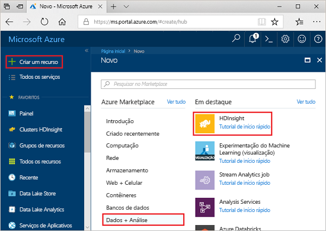
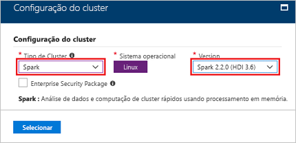
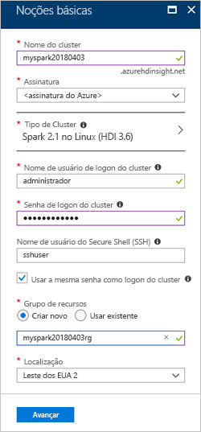

# <a name="quickstart-create-a-spark-cluster-in-hdinsight-using-the-azure-portal"></a>Início Rápido: Criar um cluster Spark no HDInsight usando o portal do Azure
Saiba como criar o cluster do Apache Spark no Azure HDInsight e como executar consultas Spark SQL nas tabelas do Hive. O Apache Spark permite análises rápidas de dados e computação de cluster usando processamento na memória. Para obter informações sobre o Spark no HDInsight, confira [Visão geral: Apache Spark no Azure HDInsight](apache-spark-overview.md).

Neste início rápido, você usa o Portal do Azure para criar um cluster Spark do HDInsight. O cluster usa Azure Storage Blobs como o armazenamento de cluster. Para obter mais informações sobre como usar o Data Lake Storage Gen2, consulte o [Guia de início rápido: configurar clusters no HDInsight](../../storage/data-lake-storage/quickstart-create-connect-hdi-cluster.md).

> [!IMPORTANT]
> A cobrança dos clusters do HDInsight será proporcional por minuto, independentemente de eles estarem sendo usados ou não. Exclua seu cluster depois de terminar de usá-lo. Para saber mais, confira a seção [Recursos de limpeza](#clean-up-resources) deste artigo.

Se você não tiver uma assinatura do Azure, [crie uma conta gratuita](https://azure.microsoft.com/free/) antes de começar.

## <a name="create-an-hdinsight-spark-cluster"></a>Criar um cluster Spark no HDInsight

1. No portal do Azure, selecione **Criar um recurso** > **Dados + Análise** > **HDInsight**. 

    
2. Em **Noções básicas**, forneça os seguintes valores:
     
    |Propriedade  |DESCRIÇÃO  |
    |---------|---------|
    |**Nome do cluster**     | Dê um nome para seu cluster HDInsight Spark. O nome do cluster usado para este início rápido é **myspark20180403**.|
    |**Assinatura**     | No menu suspenso, selecione uma assinatura do Azure usada para este cluster. A assinatura usada para este início rápido é **&lt;assinatura do Azure**. |
    |**Tipo de cluster**| Expanda o item e selecione **Spark** que o tipo de cluster e especifique a versão de cluster do Spark. <br/>  |
    |**Nome de usuário de logon do cluster**| Insira o nome de logon do usuário do cluster.  O nome padrão é *admin*. Você pode usar essa conta fazer logon no bloco de anotações do Jupyter mais tarde no início rápido. |
    |**Senha de logon do cluster**| Insira a senha de logon do cluster. |
    |**Nome de usuário do Secure Shell (SSH)**| Insira um Nome de Usuário SSH. O nome de usuário de SSH usado para este início rápido é **sshuser**. Por padrão, essa conta tem a mesma senha que a conta de*nome de usuário de logon do cluster*. |
    |**Grupo de recursos**     | Especifique se deseja criar um novo grupo de recursos ou usar um existente. Um grupo de recursos é um contêiner que mantém os recursos relacionados a uma solução do Azure. O nome do grupo de recursos usado para este início rápido é **myspark20180403rg**. |
    |**Localidade**     | Selecione um local para o grupo de recursos. O modelo usa esse local para criar o cluster, bem como para o armazenamento de cluster padrão. O local usado para este início rápido é **Leste dos EUA 2**. |

    

    Selecione **Avançar** para continuar na página **Armazenamento**.
3. Em **Armazenamento**, forneça os seguintes valores:

    - **Selecione uma conta de armazenamento**: selecione **Criar novo** e dê um nome para a nova conta de armazenamento. O nome da conta de armazenamento usado para este início rápido é **myspark20180403store**.

    

    > [!NOTE] 
    > Na captura de tela, é exibido **Selecionar existente**. O link alterna entre **Criar novo** e **Selecionar existente**.

    O **Contêiner padrão** tem um nome padrão.  Você pode alterar o nome se desejar.

    Selecione **Avançar** para continuar na página **Resumo**. 


3. Em **Resumo**, selecione **Criar**. Demora cerca de 20 minutos para criar o cluster. O cluster deve ser criado antes de prosseguir para a próxima sessão.

Se você tiver um problema com a criação de clusters HDInsight, é possível que você não tenha as permissões corretas para fazer isso. Para saber mais, confira [Requisitos do controle de acesso](../hdinsight-administer-use-portal-linux.md#create-clusters).

## <a name="create-a-jupyter-notebook"></a>Criar um notebook Jupyter

O Jupyter Notebook é um ambiente de notebook interativo que oferece suporte a várias linguagens de programação. O notebook permite que você interaja com seus dados, combine código com texto markdown e execute visualizações simples. 

1. Abra o [Portal do Azure](https://portal.azure.com).
2. Selecione **Clusters HDInsight** e, em seguida, selecione o cluster que você criou.

    

3. No portal, selecione **Painéis do cluster** e, depois, selecione **Jupyter Notebook**. Em caso de solicitação, insira as credenciais de logon do cluster.

   

4. Selecione **Novo** > **PySpark** para criar um notebook. 

   

   Um novo bloco de anotações é criado e aberto com o nome Untitled(Untitled.pynb).


## <a name="run-spark-sql-statements"></a>Executar Instruções Spark SQL

O SQL (Structured Query Language) é a linguagem mais comum e amplamente usada para consultar e definição de dados. O Spark SQL funciona como uma extensão do Apache Spark para processar dados estruturados, usando a sintaxe SQL familiar.

1. Verifique se o kernel está pronto. O kernel estará pronto quando você vir um círculo vazio ao lado do nome do kernel no notebook. Círculo sólido indica que o kernel está ocupado.

    

    Quando você inicia o notebook pela primeira vez, o kernel executa algumas tarefas em segundo plano. Aguarde a leitura do kernel. 
2. Cole o código a seguir em uma célula vazia e pressione **SHIFT + ENTER** para executar o código. O comando lista as tabelas de Hive no cluster:

    ```PySpark
    %%sql
    SHOW TABLES
    ```
    Quando você usa um Notebook Jupyter com o cluster HDInsight Spark, obtém uma predefinição `sqlContext` que você pode usar para executar consultas do Hive usando o Spark SQL. `%%sql` informa ao Notebook Jupyter para usar a predefinição `sqlContext` para executar a consulta Hive. A consulta recupera as primeiras 10 linhas de uma tabela Hive (**hivesampletable**) que vem com todos os clusters HDInsight por padrão. Ele leva aproximadamente 30 segundos para obter os resultados. A saída se parece com isso: 

    

    Toda vez que você executar uma consulta no Jupyter, o título da janela do navegador da Web mostrará um status **(Ocupado)** com o título do bloco de anotações. Você também verá um círculo sólido ao lado do texto **PySpark** no canto superior direito.
    
2. Execute outra consulta para ver os dados em `hivesampletable`.

    ```PySpark
    %%sql
    SELECT * FROM hivesampletable LIMIT 10
    ```
    
    A tela deve ser atualizada para mostrar a saída da consulta.

    

2. No menu **Arquivo** do notebook, selecione **Fechar e Interromper**. O desligamento do bloco de anotações libera os recursos do cluster.

## <a name="clean-up-resources"></a>Limpar recursos
O HDInsight salva seus dados no Armazenamento do Azure ou no Azure Data Lake Storage, assim você poderá excluir um cluster quando ele não estiver em uso. Você também é cobrado por um cluster HDInsight, mesmo quando ele não está em uso. Como os encargos para o cluster são muitas vezes maiores do que os encargos para armazenamento, faz sentido, do ponto de vista econômico, excluir os clusters quando não estiverem em uso. Se você planeja trabalhar no tutorial listado em [Próximas etapas](#next-steps) imediatamente, convém manter o cluster.

Retorne ao Portal do Azure e selecione **Excluir**.


Também é possível selecionar o nome do grupo de recursos para abrir a página do grupo de recursos, e depois selecionar **Excluir grupo de recursos**. Ao excluir o grupo de recursos, você exclui o cluster Spark do HDInsight e a conta de armazenamento padrão.

## <a name="next-steps"></a>Próximas etapas 

Neste início rápido, você aprendeu a criar um cluster HDInsight Spark e executar uma consulta de SQL básica do Spark. Avança para o próximo tutorial para saber como usar um cluster HDInsight Spark para executar consultas interativas em dados de exemplo.

> [!div class="nextstepaction"]
>[Executar consultas interativas no Spark](./apache-spark-load-data-run-query.md)
