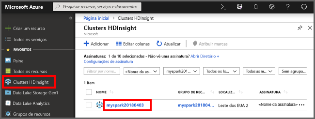
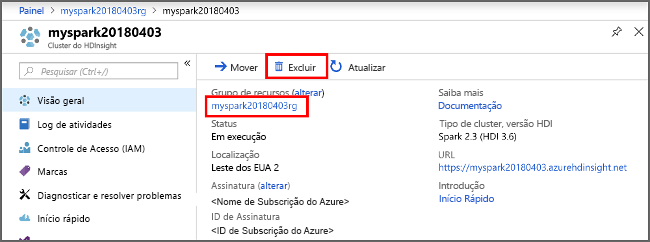

# <a name="quickstart-create-a-spark-cluster-in-hdinsight-using-powershell"></a>Início Rápido: Criar um cluster Spark no HDInsight usando o PowerShell
Saiba como criar o cluster do Apache Spark no Azure HDInsight e como executar consultas Spark SQL nas tabelas do Hive. O Apache Spark permite análises rápidas de dados e computação de cluster usando processamento na memória. Para obter informações sobre o Spark no HDInsight, confira [Visão geral: Apache Spark no Azure HDInsight](apache-spark-overview.md).

Neste início rápido, você usa o Azure PowerShell para criar um cluster Spark do HDInsight. O cluster usa Azure Storage Blobs como o armazenamento de cluster.

> [!IMPORTANT]
> A cobrança dos clusters do HDInsight será proporcional por minuto, independentemente de eles estarem sendo usados ou não. Exclua seu cluster depois de terminar de usá-lo. Para saber mais, confira a seção [Recursos de limpeza](#clean-up-resources) deste artigo.

Se você não tiver uma assinatura do Azure, [crie uma conta gratuita](https://azure.microsoft.com/free/) antes de começar.

## <a name="create-an-hdinsight-spark-cluster"></a>Criar um cluster Spark no HDInsight

A criação de um cluster HDInsight inclui a criação dos seguintes objetos e recursos do Azure:

- Um grupo de recursos do Azure. Um grupo de recursos do Azure é um contêiner para os recursos do Azure. 
- Uma conta de armazenamento do Azure ou um repositório do Azure Data Lake Store.  Cada cluster HDInsight exige um armazenamento de dados dependente. Neste início rápido, você criará uma conta de armazenamento.
- Um cluster HDInsight de tipos de cluster diferentes.  Neste início rápido, você criará um cluster Spark 2.3.

Você pode usar um script do PowerShell para criar os recursos.  Ao executar o script, você precisará inserir os seguintes valores:

|Parâmetro|Valor|
|------|------|
|Nome do grupo de recursos do Azure | Forneça um nome exclusivo para o grupo de recursos.|
|Local padrão| Especifique a região do Azure, por exemplo "EUA Central". |
|Nome da conta de armazenamento padrão | Forneça um nome exclusivo para a conta de armazenamento. |
|Nome do cluster | Forneça um nome exclusivo para o cluster Spark do HDInsight.|
|Credenciais de logon de cluster | Use essa conta para se conectar ao painel de cluster posteriormente no início rápido.|
|Credenciais do usuário SSH | Os clientes SSH podem ser usados para criar uma sessão remota de linha de comando com os clusters HDInsight.|


1. Clique em **Experimentar** no canto superior direito do bloco de código a seguir para abrir [Azure Cloud Shell](../../cloud-shell/overview.md) e execute as instruções para se conectar ao Azure.
2. Copie e cole o seguinte script do PowerShell no Cloud Shell. 

    ```azurepowershell-interactive
    ### Create a Spark 2.3 cluster in Azure HDInsight
        
    # Create the resource group
    $resourceGroupName = Read-Host -Prompt "Enter the resource group name"
    $location = Read-Host -Prompt "Enter the Azure region to create resources in, such as 'Central US'"
    New-AzureRmResourceGroup -Name $resourceGroupName -Location $location
    
    $defaultStorageAccountName = Read-Host -Prompt "Enter the default storage account name"
    
    # Create an Azure storae account and container
    New-AzureRmStorageAccount `
        -ResourceGroupName $resourceGroupName `
        -Name $defaultStorageAccountName `
        -Type Standard_LRS `
        -Location $location
    $defaultStorageAccountKey = (Get-AzureRmStorageAccountKey `
                                    -ResourceGroupName $resourceGroupName `
                                    -Name $defaultStorageAccountName)[0].Value
    $defaultStorageContext = New-AzureStorageContext `
                                    -StorageAccountName $defaultStorageAccountName `
                                    -StorageAccountKey $defaultStorageAccountKey
    
    # Create a Spark 2.3 cluster
    $clusterName = Read-Host -Prompt "Enter the name of the HDInsight cluster"
    # Cluster login is used to secure HTTPS services hosted on the cluster
    $httpCredential = Get-Credential -Message "Enter Cluster login credentials" -UserName "admin"
    # SSH user is used to remotely connect to the cluster using SSH clients
    $sshCredentials = Get-Credential -Message "Enter SSH user credentials"
    
    # Default cluster size (# of worker nodes), version, type, and OS
    $clusterSizeInNodes = "1"
    $clusterVersion = "3.6"
    $clusterType = "Spark"
    $clusterOS = "Linux"
    
    # Set the storage container name to the cluster name
    $defaultBlobContainerName = $clusterName
    
    # Create a blob container. This holds the default data store for the cluster.
    New-AzureStorageContainer `
        -Name $clusterName -Context $defaultStorageContext 
    
    $sparkConfig = New-Object "System.Collections.Generic.Dictionary``2[System.String,System.String]"
    $sparkConfig.Add("spark", "2.3")
    
    # Create the HDInsight cluster
    New-AzureRmHDInsightCluster `
        -ResourceGroupName $resourceGroupName `
        -ClusterName $clusterName `
        -Location $location `
        -ClusterSizeInNodes $clusterSizeInNodes `
        -ClusterType $clusterType `
        -OSType $clusterOS `
        -Version $clusterVersion `
        -ComponentVersion $sparkConfig `
        -HttpCredential $httpCredential `
        -DefaultStorageAccountName "$defaultStorageAccountName.blob.core.windows.net" `
        -DefaultStorageAccountKey $defaultStorageAccountKey `
        -DefaultStorageContainer $clusterName `
        -SshCredential $sshCredentials 
    
    Get-AzureRmHDInsightCluster -ResourceGroupName $resourceGroupName -ClusterName $clusterName
    ```
Demora cerca de 20 minutos para criar o cluster. O cluster deve ser criado antes de prosseguir para a próxima sessão.

Se você tiver um problema com a criação de clusters HDInsight, é possível que você não tenha as permissões corretas para fazer isso. Para saber mais, confira [Requisitos do controle de acesso](../hdinsight-administer-use-portal-linux.md#create-clusters).

## <a name="create-a-jupyter-notebook"></a>Criar um notebook Jupyter

O Jupyter Notebook é um ambiente de notebook interativo que oferece suporte a várias linguagens de programação. O notebook permite que você interaja com seus dados, combine código com texto markdown e execute visualizações simples. 

1. Abra o [Portal do Azure](https://portal.azure.com).
2. Selecione **Clusters HDInsight** e, em seguida, selecione o cluster que você criou.

    

3. No portal, selecione **Painéis do cluster** e, depois, selecione **Jupyter Notebook**. Em caso de solicitação, insira as credenciais de logon do cluster.

   

4. Selecione **Novo** > **PySpark** para criar um notebook. 

   

   Um novo bloco de anotações é criado e aberto com o nome Untitled(Untitled.pynb).


## <a name="run-spark-sql-statements"></a>Executar Instruções Spark SQL

O SQL (Structured Query Language) é a linguagem mais comum e amplamente usada para consultar e definição de dados. O Spark SQL funciona como uma extensão do Apache Spark para processar dados estruturados, usando a sintaxe SQL familiar.

1. Verifique se o kernel está pronto. O kernel estará pronto quando você vir um círculo vazio ao lado do nome do kernel no notebook. Círculo sólido indica que o kernel está ocupado.

    

    Quando você inicia o notebook pela primeira vez, o kernel executa algumas tarefas em segundo plano. Aguarde a leitura do kernel. 
2. Cole o código a seguir em uma célula vazia e pressione **SHIFT + ENTER** para executar o código. O comando lista as tabelas de Hive no cluster:

    ```PySpark
    %%sql
    SHOW TABLES
    ```
    Quando você usa um Notebook Jupyter com o cluster HDInsight Spark, obtém uma predefinição `sqlContext` que você pode usar para executar consultas do Hive usando o Spark SQL. `%%sql` informa ao Notebook Jupyter para usar a predefinição `sqlContext` para executar a consulta Hive. A consulta recupera as primeiras 10 linhas de uma tabela Hive (**hivesampletable**) que vem com todos os clusters HDInsight por padrão. Ele leva aproximadamente 30 segundos para obter os resultados. A saída se parece com isso: 

    

    Toda vez que você executar uma consulta no Jupyter, o título da janela do navegador da Web mostrará um status **(Ocupado)** com o título do bloco de anotações. Você também verá um círculo sólido ao lado do texto **PySpark** no canto superior direito.
    
2. Execute outra consulta para ver os dados em `hivesampletable`.

    ```PySpark
    %%sql
    SELECT * FROM hivesampletable LIMIT 10
    ```
    
    A tela deve ser atualizada para mostrar a saída da consulta.

    

2. No menu **Arquivo** do notebook, selecione **Fechar e Interromper**. O desligamento do bloco de anotações libera os recursos do cluster.

## <a name="clean-up-resources"></a>Limpar recursos
O HDInsight salva seus dados no Armazenamento do Azure ou no Azure Data Lake Store, assim você poderá excluir um cluster quando ele não estiver em uso. Você também é cobrado por um cluster HDInsight, mesmo quando ele não está em uso. Como os encargos para o cluster são muitas vezes maiores do que os encargos para armazenamento, faz sentido, do ponto de vista econômico, excluir os clusters quando não estiverem em uso. Se você planeja trabalhar no tutorial listado em [Próximas etapas](#next-steps) imediatamente, convém manter o cluster.

Retorne ao Portal do Azure e selecione **Excluir**.



Também é possível selecionar o nome do grupo de recursos para abrir a página do grupo de recursos, e depois selecionar **Excluir grupo de recursos**. Ao excluir o grupo de recursos, você exclui o cluster Spark do HDInsight e a conta de armazenamento padrão.

## <a name="next-steps"></a>Próximas etapas 

Neste início rápido, você aprendeu a criar um cluster HDInsight Spark e executar uma consulta de SQL básica do Spark. Avança para o próximo tutorial para saber como usar um cluster HDInsight Spark para executar consultas interativas em dados de exemplo.

> [!div class="nextstepaction"]
>[Executar consultas interativas no Spark](./apache-spark-load-data-run-query.md)
