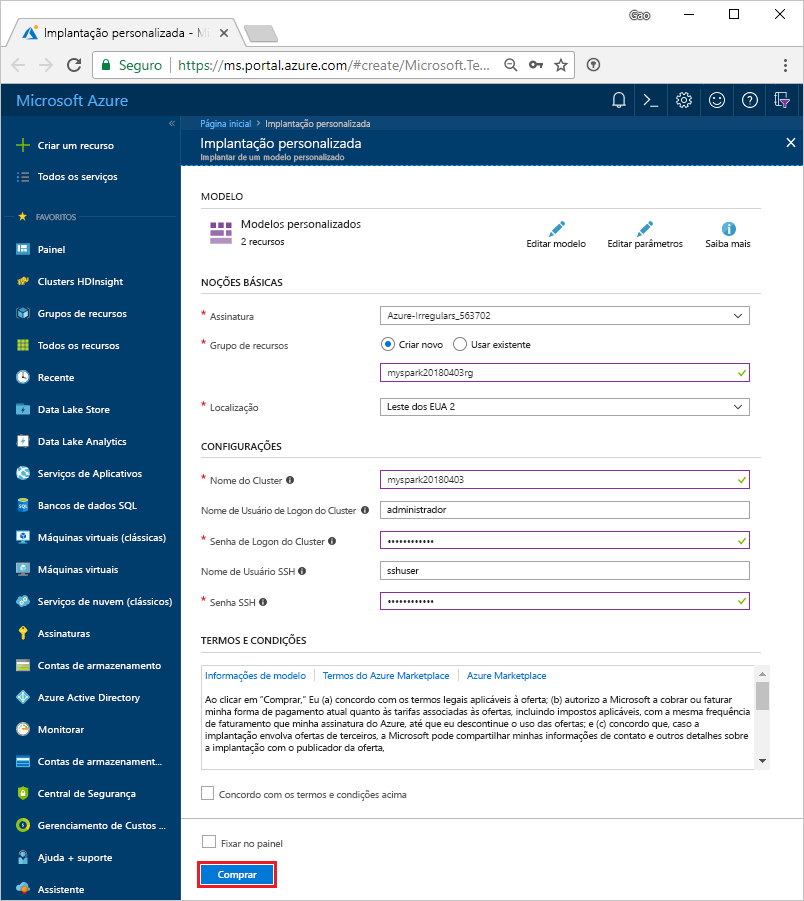

# <a name="create-an-apache-spark-cluster-in-azure-hdinsight"></a>Criar um cluster do Apache Spark no Azure HDInsight

Saiba como criar o cluster do Apache Spark no Azure HDInsight e como executar consultas Spark SQL nas tabelas do Hive. Para obter informações sobre o Spark no HDInsight, confira [Visão geral: Apache Spark no Azure HDInsight](apache-spark-overview.md).

## <a name="prerequisites"></a>pré-requisitos

* **Uma assinatura do Azure**. Antes de começar este tutorial, você deverá ter uma assinatura do Azure. Veja [Criar sua conta gratuita do Azure](https://azure.microsoft.com/free).

## <a name="create-hdinsight-spark-cluster"></a>Criar cluster do Azure HDInsight Spark

Crie um cluster Spark do HDInsight usando um [modelo do Azure Resource Manager](../hdinsight-hadoop-create-linux-clusters-arm-templates.md). O modelo pode ser encontrado no [github](https://azure.microsoft.com/resources/templates/101-hdinsight-spark-linux/). Para obter outros métodos de criação de cluster, confira [Criar clusters do HDInsight](../hdinsight-hadoop-provision-linux-clusters.md).

1. Clique na imagem a seguir para abrir o modelo no portal do Azure.         

    <a href="https://portal.azure.com/#create/Microsoft.Template/uri/https%3A%2F%2Fraw.githubusercontent.com%2FAzure%2Fazure-quickstart-templates%2Fmaster%2F101-hdinsight-spark-linux%2Fazuredeploy.json" target="_blank"></a>

2. Insira os valores a seguir:

    

    * **Assinatura**: selecione a sua assinatura do Azure usada para criar este cluster.
    * No **Grupo de recursos**: crie um grupo de recursos ou selecione um existente. O grupo de recursos é usado para gerenciar recursos do Azure em seus projetos.
    * **Local**: selecione um local para o grupo de recursos. O modelo usa esse local para criar o cluster, bem como para o armazenamento de cluster padrão.
    * **ClusterName**: insira um nome para o cluster HDInsight que você deseja criar.
    * **Nome e senha de logon do cluster**: o nome de logon padrão é admin.
    * **Nome de usuário e senha de SSH**.

3. Selecione **Concordo com os termos e condições declarados acima**, selecione **Fixar no painel**e, em seguida, clique em **Comprar**. Veja um novo bloco intitulado **Implantar a implantação de modelo**. Demora cerca de 20 minutos para criar o cluster.

Se você tiver um problema com a criação de clusters HDInsight, é possível que você não tenha as permissões corretas para fazer isso. Para saber mais, confira [Requisitos do controle de acesso](../hdinsight-administer-use-portal-linux.md#create-clusters).

> [!NOTE]
> Este artigo cria um cluster Spark que usa [Blobs do Armazenamento do Azure como o armazenamento de cluster](../hdinsight-hadoop-use-blob-storage.md). Você também pode criar um cluster Spark que usa o [Azure Data Lake Store](../hdinsight-hadoop-use-data-lake-store.md) como o armazenamento padrão. Para obter instruções, confira [Criar um cluster HDInsight com o Repositório Data Lake](../../data-lake-store/data-lake-store-hdinsight-hadoop-use-portal.md).
>
>

## <a name="create-a-jupyter-notebook"></a>Criar um notebook Jupyter

O [Notebook Jupyter](http://jupyter.org) é um ambiente de bloco de anotações interativo que dá suporte a várias linguagens de programação que permitem interagir com seus dados, combinar código com texto de markdown e executar visualizações simples. O Spark no HDInsight também inclui o [Notebook Zeppelin](apache-spark-zeppelin-notebook.md). O Notebook Jupyter é usado neste tutorial.

**Para criar um notebook Jupyter**

1. Abra o [Portal do Azure](https://portal.azure.com/).

2. Abra o cluster do Spark que você criou. Para obter instruções, consulte [Listar e mostrar clusters](../hdinsight-administer-use-portal-linux.md#list-and-show-clusters).

3. No portal, clique em **Painéis de cluster** e, depois, clique em **Notebook Jupyter**. Se você receber uma solicitação, insira as credenciais de administrador para o cluster.

   

   > [!NOTE]
   > Você também pode acessar o Jupyter Notebook de seu cluster abrindo a seguinte URL no navegador. Substitua **CLUSTERNAME** pelo nome do cluster:
   >
   > `https://CLUSTERNAME.azurehdinsight.net/jupyter`
   >
   >
3. Clique em **Novo** e então clique em **PySpark** para criar um bloco de anotações. Os notebooks Jupyter em clusters HDInsight dão suporte a três kernels – **PySpark**, **PySpark3** e **Spark**. Neste tutorial, é usado o kernel **PySpark**. Para saber mais sobre os três kernels e os benefícios de usar o **PySpark**, consulte [Usar kernels de blocos de anotações do Jupyter com clusters do Apache Spark no HDInsight](apache-spark-jupyter-notebook-kernels.md).

   

   Um novo bloco de anotações é criado e aberto com o nome Untitled(Untitled.pynb).

4. Clique no nome do bloco de anotações na parte superior e, se desejar, digite um nome amigável.

    

## <a name="run-spark-sql-statements-on-a-hive-table"></a>Executar instruções SQL Spark em uma tabela de Hive

O SQL (Structured Query Language) é a linguagem mais comum e amplamente usada para consultar e definição de dados. O Spark SQL funciona como uma extensão do Apache Spark para processar dados estruturados, usando a sintaxe SQL familiar.

O Spark SQL oferece suporte a SQL e HiveQL como linguagens de consulta. Os recursos incluem a associação em Java, Python e Scala. Com ele, você pode consultar os dados armazenados em vários locais, como bancos de dados externos, arquivos de dados estruturados (exemplo: JSON) e tabelas de Hive.

Para obter um exemplo de leitura de dados de um arquivo csv, em vez de uma tabela do Hive, veja [Executar consultas interativas em clusters Spark no HDInsight](apache-spark-load-data-run-query.md).

**Para executar o Spark SQL**

1. Quando você inicia o notebook pela primeira vez, o kernel executa algumas tarefas em segundo plano. Aguarde a leitura do kernel. O kernel estará pronto quando você vir um círculo vazio ao lado do nome do kernel no notebook. Círculo sólido indica que o kernel está ocupado.

    

2. Quando o kernel estiver pronto, cole o código a seguir em uma célula vazia e pressione **SHIFT + ENTER** para executar o código. A saída deve listar um `hivesampletable` que está disponível no cluster, por padrão.

    ```PySpark
    %%sql
    SHOW TABLES
    ```

    

    Quando você usa um Notebook Jupyter com o cluster HDInsight Spark, obtém uma predefinição `sqlContext` que você pode usar para executar consultas do Hive usando o Spark SQL. `%%sql` informa ao Notebook Jupyter para usar a predefinição `sqlContext` para executar a consulta Hive. A consulta recupera as primeiras 10 linhas de uma tabela Hive (**hivesampletable**) que vem com todos os clusters HDInsight por padrão. Para obter mais informações sobre o `%%sql` mágico e os contextos predefinidos, confira [Jupyter kernels disponíveis para um cluster HDInsight](apache-spark-jupyter-notebook-kernels.md).

    Toda vez que você executar uma consulta no Jupyter, o título da janela do navegador da Web mostrará um status **(Ocupado)** com o título do bloco de anotações. Você também verá um círculo sólido ao lado do texto **PySpark** no canto superior direito.
    
2. Execute outra consulta para ver os dados em `hivesampletable`.

    ```PySpark
    %%sql
    SELECT * FROM hivesampletable LIMIT 10
    ```
    
    A tela deve ser atualizada para mostrar a saída da consulta.

    

2. No menu **Arquivo** do notebook, clique em **Fechar e Interromper**. O desligamento do bloco de anotações libera os recursos do cluster.

3. Se você planeja conclua as seguintes etapas em um momento posterior, não se esqueça de excluir o cluster HDInsight criado neste artigo. 

[!INCLUDE [delete-cluster-warning](../../../includes/hdinsight-delete-cluster-warning.md)]

## <a name="next-steps"></a>Próximas etapas 

Neste artigo, você aprendeu a criar um cluster HDInsight Spark e executar uma consulta de SQL básica do Spark. Avança para o próximo artigo para saber como usar um cluster HDInsight Spark para executar consultas interativas em dados de exemplo.

> [!div class="nextstepaction"]
>[Executar consultas interativas em um cluster HDInsight Spark](apache-spark-load-data-run-query.md)


