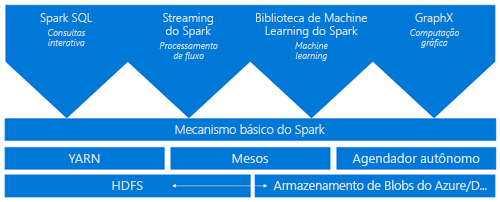
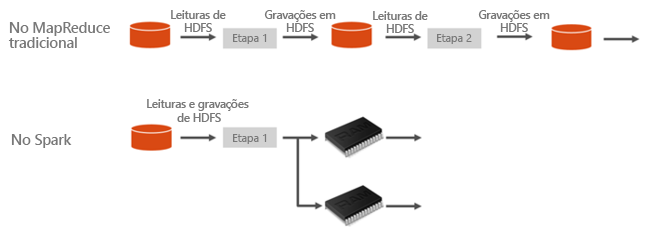
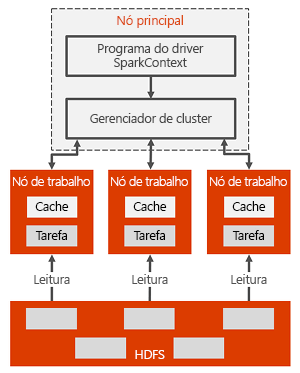

# Introdução ao Spark no HDInsight

Este artigo fornece uma introdução ao Spark no HDInsight. O <a href="http://spark.apache.org/" target="_blank">Apache Spark</a> é uma estrutura de processamento paralelo de código-fonte aberto que dá suporte ao processamento de memória para melhorar o desempenho dos aplicativos analíticos de big data. O cluster Spark no HDInsight é compatível com o WASB (Armazenamento do Azure) e com o Azure Data Lake Store. Assim, os dados existentes armazenados no Azure podem ser processados facilmente por meio de um cluster Spark.

Quando você cria um cluster do Spark no HDInsight, cria recursos de computação do Azure com o Spark instalado e configurado. Demora apenas cerca de dez minutos para criar um cluster do Spark no HDInsight. Os dados a serem processados são armazenados no Armazenamento do Azure ou no Azure Data Lake Store. Veja [Usar o Armazenamento do Azure com HDInsight](../hdinsight-hadoop-use-blob-storage.md).

## Spark X MapReduce tradicional

O que torna o Spark rápido? Como a arquitetura do Apache Spark é diferente do MapReduce tradicional, permitindo que ele ofereça melhor desempenho no compartilhamento de dados?

O Spark oferece primitivos para computação de cluster na memória. Um trabalho Spark pode carregar e armazenar dados em cache na memória e consultá-los várias vezes, muito mais rapidamente do que os sistemas baseados em disco. O Spark também se integra à linguagem de programação Scala para permitir a manipulação de conjuntos de dados distribuídos como coleções locais. Não é necessário para estruturar tudo como operações de mapeamento e redução.

No Spark, o compartilhamento de dados entre operações é mais rápido, pois os dados estão na memória. Por outro lado, o Hadoop compartilha dados por meio do HDFS, o que leva mais tempo para processar.

## O que é o Apache Spark no Azure HDInsight?
Os clusters do Spark oferecem um serviço Spark totalmente gerenciado. Os benefícios da criação de um cluster do Spark no HDInsight estão listados aqui.

| Recurso | Descrição |
| --- | --- |
| Facilidade de criação de clusters do Spark |Você pode criar um novo cluster do Spark no HDInsight em minutos usando o portal do Azure, o Azure PowerShell ou o SDK .NET do HDInsight. Confira [Introdução ao cluster do Spark no HDInsight](apache-spark-jupyter-spark-sql.md) |
| Fácil de uso |O cluster do Spark no HDInsight inclui blocos de anotações do Jupyter e do Zeppelin. Você pode usar esses blocos de anotações para processar e visualizar dados interativamente.|
| APIs REST |Os clusters do Spark no HDInsight incluem [Livy](https://github.com/cloudera/hue/tree/master/apps/spark/java#welcome-to-livy-the-rest-spark-server), um servidor de trabalho do Spark baseado em API REST para enviar e monitorar trabalhos remotamente. |
| Suporte ao Repositório Azure Data Lake | O cluster Spark no HDInsight pode ser configurado para usar o Azure Data Lake Store como um armazenamento adicional, bem como armazenamento primário (somente com clusters HDInsight 3.5). Para saber mais sobre o Repositório Data Lake, veja [Visão geral do Repositório Azure Data Lake](../../data-lake-store/data-lake-store-overview.md). |
| Integração com serviços do Azure |O cluster do Spark no HDInsight é fornecido com um conector para Hubs de Eventos do Azure. Os clientes podem criar aplicativos de fluxo contínuo usando os Hubs de Eventos, além do [Kafka](http://kafka.apache.org/), que já está disponível como parte do Spark. |
| Suporte para Servidor R | Você pode configurar um Servidor R no cluster HDInsight Spark para executar cálculos R distribuídos com as velocidades prometidas com um cluster Spark. Para obter mais informações, confira [Introdução ao uso do Servidor R no HDInsight](../r-server/r-server-get-started.md). |
| Integração com IDEs de terceiros | O HDInsight fornece plug-ins para IDEs como IntelliJ IDEA e Eclipse, que você pode usar para criar e enviar solicitações a um cluster do Spark no HDInsight. Para saber mais, confira [Usar kit de ferramentas do uso do Azure para IntelliJ IDEA](apache-spark-intellij-tool-plugin.md) e [Usar kit de ferramentas do Azure para Eclipse](apache-spark-eclipse-tool-plugin.md).|
| Consultas simultâneas |Os clusters do Spark no HDInsight dão suporte a consultas simultâneas. Isso possibilita que várias consultas de um usuário ou várias consultas de vários usuários e aplicativos compartilhem os mesmos recursos de cluster. |
| Armazenamento em cache no SSDs |Você pode escolher os dados em cache na memória ou em SSDs anexados a nós do cluster. O armazenamento em cache na memória oferece o melhor desempenho de consulta, mas pode ser caro; o armazenamento em cache em SSDs é uma ótima opção para melhorar o desempenho de consulta sem necessidade de criar um cluster do tamanho necessário para colocar todo o conjunto de dados na memória. |
| Integração com ferramentas de BI |Os clusters do Spark no  HDInsight fornecem conectores para ferramentas de BI como o [Power BI](http://www.powerbi.com/) e o [Tableau](http://www.tableau.com/products/desktop), para análise de dados. |
| Bibliotecas Anaconda pré-carregadas |Os clusters do Spark no HDInsight são fornecidos com bibliotecas Anaconda pré-instaladas. [Anaconda](http://docs.continuum.io/anaconda/) fornece quase 200 bibliotecas de aprendizado de máquina, análise de dados, visualização, etc. |
| Escalabilidade |Embora você possa especificar o número de nós no cluster durante a criação, convém aumentar ou reduzir o cluster de acordo com a carga de trabalho. Todos os clusters do HDInsight permitem alterar o número de nós no cluster. Além disso, os clusters do Spark podem ser descartados sem perda de dados, pois todos os dados ficam no Armazenamento do Azure ou no Data Lake Store. |
| Suporte contínuo |Os clusters do Spark no HDInsight vêm com suporte de nível empresarial 24 horas por dia, 7 dias por semana, e um SLA de 99,9% de tempo de atividade. |

## Arquitetura do cluster Spark

Veja a arquitetura do cluster Spark e como ela funciona:

O nó principal tem o mestre Spark que gerencia o número de aplicativos; os aplicativos são mapeados para o driver do Spark. Cada aplicativo é gerenciado pelo mestre Spark de várias maneiras. O Spark pode ser implantado em cima do Mesos, do YARN ou do Gerenciador de cluster Spark, que aloca recursos de nó de trabalho a um aplicativo. No HDInsight, o Spark é executado usando o gerenciador de cluster YARN. Os recursos no cluster são gerenciados pelo mestre Spark no HDInsight. Isso significa que o mestre Spark tem conhecimento dos quais recursos, como a memória, estão ocupados ou disponíveis no nó de trabalho.

O driver executa a função principal do usuário e as várias operações paralelas nos nós de trabalho. Em seguida, o driver coleta os resultados das operações. Os nós de trabalho leem dados do HDFS (Sistema de Arquivos Distribuído Hadoop) e gravam nele. Os nós de trabalho também armazenam dados transformados na memória em cache como RDDs (Conjuntos de Dados Distribuído Resiliente).

Quando o aplicativo é criado no mestre Spark, os recursos são alocados para os aplicativos pelo mestre Spark, criando uma execução chamada de driver do Spark. O driver do Spark também cria o SparkContext e inicia criando os RDDs. Os metadados dos RDDs são armazenados no driver do Spark.

O driver do Spark conecta-se ao mestre Spark e é responsável por converter um aplicativo em um DAG (grafo direcionado acíclico) das tarefas individuais, que é executado em um processo de executor nos nós de trabalho. Cada aplicativo obtém seus próprios processos de executor, que se mantêm pela duração do aplicativo e executa tarefas em vários threads.

## Quais são os casos de uso do Spark no HDInsight?
Os clusters do Spark no HDInsight ativam os seguintes cenários principais:

### Análise de dados interativa e BI
[Examinar um tutorial](apache-spark-use-bi-tools.md)

O Apache Spark no HDInsight armazena dados no Armazenamento do Azure ou no Azure Data Lake Store. Especialistas de negócios e os principais responsáveis por tomar decisões podem analisar e criar relatórios com esses dados e usar o Microsoft Power BI para criar relatórios interativos por meio dos dados analisados. Os analistas podem começar com dados não estruturados/semiestruturados no armazenamento do cluster, definir um esquema para os dados usando blocos de anotações e, em seguida, criar modelos de dados usando o Microsoft Power BI. Os clusters do Spark no HDInsight também dão suporte a várias ferramentas de BI de terceiros, como o Tableau, tornando-os uma plataforma ideal para analistas de dados, especialistas de negócios e os principais responsáveis por tomar decisões.

### Machine Learning do Spark
[Examine um tutorial: prever temperaturas de prédios usando dados do sistema HVAC](apache-spark-ipython-notebook-machine-learning.md)

[Examine um tutorial: prever resultados da inspeção de alimentos](apache-spark-machine-learning-mllib-ipython.md)

O Apache Spark vem com [MLlib](http://spark.apache.org/mllib/), uma biblioteca de machine learning criada com base no Spark que pode ser usada em um cluster do Spark no HDInsight. O cluster Spark no HDInsight também inclui o Anaconda, uma distribuição do Python com uma variedade de pacotes para aprendizado de máquina. Junte isso a um suporte interno para blocos de anotações do Jupyter e do Zeppelin e terá um ambiente de alto nível para criar aplicativos de aprendizado de máquina.

### Análise de dados de streaming e em tempo real do Spark
[Examinar um tutorial](apache-spark-eventhub-streaming.md)

Os clusters Spark no HDInsight dão suporte avançado para criar soluções de análise em tempo real. Embora o Spark já tenha conectores para receber dados de várias fontes, como soquetes TCP, Flume, Twitter, ZeroMQ ou Kafka, o Spark no HDInsight adiciona suporte de primeira classe para a inserção de dados de hubs de evento do Azure. Hubs de Eventos é o serviço de enfileiramento de mensagens mais usado no Azure. Ter um excelente suporte pronto para uso para hubs de eventos torna os clusters Spark no HDInsight a plataforma ideal para a criação de pipeline de análise em tempo real.

## Quais componentes estão incluídos como parte de um cluster do Spark?
Os clusters Spark no HDInsight incluem os seguintes componentes que estão disponíveis nos clusters por padrão.

* [Núcleo do Spark](https://spark.apache.org/docs/1.5.1/). Inclui Spark Core, Spark SQL, APIs de streaming do Spark, GraphX e MLlib.
* [Anaconda](http://docs.continuum.io/anaconda/)
* [Livy](https://github.com/cloudera/hue/tree/master/apps/spark/java#welcome-to-livy-the-rest-spark-server)
* [Bloco de anotações do Jupyter](https://jupyter.org)
* [Bloco de anotações do Zeppelin](http://zeppelin-project.org/)

Os clusters Spark no HDInsight também fornecem um [driver ODBC](http://go.microsoft.com/fwlink/?LinkId=616229) para conectividade com clusters do Spark no HDInsight usando ferramentas de BI, como Microsoft Power BI e Tableau.

## Por onde começo?
Inicie com a criação de um cluster Spark no HDInsight. Confira [Início rápido: provisionar um cluster do Spark no HDInsight e executar consulta interativa usando o Jupyter](apache-spark-jupyter-spark-sql.md). 

## Próximas etapas
### Cenários
* [Spark com BI: executar análise de dados interativa usando o Spark no HDInsight com ferramentas de BI](apache-spark-use-bi-tools.md)
* [Spark com Machine Learning: usar o Spark no HDInsight para analisar a temperatura de prédios usando dados do sistema HVAC](apache-spark-ipython-notebook-machine-learning.md)
* [Spark com Machine Learning: usar o Spark no HDInsight para prever resultados da inspeção de alimentos](apache-spark-machine-learning-mllib-ipython.md)
* [Streaming Spark: usar o Spark no HDInsight para a criação de aplicativos de streaming em tempo real](apache-spark-eventhub-streaming.md)
* [Análise de log do site usando o Spark no HDInsight](apache-spark-custom-library-website-log-analysis.md)

### Criar e executar aplicativos
* [Criar um aplicativo autônomo usando Scala](apache-spark-create-standalone-application.md)
* [Executar trabalhos remotamente em um cluster do Spark usando Livy](apache-spark-livy-rest-interface.md)

### Ferramentas e extensões
* [Use o Plug-in de Ferramentas do HDInsight para IntelliJ IDEA para criar e enviar aplicativos Spark Scala](apache-spark-intellij-tool-plugin.md)
* [Usar o plug-in de Ferramentas do HDInsight para depurar aplicativos Spark remotamente](apache-spark-intellij-tool-plugin-debug-jobs-remotely.md)
* [Usar blocos de anotações do Zeppelin com um cluster Spark no HDInsight](apache-spark-zeppelin-notebook.md)
* [Kernels disponíveis para o bloco de anotações Jupyter no cluster do Spark para HDInsight](apache-spark-jupyter-notebook-kernels.md)
* [Usar pacotes externos com blocos de notas Jupyter](apache-spark-jupyter-notebook-use-external-packages.md)
* [Instalar o Jupyter em seu computador e conectar-se a um cluster Spark do HDInsight](apache-spark-jupyter-notebook-install-locally.md)

### Gerenciar recursos
* [Gerenciar os recursos de cluster do Apache Spark no Azure HDInsight](apache-spark-resource-manager.md)
* [Rastrear e depurar trabalhos em execução em um cluster do Apache Spark no HDInsight](apache-spark-job-debugging.md)
* [Problemas conhecidos do Apache Spark no HDInsight](apache-spark-known-issues.md).
