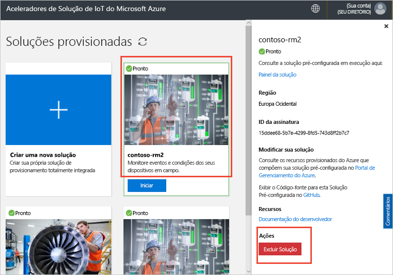

# Conecte um dispositivo IoT DevKit ao acelerador de solução de monitoramento remoto

[!INCLUDE [iot-suite-selector-connecting](../../includes/iot-suite-selector-connecting.md)]

Este guia prático mostra como executar um aplicativo de amostra no seu dispositivo IoT DevKit. O código de amostra envia a telemetria dos sensores no dispositivo DevKit ao seu acelerador de solução.

O [MXChip IoT DevKit](https://aka.ms/iot-devkit) é uma placa compatível com Arduino all-in-one periféricos e sensores avançados. É possível desenvolvê-lo usando o [Workbench do dispositivo de IoT do Azure](https://aka.ms/iot-workbench) ou pacote de extensão com as ferramentas do [ Azure IoT](https://aka.ms/azure-iot-tools) no Visual Studio Code. O [catálogo de projetos](https://microsoft.github.io/azure-iot-developer-kit/docs/projects/) contém aplicativos de exemplo para ajudá-lo a criar protótipos de soluções de IoT.

## Antes de começar

Para concluir as etapas neste tutorial, faça primeiro as tarefas a seguir:

* Prepare o seu Kit de Desenvolvimento, seguindo as etapas em [Conectar Kit de Desenvolvimento da IoT AZ3166 ao Hub IoT do Azure na nuvem](/azure/iot-hub/iot-hub-arduino-iot-devkit-az3166-get-started).

## Abra um projeto de exemplo

Para abrir o exemplo de monitoramento remoto no código VS:

1. Verifique se o seu IoT DevKit não está no seu computador. Inicie o VS Code primeiro e, em seguida, conecte o kit de desenvolvimento ao computador.

1. Clique em `F1` para abrir a paleta de comandos, digite e selecione **Workbench dos Dispositivos de IoT do Azure: Abrir Exemplos...**. Em seguida, selecione **Kit de Desenvolvimento de IoT** como placa.

1. Encontre **Monitoramento Remoto** e clique em **Exemplo Aberto**. Uma nova janela do VS Code é exibida mostrando a pasta do projeto:

   

## Configurar o dispositivo

Para configurar a cadeia de conexão do dispositivo Hub IoT no seu dispositivo DevKit:

1. Alternar o IoT DevKit no **modo de configuração**:

    * Mantenha pressionado o botão **A**.
    * Pressione e solte a o botão**Reiniciar**.

1. A tela exibe a ID do DevKit e `Configuration`.

    

1. Aperte **F1** para abrir a paleta de comandos, digite e selecione **Workbench dos Dispositivos de IoT do Azure: Definir as configurações do dispositivo... > Definir a Cadeia de conexão do dispositivo**.

1. Cole a sequência de conexão que você copiou anteriormente e pressione **Enter** para configurar o dispositivo.

## Compilar o código

Para compilar e carregar o código de dispositivo:

1. Aperte `F1` para abrir a paleta de comandos, digite e selecione **Workbench dos Dispositivos de IoT do Azure: Carregar o código de dispositivo**:

1. O VS Code compila e envia o código para o seu dispositivo DevKit:

    

1. O dispositivo DevKit é reinicializado e executa o código que você carregou.

## O exemplo de teste

Para verificar se o aplicativo de amostra enviado para o dispositivo DevKit está funcionando, conclua as etapas a seguir:

### Exibir a telemetria enviada à solução de Monitoramento Remoto

Quando o aplicativo de amostra é executado, o dispositivo DevKit envia a telemetria de seus dados de sensores via Wi-Fi para o acelerador de solução. Para ver a telemetria:

1. Vá para o painel de solução e, em seguida, clique em **Device Explorer**.

1. Clique no nome do dispositivo do seu dispositivo DevKit. na guia à direita, você pode ver a telemetria do DevKit em tempo real:

    

### Controlar o dispositivo do Kit de desenvolvimento

O acelerador da solução de monitoramento remoto permite controlar o dispositivo remotamente. O exemplo de código implementa três métodos que você pode ver na **método** seção quando você seleciona o dispositivo na **Device Explorer** página:

Para alterar a cor de um dos LEDs do DevKit, use o método **LedColor**:

1. Selecione o nome do dispositivo da lista de dispositivos e clique em **trabalhos**:

    

1. Configure os trabalhos usando os seguintes valores e clique em **aplicar**:

   * Selecionar trabalho: **Método de execução**
   * Nome do método: **LedColor**
   * Nome do trabalho: **ChangeLedColor**

     

1. Depois de alguns segundos, a cor do LED de RGB (abaixo do botão um) em suas alterações do Kit de desenvolvimento:

    

## Limpar recursos

Se você planeja passar para outros tutoriais, deixe o acelerador de solução de Monitoramento Remoto implantado.

Caso não precise mais do acelerador de solução, exclua-o da página Soluções provisionadas, selecionando-o e clicando em Excluir Solução:

## Comentários e problemas

Se você tiver algum problema, consulte [as Perguntas frequentes sobre o IoT DevKit](https://microsoft.github.io/azure-iot-developer-kit/docs/faq/) ou entre em contato conosco usando os seguintes canais:

* [Gitter.im](https://gitter.im/Microsoft/azure-iot-developer-kit)
* [Stack Overflow](https://stackoverflow.com/questions/tagged/iot-devkit)

## Próximas etapas

Agora que você aprendeu como conectar um dispositivo DevKit ao seu acelerador de solução de monitoramento remoto, aqui estão alguns próximos passos sugeridos:

* [Visão geral dos aceleradores de solução do Azure IoT](https://docs.microsoft.com/azure/iot-accelerators/)
* [Personalizar a interface do usuário](iot-accelerators-remote-monitoring-customize.md)
* [Conectar o kit de desenvolvimento de IoT ao aplicativo Azure IoT Central](../iot-central/howto-connect-devkit.md)