# Início rápido: experimentar uma solução baseada em nuvem para gerenciar meus dispositivos IoT industriais

Este início rápido mostra como implantar o acelerador de solução Azure IoT de Fábrica Conectada para executar uma simulação baseada em nuvem de monitoramento e gerenciamento para dispositivos IoT industriais. Ao implantar o acelerador de solução da Fábrica Conectada, ele será pré-preenchido com recursos simulados que permitem que você percorra um cenário IoT industrial comum. Várias fábricas simuladas estão conectadas à solução; elas relatam os valores de dados necessários para calcular a OEE (eficiência geral de equipamentos) e KPIs (indicadores chave de desempenho). Este início rápido mostra como usar o painel da solução para:

* Monitorar fábricas, linhas de produção, OEE de estação e valores de KPI.
* Analisar os dados telemétricos gerados por esses dispositivos.
* Responder a alarmes.

Para concluir este início rápido, você precisará de uma assinatura do Azure ativa.

Se você não tiver uma assinatura do Azure, crie uma [conta gratuita](https://azure.microsoft.com/free/?WT.mc_id=A261C142F) antes de começar.

## Implantar a solução

Ao implantar o acelerador de solução em sua assinatura do Azure, você precisa definir algumas opções de configuração.

Entre no [azureiotsolutions.com](https://www.azureiotsolutions.com/Accelerators) usando suas credenciais de conta do Azure.

Clique em **Experimentar agora** no bloco **Fábrica Conectada**.

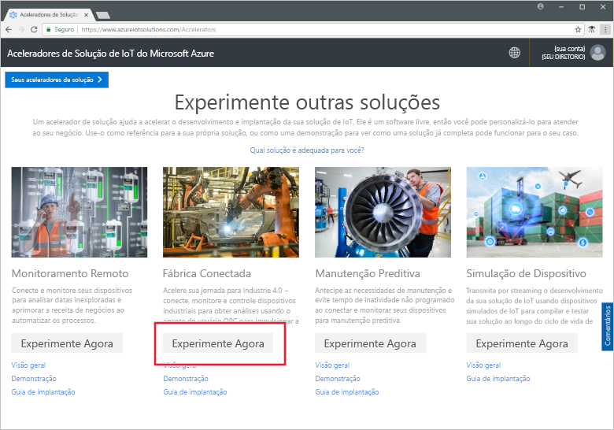

Na página **Criar solução de Fábrica Conectada**, insira um **nome de solução** exclusivo para o acelerador de solução de Fábrica Conectada. Esse é o nome do grupo de recursos do Azure que contém todos os recursos da solução do acelerador. Para este início rápido, estamos chamando nosso **MyDemoConnectedFactory**.

Selecione a **Assinatura** e a **Região** que você deseja usar para o acelerador de solução. Normalmente a região escolhida é a mais próxima de você. Para este início rápido, estamos usando o **Visual Studio Enterprise** e **Leste dos EUA**. Você deve ser um [usuário ou administrador global ](iot-accelerators-permissions.md) na assinatura.

Clique em **Criar Solução** para iniciar a implantação. Esse processo leva pelo menos cinco minutos para ser executado:

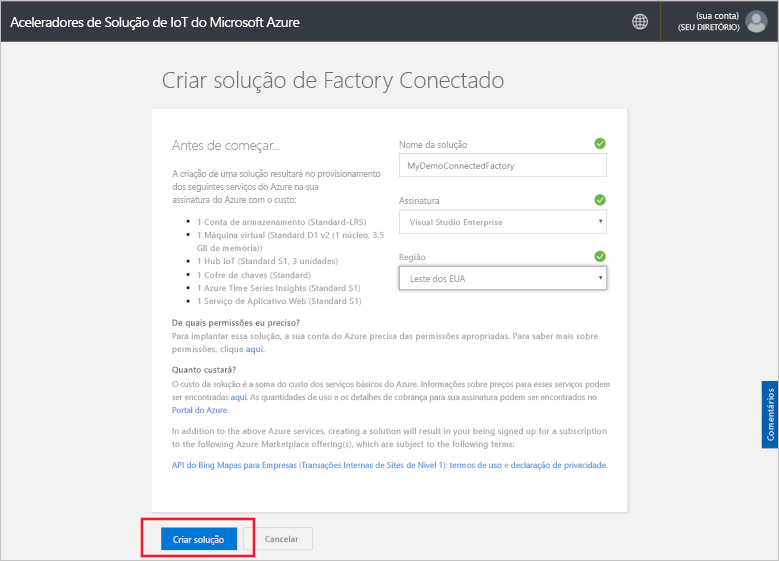

## Entrar na solução

Quando a implantação para sua assinatura do Azure for concluída, você verá uma marca de seleção verde e **Pronto** no bloco da solução. Agora é possível entrar no painel do acelerador de solução da Fábrica Conectada.

Na página **Soluções provisionadas**, clique no novo acelerador de solução da Fábrica Conectada:

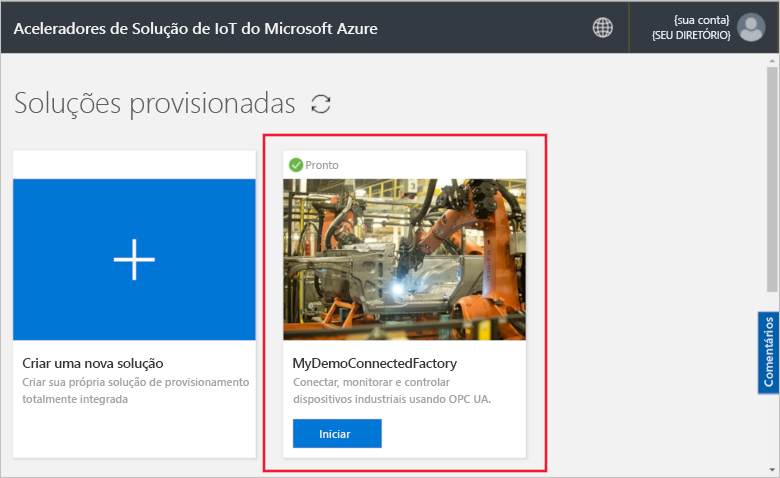

Você pode exibir as informações sobre o seu acelerador de solução da Fábrica Conectada no painel exibido. Escolha o **Painel da solução** para exibir o acelerador de solução da Fábrica Conectada:

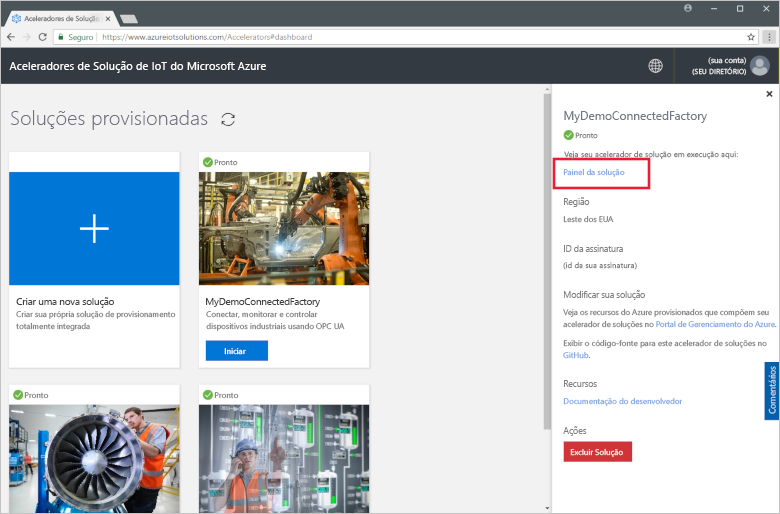

Clique em **Aceitar** para aceitar a solicitação de permissões; o painel de solução da Fábrica Conectada será exibido no seu navegador. Ele mostra um conjunto de fábricas simuladas, linhas de produção e estações.

## Exibir o painel

A exibição padrão é o *painel*. Para navegar para outras áreas do portal, use o menu no lado esquerdo da página:

[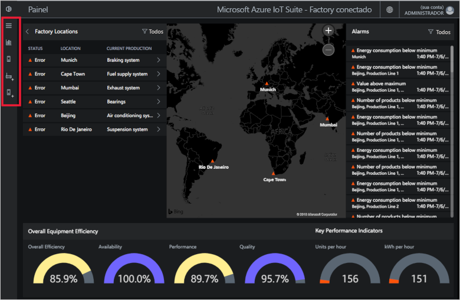](./media/quickstart-connected-factory-deploy/dashboard-expanded.png#lightbox)

É possível usar o painel para gerenciar seus dispositivos IoT industriais. A Fábrica Conectada usa uma hierarquia para mostrar uma configuração global da fábrica. No nível superior da hierarquia fica a empresa que contém uma ou mais fábricas; cada fábrica contém linhas de produção e cada linha de produção é composta de estações. Em cada nível, você pode exibir a OEE e os KPIs, publicar novos nós para telemetria e responder a alarmes.

No painel, você pode ver:

## Eficiência geral do equipamento

O painel de **Eficiência geral de equipamento** mostra os valores da OEE de toda a empresa ou a fábrica/produção linha/estação em exibição. Esse valor é agregado da exibição de estação para o nível corporativo. A figura de OEE e seus elementos constituintes podem ser mais analisados.

[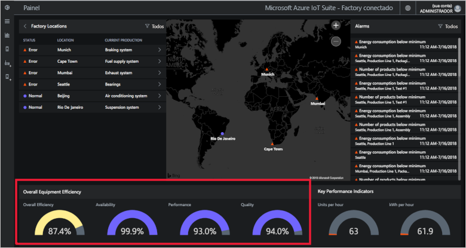](./media/quickstart-connected-factory-deploy/oee-expanded.png#lightbox)

A OEE classifica a eficiência do processo de fabricação usando parâmetros operacionais relacionados à produção. OEE é um padrão de medida do setor calculado multiplicando-se a taxa de disponibilidade, a taxa de desempenho e a taxa de qualidade: OEE = disponibilidade x qualidade x desempenho.

É possível fazer uma analisar profunda da OEE de qualquer nível dos dados da hierarquia. Clique na OEE, na disponibilidade, no desempenho ou na discagem de porcentagem de qualidade. É exibido um painel de contexto com visualizações que mostram dados em escalas de tempo diferentes:

[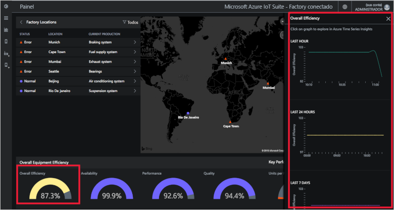](./media/quickstart-connected-factory-deploy/oeedetail-expanded.png#lightbox)

É possível clicar em um gráfico para fazer uma análise profunda dos dados.

### Indicadores chave de desempenho

O painel dos **Indicadores chave de desempenho** exibe a quantidade de unidades produzidas por hora e a energia (kWh) usada por toda a empresa ou a fábrica/linha de produção/estação em exibição. Esses valores são agregados de uma exibição de estação para o nível corporativo.

[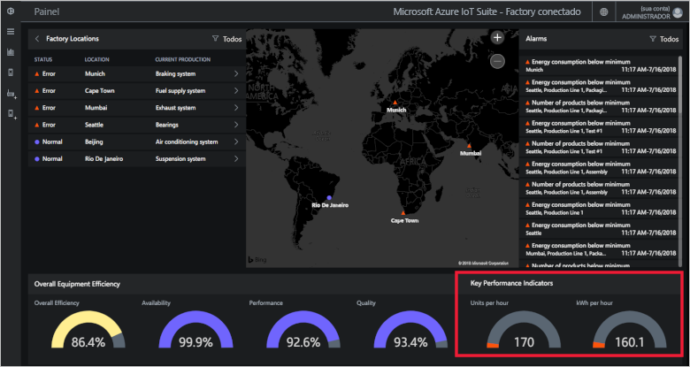](./media/quickstart-connected-factory-deploy/kpis-expanded.png#lightbox)

É possível fazer uma analisar profunda de KPIs de qualquer nível dos dados da hierarquia. Clique na OEE, na disponibilidade, no desempenho ou na discagem de porcentagem de qualidade. É exibido um painel de contexto com visualizações que mostram dados em escalas de tempo diferentes:

[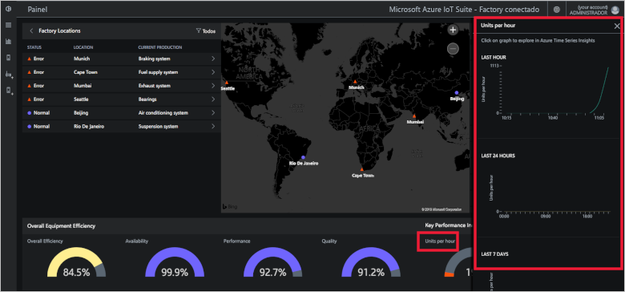](./media/quickstart-connected-factory-deploy/kpidetail-expanded.png#lightbox)

É possível clicar em um gráfico para fazer uma análise profunda dos dados.

### Locais de fábrica

Um painel **Locais de fábricas** que mostra o status, o local e a configuração atual de produção na solução. Ao executar o acelerador de solução, o painel mostra um conjunto simulado de alocadores. Cada simulação de linha de produção é composta de três servidores OPC UA reais que executam tarefas simuladas e compartilham dados. Para obter mais informações sobre o OPC UA, consulte as [Perguntas frequentes sobre Connected Factory](iot-accelerators-faq-cf.md):

[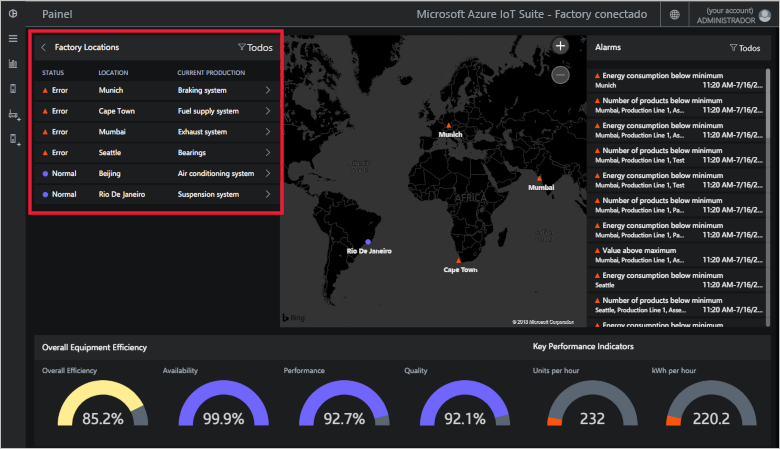](./media/quickstart-connected-factory-deploy/factorylocations-expanded.png#lightbox)

É possível navegar pela hierarquia de solução e exibir valores OEE e KPIs em cada nível:

1. Nos **Locais de fábrica**, clique em **Mumbai**. Você vê as linhas de produção neste local.

1. Clique em **Linha de Produção 1**. Você vê as estações nesta linha de produção.

1. Clique em **Empacotamento**. Você vê os nós de OPC UA publicados por essa estação.

1. Clique em **EnergyConsumption**. Você vê alguns gráficos plotando esse valor ao longo de escalas de tempo diferentes. É possível clicar em um gráfico para fazer uma análise profunda dos dados.

[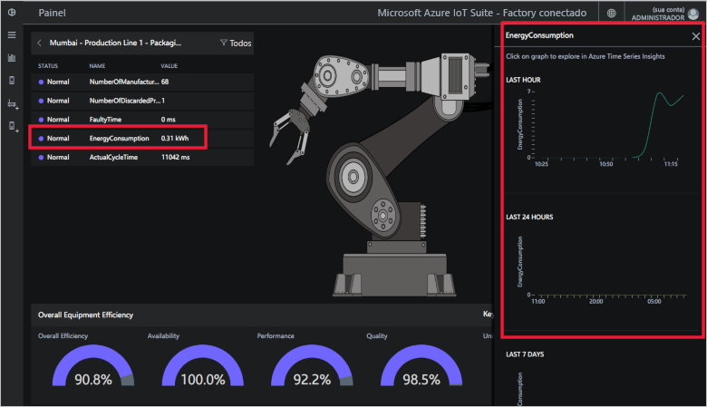](./media/quickstart-connected-factory-deploy/explorelocations-expanded.png#lightbox)

### Mapa

Se sua assinatura tiver acesso à [API do Bing Maps](iot-accelerators-faq-cf.md), o mapa de *Fábricas* mostrará a localização geográfica e o status de todas as fábricas na solução. Para analisar os detalhes de local, clique nos locais exibidos no mapa.

### Alarmes

O painel **Alarmes** mostra os alarmes gerados quando um valor relatado ou um valor calculado de OEE/KPI excede um limite configurado. Esse painel exibe alarmes em cada nível da hierarquia, do nível de estação até a empresa. Cada alarme inclui uma descrição, data, hora, local e número de ocorrências:

[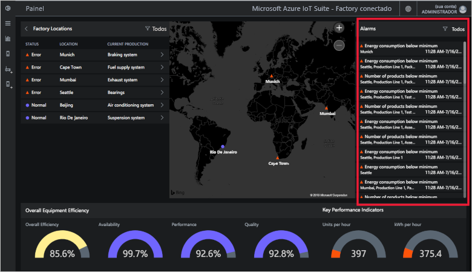](./media/quickstart-connected-factory-deploy/alarms-expanded.png#lightbox)

É possível analisar os dados que causaram o alarme no painel. Se você for um Administrador, poderá executar ações padrão em relação aos alarmes, como:

* Fechar o alarme.
* Reconhecer o alarme.

Clique em um dos alarmes, na lista suspensa **Escolher ação**, escolha **Reconhecer alerta** depois clique em **Aplicar**:

Para analisar melhor os dados de alarme, clique no grafo no painel de alarme.

Esses alarmes são gerados por regras que são especificadas em um arquivo de configuração do acelerador de solução. Essas regras podem gerar alarmes quando os valores de OEE ou KPI ou os valores de nó de OPC UA excedem o limite configurado.

## Limpar recursos

Caso planeje explorar ainda mais, mantenha implantado o acelerador de solução da Fábrica Conectada.

Caso não precise mais do acelerador de solução, exclua-o da página [Soluções provisionadas](https://www.azureiotsolutions.com/Accelerators#dashboard) selecionando-o e clicando em **Excluir solução**:

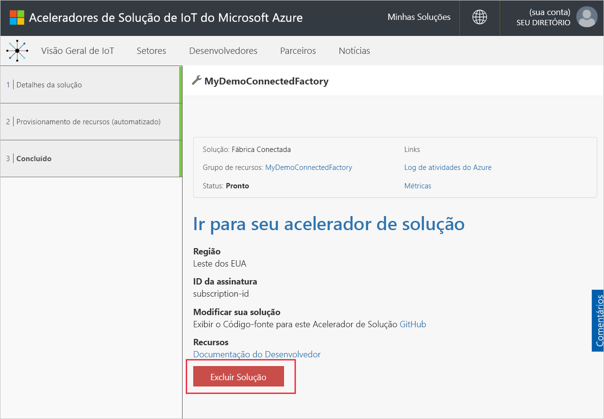

## Próximas etapas

Neste início rápido, você implantou o acelerador de solução da fábrica conectada e aprendeu como navegar pelas suas fábricas, linhas de produção e estações. Você também viu como exibir os valores de OEE e KPI em qualquer nível na hierarquia e como responder aos alarmes.

Para saber como usar outros recursos no painel para gerenciar seus dispositivos IoT industriais, siga para o guia de instruções a seguir:

> [!div class="nextstepaction"]
> [Usar o painel da Fábrica Conectada](iot-accelerators-connected-factory-dashboard.md)