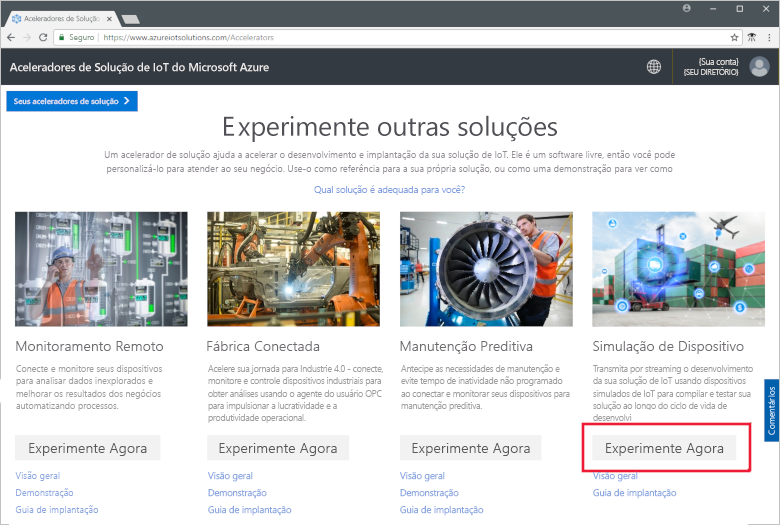
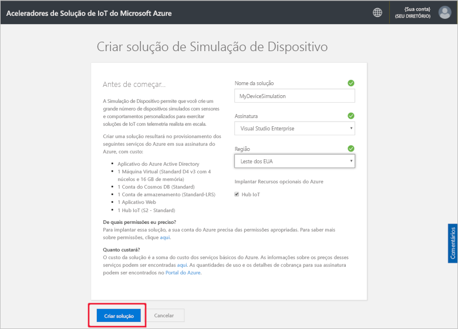
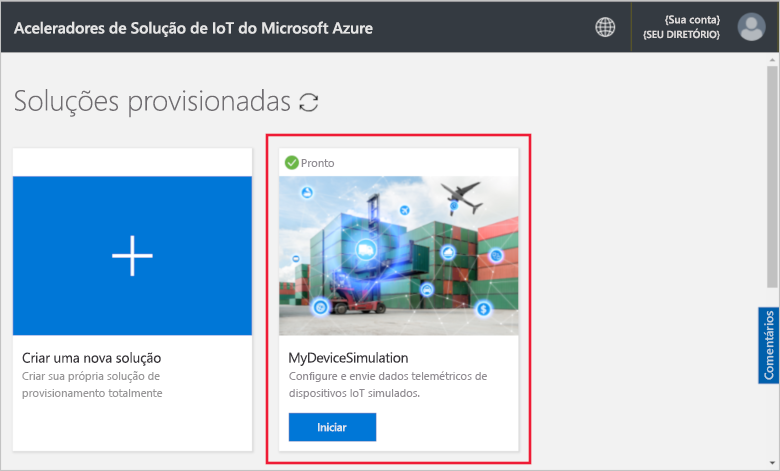
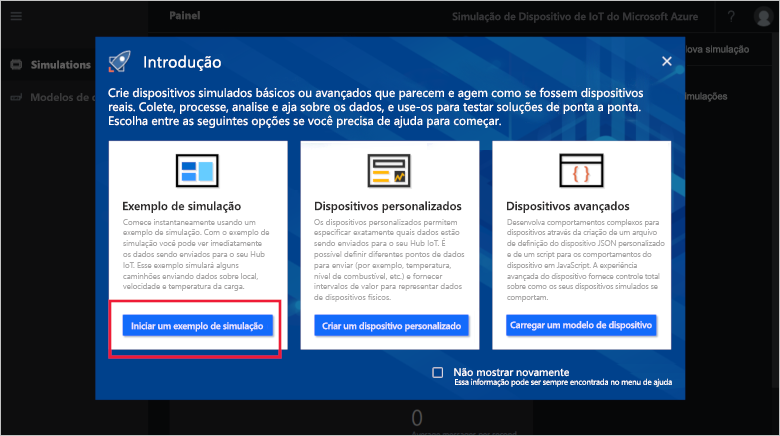
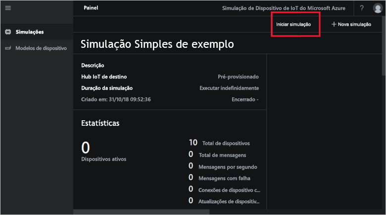
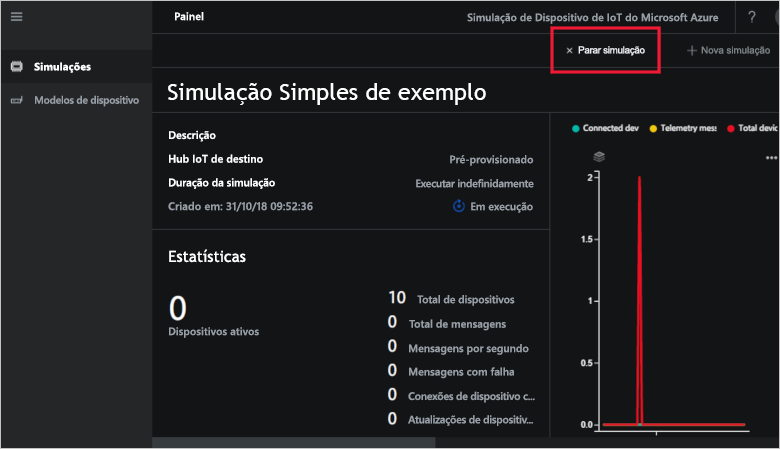

# Início Rápido: Implantar e executar uma simulação de dispositivo IoT no Azure

Este início rápido mostra como implantar a Simulação de Dispositivo do Azure IoT para testar sua solução de IoT. Depois de implantar o acelerador de solução, execute uma simulação de exemplo como introdução.

Para concluir este início rápido, você precisará de uma assinatura do Azure ativa.

Se você não tiver uma assinatura do Azure, crie uma [conta gratuita](https://azure.microsoft.com/free/?WT.mc_id=A261C142F) antes de começar.

## Implantar simulação de dispositivo

Ao implantar a Simulação de Dispositivo em sua assinatura do Azure, você precisará definir algumas opções de configuração.

Entre no [azureiotsolutions.com](https://www.azureiotsolutions.com/Accelerators) usando suas credenciais de conta do Azure.

Clique no bloco **Simulação de Dispositivo**:

Clique em **Experimentar agora** na página de descrição da Simulação de Dispositivo:

Na página **Criar solução de simulação de dispositivo**, insira um **Nome da solução** exclusivo.

Selecione a **Assinatura** e a **Região** que você deseja usar para o acelerador de solução. Normalmente a região escolhida é a mais próxima de você. Você deve ser um [usuário ou administrador global ](iot-accelerators-permissions.md) na assinatura.

Marque a caixa para implantar um Hub IoT a ser usado com a sua solução de simulação de dispositivo. Você pode sempre alterar o Hub IoT usado pela sua simulação posteriormente.

Clique em **Criar solução** para começar a provisionar a sua solução. Esse processo leva pelo menos cinco minutos para ser executado:

## Entrar na solução

Quando o processo de provisionamento for concluído, você poderá entrar na instância da Simulação de Dispositivo clicando no botão **Iniciar**:

Clique em **Aceitar** para aceitar a solicitação das permissões, o painel de solução de simulação de dispositivo será exibido no seu navegador.

Quando aberta pela primeira vez, você verá o painel da Simulação de Dispositivo com uma guia de **Introdução**. Clique no primeiro bloco para abrir uma simulação de exemplo. Se você fechar a guia de **Introdução**, poderá abrir a **Simulação Simples de Exemplo** no painel clicando em seu bloco:

## Simulação de Exemplo

Como uma simulação de exemplo, ela não pode ser editada. A simulação tem as seguintes configurações:

| Configuração             | Valor                       |
| ------------------- | --------------------------- |
| Hub IoT de destino      | Use o Hub IoT pré-provisionado |
| Modelo do dispositivo        | Caminhão                       |
| Número de dispositivos   | 10                          |
| Frequência de telemetria | 10 segundos                  |
| Duração da simulação | Executar indefinidamente            |

## Executar a simulação

Clique em **Iniciar simulação**. A simulação será executada indefinidamente, conforme configurado. É possível interromper a simulação a qualquer momento clicando em **Interromper simulação**. A simulação mostra as estatísticas para a execução atual.

Você só pode executar uma simulação por vez em uma instância da Simulação de Dispositivo.

## Limpar recursos

Se você planeja levar a exploração adiante, deixe a Simulação de Dispositivo implantada.

Se você não precisa mais da Simulação de Dispositivo, exclua-a da página [Soluções provisionadas](https://www.azureiotsolutions.com/Accelerators#dashboard) clicando em seu bloco e clicando em **Excluir Solução**:

## Próximas etapas

Neste início rápido, você implantou a Simulação de Dispositivo e executou uma simulação de dispositivo de IoT de exemplo.

> [!div class="nextstepaction"]
> [Criar uma simulação com um ou mais tipos de dispositivo](iot-accelerators-device-simulation-create-simulation.md)