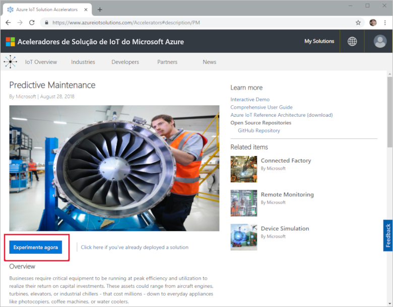
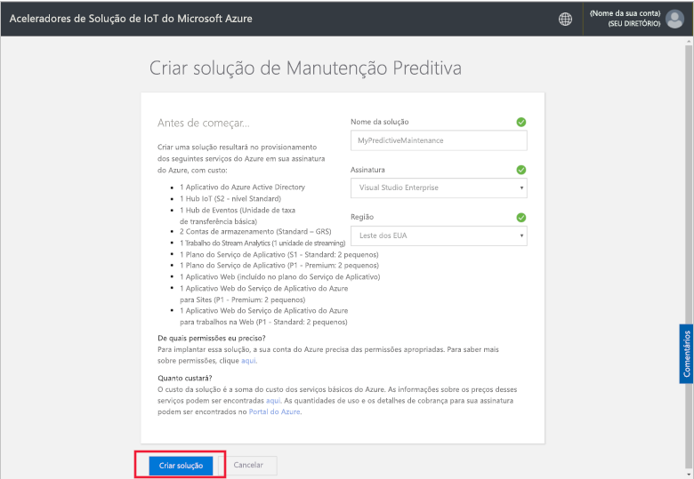
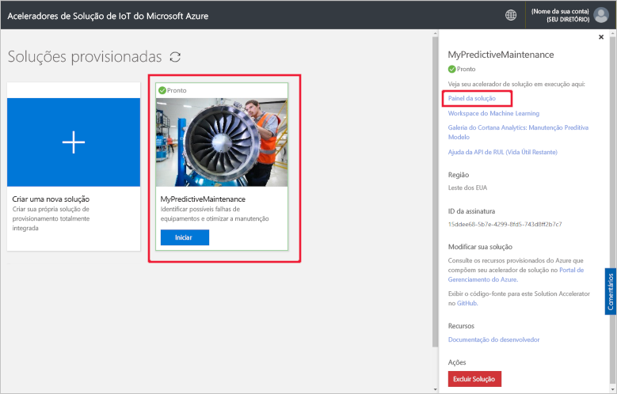
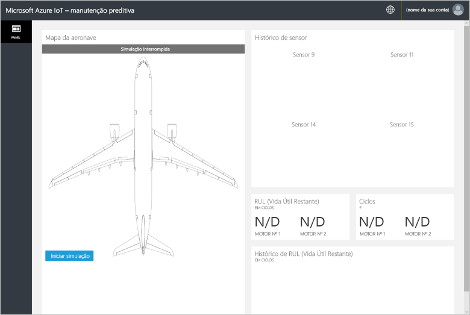
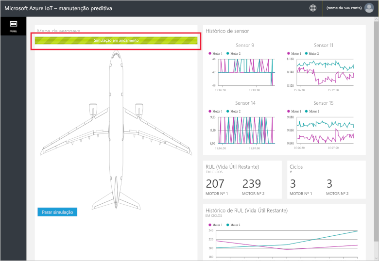
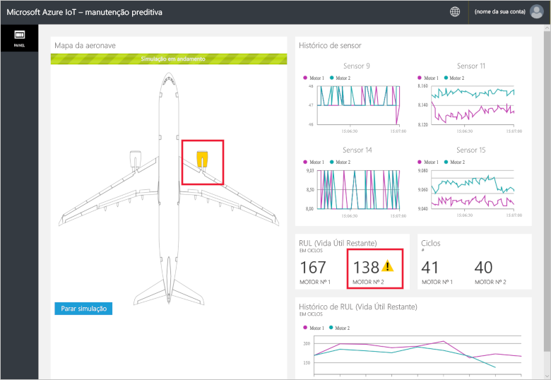
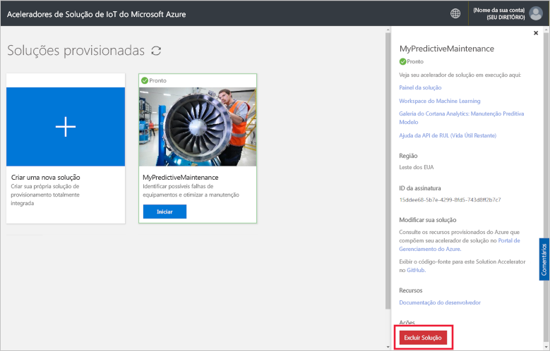

# Início rápido: Implantar uma solução baseada em nuvem para executar uma análise de manutenção preditiva em meus dispositivos conectados

Este início rápido mostra como implantar o acelerador de solução de manutenção preditiva do Azure IoT para uso como uma solução de manutenção preditiva baseada em nuvem por seus dispositivos IoT. Após ter implantado o acelerador de solução, você usa página **Painel** da solução para executar uma simulação usando dados de motores de aeronave.

A Fabrikam é uma companhia aérea regional que se dedica a fornecer uma excelente experiência ao cliente a preços competitivos. Uma das causas de atrasos de voos são problemas de manutenção e a manutenção dos motores de aeronave representa um desafio singular. A Fabrikam precisa evitar a falha do motor durante o voo a todo custo e, portanto, ela inspeciona seus motores regularmente e agenda a manutenção de acordo com um plano. No entanto, os motores de aeronave nem sempre se desgastam da mesma forma. Algum tipo de manutenção desnecessária é feita nos motores. O mais importante é que problemas ocorrem, o que pode fazer com que uma aeronave permaneça em solo até que a manutenção seja concluída. Esses problemas podem custar muito caro se uma aeronave estar em um local onde os técnicos certos ou as peças de reposição certas não estão disponíveis.

Os motores de aeronave da Fabrikam são instrumentados com sensores que monitoram as condições do motor durante o voo. Após vários anos acumulando dados operacionais e de falha do motor, os cientistas de dados da Fabrikam desenvolveram um modelo para prever a Vida Útil Restante (RUL) de um motor de aeronave. O modelo usa uma correlação entre os dados de quatro sensores do motor e o desgaste do motor que leva a uma eventual falha. Embora a Fabrikam continue suas inspeções regulares para garantir a segurança, ela agora pode usar os modelos para calcular a RUL para cada motor após cada voo. A Fabrikam agora pode prever pontos de falha no fututo e planejar a manutenção para minimizar o tempo de solo de aeronave e reduzir os custos operacionais, ao mesmo tempo que garante a segurança dos passageiros e da tripulação.

## pré-requisitos

Para concluir este início rápido, você precisará de uma assinatura do Azure ativa.

Se você não tiver uma assinatura do Azure, crie uma [conta gratuita](https://azure.microsoft.com/free/?WT.mc_id=A261C142F) antes de começar.

## Implantar a solução

Ao implantar o acelerador de solução em sua assinatura do Azure, você precisa definir algumas opções de configuração.

Entre no [azureiotsolutions.com](https://www.azureiotsolutions.com/Accelerators) usando suas credenciais de conta do Azure.

Clique em **Experimentar agora** no bloco **Manutenção preditiva**.

Na página **Criar solução de manutenção preditiva**, insira um **Nome da solução** exclusivo para o seu acelerador de solução de manutenção preditiva.

Selecione a **Assinatura** e a **Região** que você deseja usar para o acelerador de solução. Normalmente a região escolhida é a mais próxima de você. Você deve ser um [usuário ou administrador global ](iot-accelerators-permissions.md) na assinatura.

Clique em **Criar solução** para iniciar a implantação. Esse processo leva pelo menos cinco minutos para ser executado:

## Entrar na solução

Quando a implantação em sua assinatura do Azure for concluída, você poderá entrar em seu painel do acelerador de solução de manutenção preditiva.

Na página **Soluções provisionadas**, clique em seu novo acelerador de solução de manutenção preditiva. Você pode exibir informações sobre o acelerador de solução no painel exibido. Escolha **Painel da solução** para exibir o acelerador de solução de manutenção preditiva:

Clique em **Aceitar** para aceitar a solicitação de permissões. O painel de solução de manutenção preditiva é exibido no navegador:

Clique em **Iniciar simulação** para iniciar a simulação. O histórico de sensor, RUL, ciclos e histórico de RUL preenchem o painel:

Quando a RUL for menor que 160 (um limite aleatório escolhido para fins de demonstração), o portal da solução exibirá um símbolo de aviso ao lado da exibição da RUL. O portal da solução também destaca o motor de aeronave em amarelo. Observe que os valores da RUL têm uma tendência descendente geral, mas tendem a subir e a descer. Este comportamento é resultado de durações variáveis do ciclo e da precisão do modelo.

A simulação completa leva cerca de 35 minutos para concluir 148 ciclos. O limite de 160 do RUL é atingido pela primeira vez aproximadamente aos cinco minutos, e os dois motores atingem o limite aproximadamente aos oito minutos.

A simulação percorre todo o conjunto de dados dos 148 ciclos e estabelece nos valores finais de RUL e de ciclo.

Você pode parar a simulação a qualquer momento, mas clicar em **Iniciar Simulação** repetirá a simulação desde o início do conjunto de dados.

## Limpar recursos

Se você planeja explorar ainda mais, deixe o acelerador de solução de manutenção preditiva implantado.

Se você não precisar mais do acelerador de solução, exclua-o da página [Soluções provisionadas](https://www.azureiotsolutions.com/Accelerators#dashboard):

## Próximas etapas

Neste início rápido, você implantou o acelerador de solução de manutenção preditiva e executou uma simulação.

Para saber mais sobre o acelerador de solução, consulte o artigo.

> [!div class="nextstepaction"]
> [Visão geral do acelerador de solução de Manutenção Preditiva](iot-accelerators-predictive-walkthrough.md)
