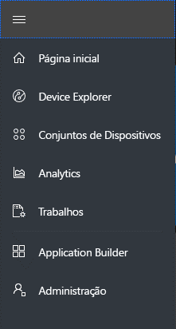
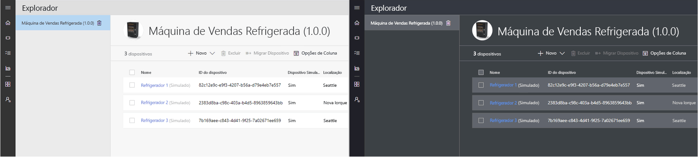
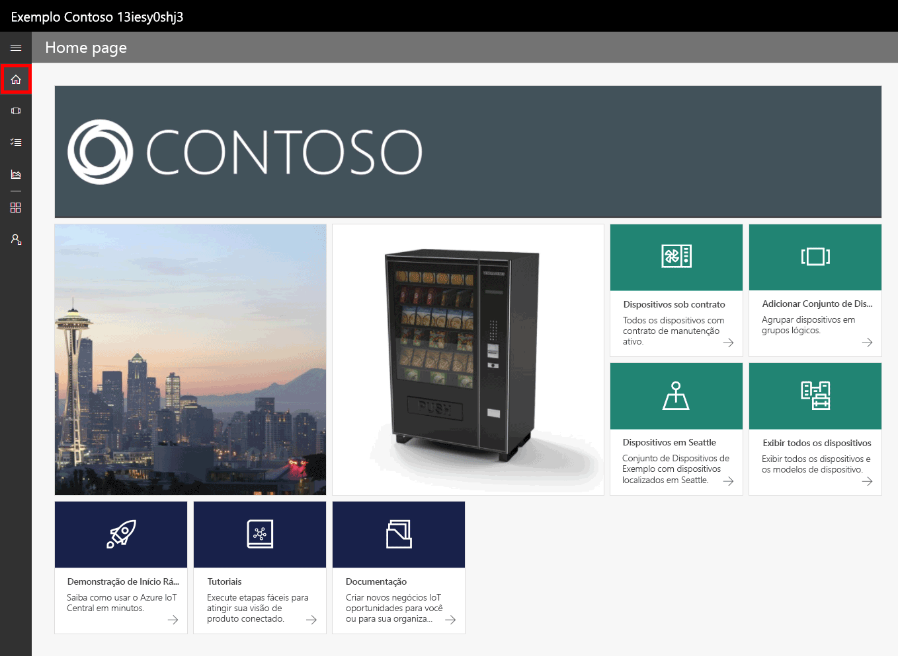
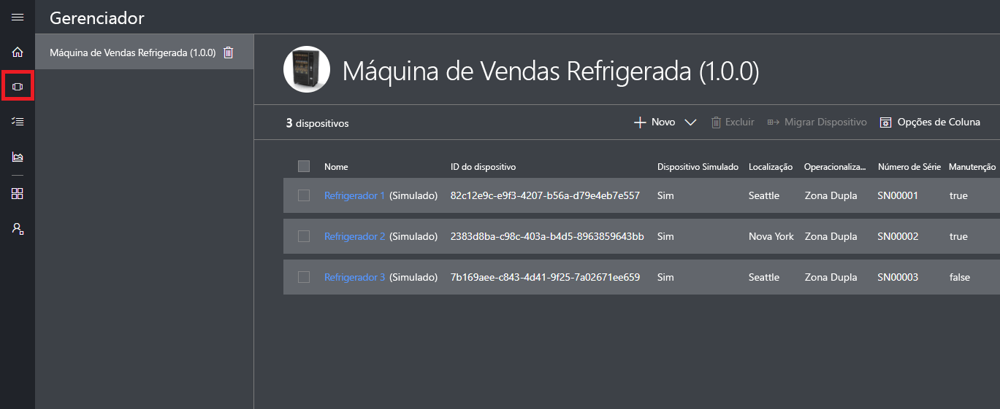
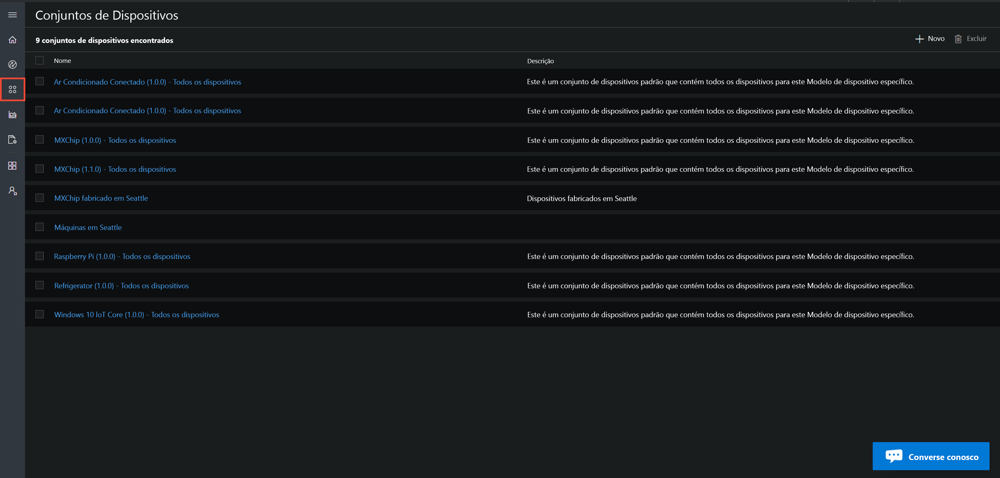
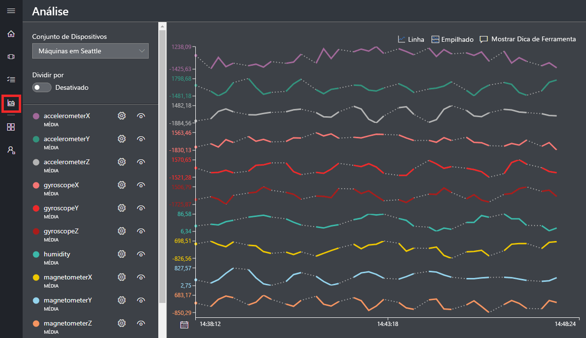
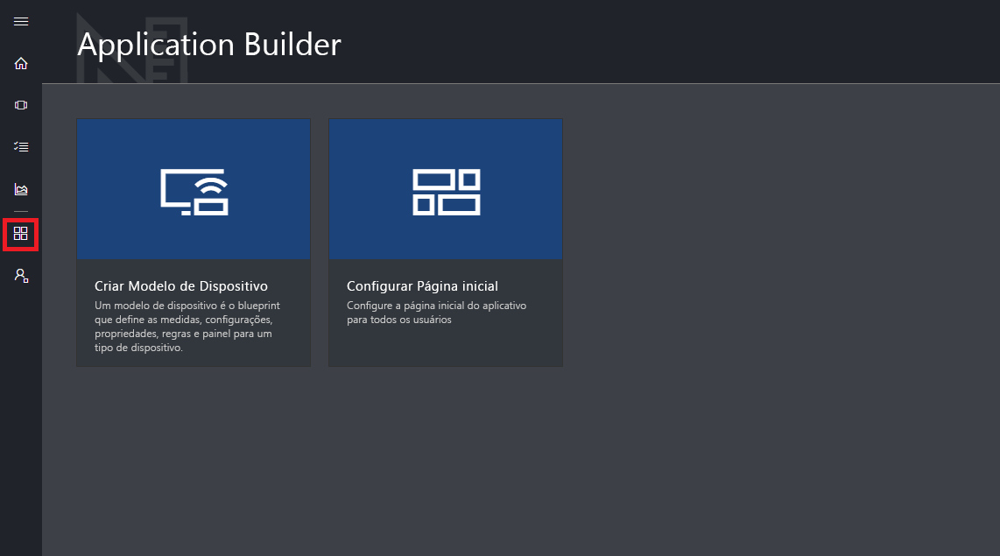
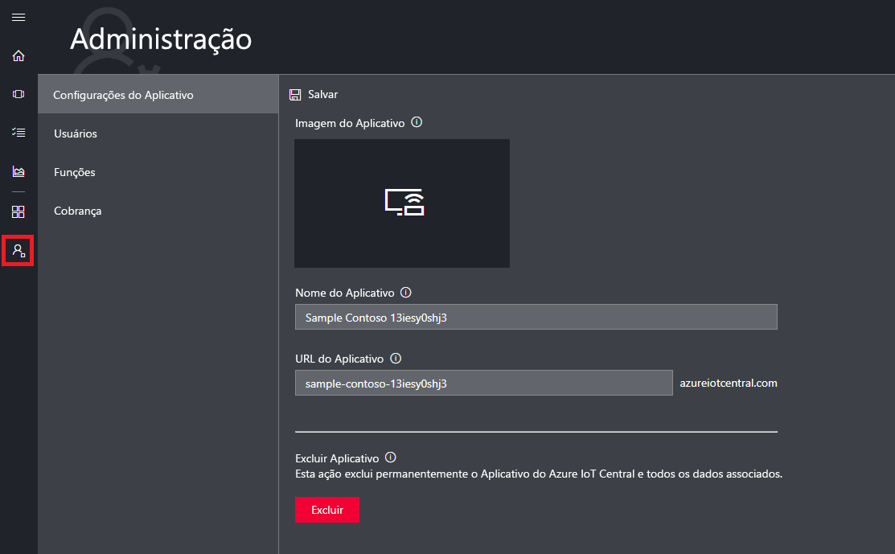

# Faça um tour da interface do usuário do Azure IoT Central

Este artigo apresenta a interface do usuário do Microsoft Azure IoT Central. Você pode usar a interface do usuário para criar, gerenciar e usar uma solução do Azure IoT Central e seus dispositivos conectados.

Como um _construtor_, use a interface do usuário do Azure IoT Central para definir sua solução o Azure IoT Central. Você pode usar a interface do usuário para:

- Definir os tipos de dispositivos que se conectam à sua solução.
- Configurar as regras e ações para seus dispositivos.
- Personalizar a interface do usuário para um _operador_ que usa sua solução.

Como um _operador_, você pode usar a interface do usuário do Azure IoT Central para gerenciar sua solução do Azure IoT Central. Você pode usar a interface do usuário para:

- Monitorar seus dispositivos.
- Configurar seus dispositivos.
- Solucionar e corrigir problemas com dispositivos.
- Provisione novos dispositivos.

## Use o menu de navegação à esquerda

Use o menu de navegação à esquerda para acessar as diferentes áreas do aplicativo:

| Menu | DESCRIÇÃO |
| ---- | ----------- |
|  | <ul><li>O botão **Início** exibe a home page do seu aplicativo. Como um construtor, você pode personalizar essa página inicial para seus operadores.</li><li>O botão **Device Explorer** lista os modelos de dispositivo definidos em seu aplicativo e os dispositivos simulados e reais associados a cada modelo de dispositivo. Como um operador, use o **Device Explorer** para gerenciar os dispositivos conectados.</li><li>O botão **Definições do Dispositivo** permite exibir e criar conjuntos de dispositivos. Como um operador, você pode criar conjuntos de dispositivos como uma coleção lógica de dispositivos especificados por uma consulta.</li><li>O botão **Análise** mostra a análise derivada da telemetria do dispositivo para dispositivos e conjuntos de dispositivos. Como um operador, você pode criar exibições personalizadas sobre dados do dispositivo para derivar insights de seu aplicativo.</li><li>O botão **Trabalhos** habilita o gerenciamento de dispositivos em massa fazendo você criar e executar trabalhos para realizar atualizações em escala.</li><li>O botão **Construtor do Aplicativo** mostra as ferramentas usadas por um construtor, como a ferramenta **Criar modelo de dispositivo**.</li><li>O botão **Administração** mostra as páginas de administração do aplicativo em que um administrador pode gerenciar as configurações do aplicativo, usuários e funções.</li></ul> |

## Pesquisa, ajuda e suporte

O menu superior aparece em cada página:

- Para procurar dispositivos e modelos de dispositivo, escolha o ícone **Pesquisar**.
- Para obter ajuda e suporte, escolha o menu suspenso da **Ajuda** para ver uma lista de recursos.
- Para controlar os tutoriais, alterar o tema da interface do usuário ou sair do aplicativo, escolha o ícone **Conta**.

Você pode escolher entre um tema claro ou escuro para a interface do usuário:

## Página inicial

A home page é a primeira página que você vê quando entra no seu aplicativo do Azure IoT Central. Como um construtor, você pode adicionar blocos para personalizar a home page de outros usuários do aplicativo. Para obter mais informações, consulte o tutorial [Personalizar modo de exibição do operador do Azure IoT Central](tutorial-customize-operator.md).

## Gerenciador de dispositivos

A página Explorer mostra o _modelos de dispositivo_ e os _dispositivos_ em seu aplicativo do Azure IoT Central.

* Um modelo do dispositivo define um tipo de dispositivo que pode se conectar ao seu aplicativo. Para saber mais, consulte [Definir um novo tipo de dispositivo em seu aplicativo do Azure IoT Central](tutorial-define-device-type.md).
* Um dispositivo representa um dispositivo real ou simulado no seu aplicativo. Para saber mais, consulte [Adicionar um novo dispositivo ao seu aplicativo do Azure IoT Central](tutorial-add-device.md).

## Conjuntos de dispositivos

A página _Conjuntos de dispositivos_ mostra conjuntos de dispositivos criados pelo construtor. Um conjunto de dispositivos é uma coleção de dispositivos relacionados. Um construtor define uma consulta para identificar os dispositivos que estão incluídos em um conjunto de dispositivos. Ao personalizar a análise em seu aplicativo, você usa conjuntos de dispositivos. Para saber mais, consulte o artigo [Usar conjuntos de dispositivos em seu aplicativo do Azure IoT Central](howto-use-device-sets.md).

## Análise

A página Análise mostra gráficos que ajudam você a entender como os dispositivos conectados ao seu aplicativo estão se comportando. Um operador usa essa página para monitorar e investigar problemas com dispositivos conectados. O construtor pode definir os gráficos mostrados nessa página. Para saber mais, consulte o artigo [Criar análises personalizadas para seu aplicativo do Azure IoT Central](howto-create-analytics.md).

## Trabalhos

A página de trabalhos permite que você execute operações de gerenciamento de dispositivos em massa em seus dispositivos. O construtor usa essa página para atualizar propriedades do dispositivo, configurações e comandos. Para saber mais, consulte o artigo [Executar um trabalho](howto-run-a-job.md).

## Construtor de Aplicativos

A página Construtor do aplicativo contém links para as ferramentas que um construtor usa para criar um aplicativo do Azure IoT Central, como criar modelos de dispositivo e configurar a home page. Para saber mais, consulte o tutorial [Definir um novo tipo de dispositivo em seu aplicativo do Azure IoT Central](tutorial-define-device-type.md).

## Administração

A página Administração contém links para as ferramentas que um administrador usa para definir usuários e funções no aplicativo. Para saber mais, consulte o artigo [Administrar seu aplicativo do Azure IoT Central](howto-administer.md).

## Próximas etapas

Agora que você tem uma visão geral do Azure IoT Central e está familiarizado com o layout da interface do usuário, a próxima etapa sugerida é concluir o início rápido [Criar um aplicativo do Azure IoT Central](quick-deploy-iot-central.md).