# Crie um aplicativo Azure IoT Central

Como um _construtor_, use a interface do usuário do Azure IoT Central para definir seu aplicativo Microsoft Azure IoT Central. Este guia de início rápido mostra como:

- Criar um aplicativo Azure IoT Central que contenha um exemplo de _modelo de dispositivo_ e _dispositivos_ simulados.
- Exibir os recursos do modelo de dispositivo da **Máquina de venda automática refrigerada** em seu aplicativo.
- Exibir a telemetria e análise de seus dispositivos simulados de **Refrigerador**.

Neste guia de início rápido, você exibe um dispositivo **Refrigerador** simulado a partir de um modelo de dispositivo. O dispositivo simulado:

* Envia a telemetria, como temperatura e pressão, para seu aplicativo.
* Informa os valores de propriedade do dispositivo, como um alerta de movimento, para seu aplicativo.
* Possui configurações de dispositivo, como velocidade do ventilador, que podem ser definidas no aplicativo.

Quando você cria um dispositivo simulado a partir de um modelo de dispositivo em um aplicativo Azure IoT Central, o dispositivo simulado permite que você teste seu aplicativo antes de você conectar um dispositivo real.

## Criar o aplicativo

Para concluir este guia de início rápido, você precisa criar um aplicativo Azure IoT Central a partir do modelo de aplicativo de **exemplo Contoso**.

Navegue até a página do [Gerenciador de aplicativos](https://aka.ms/iotcentral) do Azure IoT Central. Em seguida, digite o endereço de email e a senha que você usa para acessar sua assinatura do Azure:

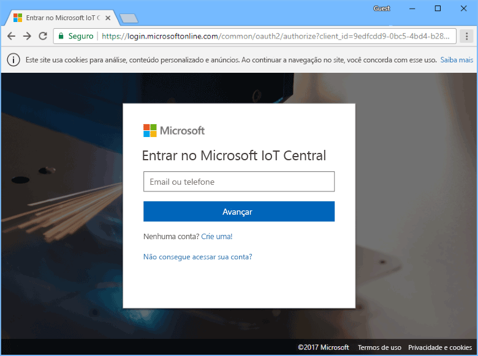

Para começar a criar um novo aplicativo Azure IoT Central, escolha **Novo aplicativo**:

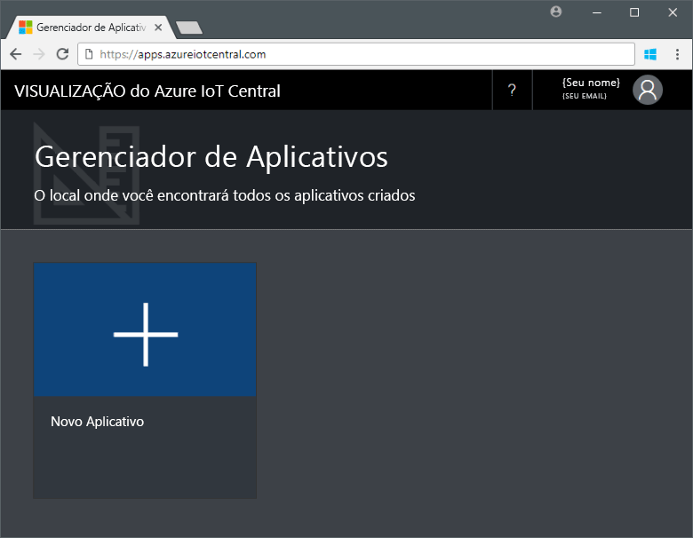

Para criar um novo aplicativo Azure IoT Central:

1. Escolha o plano de pagamento **Avaliação gratuita de aplicativo**.
1. Escolha um nome amigável do aplicativo, como **IoT Contoso**. O Azure IoT Central gera um prefixo de URL exclusivo para você. Você pode alterar esse prefixo de URL para algo mais fácil de lembrar.
1. Escolha o modelo de aplicativo de **exemplo Contoso**.
1. Depois, escolha **Criar**.

## Navegue até o aplicativos

Quando seu aplicativo estiver pronto, a **Página inicial** do seu aplicativo é exibida. O _Modo de design_ na parte superior direita pode ser ativado ou desativado para editar a página inicial. A URL do aplicativo é a URL que você especificou na etapa anterior:

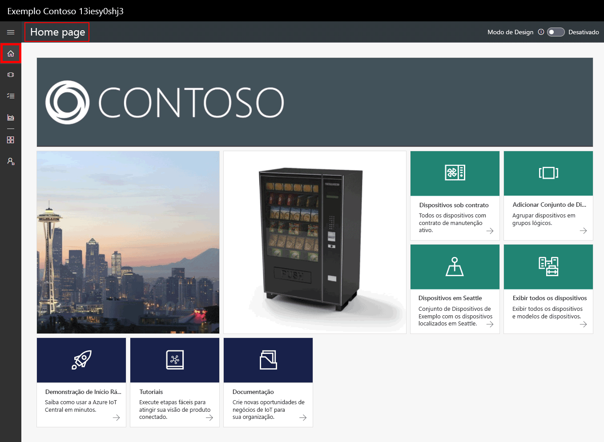

Use o _menu de navegação à esquerda_ para acessar as diferentes áreas do seu novo aplicativo Azure IoT Central:

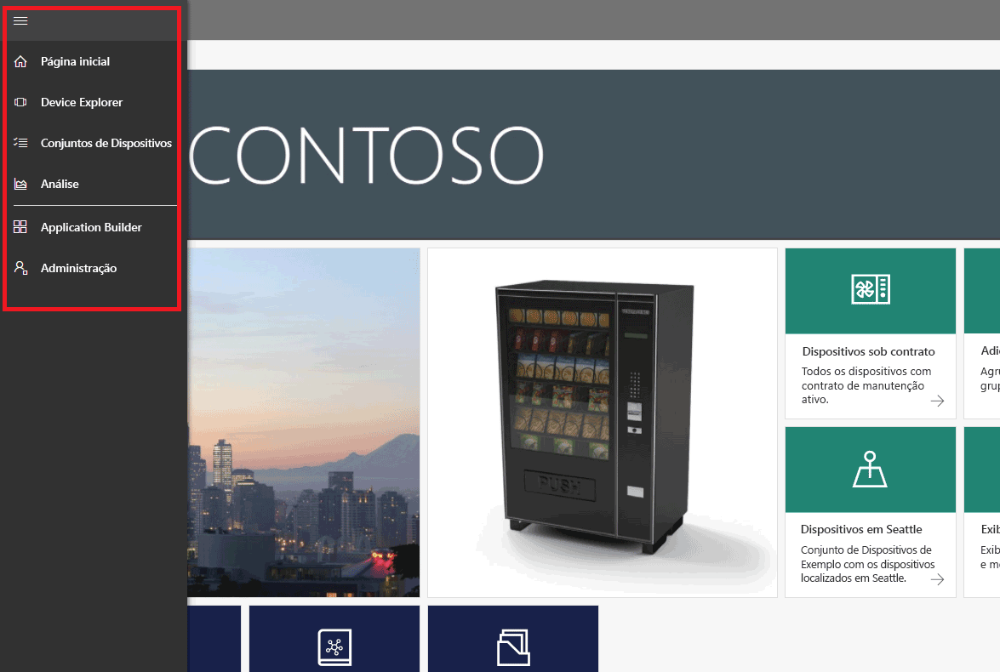

Para exibir os modelos de dispositivo e os dispositivos em seu aplicativo, escolha **Device Explorer** no menu de navegação à esquerda. O aplicativo de exemplo inclui o modelo de aplicativo de **Máquina de venda automática refrigerada**. Há três dispositivos simulados já criados com base neste modelo de dispositivo:

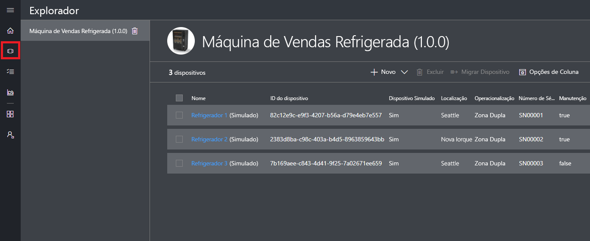

## Exibir o modelo de dispositivo e os dispositivos

Use as etapas a seguir para exibir um dispositivo refrigerador que foi criado a partir do modelo de dispositivo de **Máquina de venda automática refrigerada**. Um modelo de dispositivo define:

* _Medidas_, como a telemetria de temperatura, enviada de um dispositivo.
* _Configurações_, como velocidade do ventilador, que permite controlar o dispositivo.
* _Propriedades_, como o número de série, que armazenam informações sobre o dispositivo.
* [Regras](howto-create-telemetry-rules.md) que permitem automatizar ações com base no comportamento do dispositivo.
* Um _painel_ personalizável que exibe informações sobre o dispositivo.

Você pode criar dispositivos simulados e reais a partir de um modelo de dispositivo.

### Medidas

A página **Medidas** para o **Refrigerador 1** é exibida. Você pode ver a lista de medidas enviadas do dispositivo simulado. A página também exibe um gráfico personalizável das medidas visíveis:

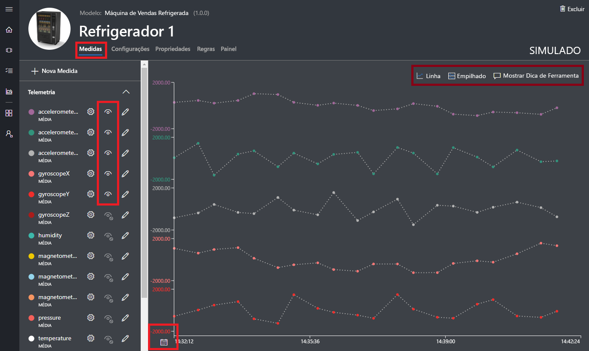

Você pode alternar a visibilidade de elementos individuais e personalizar o gráfico. O gráfico atual mostra a telemetria de um dispositivo simulado. Você pode adicionar novas medidas para o modelo do dispositivo, se você tiver as permissões apropriadas.

> [!NOTE]
> Talvez seja necessário aguardar por um curto tempo antes dos dados simulados aparecerem no gráfico.

### Configurações

Escolha **Configurações**. Na página **Configurações**, você pode controlar o dispositivo. Por exemplo, você pode atualizar a velocidade do ventilador refrigerador:

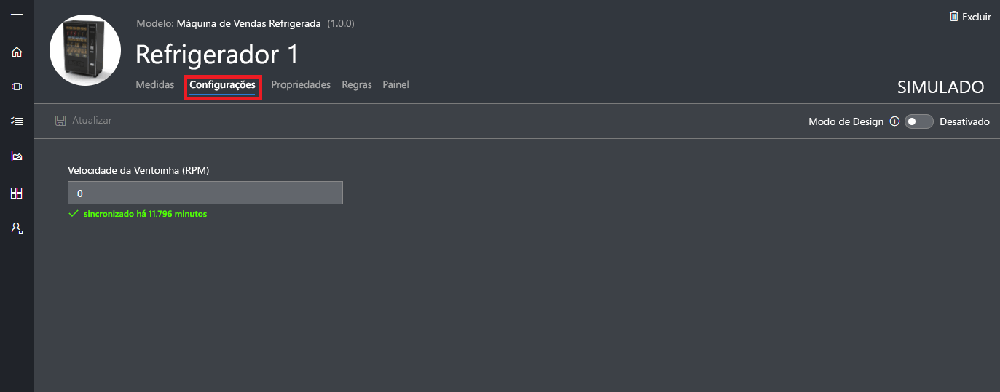

Uma configuração aparece como **sincronizada** quando um dispositivo confirma a alteração.

### propriedades

Escolha **Propriedades**. Na página **Propriedades**, você pode:

* Manter informações sobre o seu dispositivo, como o nome do cliente.
* Exibir valores de propriedade relatados pelo dispositivo, como um alerta de movimento.

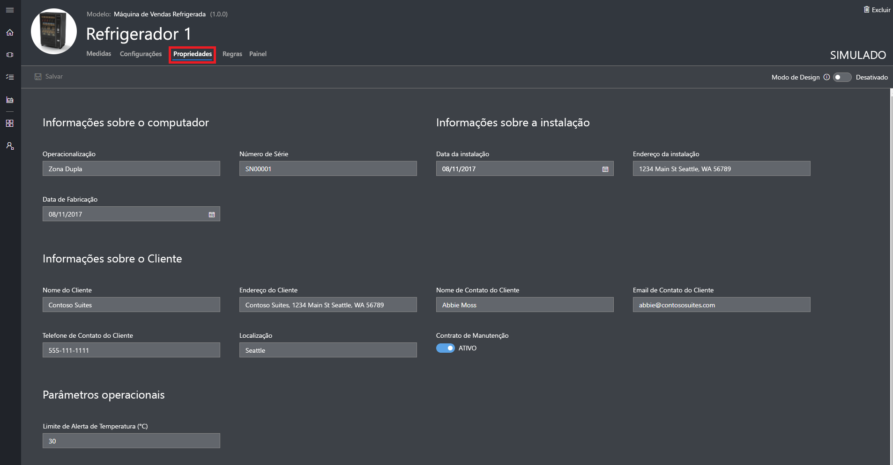

### painel

Escolha **Painel**. O painel é uma visão personalizada das informações sobre o seu dispositivo, como medidas, propriedades e KPIs:

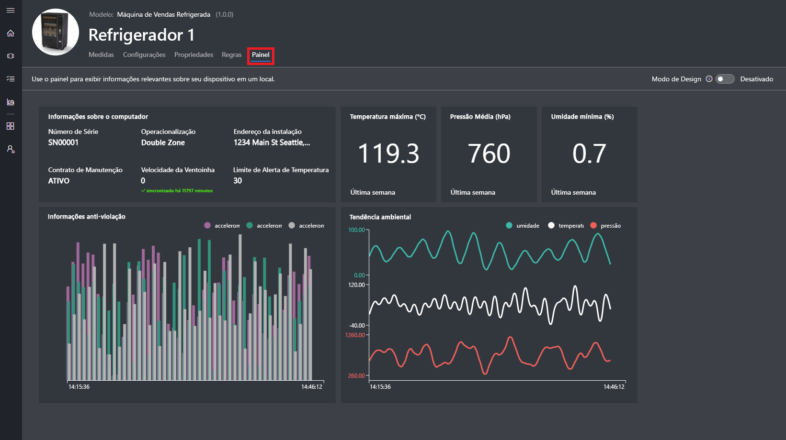

## Exibir análise

A seção anterior mostrou como exibir informações sobre dispositivos individuais. Você pode usar [conjuntos de dispositivos](howto-use-device-sets.md) e [análise](howto-create-analytics.md) para exibir informações consolidadas de vários dispositivos.

Um conjunto de dispositivos utiliza uma consulta para selecionar dinamicamente um conjunto de dispositivos que atendam a um critério. Por exemplo, o conjunto de dispositivos **Máquinas em Seattle** seleciona os refrigeradores localizados em Seattle. Para exibir o conjunto de dispositivos **Máquinas em Seattle**, escolha **Conjuntos de dispositivo** no menu de navegação à esquerda e escolha **Máquinas em Seattle**:

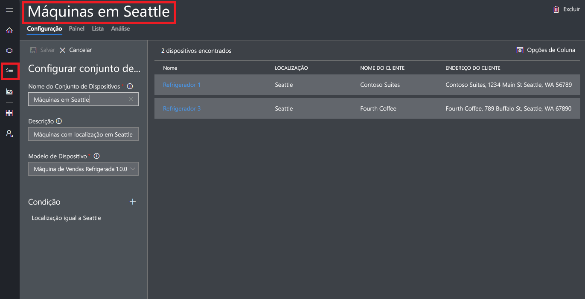

Você pode exibir os dados de análise para os dispositivos em um conjunto de dispositivos na página **Análise**:

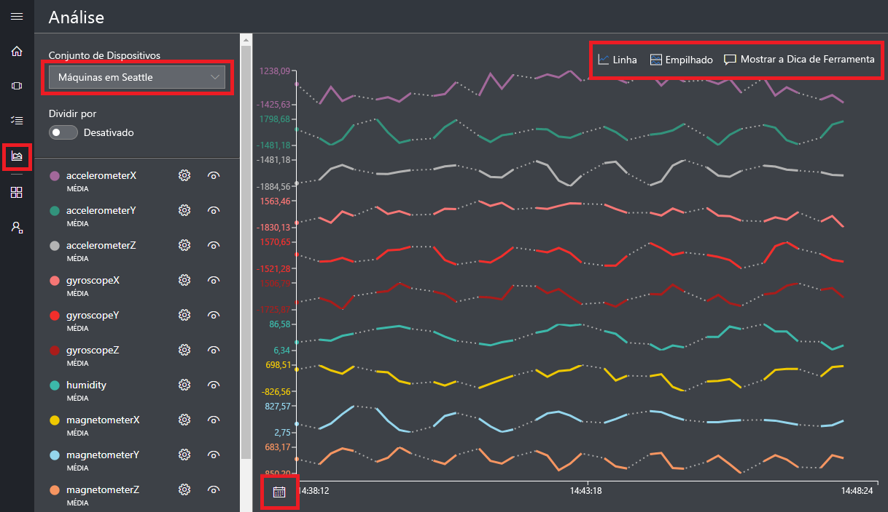

## Próximas etapas

Neste guia de início rápido, você criou um aplicativo do Azure IoT Central preenchido previamente que contém um modelo de dispositivo de **Máquina de venda automática refrigerada** e dispositivos simulados. Consulte [Definir um novo modelo de dispositivo em seu aplicativo](tutorial-define-device-type.md) para saber mais, como um construtor, sobre como definir seus próprios modelos de dispositivo.
