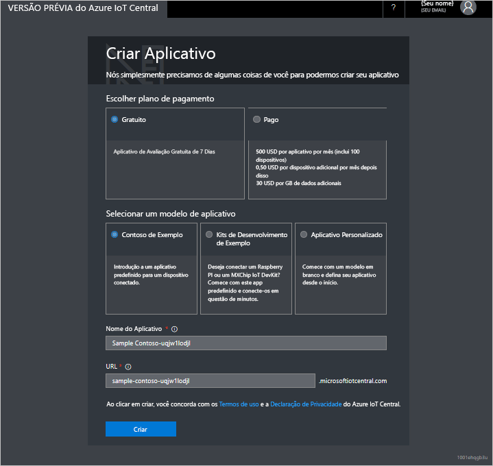

# Crie um aplicativo Azure IoT Central

Como um _construtor_, use a interface do usuário do Azure IoT Central para definir seu aplicativo Microsoft Azure IoT Central. Este guia de início rápido mostra como criar um aplicativo Azure IoT Central que contenha um exemplo de _modelo de dispositivo_ e _dispositivos_ simulados.

Navegue até a página do [Gerenciador de aplicativos](https://aka.ms/iotcentral) do Azure IoT Central. Você precisará entrar com uma conta pessoal da Microsoft ou uma conta corporativa ou de estudante.

Para começar a criar um novo aplicativo Azure IoT Central, selecione **Novo Aplicativo**. Isso leva você para a página **Criar Aplicativo**.

Para criar um novo aplicativo Azure IoT Central:

1. Escolha um plano de pagamento:
   - Os aplicativos de **Avaliação** são gratuitos por sete dias antes de expirarem. Eles podem ser convertidos em Pagamento Conforme o Uso em qualquer momento antes de expirarem.
   - Os aplicativos **Pagamento Conforme o Uso** são cobrados por dispositivo, com os primeiros 5 dispositivos gratuitos.

     Saiba mais sobre preços na [Página de preços da microsoft IoT Central](https://azure.microsoft.com/pricing/details/iot-central/).

1. Escolha um nome amigável do aplicativo, como **IoT Contoso**. O Azure IoT Central gera um prefixo de URL exclusivo para você. Você pode alterar esse prefixo de URL para algo mais fácil de lembrar.

1. Escolha um modelo de aplicativo. Um modelo de aplicativo pode conter itens predefinidos, como modelos de dispositivo e dashboards, para ajudá-lo a começar.

    | Modelo de aplicativo | DESCRIÇÃO |
    | -------------------- | ----------- |
    | Exemplo Contoso       | Cria um aplicativo que inclui um modelo de dispositivo já criado para uma Máquina de Vendas Refrigerada. Use esse modelo para começar a explorar o Azure IoT Central. |
    | Exemplo Devkits       | Cria um aplicativo com modelos de dispositivos prontos para você conectar um dispositivo MXChip ou Raspberry Pi. Use esse modelo se você for um desenvolvedor de dispositivos que está experimentando com algum desses dispositivos. |
    | Aplicativo personalizado   | Cria um aplicativo vazio para você preencher com seus próprios dispositivos e modelos de dispositivos. |

1. Se você estiver criando um aplicativo de **Pagamento Conforme o Uso**, precisará selecionar o *Directory*, a *Assinatura do Azure* e a *Região*. 

   - *Directory* é o AD (Azure Active Directory) para criar o aplicativo. Ele contém identidades de usuário, credenciais e outras informações organizacionais. Se você não tiver um Azure AD, ele será gerado quando você criar uma assinatura do Azure.

   - Uma *Assinatura do Azure* permite que você crie instâncias de serviços do Azure. O IoT Central provisionará recursos em sua assinatura. Se você não tiver uma assinatura do Azure, poderá criar uma na [página de entrada do Azure](https://aka.ms/createazuresubscription). Após criar a assinatura do Azure, navegue de volta para a página **Criar Aplicativo**. A nova assinatura aparece na lista suspensa **Assinatura do Azure**.

   - A *Região* é o local físico onde você deseja criar seu aplicativo. Normalmente, você deve escolher a região que está fisicamente mais próxima dos dispositivos para ter um desempenho ideal. Você pode ver as regiões nas quais o Azure IoT Central está disponível na página [Produtos disponíveis por região](https://azure.microsoft.com/regions/services/).

     > [!Note]
     > Após escolher uma região, não será mais possível mover posteriormente o aplicativo para uma região diferente.

1. Selecione **Criar**.

## Próximas etapas

Neste início rápido, você criou um aplicativo IoT Central. Aqui estão sugestões para as próximas etapas:

> [!div class="nextstepaction"]
> [Faça um tour pelo IoT Central](overview-iot-central-tour.md)
