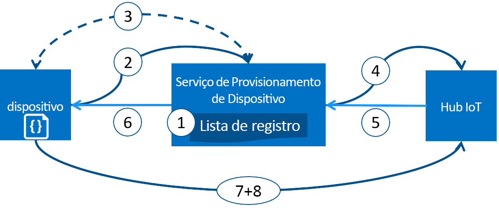

# Provisionando dispositivos com o Serviço de provisionamento de dispositivos no Hub IoT do Azure
O Microsoft Azure fornece um conjunto avançado de serviços de nuvem pública integrados para todas as suas necessidades de soluções de IoT. O Serviço de Provisionamento de Dispositivos no Hub IoT é um serviço auxiliar para o Hub IoT que permite o provisionamento de toque zero, Just-In-Time no Hub IoT correto sem necessidade de intervenção humana, permitindo que os clientes provisionem milhões de dispositivos de modo seguro e escalonável.

## Quando usar o Serviço de Provisionamento de Dispositivos
Há muitos cenários de provisionamento nos quais o Serviço de Provisionamento de Dispositivos é uma excelente opção para obter dispositivos conectados e configurados para o Hub IoT, tais como:

* Provisionamento de toque zero para uma única solução de IoT sem codificar informações de conexão de Hub IoT de fábrica (configuração inicial)
* Dispositivos de balanceamento de carga entre vários hubs
* Conectando dispositivos à solução de IoT do proprietário deles com base nos dados de transação de vendas (multilocação)
* Conectando dispositivos a uma determinada solução de IoT dependendo do caso de uso (isolamento de solução)
* Conectar um dispositivo ao hub IoT com a menor latência (fragmentação geográfica)
* Reprovisionar com base em uma alteração no dispositivo
* Reverter as chaves usadas pelo dispositivo para se conectar ao IoT Hub (quando não estiver usando certificados X.509 para conectar-se)

## Nos bastidores
Todos os cenários listados na seção anterior podem ser feitos usando o serviço de provisionamento para o provisionamento de toque zero com o mesmo fluxo. Muitas das etapas manuais tradicionalmente envolvidas no provisionamento são automatizadas com o Serviço de Provisionamento de Dispositivos para reduzir o tempo para implantação de dispositivos IoT e reduzir o risco de erro manual. A seguir está uma descrição do que ocorre nos bastidores ao provisionar um dispositivo. A primeira etapa é manual, todas as etapas seguintes são automatizadas.

1. O fabricante do dispositivo adiciona as informações de registro do dispositivo para a lista de registro no Portal do Azure.
2. O dispositivo entra em contato com o ponto de extremidade de serviço de provisionamento definido na fábrica. O dispositivo passa as próprias informações de identificação ao serviço de provisionamento para provar sua identidade.
3. O serviço de provisionamento valida a identidade do dispositivo validando a chave e a ID de registro em relação à entrada da lista de registro usando um desafio nonce ([Trusted Platform Module](https://trustedcomputinggroup.org/work-groups/trusted-platform-module/)) ou verificação X.509 padrão (X.509).
4. O serviço de provisionamento registra o dispositivo com um Hub IoT e popula o [estado desejado do gêmeo](../iot-hub/iot-hub-devguide-device-twins.md) do dispositivo.
5. O Hub IoT retorna as informações de ID do dispositivo para o serviço de provisionamento.
6. O serviço de provisionamento retorna as informações de conexão de hub IoT para o dispositivo. O dispositivo agora pode começar a enviar dados diretamente para o Hub IoT.
7. O dispositivo se conecta ao Hub IoT.
8. O dispositivo obtém o estado desejado de seu dispositivo gêmeo no Hub IoT.

## Processo de provisionamento
Há duas etapas distintas no processo de implantação de um dispositivo no qual o Serviço de Provisionamento de Dispositivos desempenha um papel que pode ser feito de modo independente:

* A **etapa de fabricação**, na qual o dispositivo é criado e preparado na fábrica e
* A **etapa de configuração de nuvem**, em que o Serviço de Provisionamento de Dispositivos é configurado para o provisionamento automatizado.

Ambas essas etapas se ajustam perfeitamente com os processos de fabricação e implantação existentes. O Serviço de Provisionamento de Dispositivos simplifica até mesmo alguns processos de implantação que envolvem uma grande quantidade de trabalho manual para obter informações de conexão para o dispositivo.

### Etapa de fabricação
Esta etapa trata-se do que acontece na linha de produção. As funções envolvidos nesta etapa incluem o designer de silício, o fabricante de silício, o integrador e/ou o fabricante final do dispositivo. Esta etapa envolve a criação do hardware em si.

O Serviço de Provisionamento do Dispositivos não introduz uma nova etapa no processo de fabricação; em vez disso, ele está associado à etapa existente que instala o software inicial e (idealmente) o HSM no dispositivo. Em vez de criar uma ID de dispositivo nesta etapa, o dispositivo é simplesmente programado com as informações do serviço de provisionamento de modo que ele chama o serviço de provisionamento para obter as informações de conexão/a atribuição de solução de IoT do dispositivo quando ele é ativado.

Também nesta etapa, o fabricante fornece as informações de chave de identificação ao implantador/operador do dispositivo. Isso pode ser algo tão simples quanto confirmar que todos os dispositivos têm um certificado X.509 gerado de um certificado de autenticação fornecido pelo implantador/operador do dispositivo ou pode ser algo como extrair a parte pública da chave de endosso do TPM de cada dispositivo TPM. Esses serviços são oferecidos por muitos fabricantes de silício atualmente.

### Etapa de configuração de nuvem
Esta etapa trata da configuração de nuvem para o provisionamento automático adequado. Geralmente, há dois tipos de usuários envolvidos na etapa de configuração de nuvem: alguém que sabe como os dispositivos precisam ser configurados inicialmente (um operador de dispositivo) e outra pessoa que sabe como os dispositivos devem ser divididos entre os Hubs IoT (um operador de solução).

Há uma única configuração inicial do provisionamento que deve ocorrer e essa tarefa geralmente é realizada pelo operador de solução. Quando o serviço de provisionamento está configurado, ele não precisa ser modificado, a menos que o caso de uso seja alterado.

Depois que o serviço foi configurado para o provisionamento automático, ele deve estar preparado para registrar dispositivos. Esta etapa é feita pelo operador de dispositivo, que sabe a configuração desejada dos dispositivos e é responsável por assegurar que o serviço de provisionamento possa atestar corretamente a identidade do dispositivo quando ele estiver procurando pelo respectivo Hub IoT. O operador de dispositivo pega as informações de chave de identificação do fabricante e as adiciona à lista de registro. Pode haver atualizações subsequentes para a lista de registro, tais como novas entradas serem adicionadas ou entradas existentes serem atualizadas com as informações mais recentes sobre os dispositivos.

## Registro e provisionamento
*Provisionamento* significa diversas coisas dependendo do setor no qual o termo é usado. No contexto de provisionamento de dispositivos IoT para a solução de nuvem deles, o provisionamento é um processo de duas partes:

1. A primeira parte é estabelecer a conexão inicial entre o dispositivo e a solução de IoT, registrando o dispositivo.
2. A segunda parte é aplicar a configuração apropriada ao dispositivo com base nos requisitos específicos da solução para a qual ele foi registrado.

Depois que ambas essas duas etapas foram concluídas, podemos dizer que o dispositivo foi completamente provisionado. Alguns serviços de nuvem apenas fornecem a primeira etapa do processo de provisionamento registrando dispositivos no ponto de extremidade de solução de IoT, mas não fornecem a configuração inicial. O Serviço de Provisionamento de Dispositivos automatiza as duas etapas para fornecer uma experiência perfeita de provisionamento para o dispositivo.

## Recursos do Serviço de Provisionamento de Dispositivos
O Serviço de Provisionamento de Dispositivos tem muitos recursos que o tornam ideal para provisionar dispositivos.

* Suporte a **atestado protegido** tanto para identidades baseadas em X.509 quanto para aquelas baseadas em TPM.
* A **lista de registro** que contém o registro completo de dispositivos/grupos de dispositivos que podem, em algum ponto, ser registrados. A lista de registro contém informações sobre a configuração desejada do dispositivo após ele ser registrado e ele pode ser atualizado a qualquer momento.
* **Várias políticas de alocação** para controlar como o Serviço de Provisionamento de Dispositivos atribui dispositivos para Hubs IoT para dar suporte a seus cenários.
* **Logs de monitoramento e diagnóstico** para verificar se tudo está funcionando corretamente.
* **Suporte a vários hubs** que permite que o Serviço de Provisionamento de Dispositivos atribua dispositivos a mais de um Hub IoT. O Serviço de Provisionamento de Dispositivos pode se comunicar com hubs entre várias assinaturas do Azure.
* **Suporte de região cruzada** que permite que o Serviço de Provisionamento de Dispositivos atribua dispositivos a Hubs IoT em outras regiões.

Você pode aprender mais sobre os conceitos e recursos envolvidos no provisionamento do dispositivo em [conceitos de dispositivo](concepts-device.md), [conceitos de serviço](concepts-service.md) e [conceitos de segurança](concepts-security.md).

## Suporte de multiplaforma
O Serviço de Provisionamento de Dispositivos, assim como todos os serviços IoT do Azure, funciona em multiplaforma com uma variedade de sistemas operacionais. O Azure oferece SDKs de software livre em uma variedade de [idiomas](https://github.com/Azure/azure-iot-sdks) para facilitar a conexão de dispositivos e gerenciar o serviço. O Serviço de Provisionamento de Dispositivos fornece suporte aos seguintes protocolos para conectar dispositivos:

* HTTPS
* AMQP
* AMQP sobre websockets
* MQTT
* MQTT sobre websockets

O Serviço de Provisionamento de Dispositivos fornece suporte apenas a conexões HTTPS para operações de serviço.

## Regiões
O Serviço de Provisionamento de Dispositivos está disponível em muitas regiões. Mantemos uma lista atualizada das regiões existentes e recentemente anunciadas para todos os serviços em [Regiões do Azure](https://azure.microsoft.com/regions/). É possível consultar onde o Serviço de Provisionamento de Dispositivos está disponível, na página [Status do Azure](https://azure.microsoft.com/status/).

> [!NOTE]
> O Serviço de Provisionamento de Dispositivos é global e não limitado a um local. No entanto, é necessário especificar uma região na qual os metadados associados ao seu perfil do Serviço de Provisionamento de Dispositivos irão residir.

## Disponibilidade
Mantemos um Contrato de Nível de Serviço de 99,9% para o Serviço de Provisionamento de Dispositivos e você pode [ler o SLA](https://azure.microsoft.com/support/legal/sla/iot-hub/). O [SLA completo do Azure](https://azure.microsoft.com/support/legal/sla/) explica a disponibilidade garantida do Azure como um todo.

## Cotas
Cada assinatura do Azure tem limites de cota em vigor que podem afetar o escopo de sua solução de IoT. O limite atual em uma base por assinatura é 10 Serviços de Provisionamento de Dispositivos por assinatura.

Para obter mais detalhes sobre os limites de cota:

* [Limites de Serviço da assinatura do Azure](../azure-subscription-service-limits.md)

## Componentes relacionados do Azure
O Serviço de Provisionamento de Dispositivos automatiza o provisionamento de dispositivos com o Hub IoT do Azure. Saiba mais sobre o [Hub IoT](https://docs.microsoft.com/azure/iot-hub/).

## Próximas etapas
Agora você tem uma visão geral do provisionamento de dispositivos IoT no Azure. A próxima etapa é testar um cenário de IoT de ponta a ponta.
> [!div class="nextstepaction"]
> [Configurar o Serviço de Provisionamento de Dispositivos no Hub IoT com o Portal do Azure](quick-setup-auto-provision.md)
> [Criar e provisionar um dispositivo simulado](quick-create-simulated-device.md)
> [Configurar o dispositivo para provisionamento](tutorial-set-up-device.md)
