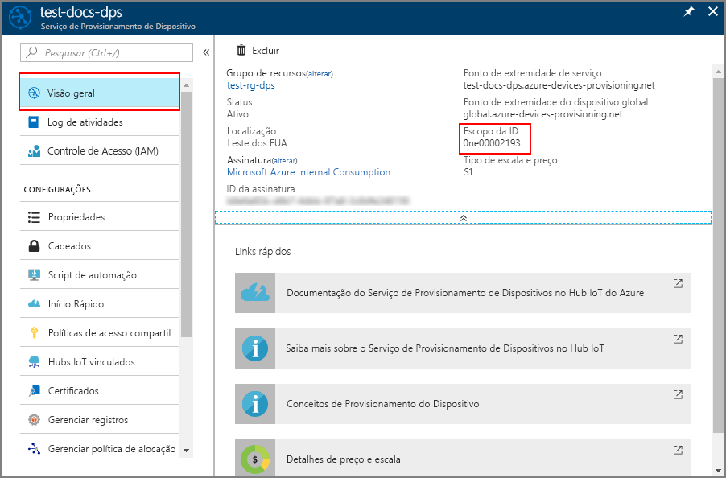

# <a name="how-to-provision-legacy-devices-using-symmetric-keys"></a>Como provisionar dispositivos herdados usando chaves simétricas


Um problema comum com muitos dispositivos herdados é que eles geralmente têm uma identidade que é composta de uma única parte de informações. Essas informações de identidade são normalmente um endereço MAC ou um número de série. Os dispositivos herdados podem não ter um certificado, TPM ou qualquer outro recurso de segurança que possa ser usado para identificar o dispositivo com segurança. O Serviço de Provisionamento de Dispositivos para o Hub IoT inclui atestado de chave simétrica. O atestado de chave simétrica pode ser usado para identificar um dispositivo com base em informações como o endereço MAC ou um número de série.

Se você puder instalar facilmente um [HSM (módulo de segurança de hardware)](concepts-security.md#hardware-security-module) e um certificado, essa poderá ser a melhor abordagem para identificar e provisionar seus dispositivos. Desde que essa abordagem possa permitir que você ignore a atualização do código implantado em todos os seus dispositivos, e você não tenha uma chave secreta inserida na imagem de dispositivo.

Este artigo parte do princípio que nem um HSM nem um certificado são opções viáveis. No entanto, supõe-se que você tenha algum método de atualização do código do dispositivo para usar o Serviço de Provisionamento de Dispositivos para provisionar esses dispositivos. 

Este artigo também pressupõe que a atualização do dispositivo ocorre em um ambiente seguro para impedir acesso não autorizado à chave mestre de grupo ou à chave do dispositivo derivada.

Este artigo é orientado para uma estação de trabalho baseada no Windows. No entanto, é possível executar os procedimentos no Linux. Para um exemplo do Linux, confira [Como provisionar para multilocação](how-to-provision-multitenant.md).


## <a name="overview"></a>Visão geral

Uma ID de registro exclusiva será definida para cada dispositivo com base nas informações que identificam esse dispositivo. Por exemplo, o endereço MAC ou um número de série.

Um grupo de registro que usa o [atestado de chave simétrica](concepts-symmetric-key-attestation.md) será criado com o Serviço de Provisionamento de Dispositivos. O grupo de registro incluirá uma chave mestra de grupo. Essa chave mestra será usada para gerar um código hash de cada ID exclusiva de registro e produzir uma chave de dispositivo exclusiva para cada dispositivo. O dispositivo usará essa chave derivada de dispositivo com a respectiva ID de registro exclusiva para atestar no Serviço de Provisionamento de Dispositivos e ser atribuído a um hub IoT.

O código de dispositivo demonstrado neste artigo seguirá o mesmo padrão que o [Guia de Início Rápido: Provisionar um dispositivo simulado com chaves simétricas](quick-create-simulated-device-symm-key.md). O código simulará um dispositivo usando uma amostra do [SDK do Azure IoT C](https://github.com/Azure/azure-iot-sdk-c). O dispositivo simulado atestará com um grupo de registro em vez de um registro individual, como demonstrado no início rápido.

[!INCLUDE [quickstarts-free-trial-note](../../includes/quickstarts-free-trial-note.md)]


## <a name="prerequisites"></a>Pré-requisitos

* Conclusão do guia de início rápido [Configurar o Serviço de Provisionamento de Dispositivos no Hub IoT com o portal do Azure](./quick-setup-auto-provision.md).
* Visual Studio 2015 ou [Visual Studio 2017](https://www.visualstudio.com/vs/) com a carga de trabalho ["Desenvolvimento para Desktop com C++"](https://www.visualstudio.com/vs/support/selecting-workloads-visual-studio-2017/) habilitada.
* Versão mais recente do [Git](https://git-scm.com/download/) instalada.


## <a name="prepare-an-azure-iot-c-sdk-development-environment"></a>Preparar um ambiente de desenvolvimento do SDK de C do IoT do Azure

Nesta seção, você preparará um ambiente de desenvolvimento usado para criar o [SDK de C do IoT do Azure](https://github.com/Azure/azure-iot-sdk-c). 

O SDK inclui o código de exemplo para o dispositivo simulado. Este dispositivo simulado tentará realizar provisionamento durante a sequência de inicialização do dispositivo.

1. Baixe o [sistema de build CMake](https://cmake.org/download/).

    É importante que os pré-requisitos do Visual Studio (Visual Studio e a carga de trabalho de "Desenvolvimento para Desktop com C++") estejam instalados em seu computador, **antes** da instalação de `CMake`. Após a instalação dos pré-requisitos e verificação do download, instale o sistema de compilação CMake.

2. Abra um prompt de comando ou o shell Bash do Git. Execute o seguinte comando para clonar o repositório GitHub do SDK de C do IoT do Azure:
    
    ```cmd/sh
    git clone https://github.com/Azure/azure-iot-sdk-c.git --recursive
    ```
    Essa operação deve demorar alguns minutos.


3. Crie um subdiretório `cmake` no diretório raiz do repositório git e navegue até essa pasta. 

    ```cmd/sh
    cd azure-iot-sdk-c
    mkdir cmake
    cd cmake
    ```

4. Execute o comando a seguir, que cria uma versão do SDK específica para a plataforma cliente de desenvolvimento. Uma solução do Visual Studio para o dispositivo simulado será gerada no diretório `cmake`. 

    ```cmd
    cmake -Dhsm_type_symm_key:BOOL=ON -Duse_prov_client:BOOL=ON  ..
    ```
    
    Se `cmake` não encontrar o compilador do C++, você poderá obter erros de build ao executar o comando acima. Se isso acontecer, tente executar esse comando no [prompt de comando do Visual Studio](https://docs.microsoft.com/dotnet/framework/tools/developer-command-prompt-for-vs). 

    Após o sucesso da compilação, as últimas linhas de saída serão semelhantes à seguinte saída:

    ```cmd/sh
    $ cmake -Dhsm_type_symm_key:BOOL=ON -Duse_prov_client:BOOL=ON  ..
    -- Building for: Visual Studio 15 2017
    -- Selecting Windows SDK version 10.0.16299.0 to target Windows 10.0.17134.
    -- The C compiler identification is MSVC 19.12.25835.0
    -- The CXX compiler identification is MSVC 19.12.25835.0

    ...

    -- Configuring done
    -- Generating done
    -- Build files have been written to: E:/IoT Testing/azure-iot-sdk-c/cmake
    ```


## <a name="create-a-symmetric-key-enrollment-group"></a>Criar um grupo de registro de chave simétrica

1. Entre no [portal do Azure](https://portal.azure.com) e abra a instância do Serviço de Provisionamento de Dispositivos.

2. Selecione a guia **Gerenciar registros** e clique no botão **Adicionar grupo de registros** na parte superior da página. 

3. Em **Adicionar Grupo de Registros**, insira as informações a seguir e clique no botão **Salvar**.

   - **Nome do grupo**: Insira **mylegacydevices**.

   - **Tipo de Atestado**: selecione **Chave Simétrica**.

   - **Gerar Chaves Automaticamente**: Marque essa caixa.

   - **Selecione como deseja atribuir dispositivos aos hubs**: Selecione **Configuração estática** para que você possa atribuir a um hub específico.

   - **Selecione os hubs IoT ao quais este grupo pode ser atribuído**: Selecione um dos seus hubs.

     

4. Após salvar o registro, uma **Chave Primária** e **Chave Secundária** serão geradas e adicionadas à entrada de registro. Seu grupo de registro de chave simétrica é exibido como **mylegacydevices** na coluna *Nome do Grupo* na guia *Grupos de Registro*. 

    Abra o registro e copie o valor da **Chave Primária** gerada. Essa chave é a chave mestre de grupo.


## <a name="choose-a-unique-registration-id-for-the-device"></a>Escolher uma ID de registro exclusiva para o dispositivo

Uma ID de registro exclusiva deve ser definida para identificar cada dispositivo. Você pode usar o endereço MAC, o número de série ou qualquer informação exclusiva do dispositivo. 

Neste exemplo, usamos uma combinação de um endereço MAC e o número de série que formam a seguinte cadeia de caracteres de uma ID de registro.

```
sn-007-888-abc-mac-a1-b2-c3-d4-e5-f6
```

Crie uma ID de registro exclusiva para seu dispositivo. Os caracteres válidos são alfanuméricos minúsculos e traço ('-').


## <a name="derive-a-device-key"></a>Derivar uma chave de dispositivo 

Para gerar a chave do dispositivo, use a chave mestra de grupo para computar o [HMAC-SHA256](https://wikipedia.org/wiki/HMAC) da ID de registro de dispositivo único para cada um dos dispositivos, depois converta o resultado no formato Base64.

Não inclua a chave mestra de grupo em seu código de dispositivo.


#### <a name="linux-workstations"></a>Estações de trabalho do Linux

Se estiver usando uma estação de trabalho do Linux, você poderá usar openssl para gerar a chave de dispositivo derivada, conforme mostrado no exemplo a seguir.

Substitua o valor de **CHAVE** pela **Chave primária** que você anotou anteriormente.

Substitua o valor de **REG_ID** por sua ID de registro.

```bash
KEY=8isrFI1sGsIlvvFSSFRiMfCNzv21fjbE/+ah/lSh3lF8e2YG1Te7w1KpZhJFFXJrqYKi9yegxkqIChbqOS9Egw==
REG_ID=sn-007-888-abc-mac-a1-b2-c3-d4-e5-f6

keybytes=$(echo $KEY | base64 --decode | xxd -p -u -c 1000)
echo -n $REG_ID | openssl sha256 -mac HMAC -macopt hexkey:$keybytes -binary | base64
```

```bash
Jsm0lyGpjaVYVP2g3FnmnmG9dI/9qU24wNoykUmermc=
```


#### <a name="windows-based-workstations"></a>Estações de trabalho baseadas em Windows

Se estiver usando uma estação de trabalho baseada no Windows, você poderá usar o PowerShell para gerar sua chave de dispositivo derivada, conforme mostrado no exemplo a seguir.

Substitua o valor de **CHAVE** pela **Chave primária** que você anotou anteriormente.

Substitua o valor de **REG_ID** por sua ID de registro.

```PowerShell
$KEY='8isrFI1sGsIlvvFSSFRiMfCNzv21fjbE/+ah/lSh3lF8e2YG1Te7w1KpZhJFFXJrqYKi9yegxkqIChbqOS9Egw=='
$REG_ID='sn-007-888-abc-mac-a1-b2-c3-d4-e5-f6'

$hmacsha256 = New-Object System.Security.Cryptography.HMACSHA256
$hmacsha256.key = [Convert]::FromBase64String($KEY)
$sig = $hmacsha256.ComputeHash([Text.Encoding]::ASCII.GetBytes($REG_ID))
$derivedkey = [Convert]::ToBase64String($sig)
echo "`n$derivedkey`n"
```

```PowerShell
Jsm0lyGpjaVYVP2g3FnmnmG9dI/9qU24wNoykUmermc=
```


Seu dispositivo usará a chave do dispositivo derivada com a ID de registro exclusiva para executar o atestado de chave simétrica com o grupo de registro durante o provisionamento.


## <a name="create-a-device-image-to-provision"></a>Criar uma imagem de dispositivo para provisionar

Nesta seção, você atualizará um exemplo de provisionamento denominado **prov\_dev\_client\_sample** localizado no SDK de C do IoT do Azure configurado anteriormente. 

Esse código de exemplo simula uma sequência de inicialização do dispositivo que envia a solicitação de provisionamento à sua instância do Serviço de Provisionamento de Dispositivos. A sequência de inicialização fará com que o dispositivo seja reconhecido e atribuído ao hub IoT que você configurou no grupo de registro.

1. No portal do Azure, selecione a guia **Visão Geral** de seu serviço de Provisionamento de Dispositivos e anote o valor de **_Escopo da ID_**.

     

2. No Visual Studio, abra o arquivo de solução **azure_iot_sdks.sln**, que foi gerado pela execução de CMake anteriormente. O arquivo da solução deve estar no seguinte local:

    ```
    \azure-iot-sdk-c\cmake\azure_iot_sdks.sln
    ```

3. Na janela *Gerenciador de Soluções* do Visual Studio, navegue até a pasta **Provisionar\_Exemplos**. Expanda o projeto de exemplo chamado **prov\_dev\_client\_sample**. Expanda **Arquivos de Origem** e abra **prov\_dev\_client\_sample.c**.

4. Localize a constante `id_scope` e substitua o valor pelo seu valor de **Escopo de ID** copiado anteriormente. 

    ```c
    static const char* id_scope = "0ne00002193";
    ```

5. Encontre a definição da função `main()` no mesmo arquivo. Certifique-se de que a variável `hsm_type` está configurada para `SECURE_DEVICE_TYPE_SYMMETRIC_KEY`, conforme mostrado abaixo:

    ```c
    SECURE_DEVICE_TYPE hsm_type;
    //hsm_type = SECURE_DEVICE_TYPE_TPM;
    //hsm_type = SECURE_DEVICE_TYPE_X509;
    hsm_type = SECURE_DEVICE_TYPE_SYMMETRIC_KEY;
    ```

6. Localize a chamada para `prov_dev_set_symmetric_key_info()` em **prov\_dev\_client\_sample.c** que é comentado.

    ```c
    // Set the symmetric key if using they auth type
    //prov_dev_set_symmetric_key_info("<symm_registration_id>", "<symmetric_Key>");
    ```

    Remova a marca de comentário da chamada de função e substitua os valores de espaço reservado (incluindo os colchetes angulares) pela ID de registro única do seu dispositivo e a chave de dispositivo derivada gerada.

    ```c
    // Set the symmetric key if using they auth type
    prov_dev_set_symmetric_key_info("sn-007-888-abc-mac-a1-b2-c3-d4-e5-f6", "Jsm0lyGpjaVYVP2g3FnmnmG9dI/9qU24wNoykUmermc=");
    ```
   
    Salve o arquivo.

7. Clique com botão direito do mouse no projeto **prov\_dev\_client\_sample** e selecione **Definir como Projeto de Inicialização**. 

8. No menu do Visual Studio, selecione **Depurar** > **Iniciar sem depuração** para executar a solução. No prompt para recompilar o projeto, clique em **Sim** para recompilar o projeto antes da execução.

    A saída a seguir é um exemplo do dispositivo simulado inicializando com êxito e conectando a instância de Serviço de provisionamento a ser atribuída a um Hub IoT:

    ```cmd
    Provisioning API Version: 1.2.8

    Registering Device

    Provisioning Status: PROV_DEVICE_REG_STATUS_CONNECTED
    Provisioning Status: PROV_DEVICE_REG_STATUS_ASSIGNING
    Provisioning Status: PROV_DEVICE_REG_STATUS_ASSIGNING

    Registration Information received from service: 
    test-docs-hub.azure-devices.net, deviceId: sn-007-888-abc-mac-a1-b2-c3-d4-e5-f6

    Press enter key to exit:
    ```

9. No portal, navegue até o Hub IoT ao qual o dispositivo simulado foi atribuído e clique na guia **Dispositivos IoT**. No provisionamento com êxito do simulado para o Hub, a ID de dispositivo aparece na folha **Dispositivos IoT**, com o *STATUS* como **habilitado**. Talvez seja necessário clicar no botão **Atualizar** na parte superior. 

     


## <a name="security-concerns"></a>Questões de segurança

Entenda que isso deixa a chave de dispositivo derivada incluída como parte da imagem, o que não é uma melhor prática de segurança. Esse é um motivo por que é preciso ponderar vantagens e desvantagens entre segurança e facilidade de uso. 


## <a name="next-steps"></a>Próximas etapas

* Para saber mais Reprovisioning, consulte [reprovisionamento conceitos de dispositivos no Hub IoT](concepts-device-reprovision.md) 
* [Início Rápido: Provisionar um dispositivo simulado com chaves simétricas](quick-create-simulated-device-symm-key.md)
* Para saber mais desprovisionamento, consulte [como desprovisionar dispositivos que foram anteriormente autoprovisionado](how-to-unprovision-devices.md) 


