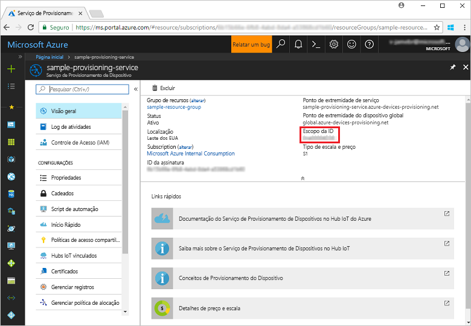
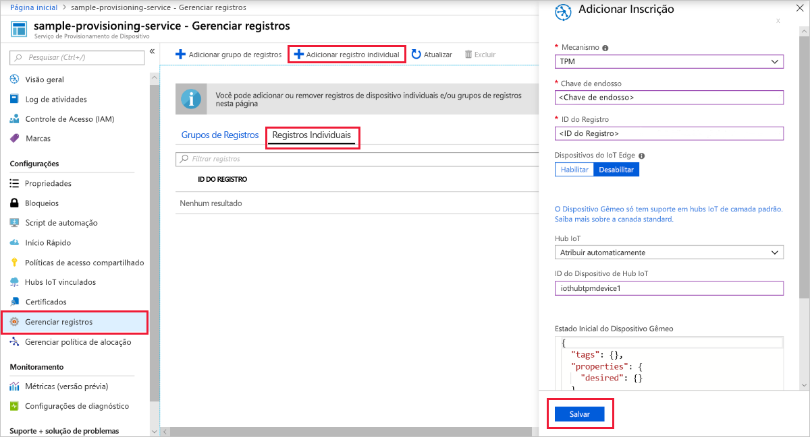
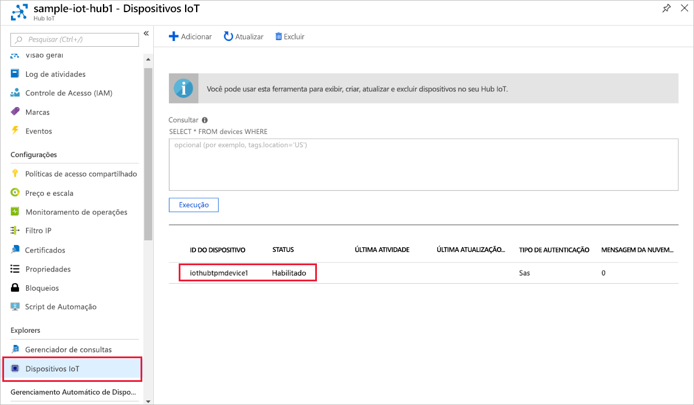

# <a name="create-and-provision-a-simulated-tpm-device-using-c-device-sdk-for-iot-hub-device-provisioning-service"></a>Criar e provisionar um dispositivo TPM simulado usando o SDK do dispositivo C# para o Serviço de Provisionamento do Dispositivo Hub IoT

[!INCLUDE [iot-dps-selector-quick-create-simulated-device-tpm](../../includes/iot-dps-selector-quick-create-simulated-device-tpm.md)]

Estas etapas mostram como compilar o exemplo de dispositivo TPM simulado do SDK C# do Hub IoT do Azure em um computador de desenvolvimento com o SO Windows e conectar o dispositivo simulado ao Serviço de Provisionamento de Dispositivos e o seu Hub IoT. O código de exemplo usa o simulador de TPM do Windows como o [HSM (módulo de segurança de hardware)](https://azure.microsoft.com/blog/azure-iot-supports-new-security-hardware-to-strengthen-iot-security/) do dispositivo. 

Se você não estiver familiarizado com o processo de provisionamento automático, analise também os [Conceitos de provisionamento automático](concepts-auto-provisioning.md). Não se esqueça de concluir as etapas em [Configurar o Serviço de Provisionamento de Dispositivos no Hub IoT com o Portal do Azure](./quick-setup-auto-provision.md) antes de continuar. 

O Serviço de Provisionamento de Dispositivos de IoT do Azure dá suporte a dois tipos de registros:
- [Grupos de registro](concepts-service.md#enrollment-group): usados para registrar vários dispositivos relacionados.
- [Registros individuais](concepts-service.md#individual-enrollment): usados para registrar um único dispositivo.

Este artigo irá demonstrar registros individuais.

[!INCLUDE [IoT Device Provisioning Service basic](../../includes/iot-dps-basic.md)]

<a id="setupdevbox"></a>
## <a name="prepare-the-development-environment"></a>Preparar o ambiente de desenvolvimento 

1. Verifique se você tem o [SDK do .NET Core](https://www.microsoft.com/net/download/windows) instalado no computador. 

1. Verifique se o `git` está instalado em seu computador e é adicionado às variáveis de ambiente que podem ser acessadas pela janela de comando. Confira [ferramentas de cliente Git do Software Freedom Conservancy](https://git-scm.com/download/) para obter a versão mais recente das ferramentas `git` a serem instaladas, que inclui o **Git Bash**, o aplicativo de linha de comando que você pode usar para interagir com seu repositório Git local. 

4. Abra um prompt de comando ou o Bash do Git. Clone o repositório GitHub do SDK para C# de IoT do Azure:
    
    ```cmd
    git clone --recursive https://github.com/Azure/azure-iot-sdk-csharp.git
    ```

## <a name="provision-the-simulated-device"></a>Provisionar o dispositivo simulado


1. Entre no Portal do Azure. Clique no botão **Todos os recursos** no menu esquerdo e abra o Serviço de Provisionamento de Dispositivos. Na folha **Visão geral**, anote o valor de **_Escopo da ID_**.

     


2. Em um prompt de comando, altere os diretórios para o diretório do projeto de exemplo de provisionamento do dispositivo TPM.

    ```cmd
    cd .\azure-iot-sdk-csharp\provisioning\device\samples\ProvisioningDeviceClientTpm
    ```

2. Digite o seguinte comando para compilar e executar o exemplo de provisionamento de dispositivo TPM. Substitua o valor `<IDScope>` pelo Escopo da ID do serviço de provisionamento. 

    ```cmd
    dotnet run <IDScope>
    ```

1. A janela Comando exibe a **_Chave de Endosso_**, a **_ID de Registro_** e uma **_ID do Dispositivo_** sugerida necessárias para registrar o dispositivo. Anote esses valores. 
   > [!NOTE]
   > Não confunda a janela que contém a saída do comando com a janela que contém a saída do simulador de TPM. Você precisará clicar na janela Comando para trazê-la para o primeiro plano.

     


4. No Portal do Azure, na folha de resumo do Serviço de Provisionamento de Dispositivos, selecione **Gerenciar registros**. Selecione a guia **Registros Individuais** e clique no botão **Adicionar registro individual** na parte superior. 

5. Em **Adicionar Registro**, insira as seguintes informações:
    - Selecione **TPM** como o atestado de identidade *Mecanismo*.
    - Insira a *ID de Registro* e *Chave de Endosso* para seu dispositivo do TPM. 
    - Opcionalmente, selecione um Hub IoT vinculado com o serviço de provisionamento.
    - Insira uma ID de dispositivo exclusiva. Você pode inserir a ID do dispositivo sugerida na saída de exemplo ou inserir a sua própria. Se você usar a sua própria, evite dados confidenciais ao nomear o dispositivo. 
    - Atualize o **Estado inicial do dispositivo gêmeo** com a configuração inicial desejada para o dispositivo.
    - Uma vez concluído, clique no botão **Salvar**. 

      

   Em caso de registro bem-sucedido, a *ID de Registro* do seu dispositivo será exibida na lista na guia *Registros Individuais*. 

6. Pressione Enter na janela de comando (que exibe a **_Chave de Endosso_**, a **_ID de Registro_** e uma **_ID do Dispositivo_** sugerida) para registrar o dispositivo simulado. Observe as mensagens que simulam a inicialização e a conexão do dispositivo com o Serviço de Provisionamento de Dispositivos para obter as informações do Hub IoT. 

1. Verifique se o dispositivo foi provisionado. No provisionamento bem-sucedido do dispositivo simulado para o Hub IoT vinculado ao serviço de provisionamento, a ID do dispositivo aparece na folha **Dispositivos IOT** do hub. 

     

    Se você tiver alterado o *estado de dispositivo gêmeo inicial* do valor padrão na entrada de registro para o seu dispositivo, pode receber o estado desejado duas do hub e agir de acordo. Para saber mais, veja [Noções básicas e uso de dispositivos gêmeos no Hub IoT](../iot-hub/iot-hub-devguide-device-twins.md)


## <a name="clean-up-resources"></a>Limpar recursos

Se você planeja continuar a trabalhar e explorar o dispositivo cliente de exemplo, não limpe os recursos criados neste Guia de Início Rápido. Caso contrário, use as etapas a seguir para excluir todos os recursos criados por este Guia de Início Rápido.

1. Feche a janela de saída de exemplo de dispositivo cliente em seu computador.
1. Feche a janela do simulador do TPM no seu computador.
1. No menu à esquerda no Portal do Azure, clique em **Todos os recursos** e selecione o serviço de Provisionamento de Dispositivos. Na parte superior da folha **Todos os recursos**, clique em **Excluir**.  
1. No menu à esquerda no Portal do Azure, clique em **Todos os recursos** e selecione seu Hub IoT. Na parte superior da folha **Todos os recursos**, clique em **Excluir**.  

## <a name="next-steps"></a>Próximas etapas

Neste Guia de Início Rápido, você criou um dispositivo TPM simulado no seu computador e o provisionou no Hub IoT usando o Serviço de Provisionamento de Dispositivos do Hub IoT. Para saber como registrar seu dispositivo TPM programaticamente, continue com o Guia de Início Rápido para registro programático de um dispositivo TPM. 

> [!div class="nextstepaction"]
> [Guia de Início Rápido do Azure – Registrar dispositivo TPM no Serviço de Provisionamento de Dispositivos do Hub IoT do Azure](quick-enroll-device-tpm-csharp.md)
