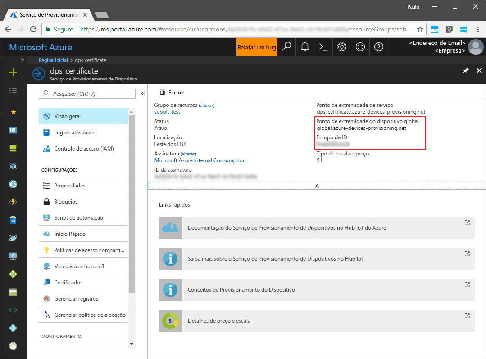
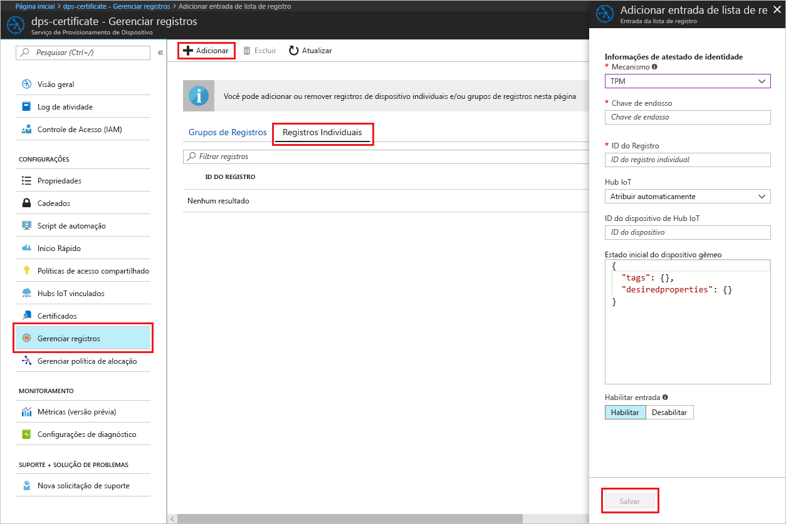
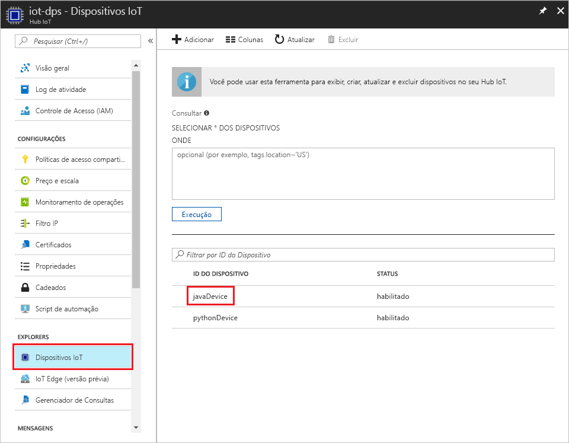

# <a name="create-and-provision-a-simulated-tpm-device-using-java-device-sdk-for-azure-iot-hub-device-provisioning-service"></a>Criar e provisionar um dispositivo TPM simulado usando o SDK do dispositivo Java para o Serviço de Provisionamento do Dispositivo Hub IoT do Azure
> [!div class="op_single_selector"]
> * [C](quick-create-simulated-device.md)
> * [Java](quick-create-simulated-device-tpm-java.md)
> * [C#](quick-create-simulated-device-tpm-csharp.md)
> * [Python](quick-create-simulated-device-tpm-python.md)

Estas etapas mostram como criar um dispositivo simulado em seu computador de desenvolvimento executando o sistema operacional Windows, executar o simulador do TPM do Windows como [HSM (Módulo de Segurança de Hardware)](https://azure.microsoft.com/blog/azure-iot-supports-new-security-hardware-to-strengthen-iot-security/) do dispositivo e usar o código de exemplo para se conectar a esse dispositivo simulado com o Serviço de Provisionamento de Dispositivos e o Hub IoT. 

Conclua as etapas em [Configurar o Serviço de Provisionamento do Dispositivo Hub IoT com o Portal do Azure](./quick-setup-auto-provision.md) antes de continuar.


## <a name="prepare-the-environment"></a>Preparar o ambiente 

1. Certifique-se de ter o [Java SE Development Kit 8](http://www.oracle.com/technetwork/java/javase/downloads/jdk8-downloads-2133151.html) instalado no computador.

1. Baixe e instale o [Maven](https://maven.apache.org/install.html).

1. Verifique se o `git` está instalado em seu computador e é adicionado às variáveis de ambiente que podem ser acessadas pela janela de comando. Confira [ferramentas de cliente Git do Software Freedom Conservancy](https://git-scm.com/download/) para obter a versão mais recente das ferramentas `git` a serem instaladas, que inclui o **Git Bash**, o aplicativo de linha de comando que você pode usar para interagir com seu repositório Git local. 

1. Abra um prompt de comando. Clone o repositório do GitHub para obter um exemplo de código de simulação do dispositivo.
    
    ```cmd/sh
    git clone https://github.com/Azure/azure-iot-sdk-java.git --recursive
    ```

1. Execute o simulador de [TPM](https://docs.microsoft.com/windows/device-security/tpm/trusted-platform-module-overview). Clique em **Permitir acesso** para permitir alterações às configurações do _Firewall do Windows_. Ele escuta em um soquete nas portas 2321 e 2322. Não feche essa janela; você precisa manter esse simulador em execução até o término deste Guia de Início Rápido. 

    ```cmd/sh
    .\azure-iot-sdk-java\provisioning\provisioning-tools\tpm-simulator\Simulator.exe
    ```

    

1. Em um prompt de comando separado, navegue até a pasta raiz compile as dependências de exemplo.

    ```cmd/sh
    cd azure-iot-sdk-java
    mvn install -DskipTests=true
    ```

1. Navegue até a pasta de exemplo.

    ```cmd/sh
    cd provisioning/provisioning-samples/provisioning-tpm-sample
    ```

1. Faça logon no Portal do Azure, clique no botão **Todos os recursos** no menu esquerdo e abra o Serviço de Provisionamento de Dispositivos. Tome nota de seu _Escopo da ID_ e _Ponto de Extremidade Global do Serviço de Provisionamento_.

    

1. Edite `src/main/java/samples/com/microsoft/azure/sdk/iot/ProvisioningTpmSample.java` para incluir o _Escopo da ID_ e o _Ponto de Extremidade Global do Serviço de Provisionamento_ conforme anotado antes.  

    ```java
    private static final String idScope = "[Your ID scope here]";
    private static final String globalEndpoint = "[Your Provisioning Service Global Endpoint here]";
    private static final ProvisioningDeviceClientTransportProtocol PROVISIONING_DEVICE_CLIENT_TRANSPORT_PROTOCOL = ProvisioningDeviceClientTransportProtocol.HTTPS;
    ```

1. Compile o projeto. Navegue até a pasta de destino e execute o arquivo jar criado.

    ```cmd/sh
    mvn clean install
    cd target
    java -jar ./provisioning-tpm-sample-{version}-with-deps.jar
    ```

1. A execução do programa é iniciada. Tome nota da _Chave de Endosso_ e a _ID de Registro_ para a próxima seção e deixe o programa em execução.

    
    

## <a name="create-a-device-enrollment-entry"></a>Criar uma entrada de registro de dispositivo

1. Faça logon no Portal do Azure, clique no botão **Todos os recursos** no menu esquerdo e abra o Serviço de Provisionamento de Dispositivos.

1. Na folha de resumo do Serviço de Provisionamento de Dispositivos, selecione **Gerenciar registros**. Selecione a guia **Registros Individuais** guia e clique no botão **Adicionar** na parte superior. 

1. Em **Adicionar a entrada da lista de registro**, insira as seguintes informações:
    - Selecione **TPM** como o atestado de identidade *Mecanismo*.
    - Insira a *ID de Registro* e *Chave de Endosso* para seu dispositivo do TPM, conforme anotados anteriormente. 
    - Selecione um hub IoT vinculado com o serviço de provisionamento.
    - Insira uma ID de dispositivo exclusiva. Evite dados confidenciais ao nomear seu dispositivo.
    - Atualize o **Estado inicial do dispositivo gêmeo** com a configuração inicial desejada para o dispositivo.
    - Uma vez concluído, clique no botão **Salvar**. 

      

   Em caso de registro bem-sucedido, a *ID de Registro* do seu dispositivo é exibida na lista na guia *Registros Individuais*. 


## <a name="simulate-the-device"></a>Simular o dispositivo

1. Na janela Comando que executa o código de exemplo do Java em seu computador, clique em enter para continuar a execução do aplicativo. Observe as mensagens que simulam a inicialização e a conexão do dispositivo com o Serviço de Provisionamento de Dispositivos para obter as informações do Hub IoT.  

    

1. Com o êxito no provisionamento do seu dispositivo simulado para o Hub IoT vinculado ao serviço de provisionamento, a ID do dispositivo aparece na folha **Device Explorer** do hub.

     

    Se você tiver alterado o *estado de dispositivo gêmeo inicial* do valor padrão na entrada de registro para o seu dispositivo, pode receber o estado desejado duas do hub e agir de acordo. Para saber mais, veja [Noções básicas e uso de dispositivos gêmeos no Hub IoT](../iot-hub/iot-hub-devguide-device-twins.md)


## <a name="clean-up-resources"></a>Limpar recursos

Se você planeja continuar a trabalhar e explorar o dispositivo cliente de exemplo, não limpe os recursos criados neste Guia de Início Rápido. Caso contrário, use as etapas a seguir para excluir todos os recursos criados por este Guia de Início Rápido.

1. Feche a janela de saída de exemplo de dispositivo cliente em seu computador.
1. Feche a janela do simulador do TPM no seu computador.
1. No menu à esquerda no Portal do Azure, clique em **Todos os recursos** e selecione o serviço de Provisionamento de Dispositivos. Abra a folha **Gerenciar Registros** de seu serviço e clique na guia **Registros Individuais**. Selecione *ID de REGISTRO* do dispositivo descrito no Guia de Início Rápido e clique no botão **Excluir** na parte superior. 
1. No menu à esquerda no Portal do Azure, clique em **Todos os recursos** e selecione seu Hub IoT. Abra a folha **Dispositivos IoT** do hub, selecione *DEVICE ID* registrado nesse Guia de Início Rápido, e clique no botão **Excluir** na parte superior.

## <a name="next-steps"></a>Próximas etapas

Neste Guia de Início Rápido, você criou um dispositivo TPM simulado no seu computador e o provisionou no Hub IoT usando o Serviço de Provisionamento de Dispositivos do Hub IoT. Para saber como registrar seu dispositivo TPM programaticamente, continue com o Guia de Início Rápido para registro programático de um dispositivo TPM. 

> [!div class="nextstepaction"]
> [Guia de Início Rápido do Azure – Registrar dispositivo TPM no Serviço de Provisionamento de Dispositivos do Hub IoT do Azure](quick-enroll-device-tpm-java.md)
