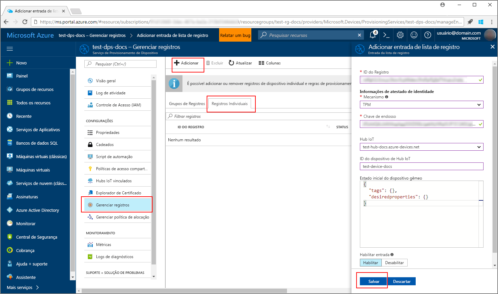
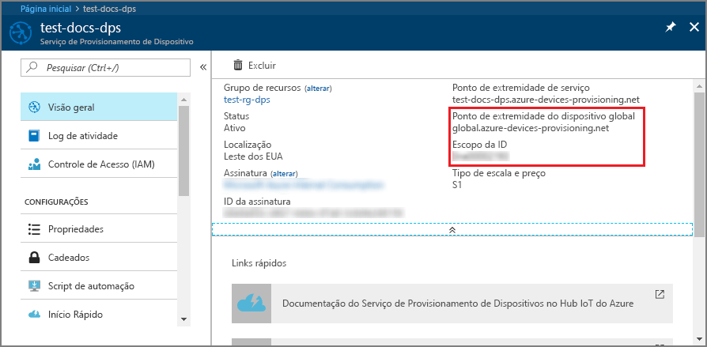
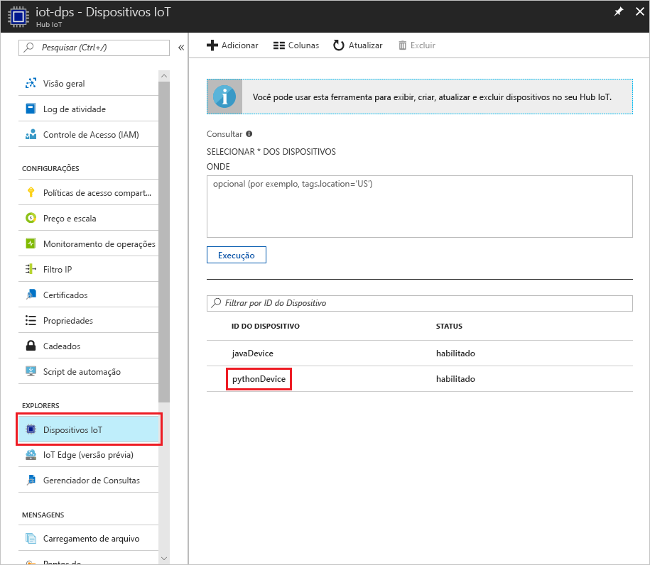

# <a name="create-and-provision-a-simulated-tpm-device-using-java-device-sdk-for-iot-hub-device-provisioning-service"></a>Criar e provisionar um dispositivo TPM simulado usando o SDK do dispositivo Java para o Serviço de Provisionamento do Dispositivo Hub IoT
> [!div class="op_single_selector"]
> * [C](quick-create-simulated-device.md)
> * [Java](quick-create-simulated-device-tpm-java.md)
> * [C#](quick-create-simulated-device-tpm-csharp.md)
> * [Python](quick-create-simulated-device-tpm-python.md)

Estas etapas mostram como criar um dispositivo simulado em seu computador de desenvolvimento executando o sistema operacional Windows, executar o simulador de TPM do Windows como [HSM (Módulo de Segurança de Hardware)](https://azure.microsoft.com/blog/azure-iot-supports-new-security-hardware-to-strengthen-iot-security/) do dispositivo e usar o exemplo de código do Python para se conectar a esse dispositivo simulado com o Serviço de Provisionamento de Dispositivos e o Hub IoT. 

Não deixe de concluir as etapas em [Configurar o Serviço de Provisionamento de Dispositivos do Hub IoT com o portal do Azure](./quick-setup-auto-provision.md) antes de continuar.


## <a name="prepare-the-environment"></a>Preparar o ambiente 

1. Verifique se você tem o [Visual Studio 2015](https://www.visualstudio.com/vs/older-downloads/) ou o [Visual Studio 2017](https://www.visualstudio.com/vs/) instalado em seu computador. Você deve ter a carga de trabalho 'Desenvolvimento de área de trabalho com C++' habilitada para sua instalação do Visual Studio.

1. Baixe e instale o [sistema de compilação CMake](https://cmake.org/download/).

1. Verifique se o `git` está instalado em seu computador e é adicionado às variáveis de ambiente que podem ser acessadas pela janela de comando. Confira [ferramentas de cliente Git do Software Freedom Conservancy](https://git-scm.com/download/) para obter a versão mais recente das ferramentas `git` a serem instaladas, que inclui o **Git Bash**, o aplicativo de linha de comando que você pode usar para interagir com seu repositório Git local. 

1. Abra um prompt de comando ou o Bash do Git. Clone o repositório do GitHub para obter exemplo de código de simulação do dispositivo:
    
    ```cmd/sh
    git clone https://github.com/Azure/azure-iot-sdk-python.git --recursive
    ```

1. Crie uma pasta em sua cópia local do repositório GitHub para o processo de compilação do CMake. 

    ```cmd/sh
    cd azure-iot-sdk-python/c
    mkdir cmake
    cd cmake
    ```

1. O exemplo de código usa um simulador do TPM do Windows. Execute o comando a seguir para habilitar a autenticação de token SAS. Ele também gera uma solução do Visual Studio para o dispositivo simulado.

    ```cmd/sh
    cmake -Duse_prov_client:BOOL=ON -Duse_tpm_simulator:BOOL=ON ..
    ```

1. Em um prompt de comando separado, navegue até a pasta do simulador de [TPM](https://docs.microsoft.com/windows/device-security/tpm/trusted-platform-module-overview) e execute-o. Clique em **Permitir Acesso**. Ele escuta em um soquete nas portas 2321 e 2322. Não feche essa janela de comando; você precisará manter esse simulador em execução até o término deste Guia de Início Rápido. 

    ```cmd/sh
    .\azure-iot-sdk-python\c\provisioning_client\deps\utpm\tools\tpm_simulator\Simulator.exe
    ```

    


## <a name="create-a-device-enrollment-entry"></a>Criar uma entrada de registro de dispositivo

1. Abra a solução gerada na pasta *cmake* denominada `azure_iot_sdks.sln`e compile-a no Visual Studio.

1. Clique com botão direito do mouse no projeto **tpm_device_provision** e selecione **Definir como Projeto de Inicialização**. Execute a solução. A janela de saída exibe a  **_Chave de Endosso_**  e a  **_ID de Registro_**  necessárias para registrar o dispositivo. Anote esses valores. 

    

1. Faça logon no Portal do Azure, clique no botão **Todos os recursos** no menu esquerdo e abra o Serviço de Provisionamento de Dispositivos.

1. Na folha de resumo do Serviço de Provisionamento de Dispositivos, selecione **Gerenciar registros**. Selecione a guia **Registros Individuais** guia e clique no botão **Adicionar** na parte superior. 

1. Em **Adicionar a entrada da lista de registro**, insira as seguintes informações:
    - Selecione **TPM** como o atestado de identidade *Mecanismo*.
    - Insira a *ID de Registro* e *Chave de Endosso* para seu dispositivo do TPM. 
    - Selecione um hub IoT vinculado com o serviço de provisionamento.
    - Insira uma ID de dispositivo exclusiva. Evite dados confidenciais ao nomear seu dispositivo.
    - Atualize o **Estado inicial do dispositivo gêmeo** com a configuração inicial desejada para o dispositivo.
    - Uma vez concluído, clique no botão **Salvar**. 

      

   Em caso de registro bem-sucedido, a *ID de Registro* do seu dispositivo será exibida na lista na guia *Registros Individuais*. 


## <a name="simulate-the-device"></a>Simular o dispositivo

1. Baixe e instale o [Python 2.x ou 3.x](https://www.python.org/downloads/). Certifique-se de usar a instalação de 32 bits ou 64 bits conforme exigido pelo seu programa de instalação. Quando solicitado durante a instalação, certifique-se de adicionar Python às variáveis de ambiente específica da plataforma.
    - Se você está usando o sistema operacional Windows, o [Pacote redistribuível do Visual C++](http://www.microsoft.com/download/confirmation.aspx?id=48145) permite o uso de DLLs nativas do Python.

1. Execute [estas instruções](https://github.com/Azure/azure-iot-sdk-python/blob/master/doc/python-devbox-setup.md) para compilar os pacotes do Python.

    > [!NOTE]
        > Se estiver executando o `build_client.cmd`, use o sinalizador `--use-tpm-simulator`.

    > [!NOTE]
        > Se usar `pip`, certifique-se de também instalar o pacote `azure-iot-provisioning-device-client`. Observe que os pacotes de PIP estão usando o TPM real, não o simulador. Para usar o simulador, você precisa compilar do código-fonte usando o sinalizador `--use-tpm-simulator`.

1. Navegue até a pasta de amostras.

    ```cmd/sh
    cd azure-iot-sdk-python/provisioning_device_client/samples
    ```

1. Usando o IDE do Python, edite o script python chamado **provisionamento\_dispositivo\_cliente\_sample.py**. Modifique as variáveis _GLOBAL\_PROV\_URI_ e _ID\_SCOPE_ para os valores observados anteriormente.

    ```python
    GLOBAL_PROV_URI = "{globalServiceEndpoint}"
    ID_SCOPE = "{idScope}"
    SECURITY_DEVICE_TYPE = ProvisioningSecurityDeviceType.TPM
    PROTOCOL = ProvisioningTransportProvider.HTTP
    ```

    

1. Execute o exemplo. 

    ```cmd/sh
    python provisioning_device_client_sample.py
    ```

1. Observe as mensagens que simulam a inicialização e a conexão do dispositivo com o Serviço de Provisionamento de Dispositivos para obter as informações do Hub IoT. 

    

1. Com o êxito no provisionamento do seu dispositivo simulado para o Hub IoT vinculado ao serviço de provisionamento, a ID do dispositivo aparece na folha **Device Explorer** do hub.

     

    Se você tiver alterado o *estado de dispositivo gêmeo inicial* do valor padrão na entrada de registro para o seu dispositivo, pode receber o estado desejado duas do hub e agir de acordo. Para saber mais, veja [Noções básicas e uso de dispositivos gêmeos no Hub IoT](../iot-hub/iot-hub-devguide-device-twins.md)


## <a name="clean-up-resources"></a>Limpar recursos

Se você planeja continuar a trabalhar e explorar o dispositivo cliente de exemplo, não limpe os recursos criados neste Guia de Início Rápido. Caso contrário, use as etapas a seguir para excluir todos os recursos criados por este Guia de Início Rápido.

1. Feche a janela de saída de exemplo de dispositivo cliente em seu computador.
1. Feche a janela do simulador do TPM no seu computador.
1. No menu à esquerda no Portal do Azure, clique em **Todos os recursos** e selecione o serviço de Provisionamento de Dispositivos. Abra a folha **Gerenciar Registros** de seu serviço e clique na guia **Registros Individuais**. Selecione *ID de REGISTRO* do dispositivo descrito no Guia de Início Rápido e clique no botão **Excluir** na parte superior. 
1. No menu à esquerda no Portal do Azure, clique em **Todos os recursos** e selecione seu Hub IoT. Abra a folha **Dispositivos IoT** do hub, selecione *DEVICE ID* registrado nesse Guia de Início Rápido, e clique no botão **Excluir** na parte superior.

## <a name="next-steps"></a>Próximas etapas

Neste Guia de Início Rápido, você criou um dispositivo TPM simulado no seu computador e o provisionou no Hub IoT usando o Serviço de Provisionamento de Dispositivos do Hub IoT. Para saber como registrar seu dispositivo TPM programaticamente, continue com o Guia de Início Rápido para registro programático de um dispositivo TPM. 

> [!div class="nextstepaction"]
> [Guia de Início Rápido do Azure – Registrar dispositivo TPM no Serviço de Provisionamento de Dispositivos do Hub IoT do Azure](quick-enroll-device-tpm-java.md)
