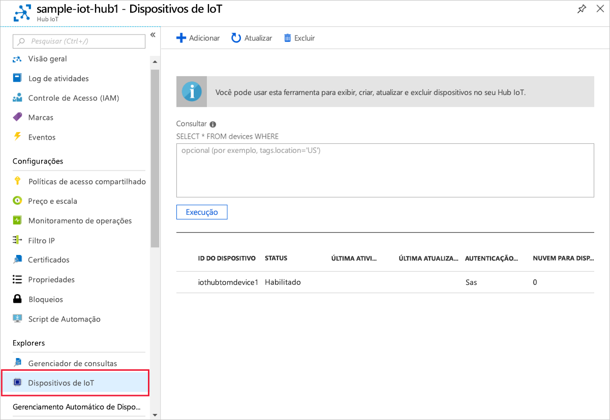

# <a name="create-and-provision-a-simulated-x509-device-using-c-device-sdk-for-iot-hub-device-provisioning-service"></a>Criar e provisionar um dispositivo X.509 simulado usando o SDK do dispositivo C# para o Serviço de Provisionamento do Dispositivo Hub IoT
[!INCLUDE [iot-dps-selector-quick-create-simulated-device-x509](../../includes/iot-dps-selector-quick-create-simulated-device-x509.md)]

Estas etapas mostram como usar [Exemplos de IoT do Azure para C# ](https://github.com/Azure-Samples/azure-iot-samples-csharp) para simular um dispositivo X.509 em um computador de desenvolvimento executando o sistema operacional Windows. O exemplo também conecta o dispositivo simulado a um Hub IoT usando o Serviço de Provisionamento de Dispositivos.

Se você não estiver familiarizado com o processo de provisionamento automático, analise também os [Conceitos de provisionamento automático](concepts-auto-provisioning.md). Não se esqueça de concluir as etapas em [Configurar o Serviço de Provisionamento de Dispositivos no Hub IoT com o Portal do Azure](./quick-setup-auto-provision.md) antes de continuar. 

O Serviço de Provisionamento de Dispositivos de IoT do Azure dá suporte a dois tipos de registros:
- [Grupos de registros](concepts-service.md#enrollment-group): usados para inscrever vários dispositivos relacionados.
- [Registros individuais](concepts-service.md#individual-enrollment): usados para inscrever um único dispositivo.

Este artigo irá demonstrar registros individuais.

[!INCLUDE [IoT Device Provisioning Service basic](../../includes/iot-dps-basic.md)]

<a id="setupdevbox"></a>
## <a name="prepare-the-development-environment"></a>Preparar o ambiente de desenvolvimento 

1. Verifique se você tem o [SDK do .Net Core 2.1 ou posterior](https://www.microsoft.com/net/download/windows) instalado em seu computador. 

1. Verifique se o `git` está instalado em seu computador e é adicionado às variáveis de ambiente que podem ser acessadas pela janela de comando. Confira [ferramentas de cliente Git do Software Freedom Conservancy](https://git-scm.com/download/) para obter a versão mais recente das ferramentas `git` a serem instaladas, que inclui o **Git Bash**, o aplicativo de linha de comando que você pode usar para interagir com seu repositório Git local. 

1. Abra um prompt de comando ou o Bash do Git. Clonar Amostras GitHub do Azure IoT para repositório GitHub em C#:
    
    ```cmd
    git clone https://github.com/Azure-Samples/azure-iot-samples-csharp.git
    ```

## <a name="create-a-self-signed-x509-device-certificate-and-individual-enrollment-entry"></a>Criar um certificado de dispositivo X.509 autoassinado e entrada de registro individual

Nesta seção, você usará um certificado X.509 autoassinado, é importante ter em mente o seguinte:

* Os certificados autoassinados são somente para teste e não devem ser usados em produção.
* A data de validade padrão para um certificado autoassinado é de um ano.

Você usará o código de exemplo de [Exemplo de Cliente do Dispositivo de Provisionamento – Atestado de X.509](https://github.com/Azure-Samples/azure-iot-samples-csharp/tree/master/provisioning/Samples/device/X509Sample) para criar o certificado a ser usado com a entrada de registro individual para o dispositivo simulado.


1. No prompt de comando, altere os diretórios para o diretório do projeto de exemplo de provisionamento do dispositivo X.509.

    ```cmd
    cd .\azure-iot-samples-csharp\provisioning\Samples\device\X509Sample
    ```

2. O código de exemplo está configurado para usar os certificados X.509 armazenados em um arquivo formatado PKCS12 protegido por senha (certificate.pfx). Além disso, você precisa de um arquivo de certificado de chave pública (certificate.cer) para criar um registro individual mais tarde neste Guia de Início Rápido. Para gerar um certificado autoassinado e seus arquivos .cer e .pfx associados, execute o seguinte comando:

    ```cmd
    powershell .\GenerateTestCertificate.ps1
    ```

3. O script solicita uma senha PFX. Lembre-se desta senha, você deve usá-la quando executar a amostra.

      


4. Entre no portal do Azure, clique no botão **Todos os recursos** no menu esquerdo e abra o serviço de provisionamento.

5. Na folha de resumo do Serviço de Provisionamento de Dispositivos, selecione **Gerenciar registros**. Selecione a guia **Registros Individuais** e clique no botão **Adicionar registro individual** na parte superior. 

6. No painel **Adicionar Registro**, insira as seguintes informações:
    - Selecione **X.509** como o *Mecanismo* de atestado de identidade.
    - No *arquivo primário certificate .pem ou .cer*, clique em *Selecionar um arquivo* para selecionar o arquivo de certificado **certificate.cer** criado na etapa anterior.
    - Deixe **ID do Dispositivo** em branco. Seu dispositivo será provisionado com a ID do dispositivo configurado para o CN (Nome Comum) no certificado X.509, **iothubx509device1**. Esse também será o nome usado para a ID de registro da entrada de registro individual. 
    - Opcionalmente, você pode fornecer as seguintes informações:
        - Selecione um hub IoT vinculado com o serviço de provisionamento.
        - Atualize o **Estado inicial do dispositivo gêmeo** com a configuração inicial desejada para o dispositivo.
    - Uma vez concluído, clique no botão **Salvar**. 

    [](./media/quick-create-simulated-device-x509-csharp/device-enrollment.png#lightbox)
    
   No registro bem-sucedido, a entrada do registro X.509 aparece como **iothubx509device1** na coluna *ID do Registro*, na guia *Registros Individuais*. 

## <a name="provision-the-simulated-device"></a>Provisionar o dispositivo simulado

1. Na folha **Visão Geral** do serviço de provisionamento, anote o valor de **_Escopo da ID_**.

     


2. Digite o seguinte comando para compilar e executar o exemplo de provisionamento de dispositivo X.509. Substitua o valor `<IDScope>` pelo Escopo da ID do serviço de provisionamento. 

    ```cmd
    dotnet run <IDScope>
    ```

3. Quando solicitado, insira a senha do arquivo PFX criado anteriormente. Observe as mensagens que simulam a inicialização e a conexão do dispositivo com o Serviço de Provisionamento de Dispositivos para obter as informações do Hub IoT. 

     

4. Verifique se o dispositivo foi provisionado. No provisionamento bem-sucedido do dispositivo simulado para o Hub IoT vinculado ao serviço de provisionamento, a ID do dispositivo aparece na folha **Dispositivos IOT** do hub. 

     

    Se você tiver alterado o *estado de dispositivo gêmeo inicial* do valor padrão na entrada de registro para o seu dispositivo, pode receber o estado desejado duas do hub e agir de acordo. Para saber mais, veja [Noções básicas e uso de dispositivos gêmeos no Hub IoT](../iot-hub/iot-hub-devguide-device-twins.md)


## <a name="clean-up-resources"></a>Limpar recursos

Se você planeja continuar a trabalhar e explorar o dispositivo cliente de exemplo, não limpe os recursos criados neste Guia de Início Rápido. Caso contrário, use as etapas a seguir para excluir todos os recursos criados por este Guia de Início Rápido.

1. Feche a janela de saída de exemplo de dispositivo cliente em seu computador.
1. Feche a janela do simulador do TPM no seu computador.
1. No menu à esquerda no Portal do Azure, clique em **Todos os recursos** e selecione o serviço de Provisionamento de Dispositivos. Na parte superior da folha **Todos os recursos**, clique em **Excluir**.  
1. No menu à esquerda no Portal do Azure, clique em **Todos os recursos** e selecione seu Hub IoT. Na parte superior da folha **Todos os recursos**, clique em **Excluir**.  

## <a name="next-steps"></a>Próximas etapas

Neste Guia de Início Rápido, você criou um dispositivo simulado X.509 no seu computador Windows e o provisionou no Hub IoT usando o Serviço de Provisionamento de Dispositivos do Hub IoT do Azure no portal. Para saber como registrar seu dispositivo X.509 programaticamente, continue com o Guia de Início Rápido para registro programático de dispositivos X.509. 

> [!div class="nextstepaction"]
> [Guia de Início Rápido do Azure – Registre dispositivos X.509 no Serviço de Provisionamento de Dispositivos do Hub IoT do Azure](quick-enroll-device-x509-csharp.md)
