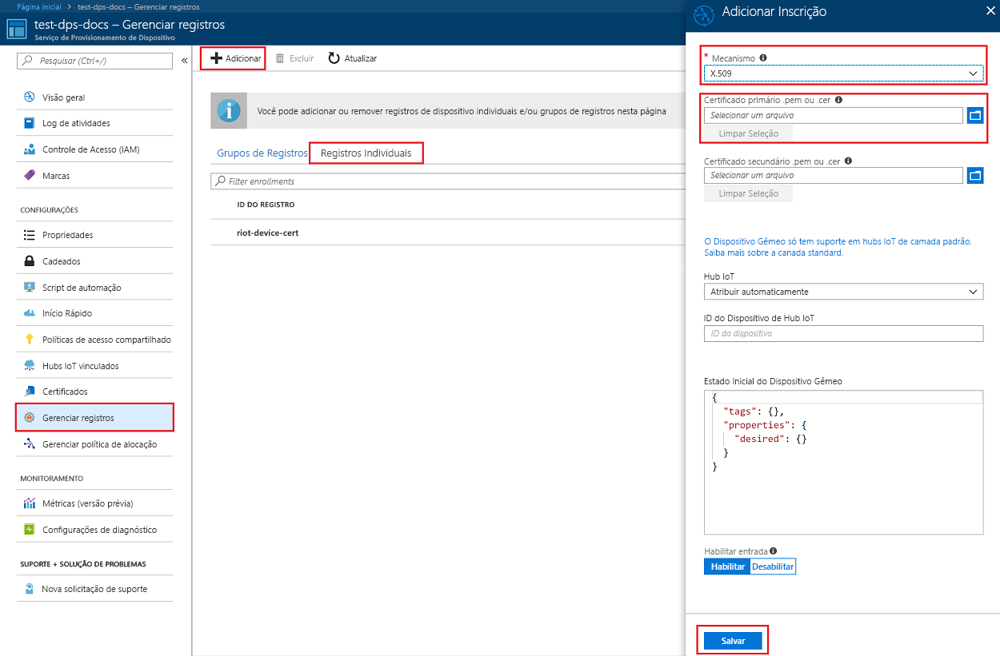

# <a name="create-and-provision-an-x509-simulated-device-using-nodejs-device-sdk-for-iot-hub-device-provisioning-service"></a>Criar e provisionar um dispositivo X.509 simulado usando o SDK do dispositivo Node.js para o Serviço de Provisionamento de Dispositivos no Hub IoT
[!INCLUDE [iot-dps-selector-quick-create-simulated-device-x509](../../includes/iot-dps-selector-quick-create-simulated-device-x509.md)]

Essas etapas mostram como criar uma entrada de registro no Serviço de Provisionamento de Dispositivos, simular um dispositivo X.509 no computador de desenvolvimento, conectar o dispositivo simulado com o Serviço de Provisionamento de Dispositivos e registrar o dispositivo em seu Hub IoT usando o [SDK do dispositivo Node.js no Hub IoT do Azure](https://github.com/Azure/azure-iot-sdk-node).

Se você não estiver familiarizado com o processo de provisionamento automático, analise também os [Conceitos de provisionamento automático](concepts-auto-provisioning.md). Não se esqueça de concluir as etapas em [Configurar o Serviço de Provisionamento de Dispositivos no Hub IoT com o Portal do Azure](./quick-setup-auto-provision.md) antes de continuar. 

[!INCLUDE [IoT DPS basic](../../includes/iot-dps-basic.md)]

## <a name="prepare-the-environment"></a>Preparar o ambiente 

1. Conclua as etapas em [Configurar o Serviço de Provisionamento de Dispositivos no Hub IoT com o Portal do Azure](./quick-setup-auto-provision.md) antes de continuar.

2. Verifique se o [Node.js v4.0 ou superior](https://nodejs.org) está instalado no computador.

3. Verifique se o [Git](https://git-scm.com/download/) está instalado em seu computador e se foi adicionado às variáveis de ambiente que podem ser acessadas pela janela de comando. 

4. Verifique se o [OpenSSL](https://www.openssl.org/) está instalado em seu computador e se foi adicionado às variáveis de ambiente que podem ser acessadas pela janela de comando. Essa biblioteca pode ser criada e instalada a partir da fonte ou baixada e instalada a partir de [terceiros](https://wiki.openssl.org/index.php/Binaries) como [este](https://sourceforge.net/projects/openssl/). 

    > [!NOTE]
    > Caso já tenha criado seus certificados X.509 _raiz_, _intermediário_ e/ou _folha_, você pode ignorar esta etapa e todas as seguintes em relação à geração de certificado.
    >

## <a name="create-a-self-signed-x509-device-certificate-and-individual-enrollment-entry"></a>Criar um certificado de dispositivo X.509 autoassinado e entrada de registro individual

1. Abra um prompt de comando. Clone o repositório do GitHub para os exemplos de código:
    
    ```cmd/sh
    git clone https://github.com/Azure/azure-iot-sdk-node.git --recursive
    ```

2. Navegue até o script do gerador de certificados e compile o projeto. 

    ```cmd/sh
    cd azure-iot-sdk-node/provisioning/tools
    npm install
    ```

3. Crie o certificado X.509 de _folha_ por meio da execução do script usando seu próprio _nome-certificado_. Observe que o nome comum do certificado de folha se torna a [ID de registro](https://docs.microsoft.com/azure/iot-dps/concepts-device#registration-id). Portanto, verifique se usou apenas valores alfanuméricos minúsculos e hifens.

    ```cmd/sh
    node create_test_cert.js device {certificate-name}
    ```

4. Entre no [Portal do Azure](https://portal.azure.com), clique no botão **Todos os recursos** no menu esquerdo e abra a instância do Serviço de Provisionamento de Dispositivos.

5. Na folha de resumo do Serviço de Provisionamento de Dispositivos, selecione **Gerenciar registros**. Selecione a guia **Registros Individuais** guia e clique no botão **Adicionar** na parte superior. 

6. No painel **Adicionar registro**, insira as seguintes informações:
    - Selecione **X.509** como o *Mecanismo* de atestado de identidade.
    - No *arquivo primário certificate .pem ou .cer*, clique em *Selecionar um arquivo* para selecionar o arquivo de certificado **{certificate-name}_cert.pem** criado na etapa anterior.  
    - Opcionalmente, você pode fornecer as seguintes informações:
      - Selecione um hub IoT vinculado com o serviço de provisionamento.
      - Insira uma ID de dispositivo exclusiva. Evite dados confidenciais ao nomear seu dispositivo. 
      - Atualize o **Estado inicial do dispositivo gêmeo** com a configuração inicial desejada para o dispositivo.
   - Uma vez concluído, clique no botão **Salvar**. 

    [](./media/quick-create-simulated-device-x509-node/individual-enrollment.png#lightbox)

    No registro bem-sucedido, o dispositivo X.509 é exibido como **{certificatename}** na coluna *ID do Registro* na guia o *Registros Individuais*. Anote esse valor para usar mais tarde.

## <a name="simulate-the-device"></a>Simular o dispositivo

O [SDK do dispositivo Node.js do Hub IoT do Azure](https://github.com/Azure/azure-iot-sdk-node) oferece uma maneira fácil de simular um dispositivo. Para ler mais sobre o assunto, confira [Conceitos de dispositivo](https://docs.microsoft.com/azure/iot-dps/concepts-device).

1. No portal do Azure, selecione a folha **Visão Geral** do seu Serviço de Provisionamento de Dispositivos e anote os valores de **_Ponto de Extremidade do Dispositivo Global_** e **_Escopo de ID_**.

     

2. Copie o _certificado_ e a _chave_ para a pasta de exemplo.

    ```cmd/sh
    copy .\{certificate-name}_cert.pem ..\device\samples\{certificate-name}_cert.pem
    copy .\{certificate-name}_key.pem ..\device\samples\{certificate-name}_key.pem
    ```

3. Navegue até o script de teste do dispositivo e crie o projeto. 

    ```cmd/sh
    cd ..\device\samples
    npm install
    ```

4. Edite o arquivo **register\_x509.js**. Salve o arquivo depois de fazer as alterações a seguir.
    - Substitua `provisioning host` pelo **_Ponto de Extremidade do Dispositivo Global_** anotado na **Etapa 1** acima.
    - Substitua `id scope` pelo **_Escopo de ID_** anotado na **Etapa 1** acima. 
    - Substitua `registration id` pela **_ID de Registro_** anotada na seção anterior.
    - Substitua `cert filename` e `key filename` pelos arquivos que você copiou na **Etapa 2** acima. 

5. Execute o script e verifique se o dispositivo foi provisionado com êxito.

    ```cmd/sh
    node register_x509.js
    ```   

6. No portal, navegue até o Hub IoT vinculado ao seu serviço de provisionamento e abra a folha **Dispositivos IoT**. No provisionamento bem-sucedido do dispositivo X.509 simulado para o hub, sua ID de dispositivo aparecerá na folha **Dispositivos IoT** com o *STATUS* **habilitado**. Talvez seja necessário clicar no botão **Atualizar** na parte superior, se você já tiver aberto a folha antes de executar o aplicativo de dispositivo de exemplo. 

     

    Se você tiver alterado o *estado de dispositivo gêmeo inicial* do valor padrão na entrada de registro para o seu dispositivo, pode receber o estado desejado duas do hub e agir de acordo. Para saber mais, veja [Noções básicas e uso de dispositivos gêmeos no Hub IoT](../iot-hub/iot-hub-devguide-device-twins.md).


## <a name="clean-up-resources"></a>Limpar recursos

Se você planeja continuar a trabalhar e explorar o dispositivo cliente de exemplo, não limpe os recursos criados neste Guia de Início Rápido. Caso contrário, use as etapas a seguir para excluir todos os recursos criados por este Guia de Início Rápido.

1. Feche a janela de saída de exemplo de dispositivo cliente em seu computador.
2. No menu à esquerda no Portal do Azure, clique em **Todos os recursos** e selecione o serviço de Provisionamento de Dispositivos. Abra a folha **Gerenciar Registros** de seu serviço e clique na guia **Registros Individuais**. Selecione *ID de REGISTRO* do dispositivo descrito no Guia de Início Rápido e clique no botão **Excluir** na parte superior. 
3. No menu à esquerda no Portal do Azure, clique em **Todos os recursos** e selecione seu Hub IoT. Abra a folha **Dispositivos IoT** do hub, selecione *DEVICE ID* registrado nesse Guia de Início Rápido, e clique no botão **Excluir** na parte superior.


## <a name="next-steps"></a>Próximas etapas

Neste Início Rápido, você criou um dispositivo X.509 simulado e o provisionou no Hub IoT usando o Serviço de Provisionamento de Dispositivos no Hub IoT do Azure no portal. Para saber como registrar seu dispositivo X.509 programaticamente, continue com o Guia de Início Rápido para registro programático de dispositivos X.509. 

> [!div class="nextstepaction"]
> [Guia de Início Rápido do Azure – Registre dispositivos X.509 no Serviço de Provisionamento de Dispositivos do Hub IoT do Azure](quick-enroll-device-x509-node.md)
