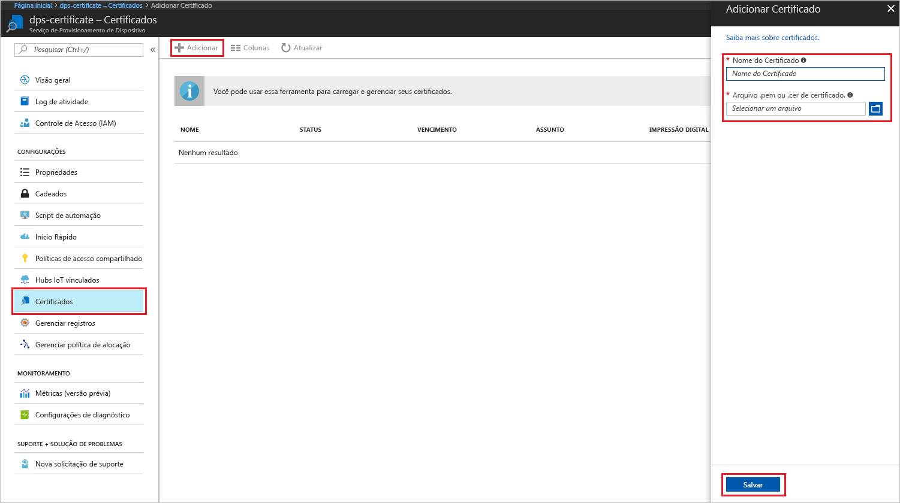
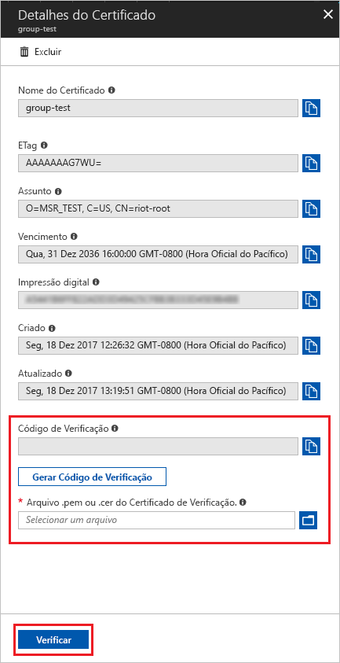
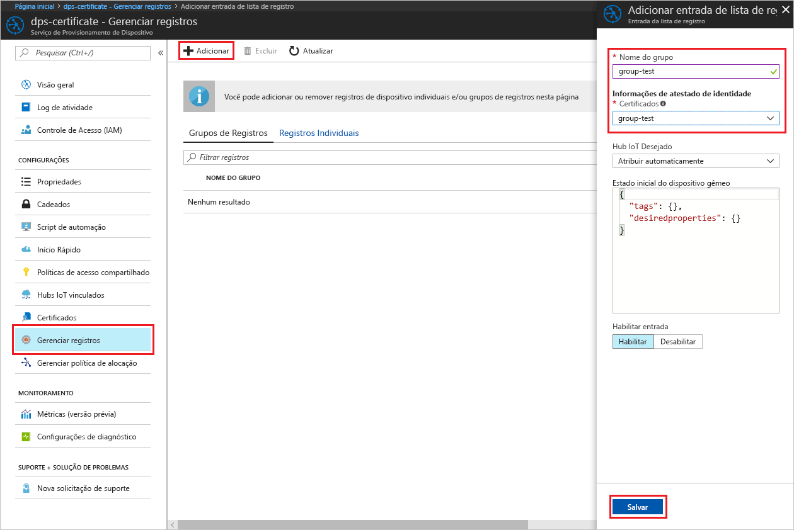
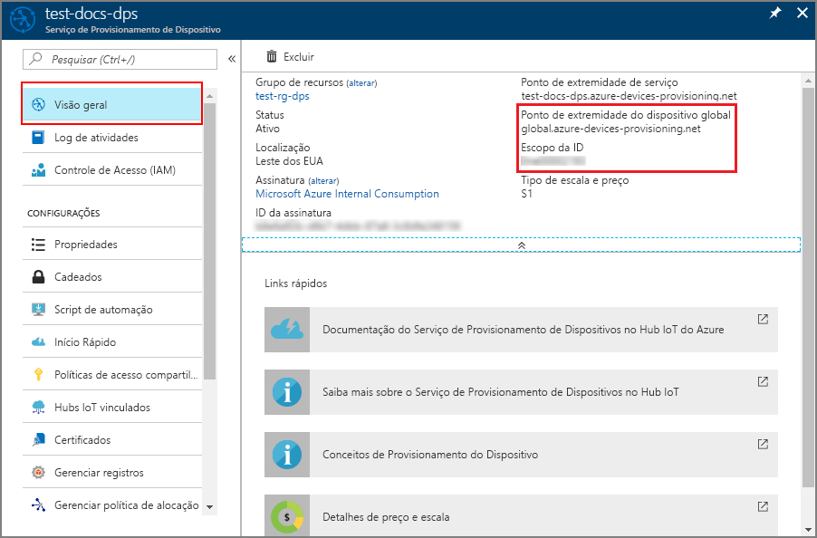
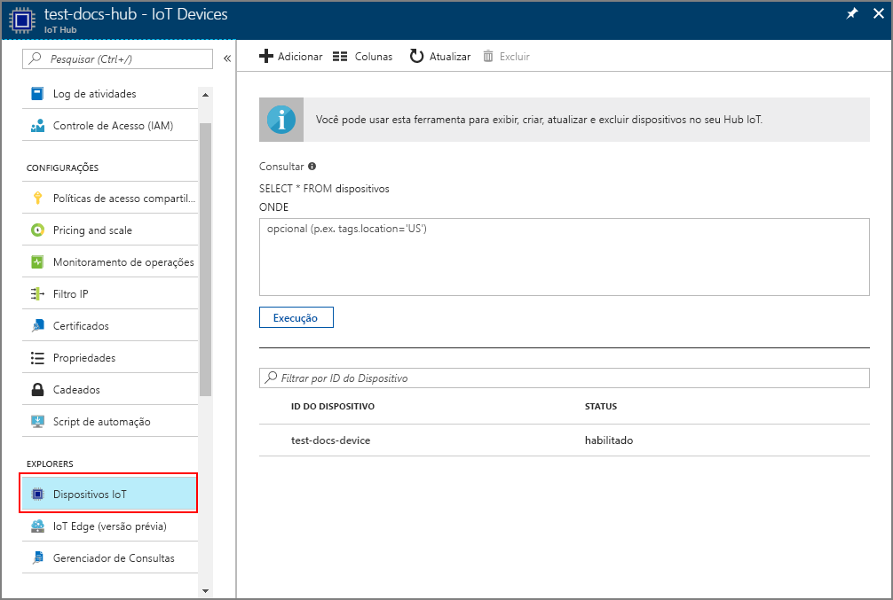

# <a name="create-and-provision-an-x509-simulated-device-using-nodejs-device-sdk-for-iot-hub-device-provisioning-service"></a>Criar e provisionar um dispositivo X.509 simulado usando o SDK do dispositivo Node.js para o Serviço de Provisionamento de Dispositivos no Hub IoT
[!INCLUDE [iot-dps-selector-quick-create-simulated-device-x509](../../includes/iot-dps-selector-quick-create-simulated-device-x509.md)]

O Serviço de Provisionamento de Dispositivos no Hub IoT é um serviço auxiliar do Hub IoT que fornece o provisionamento de dispositivos sem interação para o Hub IoT. Com o Serviço de Provisionamento de Dispositivos, você pode provisionar milhões de dispositivos de uma maneira segura e escalonável.

O provisionamento de dispositivos consiste em duas etapas. A primeira etapa é criar a entrada de registro apropriada no Serviço de Provisionamento de Dispositivos baseado nos requisitos específicos da solução.  A segunda etapa é estabelecer uma conexão entre o dispositivo e o Serviço de Provisionamento de Dispositivos e registrar o dispositivo com o Hub IoT. Depois que ambas as etapas estiverem concluídas, o dispositivo é considerado como completamente provisionado. O Serviço de Provisionamento de Dispositivos automatiza as etapas para fornecer uma experiência perfeita de provisionamento para o dispositivo. Para obter mais informações, confira [Conceitos do Serviço de Provisionamento de Dispositivos](https://docs.microsoft.com/en-us/azure/iot-dps/concepts-service).

Essas etapas mostram como criar uma entrada de registro no Serviço de Provisionamento de Dispositivos, simular um dispositivo X.509 no computador de desenvolvimento, conectar o dispositivo simulado com o Serviço de Provisionamento de Dispositivos e registrar o dispositivo em seu Hub IoT usando o [SDK do dispositivo Node.js no Hub IoT do Azure](https://github.com/Azure/azure-iot-sdk-node).


## <a name="prepare-the-environment"></a>Preparar o ambiente 

1. Conclua as etapas em [Configurar o Serviço de Provisionamento de Dispositivos no Hub IoT com o Portal do Azure](./quick-setup-auto-provision.md) antes de continuar.

1. Verifique se o [Node.js v4.0 ou superior](https://nodejs.org) está instalado no computador.

1. Verifique se o [Git](https://git-scm.com/download/) está instalado em seu computador e se foi adicionado às variáveis de ambiente que podem ser acessadas pela janela de comando. 

1. Verifique se o [OpenSSL](https://www.openssl.org/) está instalado em seu computador e se foi adicionado às variáveis de ambiente que podem ser acessadas pela janela de comando. Essa biblioteca pode ser criada e instalada a partir da fonte ou baixada e instalada a partir de [terceiros](https://wiki.openssl.org/index.php/Binaries) como [este](https://sourceforge.net/projects/openssl/). 

    > [!NOTE]
    > Caso já tenha criado seus certificados X.509 _raiz_, _intermediário_ e/ou _folha_, você pode ignorar esta etapa e todas as seguintes em relação à geração de certificado.
    >


## <a name="create-an-enrollment-entry"></a>Criar uma entrada de registro

Um registro é um relatório de dispositivos ou grupos de dispositivos que podem, em algum ponto, ser registrados armazenados no Serviço de Provisionamento de Dispositivos. O registro contém informações sobre o dispositivo ou grupo de dispositivos, incluindo detalhes do certificado X.509 e informações de registro adicionais. Há dois tipos de registros com suporte do Serviço de Provisionamento de Dispositivos, _Registro individual_ e _Grupo de registros_. Para obter mais informações, confira [Conceitos de registros](https://docs.microsoft.com/en-us/azure/iot-dps/concepts-service#enrollment).

Caso esteja criando seus próprios certificados de teste de X.509, consulte os [Conceitos de segurança](https://docs.microsoft.com/en-us/azure/iot-dps/concepts-security#x509-certificates), nos quais são necessários certificados para sua solução, e [Ferramentas do SDK do Dispositivo de Provisionamento do IoT do Azure para Node.js](https://github.com/azure/azure-iot-sdk-node/tree/master/provisioning/tools) para obter detalhes de implementação.

1. Abra um prompt de comando. Clone o repositório do GitHub para os exemplos de código:
    
    ```cmd/sh
    git clone https://github.com/Azure/azure-iot-sdk-node.git --recursive
    ```

1. Navegue até o script do gerador de certificados e compile o projeto. 

    ```cmd/sh
    cd azure-iot-sdk-node/provisioning/tools
    npm install
    ```

1. Crie informações de registro em uma das seguintes maneiras, conforme sua configuração:

    - **Registro individual**:

        1. Crie o certificado de _folha_ por meio da execução do script usando seu próprio _nome-certificado_. Observe que o nome comum do certificado de folha se torna a [ID de registro](https://docs.microsoft.com/en-us/azure/iot-dps/concepts-device#registration-id). Portanto, verifique se usou apenas valores alfanuméricos minúsculos e hifens.

        ```cmd/sh
        node create_test_cert.js device {certificate-name}
        ```
         
        1. No portal do **Azure**, abra a folha de resumo do **Serviço de Provisionamento de Dispositivos**. Selecione **Gerenciar registros**, depois a guia **Registros Individuais** e clique no botão **Adicionar** na parte superior. 

        1. Em **Adicionar a entrada da lista de registro**, insira as seguintes informações:
            - Selecione **X.509** como o *Mecanismo* de atestado de identidade.
            - No *Arquivo de certificado .pem ou .cer*, selecione o arquivo de certificado **_{nome-certificado}\_cert.pem_** criado nas etapas anteriores usando o widget *Gerenciador de Arquivos*.
            - Opcionalmente, você pode fornecer as seguintes informações:
                - Selecione um hub IoT vinculado com o serviço de provisionamento.
                - Insira uma ID de dispositivo exclusiva. Evite dados confidenciais ao nomear seu dispositivo. 
                - Atualize o **Estado inicial do dispositivo gêmeo** com a configuração inicial desejada para o dispositivo.
            - Uma vez concluído, clique no botão **Salvar**. 

          

    No registro bem-sucedido, o dispositivo X.509 é exibido como **{certificatename}** na coluna *ID do Registro* na guia o *Registros Individuais*. Anote esse valor para usar mais tarde.

    - **Grupos de registros**: 

        1. Crie o certificado _raiz_ por meio da execução do script usando seu próprio _nome-raiz_.

        ```cmd/sh
        node create_test_cert.js root {root-name}
        ```

        1. No portal do **Azure**, abra a folha de resumo do **Serviço de Provisionamento de Dispositivos**. Selecione **Certificados** e clique no botão **Adicionar** na parte superior.

        1. Em **Adicionar Certificado**, insira as seguintes informações:
            - Digite um nome de certificado exclusivo.
            - Selecione o arquivo **_{nome-raiz}\_cert.pem_** criado anteriormente.
            - Uma vez concluído, clique no botão **Salvar**.

        

        1. Selecione o certificado recém-criado:
            - Clique em **Gerar Código de Verificação**. Copie o código gerado.
            - Crie o certificado de _verificação_. Insira o _código de verificação_ ou clique com o botão direito do mouse na janela do seu script do Node em execução com o seguinte comando:

                ```cmd/sh
                node create_test_cert.js verification {rootname_cert} {verification code}
                ```

            - No *Arquivo .pem ou .cer do certificado de verificação*, selecione o arquivo de certificado **_verification_cert.pem_** criado nas etapas anteriores usando o widget *Explorador de Arquivos*. Clique em **Verificar**.

            

        1. Selecione **Gerenciar registros**. Selecione a guia **Grupos de Registro** e clique no botão **Adicionar** na parte superior.
            - Insira um nome de grupo exclusivo.
            - Selecionar o nome do certificado exclusivo criado anteriormente
            - Opcionalmente, você pode fornecer as seguintes informações:
                - Selecione um hub IoT vinculado com o serviço de provisionamento.
                - Atualize o **Estado inicial do dispositivo gêmeo** com a configuração inicial desejada para o dispositivo.

        

        No registro bem-sucedido, o grupo de dispositivos X.509 aparece na coluna *Nome do Grupo* na guia *Grupos de Registro*. Anote esse valor para usar mais tarde.

        1. Crie o certificado de _folha_ por meio da execução do script usando seu próprio _nome-certificado_ seguido do _nome-raiz_ usado anteriormente. O nome comum do certificado de folha se torna a [ID de registro](https://docs.microsoft.com/en-us/azure/iot-dps/concepts-device#registration-id). Portanto, verifique se usou apenas valores alfanuméricos minúsculos e hifens.

            ```cmd/sh
            node create_test_cert.js device {certificate-name} {root-name}
            ```

        > [!NOTE]
        > Também é possível criar certificados _intermediários_ usando `node create_test_cert.js intermediate {certificate-name} {parent-name}`. Não se esqueça de criar o certificado de _folha_ conforme a última etapa usando o último _intermediário_ como raiz/pai. Para obter mais informações, confira [Como controlar o acesso ao dispositivo](https://docs.microsoft.com/en-us/azure/iot-dps/concepts-security#controlling-device-access-to-the-provisioning-service-with-x509-certificates).
        >


## <a name="simulate-the-device"></a>Simular o dispositivo

O [SDK do dispositivo Node.js do Hub IoT do Azure](https://github.com/Azure/azure-iot-sdk-node) oferece uma maneira fácil de simular um dispositivo. Para ler mais sobre o assunto, confira [Conceitos de dispositivo](https://docs.microsoft.com/en-us/azure/iot-dps/concepts-device).

1. No portal do Azure, selecione a folha **Visão Geral** do seu Serviço de Provisionamento de Dispositivos e anote os valores de **_Ponto de Extremidade do Dispositivo Global_** e **_Escopo de ID_**.

     

1. Copie o _certificado_ e a _chave_ para a pasta de exemplo.

    ```cmd/sh
    copy .\{certificate-name}_cert.pem ..\device\samples\{certificate-name}_cert.pem
    copy .\{certificate-name}_key.pem ..\device\samples\{certificate-name}_key.pem
    ```

1. Navegue até o script de teste do dispositivo e crie o projeto. 

    ```cmd/sh
    cd ..\device\samples
    npm install
    ```

1. Edite o arquivo **register\_x509.js**. Salve o arquivo depois de fazer as alterações a seguir.
    - Substitua `provisioning host` pelo **_Ponto de Extremidade do Dispositivo Global_** anotado na **Etapa 1** acima.
    - Substitua `id scope` pelo **_Escopo de ID_** anotado na **Etapa 1** acima. 
    - Substitua `reigstration id` pela **_ID de Registro_** ou pelo **_Nome do Grupo_** anotados na seção anterior.
    - Substitua `cert filename` e `key filename` pelos arquivos que você copiou na **Etapa 2** acima. 

1. Execute o script e verifique se o dispositivo foi provisionado com êxito.

    ```cmd/sh
    node register_x509.js
    ```   

1. No portal, navegue até o Hub IoT vinculado ao seu serviço de provisionamento e abra a folha **Dispositivos IoT**. No provisionamento bem-sucedido do dispositivo X.509 simulado para o hub, sua ID de dispositivo aparecerá na folha **Dispositivos IoT** com o *STATUS* **habilitado**. Talvez seja necessário clicar no botão **Atualizar** na parte superior, se você já tiver aberto a folha antes de executar o aplicativo de dispositivo de exemplo. 

     

    Se você tiver alterado o *estado de dispositivo gêmeo inicial* do valor padrão na entrada de registro para o seu dispositivo, pode receber o estado desejado duas do hub e agir de acordo. Para saber mais, veja [Noções básicas e uso de dispositivos gêmeos no Hub IoT](../iot-hub/iot-hub-devguide-device-twins.md).


## <a name="clean-up-resources"></a>Limpar recursos

Se você planeja continuar a trabalhar e explorar o dispositivo cliente de exemplo, não limpe os recursos criados neste Guia de Início Rápido. Caso contrário, use as etapas a seguir para excluir todos os recursos criados por este Guia de Início Rápido.

1. Feche a janela de saída de exemplo de dispositivo cliente em seu computador.
1. No menu à esquerda no Portal do Azure, clique em **Todos os recursos** e selecione o serviço de Provisionamento de Dispositivos. Abra a folha **Gerenciar Registros** de seu serviço e clique na guia **Registros Individuais** ou **Grupos de Registro**. Selecione *ID DE REGISTRO* ou *NOME DO GRUPO* do dispositivo que você registrou neste Início Rápido e clique no botão **Excluir** na parte superior. 
1. No menu à esquerda no Portal do Azure, clique em **Todos os recursos** e selecione seu Hub IoT. Abra a folha **Dispositivos IoT** do hub, selecione *DEVICE ID* registrado nesse Guia de Início Rápido, e clique no botão **Excluir** na parte superior.


## <a name="next-steps"></a>Próximas etapas

Neste Início Rápido, você criou um dispositivo X.509 simulado e o provisionou no Hub IoT usando o Serviço de Provisionamento de Dispositivos no Hub IoT do Azure no portal. Para saber como registrar seu dispositivo X.509 programaticamente, continue com o Guia de Início Rápido para registro programático de dispositivos X.509. 

> [!div class="nextstepaction"]
> [Guia de Início Rápido do Azure – Registre dispositivos X.509 no Serviço de Provisionamento de Dispositivos do Hub IoT do Azure](quick-enroll-device-x509-node.md)
