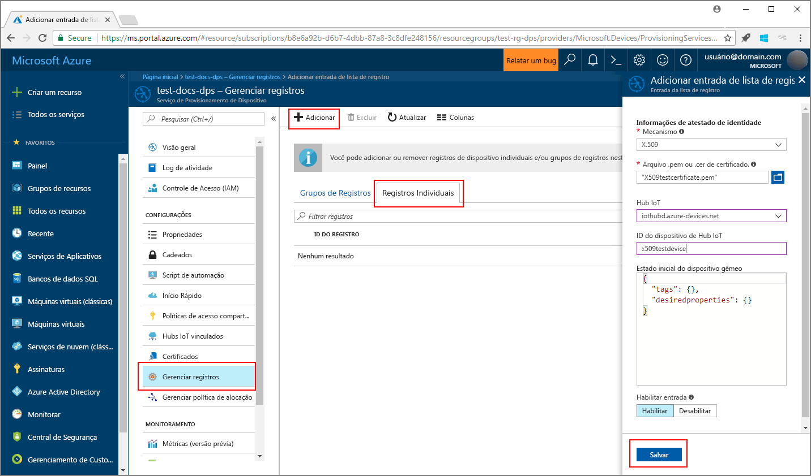
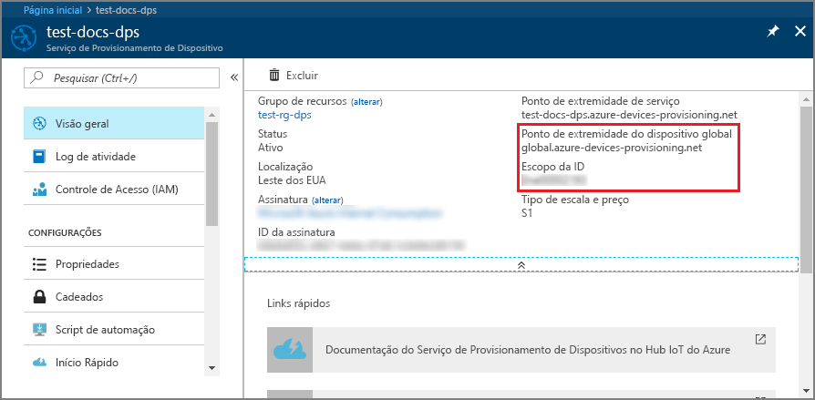
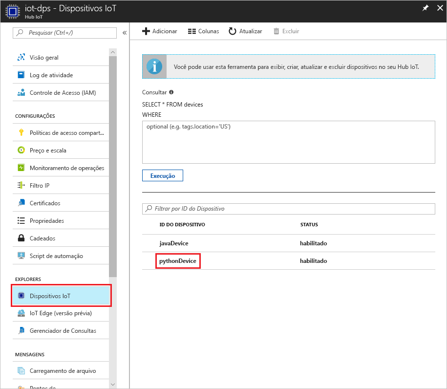

# <a name="create-and-provision-a-simulated-x509-device-using-python-device-sdk-for-iot-hub-device-provisioning-service"></a>Criar e provisionar um dispositivo X.509 simulado usando o SDK do dispositivo Python para o Serviço de Provisionamento do Dispositivo Hub IoT
[!INCLUDE [iot-dps-selector-quick-create-simulated-device-x509](../../includes/iot-dps-selector-quick-create-simulated-device-x509.md)]

Estas etapas mostram como simular um dispositivo X.509 no computador de desenvolvimento que executa o sistema operacional Windows e usam um exemplo de código Python para conectar este dispositivo simulado com o Serviço de Provisionamento do Dispositivo e o Hub IoT. 

Não deixe de concluir as etapas em [Configurar o Serviço de Provisionamento de Dispositivos do Hub IoT com o portal do Azure](./quick-setup-auto-provision.md) antes de continuar.


## <a name="prepare-the-environment"></a>Preparar o ambiente 

1. Verifique se você tem o [Visual Studio 2015](https://www.visualstudio.com/vs/older-downloads/) ou o [Visual Studio 2017](https://www.visualstudio.com/vs/) instalado em seu computador. Você deve ter a carga de trabalho 'Desenvolvimento de área de trabalho com C++' habilitada para sua instalação do Visual Studio.

1. Baixe e instale o [sistema de compilação CMake](https://cmake.org/download/).

1. Verifique se o `git` está instalado em seu computador e é adicionado às variáveis de ambiente que podem ser acessadas pela janela de comando. Confira [ferramentas de cliente Git do Software Freedom Conservancy](https://git-scm.com/download/) para obter a versão mais recente das ferramentas `git` a serem instaladas, que inclui o **Git Bash**, o aplicativo de linha de comando que você pode usar para interagir com seu repositório Git local. 

1. Abra um prompt de comando ou o Bash do Git. Clone o repositório do GitHub para obter um exemplo de código de simulação do dispositivo.
    
    ```cmd/sh
    git clone https://github.com/Azure/azure-iot-sdk-python.git --recursive
    ```

1. Crie uma pasta em sua cópia local do repositório GitHub para o processo de compilação do CMake. 

    ```cmd/sh
    cd azure-iot-sdk-python/c
    mkdir cmake
    cd cmake
    ```

1. Execute o comando a seguir para criar a solução do Visual Studio para o cliente de provisionamento.

    ```cmd/sh
    cmake -Duse_prov_client:BOOL=ON ..
    ```


## <a name="create-a-device-enrollment-entry"></a>Criar uma entrada de registro de dispositivo

1. Abra a solução gerada na pasta *cmake* denominada `azure_iot_sdks.sln`e compile-a no Visual Studio.

1. Clique com o botão direito do mouse no projeto **dados\_dispositivo\_registro** da pasta **Provision\_Tools** e selecione **Definir como Projeto de Inicialização**. Execute a solução. Na janela de saída, insira `i` para registro individual quando solicitado. A janela de saída exibe um certificado X.509 gerado localmente para seu dispositivo simulado. Copie para a área de transferência a saída que começa em *-----BEGIN CERTIFICATE-----* e termina em *-----END CERTIFICATE-----*, não deixando de incluir ambas essas linhas também. 

    
 
1. Crie um arquivo chamado **_X509testcertificate.pem_** em seu computador Windows, abra-o em um editor de sua escolha e copie o conteúdo da área de transferência para o arquivo. Salve o arquivo. 

1. Faça logon no portal do Azure, clique no botão **Todos os recursos** no menu esquerdo e abra o serviço de provisionamento.

1. Na folha de resumo do Serviço de Provisionamento de Dispositivos, selecione **Gerenciar registros**. Selecione a guia **Registros Individuais** guia e clique no botão **Adicionar** na parte superior. 

1. Em **Adicionar a entrada da lista de registro**, insira as seguintes informações:
    - Selecione **X.509** como o *Mecanismo* de atestado de identidade.
    - No *arquivo .pem ou .cer do certificado*, selecione o arquivo de certificado **_X509testcertificate.pem_** criado nas etapas anteriores usando o widget *Explorador de Arquivos*.
    - Opcionalmente, você pode fornecer as seguintes informações:
        - Selecione um hub IoT vinculado com o serviço de provisionamento.
        - Insira uma ID de dispositivo exclusiva. Evite dados confidenciais ao nomear seu dispositivo. 
        - Atualize o **Estado inicial do dispositivo gêmeo** com a configuração inicial desejada para o dispositivo.
    - Uma vez concluído, clique no botão **Salvar**. 

      

   No registro bem-sucedido, o dispositivo X.509 é exibido como **riot-device-cert** na coluna *ID do Registro* na guia o *Registros Individuais*. 


## <a name="simulate-the-device"></a>Simular o dispositivo

1. Na folha de resumo do Serviço de Provisionamento de Dispositivos, selecione **Visão geral**. Tome nota do _Escopo da ID_ e do _Ponto de Extremidade de Serviço Global_.

    

1. Baixe e instale o [Python 2.x ou 3.x](https://www.python.org/downloads/). Certifique-se de usar a instalação de 32 bits ou 64 bits conforme exigido pelo seu programa de instalação. Quando solicitado durante a instalação, certifique-se de adicionar Python às variáveis de ambiente específica da plataforma. Se você estiver usando o Python 2.x, talvez seja necessário [instalar ou atualizar o *pip*, o sistema de gerenciamento de pacotes do Python](https://pip.pypa.io/en/stable/installing/).
    - Se você está usando o sistema operacional Windows, o [Pacote redistribuível do Visual C++](http://www.microsoft.com/download/confirmation.aspx?id=48145) permite o uso de DLLs nativas do Python.

1. Execute [estas instruções](https://github.com/Azure/azure-iot-sdk-python/blob/master/doc/python-devbox-setup.md) para compilar os pacotes do Python.

    > [!NOTE]
        > Se usar `pip`, certifique-se de também instalar o pacote `azure-iot-provisioning-device-client`.

1. Navegue até a pasta de amostras.

    ```cmd/sh
    cd azure-iot-sdk-python/provisioning_device_client/samples
    ```

1. Usando o IDE do Python, edite o script python chamado **provisionamento\_dispositivo\_cliente\_sample.py**. Modifique as variáveis _GLOBAL\_PROV\_URI_ e _ID\_SCOPE_ para os valores observados anteriormente.

    ```python
    GLOBAL_PROV_URI = "{globalServiceEndpoint}"
    ID_SCOPE = "{idScope}"
    SECURITY_DEVICE_TYPE = ProvisioningSecurityDeviceType.X509
    PROTOCOL = ProvisioningTransportProvider.HTTP
    ```

1. Execute o exemplo. 

    ```cmd/sh
    python provisioning_device_client_sample.py
    ```

1. O aplicativo se conectará, registrará o dispositivo e exibirá uma mensagem de registro bem-sucedido.

    

1. No portal, navegue até o hub IoT vinculado ao seu serviço de provisionamento e abra a folha **Device Explorer**. No provisionamento bem-sucedido do dispositivo X.509 simulado para o hub, sua ID de dispositivo aparecerá na folha **Device Explorer** com o *STATUS* **habilitado**. Talvez seja necessário clicar no botão **Atualizar** na parte superior, se você já tiver aberto a folha antes de executar o aplicativo de dispositivo de exemplo. 

     

> [!NOTE]
> Se você tiver alterado o *estado de dispositivo gêmeo inicial* do valor padrão na entrada de registro para o seu dispositivo, pode receber o estado desejado duas do hub e agir de acordo. Para saber mais, veja [Noções básicas e uso de dispositivos gêmeos no Hub IoT](../iot-hub/iot-hub-devguide-device-twins.md).
>


## <a name="clean-up-resources"></a>Limpar recursos

Se você planeja continuar a trabalhar e explorar o dispositivo cliente de exemplo, não limpe os recursos criados neste Guia de Início Rápido. Caso contrário, use as etapas a seguir para excluir todos os recursos criados por este Guia de Início Rápido.

1. Feche a janela de saída de exemplo de dispositivo cliente em seu computador.
1. No menu à esquerda no Portal do Azure, clique em **Todos os recursos** e selecione o serviço de Provisionamento de Dispositivos. Abra a folha **Gerenciar Registros** de seu serviço e clique na guia **Registros Individuais**. Selecione *ID de REGISTRO* do dispositivo descrito no Guia de Início Rápido e clique no botão **Excluir** na parte superior. 
1. No menu à esquerda no Portal do Azure, clique em **Todos os recursos** e selecione seu Hub IoT. Abra a folha **Dispositivos IoT** do hub, selecione *DEVICE ID* registrado nesse Guia de Início Rápido, e clique no botão **Excluir** na parte superior.

## <a name="next-steps"></a>Próximas etapas

Neste Guia de Início Rápido, você criou um dispositivo simulado X.509 no seu computador Windows e o provisionou no Hub IoT usando o Serviço de Provisionamento de Dispositivos do Hub IoT do Azure no portal. Para saber como registrar seu dispositivo X.509 programaticamente, continue com o Guia de Início Rápido para registro programático de dispositivos X.509. 

> [!div class="nextstepaction"]
> [Guia de Início Rápido do Azure – Registre dispositivos X.509 no Serviço de Provisionamento de Dispositivos do Hub IoT do Azure](quick-enroll-device-x509-java.md)
