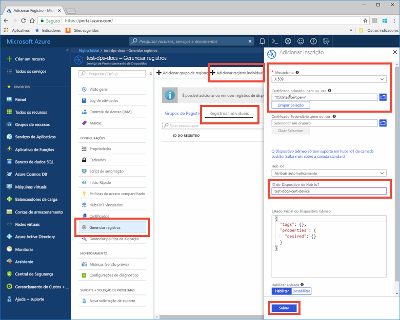

# <a name="quickstart-provision-an-x509-simulated-device-using-the-azure-iot-c-sdk"></a>Início Rápido: Provisionar um dispositivo X.509 simulado usando o SDK de C do IoT do Azure

[!INCLUDE [iot-dps-selector-quick-create-simulated-device-x509](../../includes/iot-dps-selector-quick-create-simulated-device-x509.md)]

Neste início rápido, você aprenderá a criar e executar um simulador de dispositivo X.509 em uma máquina de desenvolvimento Windows. Você configurará o dispositivo simulado para ser atribuído a um hub IoT usando um registro em uma instância do Serviço de Provisionamento de Dispositivos. Um código de exemplo do [SDK de C do IoT do Azure](https://github.com/Azure/azure-iot-sdk-c) será usado a fim de simular uma sequência de inicialização para o dispositivo. O dispositivo será reconhecido com base no registro do serviço de provisionamento e atribuído ao hub IoT.

Se você não estiver familiarizado com o processo de provisionamento automático, analise os [Conceitos de provisionamento automático](concepts-auto-provisioning.md). Não se esqueça de concluir as etapas em [Configurar o Serviço de Provisionamento de Dispositivos no Hub IoT com o Portal do Azure](./quick-setup-auto-provision.md) antes de continuar com este início rápido. 

[!INCLUDE [quickstarts-free-trial-note](../../includes/quickstarts-free-trial-note.md)]


## <a name="prerequisites"></a>Pré-requisitos

* Visual Studio 2015 ou [Visual Studio 2017](https://www.visualstudio.com/vs/) com a carga de trabalho ["Desenvolvimento para Desktop com C++"](https://www.visualstudio.com/vs/support/selecting-workloads-visual-studio-2017/) habilitada.
* Versão mais recente do [Git](https://git-scm.com/download/) instalada.


<a id="setupdevbox"></a>

## <a name="prepare-a-development-environment-for-the-azure-iot-c-sdk"></a>Preparar um ambiente de desenvolvimento para o SDK de C do IoT do Azure

Nesta seção, você vai preparar um ambiente de desenvolvimento usado para criar o [SDK de C do IoT do Azure](https://github.com/Azure/azure-iot-sdk-c) que inclui o código de exemplo para a sequência de inicialização do X.509.

1. Baixe a versão mais recente do [sistema de compilação CMake](https://cmake.org/download/). No mesmo site, pesquise o hash criptográfico da versão de distribuição binária que você escolher. Verifique o binário baixado usando o valor de hash criptográfico correspondente. O exemplo a seguir usou o Windows PowerShell para verificar o hash criptográfico da versão 3.11.4 da distribuição MSI x64:

    ```PowerShell
    PS C:\Users\wesmc\Downloads> $hash = get-filehash .\cmake-3.11.4-win64-x64.msi
    PS C:\Users\wesmc\Downloads> $hash.Hash -eq "56e3605b8e49cd446f3487da88fcc38cb9c3e9e99a20f5d4bd63e54b7a35f869"
    True
    ```

    É importante que os pré-requisitos do Visual Studio (Visual Studio e a carga de trabalho de "Desenvolvimento para Desktop com C++") estejam instalados em seu computador, **antes** da instalação de `CMake`. Após a instalação dos pré-requisitos e verificação do download, instale o sistema de compilação CMake.

2. Abra um prompt de comando ou o shell Bash do Git. Execute o seguinte comando para clonar o repositório do GitHub [SDK de C do IoT do Azure](https://github.com/Azure/azure-iot-sdk-c):
    
    ```cmd/sh
    git clone https://github.com/Azure/azure-iot-sdk-c.git --recursive
    ```
    Atualmente, o tamanho desse repositório está em torno de 220 MB. Essa operação deve demorar alguns minutos.


3. Crie um subdiretório `cmake` no diretório raiz do repositório git e navegue até essa pasta. 

    ```cmd/sh
    cd azure-iot-sdk-c
    mkdir cmake
    cd cmake
    ```

4. O exemplo de código usa um certificado X.509 para fornecer comprovação por meio da autenticação X.509. Execute o comando a seguir que cria uma versão do SDK específica para a plataforma cliente de desenvolvimento. Uma solução do Visual Studio para o dispositivo simulado será gerada no diretório `cmake`. 

    ```cmd
    cmake -Duse_prov_client:BOOL=ON ..
    ```
    
    Se `cmake` não encontrar o compilador do C++, você poderá obter erros de build ao executar o comando acima. Se isso acontecer, tente executar esse comando no [prompt de comando do Visual Studio](https://docs.microsoft.com/dotnet/framework/tools/developer-command-prompt-for-vs). 

    Após o sucesso da compilação, as últimas linhas de saída serão semelhantes à seguinte saída:

    ```cmd/sh
    $ cmake -Duse_prov_client:BOOL=ON ..
    -- Building for: Visual Studio 15 2017
    -- Selecting Windows SDK version 10.0.16299.0 to target Windows 10.0.17134.
    -- The C compiler identification is MSVC 19.12.25835.0
    -- The CXX compiler identification is MSVC 19.12.25835.0

    ...

    -- Configuring done
    -- Generating done
    -- Build files have been written to: E:/IoT Testing/azure-iot-sdk-c/cmake
    ```


<a id="portalenroll"></a>

## <a name="create-a-self-signed-x509-device-certificate"></a>Criar um certificado de dispositivo X.509 autoassinado

Nesta seção, você usará um certificado X.509 autoassinado. É importante ter em mente o seguinte:

* Os certificados autoassinados são somente para teste e não devem ser usado na produção.
* A data de validade padrão para um certificado autoassinado é de um ano.

Você usará o código de exemplo do SDK de C do IoT do Azure para criar o certificado a ser usado na entrada de registro individual do dispositivo simulado.

1. Inicie o Visual Studio e abra o arquivo da nova solução chamado `azure_iot_sdks.sln`. Esse arquivo de solução está localizado na pasta `cmake` que você criou anteriormente na raiz do repositório git azure-iot-sdk-c.

2. No menu do Visual Studio, selecione **Compilar** > **Compilar Solução** para compilar todos os projetos na solução.

3. Na janela *Gerenciador de Soluções* do Visual Studio, navegue até a pasta **Provisionar\_Ferramentas**. Clique com o botão direito do mouse no projeto **dice\_device\_enrollment** e selecione **Definir como Projeto de Inicialização**. 

4. No menu do Visual Studio, selecione **Depurar** > **Iniciar sem depuração** para executar a solução. Na janela de saída, insira **i** para registro individual quando solicitado. 

    A janela de saída exibe um certificado X.509 autoassinado gerado localmente para seu dispositivo simulado. Copie a saída para a área de transferência começando em **-----BEGIN CERTIFICATE-----** e terminando no primeiro **-----END CERTIFICATE-----**, não deixando de incluir essas duas linhas também. Observe que você precisa apenas do primeiro certificado da janela de saída.
 
5. Usando um editor de texto, salve o certificado em um novo arquivo chamado **_X509testcert.pem_**. 


## <a name="create-a-device-enrollment-entry-in-the-portal"></a>Criar uma entrada de registro de dispositivo no portal

1. Entre no portal do Azure, clique no botão **Todos os recursos** no menu esquerdo e abra o serviço de Provisionamento de Dispositivos.

2. Selecione a guia **Gerenciar registros** e clique no botão **Adicionar registro individual** na parte superior. 

3. Em **Adicionar registro**, insira as informações a seguir e clique no botão **Salvar**.

    - **Mecanismo:** selecione **X.509** como o *Mecanismo* de atestado de identidade.
    - **Arquivo .pem ou .cer de certificado primário:** clique em **Selecionar um arquivo** para selecionar o arquivo de certificado X509testcert.pem que você criou anteriormente.
    - **ID do dispositivo Hub IoT:** insira **test-docs-cert-device** para dar uma ID ao dispositivo.

    [](./media/quick-create-simulated-device-x509/individual-enrollment.png#lightbox)

    No registro bem-sucedido, o dispositivo X.509 é exibido como **riot-device-cert** na coluna *ID do Registro* na guia o *Registros Individuais*. 


<a id="firstbootsequence"></a>

## <a name="simulate-first-boot-sequence-for-the-device"></a>Simular a primeira sequência de inicialização para o dispositivo

Nesta seção, atualize o código de exemplo para enviar a sequência de inicialização do dispositivo para a instância do Serviço de Provisionamento de Dispositivos. Essa sequência de inicialização fará com que o dispositivo seja reconhecido e atribuído a um hub IoT vinculado à instância do Serviço de Provisionamento de Dispositivo.


1. No portal do Azure, selecione a guia **Visão Geral** de seu serviço de Provisionamento de Dispositivos e anote o valor de **_Escopo da ID_**.

     

2. Na janela *Gerenciador de Soluções* do Visual Studio, navegue até a pasta **Provisionar\_Exemplos**. Expanda o projeto de exemplo chamado **prov\_dev\_client\_sample**. Expanda **Arquivos de Origem** e abra **prov\_dev\_client\_sample.c**.

3. Localize a constante `id_scope` e substitua o valor pelo seu valor de **Escopo de ID** copiado anteriormente. 

    ```c
    static const char* id_scope = "0ne00002193";
    ```

4. Encontre a definição da função `main()` no mesmo arquivo. Verifique se a variável `hsm_type` está definida como `SECURE_DEVICE_TYPE_X509` em vez de `SECURE_DEVICE_TYPE_TPM`, conforme mostrado abaixo.

    ```c
    SECURE_DEVICE_TYPE hsm_type;
    //hsm_type = SECURE_DEVICE_TYPE_TPM;
    hsm_type = SECURE_DEVICE_TYPE_X509;
    ```

5. Clique com botão direito do mouse no projeto **prov\_dev\_client\_sample** e selecione **Definir como Projeto de Inicialização**. 

6. No menu do Visual Studio, selecione **Depurar** > **Iniciar sem depuração** para executar a solução. No prompt para recompilar o projeto, clique em **Sim** para recompilar o projeto antes da execução.

    A saída a seguir é um exemplo da inicialização bem-sucedida do exemplo de cliente de dispositivo provisionamento e da conexão com uma instância do Serviço de Provisionamento de Dispositivos para obter informações do hub IoT e registrá-lo:

    ```cmd
    Provisioning API Version: 1.2.7

    Registering... Press enter key to interrupt.

    Provisioning Status: PROV_DEVICE_REG_STATUS_CONNECTED
    Provisioning Status: PROV_DEVICE_REG_STATUS_ASSIGNING
    Provisioning Status: PROV_DEVICE_REG_STATUS_ASSIGNING

    Registration Information received from service: 
    test-docs-hub.azure-devices.net, deviceId: test-docs-cert-device    
    ```

7. No portal, navegue até o Hub IoT vinculado ao seu serviço de provisionamento e clique na guia **Dispositivos IoT**. No provisionamento bem-sucedido do dispositivo X.509 simulado para o hub, sua ID de dispositivo aparecerá na folha **Dispositivos IoT** com o *STATUS* **habilitado**. Observe que você talvez precise clicar no botão **Refresh** na parte superior. 

     


## <a name="clean-up-resources"></a>Limpar recursos

Se você planeja continuar a trabalhar e explorar o dispositivo cliente de exemplo, não limpe os recursos criados neste Guia de Início Rápido. Caso contrário, use as etapas a seguir para excluir todos os recursos criados por este Guia de Início Rápido.

1. Feche a janela de saída de exemplo de dispositivo cliente em seu computador.
1. No menu à esquerda no Portal do Azure, clique em **Todos os recursos** e selecione o serviço de Provisionamento de Dispositivos. Abra **Gerenciar Registros** de seu serviço e clique na guia **Registros Individuais**. Selecione *ID de REGISTRO* do dispositivo descrito no Guia de Início Rápido e clique no botão **Excluir** na parte superior. 
1. No menu à esquerda no Portal do Azure, clique em **Todos os recursos** e selecione seu Hub IoT. Abra **Dispositivos IoT** do hub, selecione *DEVICE ID* registrado nesse Guia de Início Rápido, e clique no botão **Excluir** na parte superior.

## <a name="next-steps"></a>Próximas etapas

Neste Guia de Início Rápido, você criou um dispositivo simulado X.509 no seu computador Windows e o provisionou no Hub IoT usando o Serviço de Provisionamento de Dispositivos do Hub IoT do Azure no portal. Para saber como registrar seu dispositivo X.509 programaticamente, continue com o Guia de Início Rápido para registro programático de dispositivos X.509. 

> [!div class="nextstepaction"]
> [Guia de Início Rápido do Azure – Registre dispositivos X.509 no Serviço de Provisionamento de Dispositivos do Hub IoT do Azure](quick-enroll-device-x509-java.md)
