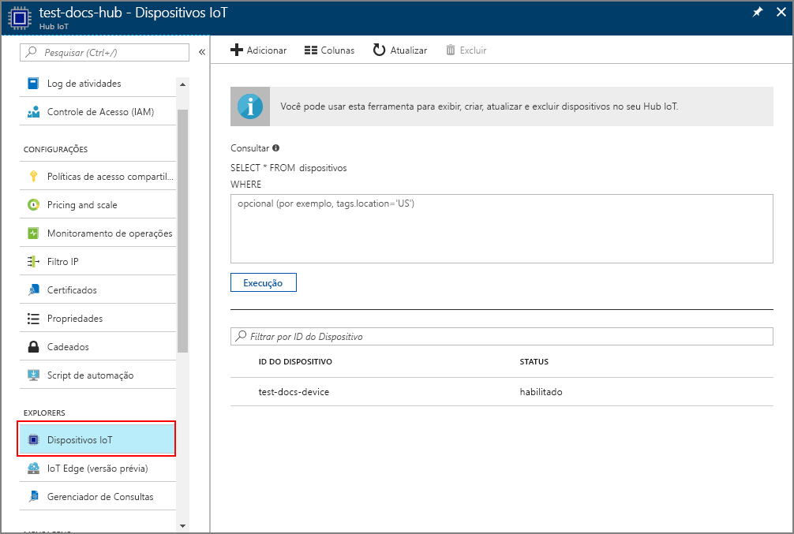

# <a name="create-and-provision-an-x509-simulated-device-using-iot-hub-device-provisioning-service-preview"></a>Criar e provisionar um dispositivo simulado X.509 usando o Serviço de Provisionamento de Dispositivos do Hub IoT (versão prévia)
> [!div class="op_single_selector"]
> * [TPM](quick-create-simulated-device.md)
> * [X.509](quick-create-simulated-device-x509.md)

Estas etapas mostram como simular um dispositivo X.509 no computador de desenvolvimento que executa o sistema operacional Windows e usam um exemplo de código para conectar este dispositivo simulado com o Serviço de Provisionamento do Dispositivo e o hub IoT. 

Não deixe de concluir as etapas em [Configurar o Serviço de Provisionamento de Dispositivos do Hub IoT com o portal do Azure](./quick-setup-auto-provision.md) antes de continuar.

<a id="setupdevbox"></a>
## <a name="prepare-the-development-environment"></a>Preparar o ambiente de desenvolvimento 

1. Verifique se você tem o Visual Studio 2015 ou o [Visual Studio 2017](https://www.visualstudio.com/vs/) instalado em seu computador. Você deve ter a carga de trabalho 'Desenvolvimento de área de trabalho com C++' habilitada para sua instalação do Visual Studio.

2. Baixe e instale o [sistema de compilação CMake](https://cmake.org/download/).

3. Verifique se o `git` está instalado em seu computador e é adicionado às variáveis de ambiente que podem ser acessadas pela janela de comando. Confira [ferramentas de cliente Git do Software Freedom Conservancy](https://git-scm.com/download/) para obter a versão mais recente das ferramentas `git` a serem instaladas, que inclui o **Git Bash**, o aplicativo de linha de comando que você pode usar para interagir com seu repositório Git local. 

4. Abra um prompt de comando ou o Bash do Git. Clone o repositório do GitHub para obter exemplo de código de simulação do dispositivo:
    
    ```cmd/sh
    git clone https://github.com/Azure/azure-iot-sdk-c.git --recursive
    ```

5. Crie uma pasta em sua cópia local do repositório GitHub para o processo de compilação do CMake. 

    ```cmd/sh
    cd azure-iot-sdk-c
    mkdir cmake
    cd cmake
    ```

6. Execute o comando a seguir para criar a solução do Visual Studio para o cliente de provisionamento.

    ```cmd/sh
    cmake -Duse_prov_client:BOOL=ON ..
    ```


## <a name="create-a-device-enrollment-entry-in-the-device-provisioning-service"></a>Criar uma entrada de registro de dispositivo no Serviço de Provisionamento de Dispositivos

1. Abra a solução gerada na pasta *cmake* denominada `azure_iot_sdks.sln`e compile-a no Visual Studio.

2. Clique com o botão direito do mouse no projeto **dice\_device\_enrollment** da pasta **Provision\_Samples** e selecione **Definir como Projeto de Inicialização**. Execute a solução. Na janela de saída, insira `i` para registro individual quando solicitado. A janela de saída exibe um certificado X.509 gerado localmente para seu dispositivo simulado. Copie para a área de transferência a saída que começa em *-----BEGIN CERTIFICATE-----* e termina em *-----END PUBLIC KEY-----*, incluindo ambas as linhas também. 
 
3. Crie um arquivo chamado **_X509testcertificate.pem_** em seu computador Windows, abra-o em um editor de sua escolha e copie o conteúdo da área de transferência para o arquivo. Salve o arquivo. 

4. Faça logon no portal do Azure, clique no botão **Todos os recursos** no menu esquerdo e abra o serviço de provisionamento.

4. Na folha de resumo do Serviço de Provisionamento de Dispositivos, selecione **Gerenciar registros**. Selecione a guia **Registros Individuais** guia e clique no botão **Adicionar** na parte superior. 

5. Em **Adicionar a entrada da lista de registro**, insira as seguintes informações:
    - Selecione **X.509** como o *Mecanismo* de atestado de identidade.
    - No *arquivo .pem ou .cer do certificado*, selecione o arquivo de certificado **_X509testcertificate.pem_** criado nas etapas anteriores usando o widget *Explorador de Arquivos*.
    - Opcionalmente, você pode fornecer as seguintes informações:
        - Selecione um hub IoT vinculado com o serviço de provisionamento.
        - Insira uma ID de dispositivo exclusiva. Evite dados confidenciais ao nomear seu dispositivo. 
        - Atualize o **Estado inicial do dispositivo gêmeo** com a configuração inicial desejada para o dispositivo.
    - Uma vez concluído, clique no botão **Salvar**. 

      

   No registro bem-sucedido, o dispositivo X.509 é exibido como **riot-device-cert** na coluna *ID do Registro* na guia o *Registros Individuais*. 


<a id="firstbootsequence"></a>
## <a name="simulate-first-boot-sequence-for-the-device"></a>Simular a primeira sequência de inicialização para o dispositivo

1. No portal do Azure, selecione a folha **Visão Geral** do seu serviço de Provisionamento de Dispositivos e anote o valor de **_Escopo da ID_**.

     

2. No Visual Studio em seu computador, navegue até o projeto de exemplo chamado **prov\_dev\_client\_sample** na pasta **Provision\_Samples** e abra o arquivo **prov\_dev\_client\_sample.c**.

3. Atribua o valor _ID do Escopo_ à variável `scope_id`. 

    ```c
    static const char* scope_id = "[ID Scope]";
    ```

4. Clique com botão direito do mouse no projeto **prov\_dev\_client\_sample** e selecione **Definir como Projeto de Inicialização**. Execute o exemplo. Observe as mensagens que simulam a inicialização e a conexão do dispositivo com o Serviço de Provisionamento de Dispositivos para obter as informações do Hub IoT. Procure a mensagem indicando o registro bem-sucedido no hub: *Informações de registro recebidas do serviço: yourhuburl!*. Feche a janela quando solicitado.

5. No portal, navegue até o hub IoT vinculado ao seu serviço de provisionamento e abra a folha **Device Explorer**. No provisionamento bem-sucedido do dispositivo X.509 simulado para o hub, sua ID de dispositivo aparecerá na folha **Device Explorer** com o *STATUS* **habilitado**. Observe que talvez você precise clicar no botão **Atualizar** na parte superior, se você já tiver aberto a folha antes de executar o aplicativo de dispositivo de exemplo. 

     

> [!NOTE]
> Se você tiver alterado o *estado de dispositivo gêmeo inicial* do valor padrão na entrada de registro para o seu dispositivo, pode receber o estado desejado duas do hub e agir de acordo. Para saber mais, veja [Noções básicas e uso de dispositivos gêmeos no Hub IoT](../iot-hub/iot-hub-devguide-device-twins.md).
>


## <a name="clean-up-resources"></a>Limpar recursos

Se você planeja continuar a trabalhar e explorar o dispositivo cliente de exemplo, não limpe os recursos criados neste Guia de Início Rápido. Caso contrário, use as etapas a seguir para excluir todos os recursos criados por este Guia de Início Rápido.

1. Feche a janela de saída de exemplo de dispositivo cliente em seu computador.
1. No menu à esquerda no Portal do Azure, clique em **Todos os recursos** e selecione o serviço de Provisionamento de Dispositivos. Na parte superior da folha **Todos os recursos**, clique em **Excluir**.  
1. No menu à esquerda no Portal do Azure, clique em **Todos os recursos** e selecione seu Hub IoT. Na parte superior da folha **Todos os recursos**, clique em **Excluir**.  

## <a name="next-steps"></a>Próximas etapas

Neste Guia de Início Rápido, você criou um dispositivo simulado X.509 no seu computador Windows e o provisionou no Hub IoT usando o Serviço de Provisionamento de Dispositivos do Hub IoT do Azure. Para saber mais sobre os detalhes de configuração do dispositivo, prossiga para o tutorial de configuração do Serviço de Provisionamento de Dispositivos no portal do Azure. 

> [!div class="nextstepaction"]
> [Tutoriais do Serviço de Provisionamento de Dispositivos no Hub IoT do Azure](./tutorial-set-up-cloud.md)
