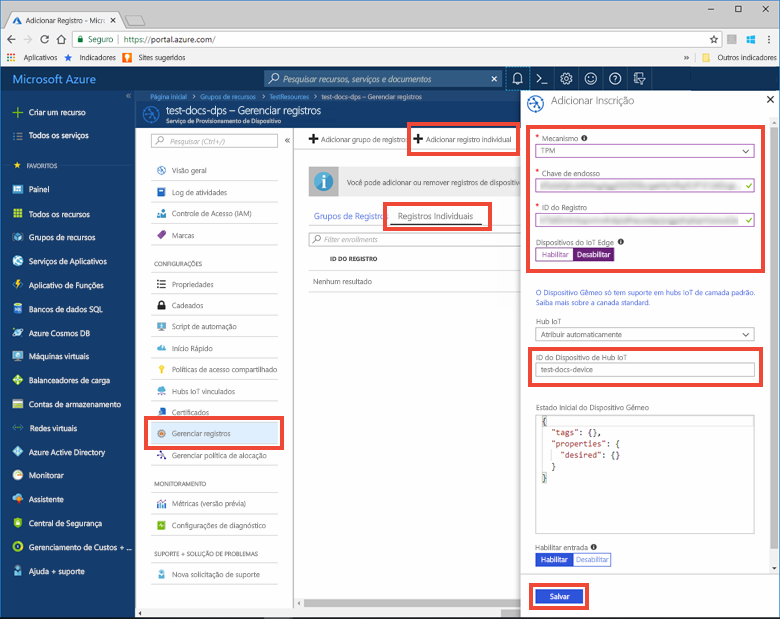
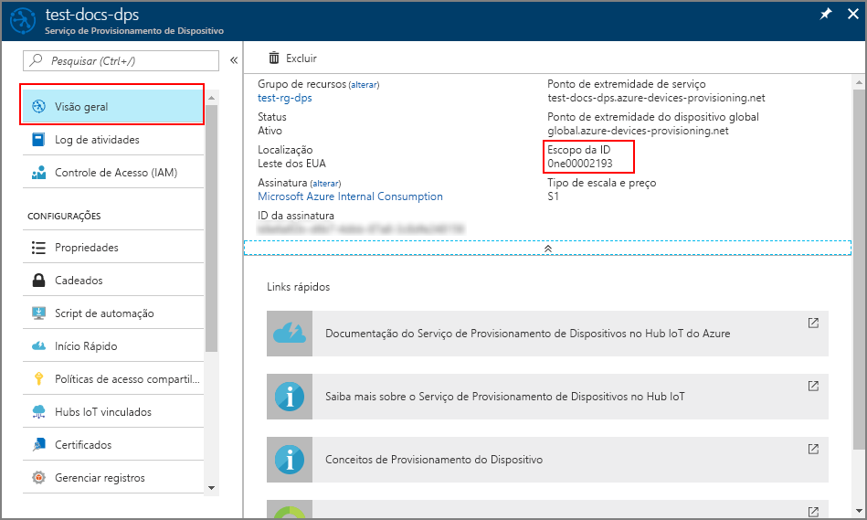

# <a name="create-and-provision-a-simulated-device-using-iot-hub-device-provisioning-service-preview"></a>Criar e provisionar um dispositivo simulado usando o Serviço de Provisionamento de Dispositivos do Hub IoT (versão prévia)

Estas etapas mostram como criar um dispositivo simulado em seu computador de desenvolvimento executando o sistema operacional Windows, executar o simulador do TPM do Windows como [HSM (Módulo de Segurança de Hardware)](https://azure.microsoft.com/blog/azure-iot-supports-new-security-hardware-to-strengthen-iot-security/) do dispositivo e usar o código de exemplo para se conectar a esse dispositivo simulado com o Serviço de Provisionamento de Dispositivos e o Hub IoT. 

Não deixe de concluir as etapas em [Configurar o Serviço de Provisionamento de Dispositivos do Hub IoT com o portal do Azure](./quick-setup-auto-provision.md) antes de continuar.

<a id="setupdevbox"></a>
## <a name="prepare-the-development-environment"></a>Preparar o ambiente de desenvolvimento 

1. Verifique se você tem o Visual Studio 2015 ou o [Visual Studio 2017](https://www.visualstudio.com/vs/) instalado em seu computador. 

2. Baixe e instale o [sistema de compilação CMake](https://cmake.org/download/).

3. Verifique se o `git` está instalado em seu computador e é adicionado às variáveis de ambiente que podem ser acessadas pela janela de comando. Confira [ferramentas de cliente Git do Software Freedom Conservancy](https://git-scm.com/download/) para obter a versão mais recente das ferramentas `git` a serem instaladas, que inclui o **Git Bash**, o aplicativo de linha de comando que você pode usar para interagir com seu repositório Git local. 

4. Abra um prompt de comando ou o Bash do Git. Clone o repositório do GitHub para obter exemplo de código de simulação do dispositivo:
    
    ```cmd/sh
    git clone https://github.com/Azure/azure-iot-sdk-c.git --recursive
    ```

5. Crie uma pasta em sua cópia local do repositório GitHub para o processo de compilação do CMake. 

    ```cmd/sh
    cd azure-iot-sdk-c
    mkdir cmake
    cd cmake
    ```

6. O exemplo de código usa um simulador do TPM do Windows. Execute o comando a seguir para habilitar a autenticação de token SAS. Ele também gera uma solução do Visual Studio para o dispositivo simulado.

    ```cmd/sh
    cmake -Ddps_auth_type=tpm_simulator ..
    ```

7. Em um prompt de comando separado, navegue até a pasta raiz do GitHub e execute o simulador do [TPM](https://docs.microsoft.com/windows/device-security/tpm/trusted-platform-module-overview). Ele escuta em um soquete nas portas 2321 e 2322. Não feche essa janela de comando; você precisará manter esse simulador em execução até o término deste Guia de Início Rápido. 

    ```cmd/sh
    .\azure-iot-sdk-c\dps_client\deps\utpm\tools\tpm_simulator\Simulator.exe
    ```

## <a name="create-a-device-enrollment-entry-in-the-device-provisioning-service"></a>Criar uma entrada de registro de dispositivo no Serviço de Provisionamento de Dispositivos

1. Abra a solução gerada na pasta *cmake* denominada `azure_iot_sdks.sln`e compile-a no Visual Studio.

2. Clique com botão direito do mouse no projeto **tpm_device_provision** e selecione **Definir como Projeto de Inicialização**. Execute a solução. A janela de saída exibe a ** _Chave de Endosso_ ** e a ** _ID de Registro_ ** necessárias para registrar o dispositivo. Anote esses valores. 

3. Faça logon no portal do Azure, clique no botão **Todos os recursos** no menu esquerdo e abra o serviço de Provisionamento de Dispositivos.

4. Na folha de resumo do Serviço de Provisionamento de Dispositivos, selecione **Gerenciar registros**. Selecione a guia **Registros Individuais** guia e clique no botão **Adicionar** na parte superior. 

5. Em **Adicionar a entrada da lista de registro**, insira as seguintes informações:
    - Selecione **TPM** como o atestado de identidade *Mecanismo*.
    - Insira a *ID de Registro* e *Chave de Endosso* para seu dispositivo do TPM. 
    - Selecione um hub IoT vinculado com o serviço de provisionamento.
    - Insira uma ID de dispositivo exclusiva. Evite dados confidenciais ao nomear seu dispositivo.
    - Atualize o **Estado inicial do dispositivo gêmeo** com a configuração inicial desejada para o dispositivo.
    - Uma vez concluído, clique no botão **Salvar**. 

      

   Em caso de registro bem-sucedido, a *ID de Registro* do seu dispositivo será exibida na lista na guia *Registros Individuais*. 


<a id="firstbootsequence"></a>
## <a name="simulate-first-boot-sequence-for-the-device"></a>Simular a primeira sequência de inicialização para o dispositivo

1. No portal do Azure, selecione a folha **Visão Geral** do seu serviço de Provisionamento de Dispositivos e anote os valores de ** _Ponto de extremidade do dispositivo global_ ** e ** _ ID do Escopo_ **.

     

2. No Visual Studio em seu computador, selecione o projeto de exemplo chamado **dps_client_sample** e abra o arquivo **dps_client_sample.c**.

3. Atribua o valor _ID do Escopo_ à variável `dps_scope_id`. Observe que a variável `dps_uri` tem o mesmo valor que o _Ponto de extremidade do dispositivo global_. 

    ```c
    static const char* dps_uri = "global.azure-devices-provisioning.net";
    static const char* dps_scope_id = "[DPS Id Scope]";
    ```

4. Clique com botão direito do mouse no projeto **dps_client_sample** e selecione **Definir como Projeto de Inicialização**. Execute o exemplo. Observe as mensagens que simulam a inicialização e a conexão do dispositivo com o Serviço de Provisionamento de Dispositivos para obter as informações do Hub IoT. Com o êxito no provisionamento do seu dispositivo simulado para o Hub IoT vinculado ao serviço de provisionamento, a ID do dispositivo aparece na folha **Device Explorer** do hub. 

     

    Se você tiver alterado o *estado de dispositivo gêmeo inicial* do valor padrão na entrada de registro para o seu dispositivo, pode receber o estado desejado duas do hub e agir de acordo. Para saber mais, veja [Noções básicas e uso de dispositivos gêmeos no Hub IoT](../iot-hub/iot-hub-devguide-device-twins.md)


## <a name="clean-up-resources"></a>Limpar recursos

Se você planeja continuar a trabalhar e explorar o dispositivo cliente de exemplo, não limpe os recursos criados neste Guia de Início Rápido. Caso contrário, use as etapas a seguir para excluir todos os recursos criados por este Guia de Início Rápido.

1. Feche a janela de saída de exemplo de dispositivo cliente em seu computador.
1. Feche a janela do simulador do TPM no seu computador.
1. No menu à esquerda no portal do Azure, clique em **Todos os recursos** e selecione o serviço de Provisionamento do Dispositivo. Na parte superior da folha **Todos os recursos**, clique em **Excluir**.  
1. No menu à esquerda no Portal do Azure, clique em **Todos os recursos** e selecione seu Hub IoT. Na parte superior da folha **Todos os recursos**, clique em **Excluir**.  

## <a name="next-steps"></a>Próximas etapas

Neste Guia de Início Rápido, você criou um dispositivo simulado do TPM no seu computador e o provisionou no Hub IoT usando o Serviço de Provisionamento de Dispositivos do Hub IoT do Azure. Para saber mais sobre os detalhes de configuração do dispositivo, prossiga para o tutorial de configuração do Serviço de Provisionamento de Dispositivos no portal do Azure. 

> [!div class="nextstepaction"]
> [Tutoriais do Serviço de Provisionamento de Dispositivos no Hub IoT do Azure](./tutorial-set-up-cloud.md)

