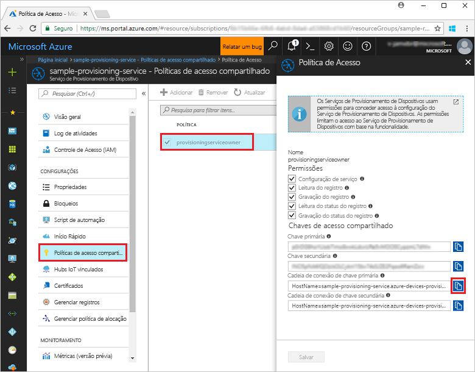
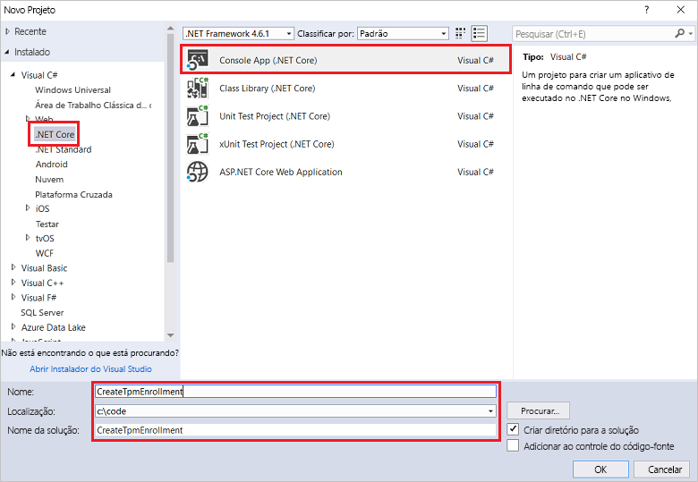
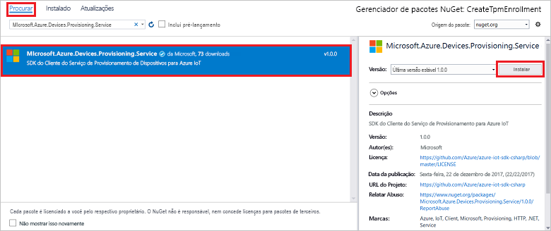
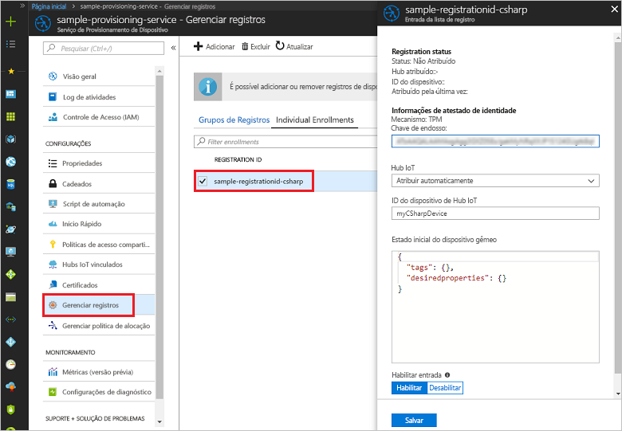

# <a name="enroll-tpm-device-to-iot-hub-device-provisioning-service-using-c-service-sdk"></a>Registrar dispositivo TPM no Serviço de Provisionamento de Dispositivos no Hub IoT usando o SDK do serviço C#
> [!div class="op_single_selector"]
> * [Java](quick-enroll-device-tpm-java.md)
> * [C#](quick-enroll-device-tpm-csharp.md)
> * [Node.js](quick-enroll-device-tpm-node.md)

Estas etapas mostram como criar programaticamente um registro individual de um dispositivo TPM no Serviço de Provisionamento de Dispositivos no Hub IoT do Azure usando o [SDK do Serviço C#](https://github.com/Azure/azure-iot-sdk-csharp) e um aplicativo de exemplo do C# .NET Core. Opcionalmente, é possível registrar um dispositivo TPM simulado no serviço de provisionamento usando esta entrada de registro individual. Embora essas etapas funcionem em computadores Windows e Linux, este artigo usa um computador de desenvolvimento do Windows.

## <a name="prepare-the-development-environment"></a>Preparar o ambiente de desenvolvimento

1. Verifique se você tem o [Visual Studio 2017](https://www.visualstudio.com/vs/) instalado em seu computador. 
2. Verifique se você tem o [SDK do .NET Core](https://www.microsoft.com/net/download/windows) instalado no computador. 
3. Conclua as etapas em [Configurar o Serviço de Provisionamento de Dispositivos do Hub IoT com o portal do Azure](./quick-setup-auto-provision.md) antes de continuar.
4. (Opcional) Se desejar registrar um dispositivo simulado no fim deste Guia de início rápido, siga as etapas em [Criar e provisionar um dispositivo TPM simulado usando o SDK do dispositivo C#](quick-create-simulated-device-tpm-csharp.md) até a etapa em que você obtém uma chave de endosso para o dispositivo. Anote a chave de endosso, a ID de registro e, opcionalmente, a ID do dispositivo, você precisará usá-las mais tarde neste Guia de início rápido. **Não siga as etapas para criar um registro individual usando o portal do Azure.**

## <a name="get-the-connection-string-for-your-provisioning-service"></a>Obter a cadeia de conexão do serviço de provisionamento

Para o exemplo deste Guia de início Rápido, é preciso ter a cadeia de conexão do serviço de provisionamento.
1. Faça logon no portal do Azure, clique no botão **Todos os recursos** no menu esquerdo e abra o Serviço de Provisionamento de Dispositivos. 
2. Clique em **Políticas de acesso compartilhado**, em seguida, clique na política de acesso que deseja usar para abrir suas propriedades. Na janela **Política de Acesso**, copie e anote a cadeia de conexão da chave primária. 

    

## <a name="create-the-individual-enrollment-sample"></a>Criar o exemplo de registro individual 

As etapas nesta seção mostram como criar um aplicativo de console .NET Core que adiciona um registro individual para um dispositivo TPM ao seu serviço de provisionamento. Com algumas modificações, você também pode seguir estas etapas para criar um aplicativo de console do [Windows IoT Core](https://developer.microsoft.com/en-us/windows/iot) para adicionar o registro individual. Para saber mais sobre como desenvolver com o IoT Core, confira a [Documentação do desenvolvedor do Windows IoT Core](https://docs.microsoft.com/en-us/windows/iot-core/).
1. No Visual Studio, adicione um projeto de Aplicativo de Console do Visual C# .NET Core a uma nova solução usando o modelo de projeto **Aplicativo de Console (.NET Core)**. Verifique se a versão do .NET Framework é 4.5.1 ou posterior. Nomeie o projeto como **CreateTpmEnrollment**.

    

2. No Gerenciador de Soluções, clique com o botão direito do mouse no projeto **CreateTpmEnrollment**, em seguida, clique em **Gerenciar Pacotes NuGet**.
3. Na janela **Gerenciador de Pacotes NuGet**, selecione **Procurar**, procure **Microsoft.Azure.Devices.Provisioning.Service**, selecione **Instalar** para instalar o pacote **Microsoft.Azure.Devices.Provisioning.Service** e aceite os termos de uso. Esse procedimento baixa, instala e adiciona uma referência ao pacote NuGet do [SDK do Cliente do Serviço de Provisionamento do IoT do Azure](https://www.nuget.org/packages/Microsoft.Azure.Devices.Provisioning.Service/) e suas dependências.

    

4. Adicione as seguintes instruções `using` após as outras instruções `using` na parte superior do arquivo **Program.cs**:
   
   ```csharp
   using System.Threading.Tasks;
   using Microsoft.Azure.Devices.Provisioning.Service;
   ```
    
5. Adicione os seguintes campos à classe **Program** .  
   - Substitua o valor do espaço reservado **ProvisioningConnectionString** pela cadeia de conexão do serviço de provisionamento para a qual você deseja criar o registro.
   - Outra opção é alterar a ID de registro, a chave de endosso, a ID do dispositivo e o status de provisionamento. 
   - Caso esteja usando este Guia de início rápido junto com o guia [Criar e provisionar um dispositivo TPM simulado usando o SDK do dispositivo C#](quick-create-simulated-device-tpm-csharp.md) para provisionar um dispositivo simulado, substitua a chave de endosso e a ID de registro pelos valores que você anotou no guia anterior. É possível substituir a ID do dispositivo pelo valor sugerido neste Guia de início rápido, para isso, use seu próprio valor ou use o valor padrão deste exemplo.
        
   ```csharp
   private static string ProvisioningConnectionString = "{Your provisioning service connection string}";
   private const string RegistrationId = "sample-registrationid-csharp";
   private const string TpmEndorsementKey =
       "AToAAQALAAMAsgAgg3GXZ0SEs/gakMyNRqXXJP1S124GUgtk8qHaGzMUaaoABgCAAEMAEAgAAAAAAAEAxsj2gUS" +
       "cTk1UjuioeTlfGYZrrimExB+bScH75adUMRIi2UOMxG1kw4y+9RW/IVoMl4e620VxZad0ARX2gUqVjYO7KPVt3d" +
       "yKhZS3dkcvfBisBhP1XH9B33VqHG9SHnbnQXdBUaCgKAfxome8UmBKfe+naTsE5fkvjb/do3/dD6l4sGBwFCnKR" +
       "dln4XpM03zLpoHFao8zOwt8l/uP3qUIxmCYv9A7m69Ms+5/pCkTu/rK4mRDsfhZ0QLfbzVI6zQFOKF/rwsfBtFe" +
       "WlWtcuJMKlXdD8TXWElTzgh7JS4qhFzreL0c1mI0GCj+Aws0usZh7dLIVPnlgZcBhgy1SSDQMQ==";
       
   // Optional parameters
   private const string OptionalDeviceId = "myCSharpDevice";
   private const ProvisioningStatus OptionalProvisioningStatus = ProvisioningStatus.Enabled;
   ```
    
6. Adicione o seguinte método à classe **Programa**.  Esse código cria uma entrada de registro individual e depois chama o método **CreateOrUpdateIndividualEnrollmentAsync** no **ProvisioningServiceClient** para adicionar o registro individual ao serviço de provisionamento.
   
   ```csharp
   public static async Task RunSample()
   {
       Console.WriteLine("Starting sample...");

       using (ProvisioningServiceClient provisioningServiceClient =
               ProvisioningServiceClient.CreateFromConnectionString(ProvisioningConnectionString))
       {
           #region Create a new individualEnrollment config
           Console.WriteLine("\nCreating a new individualEnrollment...");
           Attestation attestation = new TpmAttestation(TpmEndorsementKey);
           IndividualEnrollment individualEnrollment =
                   new IndividualEnrollment(
                           RegistrationId,
                           attestation);

           // The following parameters are optional. Remove them if you don't need them.
           individualEnrollment.DeviceId = OptionalDeviceId;
           individualEnrollment.ProvisioningStatus = OptionalProvisioningStatus;
           #endregion

           #region Create the individualEnrollment
           Console.WriteLine("\nAdding new individualEnrollment...");
           IndividualEnrollment individualEnrollmentResult =
               await provisioningServiceClient.CreateOrUpdateIndividualEnrollmentAsync(individualEnrollment).ConfigureAwait(false);
           Console.WriteLine("\nIndividualEnrollment created with success.");
           Console.WriteLine(individualEnrollmentResult);
           #endregion
        
       }
   }
   ```
       
7. Por fim, substitua o corpo do método **Main** pelas seguintes linhas:
   
   ```csharp
   RunSample().GetAwaiter().GetResult();
   Console.WriteLine("\nHit <Enter> to exit ...");
   Console.ReadLine();
   ```
        
8. Compilar a solução.

## <a name="run-the-individual-enrollment-sample"></a>Executar o exemplo de registro individual
  
1. Execute o exemplo no Visual Studio para criar o registro individual para seu dispositivo TPM.
 
2. Na criação bem-sucedida, a janela de comando exibe as propriedades do novo registro individual.

    

3. Para verificar se o registro individual foi criado, na folha de resumo de Serviço de Provisionamento do Dispositivo no portal do Azure, selecione **Gerenciar registros**, depois selecione a guia **Registros individuais**. Você deve ver uma nova entrada de registro que corresponda à ID de registro usada no exemplo. Clique na entrada para verificar a chave de endosso e outras propriedades da entrada.

    
 
4. (Opcional) Caso esteja seguindo as etapas no Guia de início rápido [Criar e provisionar um dispositivo TPM simulado usando o SDK do dispositivo C#](quick-create-simulated-device-tpm-csharp.md), você pode seguir com as etapas restantes neste guia para registrar seu dispositivo simulado. Certifique-se de ignorar as etapas para criar um registro individual usando o portal do Azure.

## <a name="clean-up-resources"></a>Limpar recursos
Se você planeja explorar o exemplo do serviço C#, não limpe os recursos criados neste Início Rápido. Caso contrário, use as etapas a seguir para excluir todos os recursos criados por este Guia de Início Rápido.

1. Feche a janela de saída de exemplo do C# em seu computador.
2. Navegue até o serviço de provisionamento do dispositivo no Portal do Azure, clique em **Gerenciar registros** e, em seguida, selecione a guia **Registros individuais**. Selecione a *ID de Registro* para a entrada de registro criada usando este Guia de início rápido e clique no botão **Excluir** na parte superior da folha. 
3. Se você seguiu as etapas do Guia de início rápido [Criar e provisionar um dispositivo TPM simulado usando o SDK do dispositivo C#](quick-create-simulated-device-tpm-csharp.md) para criar um dispositivo TPM simulado: 

    1. Feche a janela do simulador de TPM e a janela de saída de exemplo do dispositivo simulado.
    2. No portal do Azure, navegue até o Hub IoT em que o dispositivo foi provisionado. No menu esquerdo em **Gerenciadores**, clique em **Dispositivos IoT**, marque a caixa de seleção ao lado de seu dispositivo e clique em **Excluir** na parte superior da janela.
 
## <a name="next-steps"></a>Próximas etapas
Neste Guia de início rápido, você criou programaticamente uma entrada de registro individual para um dispositivo TPM e, opcionalmente, criou um dispositivo simulado TPM no seu computador e o provisionou no hub IoT usando o Serviço de Provisionamento de Dispositivos do Hub IoT do Azure. Para saber mais sobre os detalhes de configuração do dispositivo, prossiga para o tutorial de configuração do Serviço de Provisionamento de Dispositivos no portal do Azure. 
 
> [!div class="nextstepaction"]
> [Tutoriais do Serviço de Provisionamento de Dispositivos no Hub IoT do Azure](./tutorial-set-up-cloud.md)

