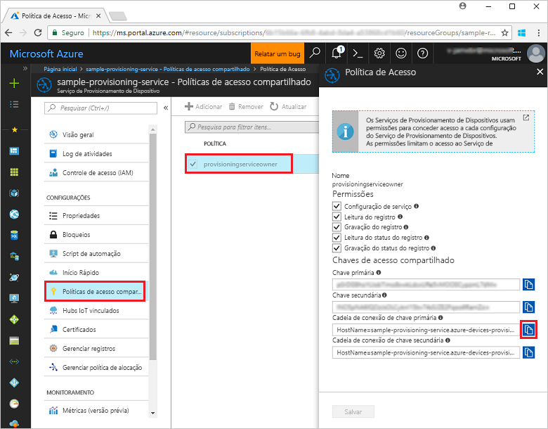
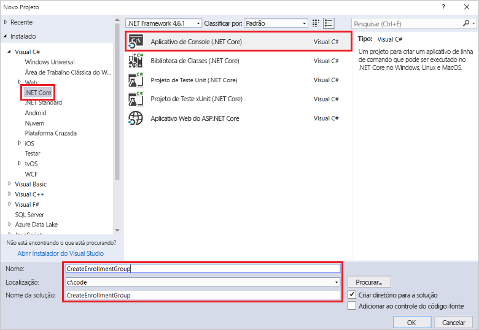
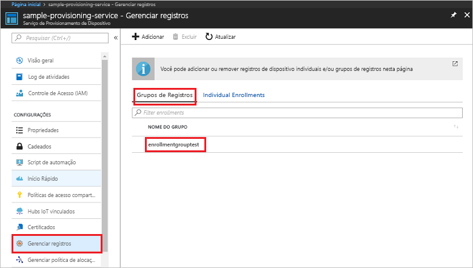

# <a name="enroll-x509-devices-to-iot-hub-device-provisioning-service-using-c-service-sdk"></a>Registrar dispositivos X.509 no Serviço de Provisionamento de Dispositivos no Hub IoT usando o SDK do serviço C#

[!INCLUDE [iot-dps-selector-quick-enroll-device-x509](../../includes/iot-dps-selector-quick-enroll-device-x509.md)]


Essas etapas mostram como criar programaticamente um grupo de registros para um certificado X.509 AC raiz ou intermediário utilizando o [SDK do Serviço C#](https://github.com/Azure/azure-iot-sdk-csharp) e um exemplo de aplicativo C# .NET Core. Um grupo de registros controla o acesso ao serviço de provisionamento para dispositivos que compartilham um certificado de autenticação comum em sua cadeia de certificados. Para saber mais, confira [Como controlar o acesso ao dispositivo para o serviço de provisionamento com certificados X.509](./concepts-security.md#controlling-device-access-to-the-provisioning-service-with-x509-certificates). Para obter mais informações sobre como usar a Infraestrutura de Chave Pública (PKI) do X.509 baseada em certificado com o Hub IoT do Azure e o Serviço de Provisionamento do Dispositivo, confira [Visão geral de segurança do certificado de Autoridade de Certificação do X.509](https://docs.microsoft.com/en-us/azure/iot-hub/iot-hub-x509ca-overview). Embora as etapas deste artigo funcionem em computadores Windows e Linux, este artigo usa um computador de desenvolvimento do Windows.

## <a name="prepare-the-development-environment"></a>Preparar o ambiente de desenvolvimento

1. Verifique se você tem o [Visual Studio 2017](https://www.visualstudio.com/vs/) instalado em seu computador. 
2. Verifique se você tem o [SDK do .NET Core](https://www.microsoft.com/net/download/windows) instalado no computador. 
3. Conclua as etapas em [Configurar o Serviço de Provisionamento de Dispositivos do Hub IoT com o portal do Azure](./quick-setup-auto-provision.md) antes de continuar.
4. Você precisa de um arquivo .pem ou .cer que contenha a parte pública de um certificado de Autoridade de Certificação X.509 intermediário ou raiz que tenha sido carregado e verificado com seu serviço de provisionamento. O [SDK de C do IoT do Azure](https://github.com/Azure/azure-iot-sdk-c) contém ferramentas que podem ajudá-lo a criar uma cadeia de certificados X.509, carregar um certificado raiz ou intermediário a partir dessa cadeia e executar a prova de posse com o serviço para verificar o certificado. Para usar essa ferramenta, baixe o conteúdo da pasta [azure-iot-sdk-c/tools/CACertificates](https://github.com/Azure/azure-iot-sdk-c/tree/master/tools/CACertificates) para uma pasta de trabalho do seu computador e siga as etapas de [azure-iot-sdk-c\tools\CACertificates\CACertificateOverview.md](https://github.com/Azure/azure-iot-sdk-c/blob/master/tools/CACertificates/CACertificateOverview.md). Além disso, para as ferramentas no SDK do C, o [Exemplo de verificação de certificado do grupo](https://github.com/Azure/azure-iot-sdk-csharp/tree/master/provisioning/service/samples/GroupCertificateVerificationSample) no **SDK do Serviço C#** mostra como executar a verificação de posse com um certificado de Autoridade de Certificação X.509 intermediário ou raiz. 

  > [!IMPORTANT]
  > Os certificados criados com as ferramentas do SDK são projetados para uso apenas para desenvolvimento. Para obter informações sobre como obter certificados adequados para o código de produção, confira [Como obter um certificado de Autoridade de Certificação X.509](https://docs.microsoft.com/en-us/azure/iot-hub/iot-hub-x509ca-overview#how-to-get-an-x509-ca-certificate) na documentação do Hub IoT do Azure.

## <a name="get-the-connection-string-for-your-provisioning-service"></a>Obter a cadeia de conexão do serviço de provisionamento

Para o exemplo deste Guia de início rápido, é preciso ter a cadeia de conexão do serviço de provisionamento.
1. Faça logon no portal do Azure, clique no botão **Todos os recursos** no menu esquerdo e abra o Serviço de Provisionamento de Dispositivos. 
2. Clique em **Políticas de acesso compartilhado**, em seguida, clique na política de acesso que deseja usar para abrir suas propriedades. Na janela **Política de Acesso**, copie e anote a cadeia de conexão da chave primária. 

    

## <a name="create-the-enrollment-group-sample"></a>Criar exemplo de grupo de registros 

As etapas nesta seção mostram como criar um aplicativo de console .NET Core que adiciona um grupo de registro ao serviço de provisionamento. Com algumas modificações, você também pode seguir estas etapas para criar um aplicativo de console do [Windows IoT Core](https://developer.microsoft.com/en-us/windows/iot) para adicionar o grupo de registros. Para saber mais sobre como desenvolver com o IoT Core, confira a [Documentação do desenvolvedor do Windows IoT Core](https://docs.microsoft.com/en-us/windows/iot-core/).
1. No Visual Studio, adicione um projeto de Aplicativo de Console do Visual C# .NET Core a uma nova solução usando o modelo de projeto **Aplicativo de Console (.NET Core)**. Verifique se a versão do .NET Framework é 4.5.1 ou posterior. Nomeie o projeto como **CreateEnrollmentGroup**.

    

2. No Gerenciador de Soluções, clique com o botão direito do mouse no projeto **CreateEnrollmentGroup** e clique em **Gerenciar Pacotes NuGet**.
3. Na janela **Gerenciador de Pacotes NuGet**, selecione **Procurar**, procure **Microsoft.Azure.Devices.Provisioning.Service**, selecione **Instalar** para instalar o pacote **Microsoft.Azure.Devices.Provisioning.Service** e aceite os termos de uso. Esse procedimento baixa, instala e adiciona uma referência ao pacote NuGet do [SDK do Cliente do Serviço de Provisionamento do IoT do Azure](https://www.nuget.org/packages/Microsoft.Azure.Devices.Provisioning.Service/) e suas dependências.

    

4. Adicione as seguintes instruções `using` após as outras instruções `using` na parte superior do arquivo **Program.cs**:
   
   ```csharp
   using System.Security.Cryptography.X509Certificates;
   using System.Threading.Tasks;
   using Microsoft.Azure.Devices.Provisioning.Service;
   ```
    
5. Adicione os seguintes campos à classe **Program** .  
   - Substitua o valor do espaço reservado **ProvisioningConnectionString** pela cadeia de conexão do serviço de provisionamento para a qual você deseja criar o registro.
   - Substitua o valor do espaço reservado de **X509RootCertPath** pelo caminho para um arquivo .pem ou .cer que representa a parte pública de um certificado de Autoridade de Certificação X.509 intermediário ou raiz que tenha sido carregado anteriormente e verificado com o serviço de provisionamento.
   - Outra opção é alterar o valor **EnrollmentGroupId**. A cadeia de caracteres pode conter apenas letras minúsculas e hifens. 

   > [!IMPORTANT]
   > No código de produção, esteja ciente das seguintes considerações de segurança:
   >
   > - Codificar a cadeia de conexão para o administrador de serviço de provisionamento é contra as práticas recomendadas de segurança. Em vez disso, a cadeia de conexão deve ser mantida de uma maneira segura, como em um arquivo de configuração seguro ou no registro.
   > - Verifique se você carregou somente a parte pública do certificado de autenticação. Nunca carregue arquivos .pfx (PKCS12) ou .pem que contenham as chaves privadas para o serviço de provisionamento.
        
   ```csharp
   private static string ProvisioningConnectionString = "{Your provisioning service connection string}";
   private static string EnrollmentGroupId = "enrollmentgrouptest";
   private static string X509RootCertPath = @"{Path to a .cer or .pem file for a verified root CA or intermediate CA X.509 certificate}";
   ```
    
6. Adicione o seguinte método à classe **Programa**. Esse código cria uma entrada do grupo de registros e depois chama o método **CreateOrUpdateEnrollmentGroupAsync** no **ProvisioningServiceClient** para adicionar o grupo de registros ao serviço de provisionamento.
   
   ```csharp
   public static async Task RunSample()
   {
       Console.WriteLine("Starting sample...");
 
       using (ProvisioningServiceClient provisioningServiceClient =
               ProvisioningServiceClient.CreateFromConnectionString(ProvisioningConnectionString))
       {
           #region Create a new enrollmentGroup config
           Console.WriteLine("\nCreating a new enrollmentGroup...");
           var certificate = new X509Certificate2(X509RootCertPath);
           Attestation attestation = X509Attestation.CreateFromRootCertificates(certificate);
           EnrollmentGroup enrollmentGroup =
                   new EnrollmentGroup(
                           EnrollmentGroupId,
                           attestation)
                   {
                       ProvisioningStatus = ProvisioningStatus.Enabled
                   };
           Console.WriteLine(enrollmentGroup);
           #endregion
 
           #region Create the enrollmentGroup
           Console.WriteLine("\nAdding new enrollmentGroup...");
           EnrollmentGroup enrollmentGroupResult =
               await provisioningServiceClient.CreateOrUpdateEnrollmentGroupAsync(enrollmentGroup).ConfigureAwait(false);
           Console.WriteLine("\nEnrollmentGroup created with success.");
           Console.WriteLine(enrollmentGroupResult);
           #endregion
 
       }
   }
   ```

7. Por fim, substitua o corpo do método **Main** pelas seguintes linhas:
   
   ```csharp
   RunSample().GetAwaiter().GetResult();
   Console.WriteLine("\nHit <Enter> to exit ...");
   Console.ReadLine();
   ```
        
8. Compilar a solução.

## <a name="run-the-enrollment-group-sample"></a>Executar exemplo de grupo de registros
  
1. Execute o exemplo no Visual Studio para criar o grupo de registros.
 
2. Na criação bem-sucedida, a janela de comando exibe as propriedades do novo grupo de registros.

    

3. Para verificar se o grupo de registros foi criado, na folha de resumo do Serviço de Provisionamento do Dispositivo no portal do Azure, selecione **Gerenciar registros**, depois selecione a guia **Grupos de registros**. Você deve ver uma nova entrada de registro que corresponda à ID de registro usada no exemplo. Clique na entrada para verificar a impressão digital do certificado e outras propriedades da entrada.

    
 
## <a name="clean-up-resources"></a>Limpar recursos
Se você planeja explorar o exemplo do serviço C#, não limpe os recursos criados neste Início Rápido. Caso contrário, use as etapas a seguir para excluir todos os recursos criados por este Guia de Início Rápido.

1. Feche a janela de saída de exemplo do C# em seu computador.
2. Navegue até o Serviço de Provisionamento de Dispositivos no Portal do Azure, clique em **Gerenciar registros** e, em seguida, selecione a guia **Grupos de Registro**. Selecione *ID de Registro* para a entrada de registro criada usando este Início Rápido e clique no botão **Excluir** na parte superior da folha.  
3. No Serviço de Provisionamento de Dispositivos no Portal do Azure, clique em **Certificados**, clique no certificado que você enviou para este Guia de Início Rápido e clique no botão
 **Excluir** na parte superior da janela **Detalhes do Certificado**.  
 
## <a name="next-steps"></a>Próximas etapas
Neste Início Rápido, você criou um grupo de registros para um certificado de Autoridade de Certificação X.509 raiz ou intermediário usando o Serviço de Provisionamento de Dispositivos no Hub IoT do Azure. Para saber mais sobre os detalhes de configuração do dispositivo, prossiga para o tutorial de configuração do Serviço de Provisionamento de Dispositivos no portal do Azure. 
 
> [!div class="nextstepaction"]
> [Tutoriais do Serviço de Provisionamento de Dispositivos no Hub IoT do Azure](./tutorial-set-up-cloud.md)
