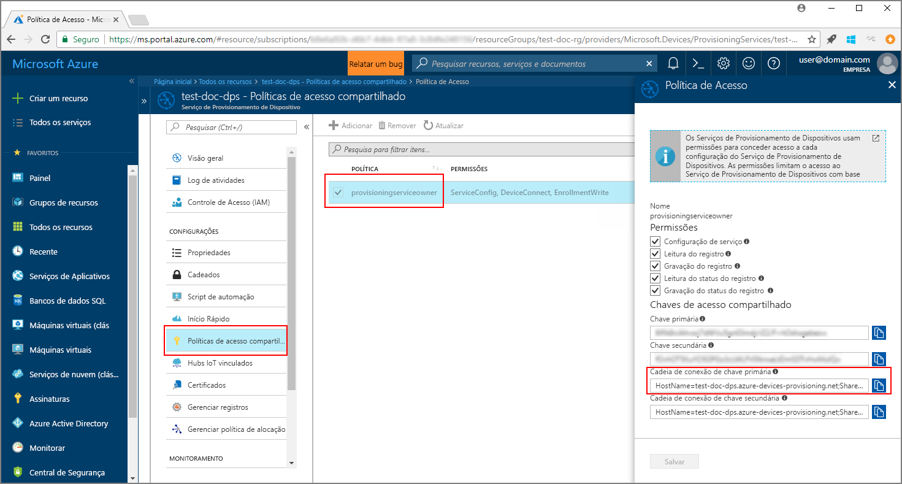
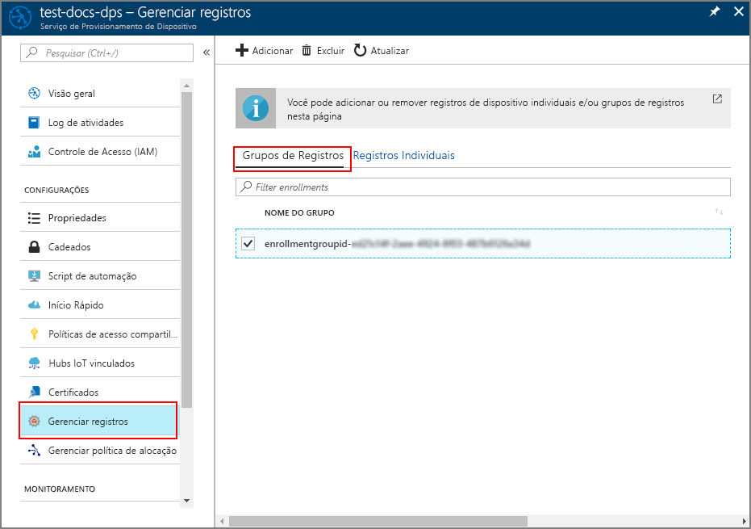

# <a name="enroll-x509-devices-to-iot-hub-device-provisioning-service-using-java-service-sdk"></a>Registrar dispositivos X.509 no Serviço de Provisionamento de Dispositivos do Hub IoT usando o SDK do serviço Java
> [!div class="op_single_selector"]
> * [Java](quick-enroll-device-x509-java.md)
> * [C#](quick-enroll-device-x509-csharp.md)
> * [Node.js](quick-enroll-device-x509-node.md)

Estas etapas mostram como registrar um grupo de dispositivos X.509 simulados programaticamente no Serviço de Provisionamento de Dispositivos do Hub IoT do Azure usando o [SDK do serviço Java](https://azure.github.io/azure-iot-sdk-java/service/) com a ajuda de um aplicativo Java de exemplo. Embora o SDK do serviço Java funcione em computadores Windows e Linux, este artigo usa um computador de desenvolvimento do Windows para percorrer o processo de registro.

Certifique-se de [configurar o Serviço de Provisionamento de Dispositivos do Hub IoT com o Portal do Azure](./quick-setup-auto-provision.md) antes de prosseguir.

<a id="setupdevbox"></a>

## <a name="prepare-the-development-environment"></a>Preparar o ambiente de desenvolvimento 

1. Certifique-se de ter o [Java SE Development Kit 8](http://www.oracle.com/technetwork/java/javase/downloads/jdk8-downloads-2133151.html) instalado no computador. 

2. Configure variáveis de ambiente para a instalação do Java. A variável `PATH` deve incluir o caminho completo para o diretório *jdk1.8.x\bin*. Se for a primeira instalação do Java do seu computador, crie uma nova variável de ambiente chamada `JAVA_HOME` e aponte-a para o caminho completo para o diretório *jdk1.8.x*. No computador Windows, geralmente este diretório está localizado na pasta *C:\\Arquivos de Programas\\Java\\* e é possível criar ou editar variáveis de ambiente pesquisando **Editar as variáveis de ambiente do sistema** no **Painel de Controle** do seu computador Windows. 

  Verifique se o Java foi instalado com sucesso em seu computador executando o seguinte comando na janela de comando:

    ```cmd\sh
    java -version
    ```

3. Baixe e extraia [Maven 3](https://maven.apache.org/download.cgi) em seu computador. 

4. Edite a variável de ambiente `PATH` para apontar para a pasta *apache-maven-3.x.x\\bin* dentro da pasta para a qual o Maven foi extraído. Você pode confirmar que o Maven foi instalado com sucesso executando este comando em sua janela de comando:

    ```cmd\sh
    mvn --version
    ```

5. Verifique se o [git](https://git-scm.com/download/) está instalado em seu computador e se foi adicionado à variável de ambiente `PATH`. 


<a id="javasample"></a>

## <a name="download-and-modify-the-java-sample-code"></a>Baixar e modificar o código de exemplo do Java

Esta seção mostra como adicionar os detalhes de provisionamento do dispositivo X.509 ao código de exemplo. 

1. Abra um prompt de comando. Clone o repositório do GitHub para o exemplo de código de registro do dispositivo usando o SDK do serviço Java:
    
    ```cmd\sh
    git clone https://github.com/Azure/azure-iot-sdk-java.git --recursive
    ```

2. No código-fonte baixado, navegue até a pasta de exemplo **_azure-iot-sdk-java/provisioning/provisioning-samples/service-enrollment-group-sample_**. Abra o arquivo **_/src/main/java/samples/com/microsoft/azure/sdk/iot/ServiceEnrollmentGroupSample.java_** em um editor de sua escolha e adicione os seguintes detalhes:

    1. Adicione o `[Provisioning Connection String]` do serviço de provisionamento do portal desta forma:
        1. Navegue até seu serviço de provisionamento no [Portal do Azure](https://portal.azure.com). 
        2. Abra s **Políticas de acesso compartilhadas** e selecione uma política que tem a permissão *EnrollmentWrite*.
        3. Copie a **Cadeia de conexão da chave primária**. 

              

        4. No arquivo de código de exemplo **_ServiceEnrollmentGroupSample.java_**, substitua o `[Provisioning Connection String]` por uma **cadeia de conexão de chave primária**.

            ```Java
            private static final String PROVISIONING_CONNECTION_STRING = "[Provisioning Connection String]";
            ```

    2. Adicione o certificado raiz do grupo de dispositivos. Se precisar de um certificado raiz de exemplo, use a ferramenta _gerador de certificados X.509_ da seguinte maneira:
        1. Em uma janela de comando, navegue até a pasta **_azure-iot-sdk-java/provisioning/provisioning-tools/provisioning-x509-cert-generator_**.
        2. Crie a ferramenta executando o seguinte comando:

                ```cmd\sh
                mvn clean install
                ```

        4. Execute a ferramenta usando os seguintes comandos:

                ```cmd\sh
                cd target
                java -jar ./provisioning-x509-cert-generator-{version}-with-deps.jar
                ```

        5. Quando solicitado, insira opcionalmente um _Nome Comum_ para seus certificados.
        6. A ferramenta gera localmente um **Certificado de Cliente**, a **Chave privada do certificado de cliente** e o **Certificado raiz**.
        7. Copie o **Certificado raiz**, incluindo as linhas **_-----INICIAR CERTIFICADO-----_** e **_-----ENCERRAR CERTIFICADO-----_**. 
        8. Atribua o valor do **Certificado raiz** ao parâmetro **PUBLIC_KEY_CERTIFICATE_STRING** conforme mostrado abaixo:

                ```Java
                private static final String PUBLIC_KEY_CERTIFICATE_STRING =
                        "-----BEGIN CERTIFICATE-----\n" +
                        "XXXXXXXXXXXXXXXXXXXXXXXXXXXXXXXXXXXXXXXXXXXXXXXXXXXXXXXXXXXXXXXX\n" +
                        "XXXXXXXXXXXXXXXXXXXXXXXXXXXXXXXXXXXXXXXXXXXXXXXXXXXXXXXXXXXXXXXX\n" +
                        "XXXXXXXXXXXXXXXXXXXXXXXXXXXXXXXXXXXXXXXXXXXXXXXXXXXXXXXXXXXXXXXX\n" +
                        "XXXXXXXXXXXXXXXXXXXXXXXXXXXXXXXXXXXXXXXXXXXXXXXXXXXXXXXXXXXXXXXX\n" +
                        "XXXXXXXXXXXXXXXXXXXXXXXXXXXXXXXXXXXXXXXXXXXXXXXXXXXXXXXXXXXXXXXX\n" +
                        "XXXXXXXXXXXXXXXXXXXXXXXXXXXXXXXXXXXXXXXXXXXXXXXXXXXXXXXXXXXXXXXX\n" +
                        "XXXXXXXXXXXXXXXXXXXXXXXXXXXXXXXXXXXXXXXXXXXXXXXXXXXXXXXXXXXXXXXX\n" +
                        "XXXXXXXXXXXXXXXXXXXXXXXXXXXXXXXXXXXXXXXXXXXXXXXXXXXXXXXXXXXXXXXX\n" +
                        "XXXXXXXXXXXXXXXXXXXXXXXXXXXXXXXXXXXXXXXXXXXXXXXXXXXXXXXXXXXXXXXX\n" +
                        "XXXXXXXXXXXXXXXXXXXXXXXXXXXXXXXXXXXXXXXXXXXXXXXXXXXXXXXXXXXXXXXX\n" +
                        "-----END CERTIFICATE-----\n";
                ```

        9. Feche a janela de comando ou insira **n** quando solicitado para *Código de verificação*. 
 
    3. Opcionalmente, você pode configurar seu serviço de provisionamento por meio do código de exemplo:
        - Para adicionar essa configuração ao exemplo, siga estas etapas:
            1. Navegue até o hub IoT vinculado ao serviço de provisionamento no [Portal do Azure](https://portal.azure.com). Abra a guia **Visão geral** do hub e copie o **Nome do host**. Atribua este **Nome do host** ao parâmetro *IOTHUB_HOST_NAME*.

                ```Java
                private static final String IOTHUB_HOST_NAME = "[Host name].azure-devices.net";
                ```
            2. Atribua um nome amigável ao parâmetro *DEVICE_ID* e mantenha o *PROVISIONING_STATUS* como o valor padrão *ENABLED*. 

        - OU, se você optar por não configurar o serviço de provisionamento, certifique-se de comentar ou excluir as seguintes instruções no arquivo _ServiceEnrollmentGroupSample.java_:

            ```Java
            enrollmentGroup.setIotHubHostName(IOTHUB_HOST_NAME);                // Optional parameter.
            enrollmentGroup.setProvisioningStatus(ProvisioningStatus.ENABLED);  // Optional parameter.
            ```

    4. Estude o exemplo de código. Ele cria, atualiza, consulta e exclui um registro de grupo de dispositivos X.509. Para verificar o registro bem-sucedido no portal, comente temporariamente as seguintes linhas de código no fim do arquivo _ServiceEnrollmentGroupSample.java_:

        ```Java
        // ************************************** Delete info of enrollmentGroup ***************************************
        System.out.println("\nDelete the enrollmentGroup...");
        provisioningServiceClient.deleteEnrollmentGroup(enrollmentGroupId);
        ```

    5. Salve o arquivo _ServiceEnrollmentGroupSample.java_. 
 

<a id="runjavasample"></a>

## <a name="build-and-run-sample-group-enrollment"></a>Compilar e executar o registro do grupo de exemplo

1. Abra uma janela de comando e navegue até a pasta **_azure-iot-sdk-java/provisioning/provisioning-samples/service-enrollment-group-sample_**.

2. Compile o código de exemplo usando este comando:

    ```cmd\sh
    mvn install -DskipTests
    ```

   Esse comando baixa o pacote do Maven [`com.microsoft.azure.sdk.iot.provisioning.service`](https://www.mvnrepository.com/artifact/com.microsoft.azure.sdk.iot.provisioning/provisioning-service-client) para o seu computador. Esse pacote inclui os binários do SDK do serviço Java, de que o código de exemplo precisa para compilar. Se você executou a ferramenta _gerador do certificado X.509_ na seção anterior, este pacote já será baixado em seu computador. 

3. Execute o exemplo usando estes comandos na janela de comando:

    ```cmd\sh
    cd target
    java -jar ./service-enrollment-group-sample-{version}-with-deps.jar
    ```

4. Observe se o registro foi bem-sucedido na janela de saída.

5. Navegue até seu serviço de provisionamento no Portal do Azure. Clique em **Gerenciar registros**. Observe que o grupo de dispositivos X.509 é exibido na guia **Grupos de registro**, com um *NOME DE GRUPO* gerado automaticamente. 

      

## <a name="modifications-to-enroll-a-single-x509-device"></a>Modificações para registrar um único dispositivo X.509

Para registrar um único dispositivo X.509, modifique o código de exemplo do *registro individual* usado no [Registrar dispositivo TPM no Serviço de Provisionamento de Dispositivos do Hub IoT usando o SDK do serviço Java](quick-enroll-device-tpm-java.md#javasample) da seguinte maneira:

1. Copie o *Nome comum* do seu certificado de cliente X.509 para a área de transferência. Se desejar usar a ferramenta _gerador de certificado X.509_ conforme mostrado na [seção de código de exemplo anterior](#javasample), insira um _Nome comum_ para seu certificado ou use o **microsoftriotcore** padrão. Use este **Nome comum** como o valor da variável *REGISTRATION_ID*. 

    ```Java
    // Use common name of your X.509 client certificate
    private static final String REGISTRATION_ID = "[RegistrationId]";
    ```

2. Renomeie a variável *TPM_ENDORSEMENT_KEY* como *PUBLIC_KEY_CERTIFICATE_STRING*. Copie seu certificado do cliente ou o **Certificado do cliente** da saída da ferramenta do _gerador de certificado X.509_, como o valor da variável *PUBLIC_KEY_CERTIFICATE_STRING*. 

    ```Java
    // Rename the variable *TPM_ENDORSEMENT_KEY* as *PUBLIC_KEY_CERTIFICATE_STRING*
    private static final String PUBLIC_KEY_CERTIFICATE_STRING =
            "-----BEGIN CERTIFICATE-----\n" +
            "XXXXXXXXXXXXXXXXXXXXXXXXXXXXXXXXXXXXXXXXXXXXXXXXXXXXXXXXXXXXXXXX\n" +
            "XXXXXXXXXXXXXXXXXXXXXXXXXXXXXXXXXXXXXXXXXXXXXXXXXXXXXXXXXXXXXXXX\n" +
            "XXXXXXXXXXXXXXXXXXXXXXXXXXXXXXXXXXXXXXXXXXXXXXXXXXXXXXXXXXXXXXXX\n" +
            "XXXXXXXXXXXXXXXXXXXXXXXXXXXXXXXXXXXXXXXXXXXXXXXXXXXXXXXXXXXXXXXX\n" +
            "XXXXXXXXXXXXXXXXXXXXXXXXXXXXXXXXXXXXXXXXXXXXXXXXXXXXXXXXXXXXXXXX\n" +
            "XXXXXXXXXXXXXXXXXXXXXXXXXXXXXXXXXXXXXXXXXXXXXXXXXXXXXXXXXXXXXXXX\n" +
            "XXXXXXXXXXXXXXXXXXXXXXXXXXXXXXXXXXXXXXXXXXXXXXXXXXXXXXXXXXXXXXXX\n" +
            "XXXXXXXXXXXXXXXXXXXXXXXXXXXXXXXXXXXXXXXXXXXXXXXXXXXXXXXXXXXXXXXX\n" +
            "XXXXXXXXXXXXXXXXXXXXXXXXXXXXXXXXXXXXXXXXXXXXXXXXXXXXXXXXXXXXXXXX\n" +
            "XXXXXXXXXXXXXXXXXXXXXXXXXXXXXXXXXXXXXXXXXXXXXXXXXXXXXXXXXXXXXXXX\n" +
            "-----END CERTIFICATE-----\n";
    ```
3. Na função **principal**, substitua a linha `Attestation attestation = new TpmAttestation(TPM_ENDORSEMENT_KEY);` pelo seguinte para usar o certificado do cliente X.509:
    ```Java
    Attestation attestation = X509Attestation.createFromClientCertificates(PUBLIC_KEY_CERTIFICATE_STRING);
    ```

4. Salve, compile e execute o arquivo de exemplo de *registro individual* usando as etapas na seção [Compilar e executar o código de exemplo para registro individual](quick-enroll-device-tpm-java.md#runjavasample).


## <a name="clean-up-resources"></a>Limpar recursos
Se você planeja explorar o exemplo do serviço Java, não limpe os recursos criados neste guia de início rápido. Caso contrário, use as etapas a seguir para excluir todos os recursos criados por este Guia de Início Rápido.

1. Feche a janela de saída de exemplo do Java no computador.
1. Feche a janela _Gerador de Certificado X509_ em seu computador.
1. Navegue até seu serviço de Provisionamento de Dispositivos no Portal do Azure, clique em **Gerenciar registros** e, sem seguida, selecione a guia **Grupos de registro**. Selecione o *NOME DO GRUPO* para os dispositivos X.509 registrados usando este Guia de Início Rápido e clique no botão **Excluir** na parte superior da folha.  

## <a name="next-steps"></a>Próximas etapas
Neste guia de início rápido, você registrou um grupo simulado de dispositivos X.509 para seu serviço de provisionamento de dispositivos. Para saber mais sobre os detalhes de configuração do dispositivo, prossiga para o tutorial de configuração do Serviço de Provisionamento de Dispositivos no portal do Azure. 

> [!div class="nextstepaction"]
> [Tutoriais do Serviço de Provisionamento de Dispositivos no Hub IoT do Azure](./tutorial-set-up-cloud.md)
