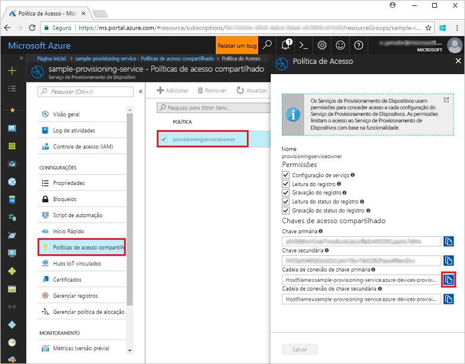
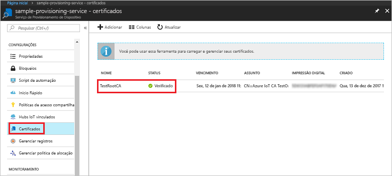
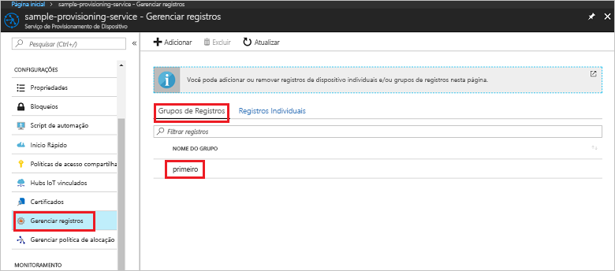

# <a name="enroll-x509-devices-to-iot-hub-device-provisioning-service-using-nodejs-service-sdk"></a>Registrar dispositivos X.509 no Serviço de Provisionamento de Dispositivos do Hub IoT usando o SDK do serviço Node.js

[!INCLUDE [iot-dps-selector-quick-enroll-device-x509](../../includes/iot-dps-selector-quick-enroll-device-x509.md)]


Essas etapas mostram como criar programaticamente um grupo de registros para um certificado X.509 AC raiz ou intermediário utilizando o [SDK do Serviço Node.js](https://github.com/Azure/azure-iot-sdk-node) e um exemplo de Node.js. Embora essas etapas funcionem em computadores Windows e Linux, este artigo usa um computador de desenvolvimento do Windows.
 

## <a name="prerequisites"></a>pré-requisitos

- Conclua as etapas em [Configurar o Serviço de Provisionamento de Dispositivos Hub IoT com o portal do Azure](./quick-setup-auto-provision.md). 

 
- Verifique se o [Node.js v4.0 ou superior](https://nodejs.org) está instalado no computador.


- Você precisa de um arquivo .pem que contenha um certificado X.509 AC raiz ou intermediário que tenha sido carregado e verificado com seu serviço de provisionamento. O **SDK do dispositivo IoT do Azure** contém ferramentas que podem ajudá-lo a criar uma cadeia de certificados X.509, fazer o upload de um certificado raiz ou intermediário dessa cadeia e executar a prova de posse com o serviço para verificar o certificado. Para usar essa ferramenta, clone o [SDK do dispositivo IoT do Azure](https://github.com/Azure/azure-iot-sdk-c) e siga as etapas em [azure-iot-sdk-c\tools\CACertificates\CACertificateOverview.md](https://github.com/Azure/azure-iot-sdk-c/blob/master/tools/CACertificates/CACertificateOverview.md) em seu computador.

## <a name="create-the-enrollment-group-sample"></a>Criar exemplo de grupo de registros 

 
1. Em uma janela de comando na sua pasta de trabalho, execute:
  
     ```cmd\sh
     npm install azure-iot-provisioning-service
     ```  

2. Usando um editor de texto, crie um arquivo **create_enrollment_group.js** em sua pasta de trabalho. Adicione o seguinte código ao arquivo e salve:

    ```
    'use strict';
    var fs = require('fs');

    var provisioningServiceClient = require('azure-iot-provisioning-service').ProvisioningServiceClient;

    var serviceClient = provisioningServiceClient.fromConnectionString(process.argv[2]);

    var enrollment = {
      enrollmentGroupId: 'first',
      attestation: {
        type: 'x509',
        x509: {
          signingCertificates: {
            primary: {
              certificate: fs.readFileSync(process.argv[3], 'utf-8').toString()
            }
          }
        }
      },
      provisioningStatus: 'disabled'
    };

    serviceClient.createOrUpdateEnrollmentGroup(enrollment, function(err, enrollmentResponse) {
      if (err) {
        console.log('error creating the group enrollment: ' + err);
      } else {
        console.log("enrollment record returned: " + JSON.stringify(enrollmentResponse, null, 2));
        enrollmentResponse.provisioningStatus = 'enabled';
        serviceClient.createOrUpdateEnrollmentGroup(enrollmentResponse, function(err, enrollmentResponse) {
          if (err) {
            console.log('error updating the group enrollment: ' + err);
          } else {
            console.log("updated enrollment record returned: " + JSON.stringify(enrollmentResponse, null, 2));
          }
        });
      }
    });
    ````

## <a name="run-the-enrollment-group-sample"></a>Executar exemplo de grupo de registros
 
1. Para executar o exemplo, é necessário a cadeia de conexão com o serviço de provisionamento. 
    1. Faça logon no Portal do Azure, clique no botão **Todos os recursos** no menu esquerdo e abra o Serviço de Provisionamento de Dispositivos. 
    2. Clique em **Políticas de acesso compartilhado**, em seguida, clique na política de acesso que deseja usar para abrir suas propriedades. Na janela **Política de Acesso**, copie e anote a cadeia de conexão da chave primária. 

     


3. Como informado em [Pré-requisitos](#prerequisites), você também precisa de um arquivo .pem que contenha um certificado X.509  AC raiz ou intermediário, carregado e verificado anteriormente com seu serviço de provisionamento. Para verificar se o seu certificado foi carregado e verificado, na página de resumo do Serviço de Provisionamento de Dispositivos no portal Azure, clique em **Certificados**. Encontre o certificado que deseja usar para registro do grupo e veja se o valor do status é *verificado*.

     

1. Para criar um grupo de registros para o seu certificado, execute o seguinte comando (inclua aspas nos argumentos do comando):
 
     ```cmd\sh
     node create_enrollment_group.js "<the connection string for your provisioning service>" "<your certificate's .pem file>"
     ```
 
3. Na criação bem-sucedida, a janela de comando exibe as propriedades do novo grupo de registros.

     

4. Verifique se o grupo de registros foi criado. No Portal do Azure, na folha de resumo do Serviço de Provisionamento de Dispositivos, selecione **Gerenciar registros**. Selecione a guia **Grupos de Inscrição** e verifique se a nova entrada de registro (*primeira*) está presente.

     
 
## <a name="clean-up-resources"></a>Limpar recursos
Se você planeja explorar exemplos do serviço Node.js, não limpe os recursos criados neste Guia de início rápido. Caso contrário, use as etapas a seguir para excluir todos os recursos do Azure criados por este Guia de Início Rápido.
 
1. Feche a janela de saída de exemplo do Node.js no computador.
2. Navegue até o Serviço de Provisionamento de Dispositivos no Portal do Azure, clique em **Gerenciar registros** e, em seguida, selecione a guia **Grupos de Registro**. Selecione *ID de Registro* para a entrada de registro criada usando este Início Rápido e clique no botão **Excluir** na parte superior da folha.  
3. No Serviço de Provisionamento de Dispositivos no Portal do Azure, clique em **Certificados**, clique no certificado que você enviou para este Guia de Início Rápido e clique no botão
 **Excluir** na parte superior da janela **Detalhes do Certificado**.  
 
## <a name="next-steps"></a>Próximas etapas
Neste Guia de Início Rápido, você criou um registro de grupo para um certificado X.509 AC raiz ou intermediário usando o Serviço de Provisionamento de Dispositivos Hub IoT do Azure. Para saber mais sobre os detalhes de configuração do dispositivo, prossiga para o tutorial de configuração do Serviço de Provisionamento de Dispositivos no portal do Azure. 
 
> [!div class="nextstepaction"]
> [Tutoriais do Serviço de Provisionamento de Dispositivos no Hub IoT do Azure](./tutorial-set-up-cloud.md)