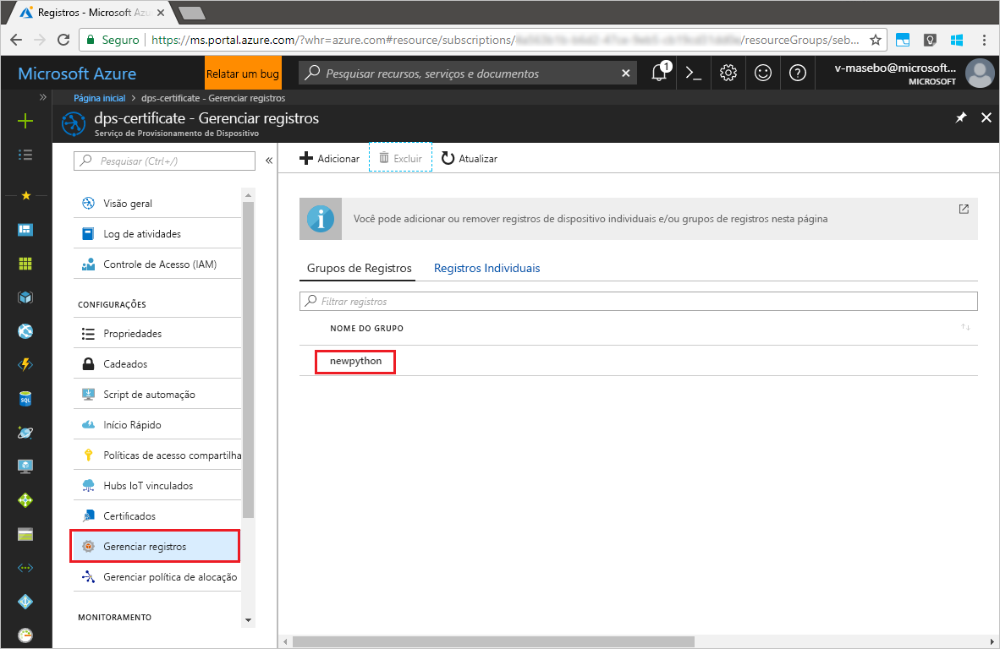

# <a name="enroll-x509-devices-to-iot-hub-device-provisioning-service-using-python-provisioning-service-sdk"></a>Registrar dispositivos X.509 no Serviço de Provisionamento de Dispositivos no Hub IoT usando o SDK do serviço de provisionamento Python
[!INCLUDE [iot-dps-selector-quick-enroll-device-x509](../../includes/iot-dps-selector-quick-enroll-device-x509.md)]

Estas etapas mostram como registrar um grupo de dispositivos X.509 simulados programaticamente no Serviço de Provisionamento de Dispositivos no Hub IoT do Azure usando o [SDK do Serviço de Provisionamento do Python](https://github.com/Azure/azure-iot-sdk-python/tree/master/provisioning_service_client) com a ajuda de um aplicativo Python de exemplo. Embora o SDK do serviço Java funcione em computadores Windows e Linux, este artigo usa um computador de desenvolvimento do Windows para percorrer o processo de registro.

Certifique-se de [configurar o Serviço de Provisionamento de Dispositivos do Hub IoT com o Portal do Azure](./quick-setup-auto-provision.md) antes de prosseguir.

> [!NOTE]
> Este guia de início rápido só oferece suporte a **Grupos de Registro**. O **Registro Individual** por meio do _SDK do Serviço de Provisionamento do Python_ é um trabalho em andamento.
> 

<a id="prepareenvironment"></a>

## <a name="prepare-the-environment"></a>Preparar o ambiente 

1. Baixe e instale o [Python 2.x ou 3.x](https://www.python.org/downloads/). Certifique-se de usar a instalação de 32 bits ou 64 bits conforme exigido pelo seu programa de instalação. Quando solicitado durante a instalação, certifique-se de adicionar Python às variáveis de ambiente específica da plataforma. 

1. Escolha uma das seguintes opções:

    - Criar e compilar o **SDK do Python do IoT Azure**. Execute [estas instruções](https://github.com/Azure/azure-iot-sdk-python/blob/master/doc/python-devbox-setup.md) para compilar os pacotes do Python. Se você está usando o sistema operacional Windows, instale também o [Pacote redistribuível do Visual C++](http://www.microsoft.com/download/confirmation.aspx?id=48145) para permitir o uso de DLLs nativas do Python.

    - [Instale ou atualize o *pip*, o sistema de gerenciamento de pacotes do Python](https://pip.pypa.io/en/stable/installing/) e instale o pacote por meio do comando a seguir:

        ```cmd/sh
        pip install azure-iothub-provisioningserviceclient
        ```

1. Você precisa de um arquivo .pem que contenha um certificado X.509 AC raiz ou intermediário que tenha sido carregado e verificado com seu serviço de provisionamento. O **SDK de C do IoT do Azure** contém ferramentas que podem ajudá-lo a criar uma cadeia de certificados X.509, carregar um certificado raiz ou intermediário a partir dessa cadeia e executar a prova de posse com o serviço para verificar o certificado. Para usar essa ferramenta, clone o [SDK de C do IoT do Azure](https://github.com/Azure/azure-iot-sdk-c) e siga as etapas em [azure-iot-sdk-c\tools\CACertificates\CACertificateOverview.md](https://github.com/Azure/azure-iot-sdk-c/blob/master/tools/CACertificates/CACertificateOverview.md) em seu computador.


## <a name="modify-the-python-sample-code"></a>Modificar o código de exemplo do Python

Esta seção mostra como adicionar os detalhes de provisionamento do dispositivo X.509 ao código de exemplo. 

1. Usando um editor de texto, crie um novo arquivo **EnrollmentGroup.py**.

1. Adicione as seguintes instruções `import` e variáveis ao início do arquivo **EnrollmentGroup.py**. Em seguida, substitua `dpsConnectionString` pela cadeia de conexão localizada em **Políticas de acesso compartilhado** no **Serviço de provisionamento de dispositivos** no **Portal do Azure**. Substitua o espaço reservado do certificado pelo certificado criado anteriormente em [Preparar o ambiente](quick-enroll-device-x509-python.md#prepareenvironment). Por fim, crie uma única `registrationid` e verifique se ela só consiste em alfanuméricos minúsculos e hifens.  
   
    ```python
    from provisioningserviceclient import ProvisioningServiceClient
    from provisioningserviceclient.models import EnrollmentGroup, AttestationMechanism

    CONNECTION_STRING = "{dpsConnectionString}"

    SIGNING_CERT = """-----BEGIN CERTIFICATE-----
    XXXXXXXXXXXXXXXXXXXXXXXXXXXXXXXXXXXXXXXXXXXXXXXXXXXXXXXXXXXXXXXX
    XXXXXXXXXXXXXXXXXXXXXXXXXXXXXXXXXXXXXXXXXXXXXXXXXXXXXXXXXXXXXXXX
    XXXXXXXXXXXXXXXXXXXXXXXXXXXXXXXXXXXXXXXXXXXXXXXXXXXXXXXXXXXXXXXX
    XXXXXXXXXXXXXXXXXXXXXXXXXXXXXXXXXXXXXXXXXXXXXXXXXXXXXXXXXXXXXXXX
    XXXXXXXXXXXXXXXXXXXXXXXXXXXXXXXXXXXXXXXXXXXXXXXXXXXXXXXXXXXXXXXX
    XXXXXXXXXXXXXXXXXXXXXXXXXXXXXXXXXXXXXXXXXXXXXXXXXXXXXXXXXXXXXXXX
    XXXXXXXXXXXXXXXXXXXXXXXXXXXXXXXXXXXXXXXXXXXXXXXXXXXXXXXXXXXXXXXX
    XXXXXXXXXXXXXXXXXXXXXXXXXXXXXXXXXXXXXXXXXXXXXXXXXXXXXXXXXXXXXXXX
    XXXXXXXXXXXXXXXXXXXXXXXXXXXXXXXXXXXXXXXXXXXXXXXXXXXXXXXXXXXXXXXX
    XXXXXXXXXXXXXXXXXXXXXXXXXXXXXXXXXXXXXXXXXXXXXXXXXXXXXXXXXXXXXXXX
    XXXXXXXXXXXXXXXXXXXXXXXXXXXXXXXXXXXXXXXXXXXXXXXXXXXXXXXXXXXXXXXX
    XXXXXXXXXXXXXXXXXXXXXXXXXXXXXXXXXXXXXXXXXXXXXXXXXXXXXXXXXXXXXXXX
    XXXXXXXXXXXXXXXXXXXXXXXXXXXXXXXXXXXXXXXXXXXXXXXXXXXXXXXXXXXXXXXX
    XXXXXXXXXXXXXXXXXXXXXXXXXXXXXXXXXXXXXXXXXXXXXXXXXXXXXXXXXXXXXXXX
    XXXXXXXXXXXXXXXXXXXXXXXXXXXXXXXXXXXXXXXXXXXXXXXXXXXXXXXX
    -----END CERTIFICATE-----"""

    GROUP_ID = "{registrationid}"
    ```

1. Adicione a seguinte função e chamada de função para implementar a criação de grupo de registro:
   
    ```python
    def main():
        print ( "Initiating enrollment group creation..." )

        psc = ProvisioningServiceClient.create_from_connection_string(CONNECTION_STRING)
        att = AttestationMechanism.create_with_x509_signing_certs(SIGNING_CERT)
        eg = EnrollmentGroup.create(GROUP_ID, att)

        eg = psc.create_or_update(eg)
    
        print ( "Enrollment group created." )

    if __name__ == '__main__':
        main()
    ```

1. Salve e feche o arquivo **EnrollmentGroup.py**.
 

## <a name="run-the-sample-group-enrollment"></a>Executar o registro do grupo de exemplo

1. Abra o prompt de comando e execute o script.

    ```cmd/sh
    python EnrollmentGroup.py
    ```

1. Observe a saída do registro bem-sucedido.

1. Navegue até seu serviço de provisionamento no Portal do Azure. Clique em **Gerenciar registros**. Observe que seu grupo de dispositivos X.509 aparece na guia **Grupos de Registro**, com o nome `registrationid` gerado anteriormente. 

      


## <a name="clean-up-resources"></a>Limpar recursos
Se você planeja explorar o exemplo do serviço Java, não limpe os recursos criados neste guia de início rápido. Caso contrário, use as etapas a seguir para excluir todos os recursos criados por este Guia de Início Rápido.

1. Feche a janela de saída de exemplo do Java no computador.
1. Feche a janela _Gerador de Certificado X509_ em seu computador.
1. Navegue até o Serviço de Provisionamento de Dispositivos no Portal do Azure, clique em **Gerenciar registros** e, em seguida, selecione a guia **Grupos de Registro**. Selecione o *NOME DO GRUPO* para os dispositivos X.509 registrados usando este Guia de Início Rápido e clique no botão **Excluir** na parte superior da folha.  


## <a name="next-steps"></a>Próximas etapas
Neste guia de início rápido, você registrou um grupo simulado de dispositivos X.509 para seu serviço de provisionamento de dispositivos. Para saber mais sobre os detalhes de configuração do dispositivo, prossiga para o tutorial de configuração do Serviço de Provisionamento de Dispositivos no portal do Azure. 

> [!div class="nextstepaction"]
> [Tutoriais do Serviço de Provisionamento de Dispositivos no Hub IoT do Azure](./tutorial-set-up-cloud.md)
