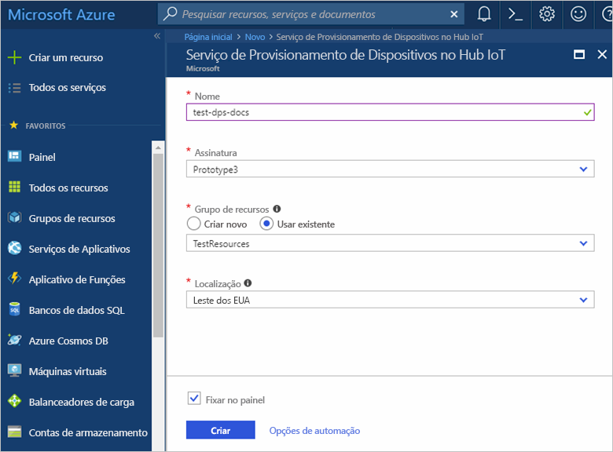
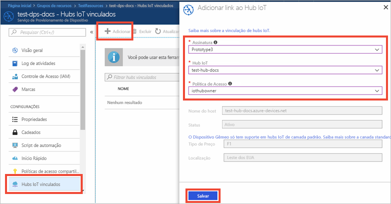

# Configurar o Serviço de Provisionamento de Dispositivos do Hub IoT com o portal do Azure

Estas etapas mostram como configurar os recursos de nuvem do Azure no portal para provisionar seus dispositivos. Isso inclui criar o Hub IoT, criar um novo IoT Serviço de Provisionamento de Dispositivos no Hub IoT e vincular os dois serviços. 

Se você não tiver uma assinatura do Azure, crie uma [conta gratuita](https://azure.microsoft.com/free/?WT.mc_id=A261C142F) antes de começar.

## Faça logon no Portal do Azure

Faça logon no [Portal do Azure](https://portal.azure.com/).

## Crie um hub IoT

1. Clique no botão **Novo** no canto superior esquerdo do Portal do Azure.

2. Selecione **Internet das Coisas**, selecione **Hub IoT**e clique no botão **Criar**. 

3. **Nomeie** seu Hub IoT. Selecione uma das opções disponíveis sobre preço, insira as [unidades do Hub IoT](https://azure.microsoft.com/pricing/details/iot-hub/), selecione o número de partições para mensagens de dispositivo para nuvem e a assinatura que deve ser usada para esse recurso. Insira o nome de um grupo de recursos novo ou existente e selecione o local. Ao concluir, clique em **Criar**.

      

4. Depois que o Hub IoT é implantado com êxito, a folha de resumo do hub é aberta automaticamente.

## Criar uma nova instância para o Serviço de Provisionamento de Dispositivos do Hub IoT

1. Clique no botão **Novo** no canto superior esquerdo do Portal do Azure.

2. *Pesquise no Marketplace* o **serviço de Provisionamento de Dispositivos**. Selecione **Serviço de Provisionamento de Dispositivos IoT** e clique no botão **Criar**. 

3. **Nomeie** sua instância do Serviço de Provisionamento de Dispositivos. Selecione a assinatura que é usada para essa instância e nomeie um grupo de recursos novo ou existente. Selecione o local. Ao concluir, clique em **Criar**.

      

4. Depois que o serviço é implantado com êxito, a folha de resumo é aberta automaticamente.

## Vincular o Hub IoT e o Serviço de Provisionamento de Dispositivos

1. Clique no botão **Todos os recursos** no menu à esquerda do portal do Azure. Selecione a instância de Serviço de Provisionamento de Dispositivos que você criou na seção anterior.  

2. Na folha de resumo do Serviço de Provisionamento de Dispositivos, selecione **Hubs IoT Vinculados**. Clique no botão **+ Adicionar** na parte superior. 

3. Na folha do portal **Adicionar link para o Hub IoT**, selecione a assinatura atual ou insira o nome e a cadeia de conexão para outra assinatura. Selecione o nome do hub na lista suspensa. Quando concluir, clique em **Salvar**. 

      

3. Agora você deve ver o hub selecionado na folha **Hubs IoT Vinculados**. Talvez você precise clicar em **Atualizar** para mostrar **Hubs IoT vinculados**.

## Limpar recursos

Outros Guias de Início Rápido na coleção aproveitam este Guia de Início Rápido. Se você planeja continuar trabalhando com Guias de Início Rápido ou tutoriais subsequentes, não limpe os recursos criados neste Guia de Início Rápido. Caso contrário, siga estas etapas para excluir todos os recursos criados por esse Guia de Início Rápido no portal do Azure.

1. No menu à esquerda no portal do Azure, clique em **Todos os recursos** e selecione o serviço de Provisionamento do Dispositivo. Na parte superior da folha **Todos os recursos**, clique em **Excluir**.  
2. No menu à esquerda no Portal do Azure, clique em **Todos os recursos** e selecione seu Hub IoT. Na parte superior da folha **Todos os recursos**, clique em **Excluir**.  

## Próximas etapas

Neste Guia de Início Rápido, você implantou um Hub IoT e uma instância do Serviço de Provisionamento de Dispositivos, e vinculou os dois recursos. Para aprender a usar essa configuração a fim de provisionar um dispositivo simulado, prossiga para o Guia de Início Rápido de criação de dispositivo simulado.

> [!div class="nextstepaction"]
> [Guia de Início Rápido para criar dispositivo simulado](./quick-create-simulated-device.md)
