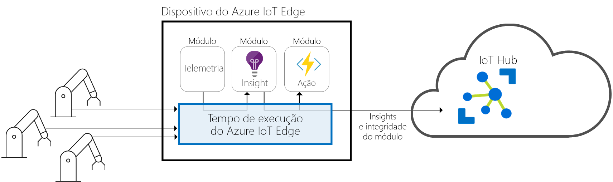
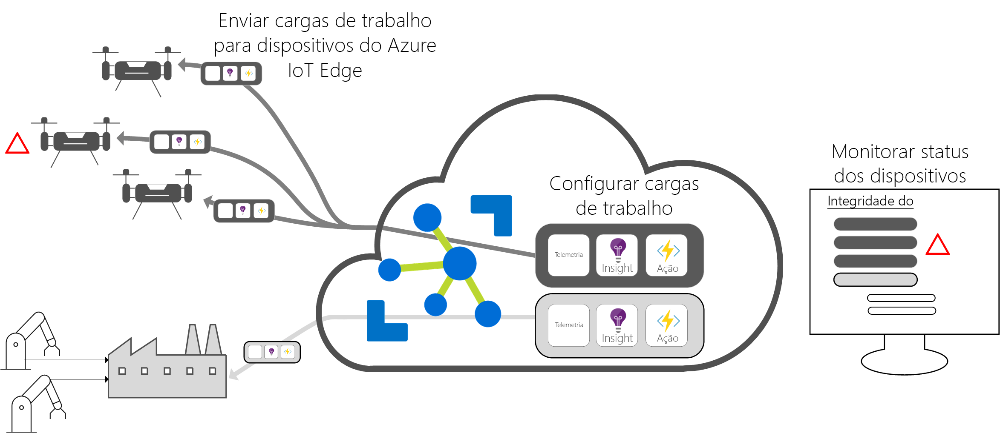

# O que é o Azure IoT Edge

O Azure IoT Edge move análises de nuvem e lógica de negócios personalizada para dispositivos, de modo que sua organização pode se concentrar em ideias de negócios em vez de gerenciamento de dados. Configurar o software de IoT, implantá-lo em dispositivos por meio de contêineres padrão e monitorar tudo isso na nuvem.

>[!NOTE]
>O Azure IoT Edge só está disponível na camada Standard do Hub IoT. A camada gratuita destina-se a testes e avaliação apenas. Para saber mais sobre as camadas Básica e Standard, confira [Como escolher a camada certa do Hub IoT](../iot-hub/iot-hub-scaling.md).

A análise impulsiona o valor comercial em soluções de IoT, mas nem todas as análise precisam estar na nuvem. Se desejar que um dispositivo responda em caso de emergência assim que possível, você pode executar a detecção de anomalias no próprio dispositivo. Da mesma forma, se você deseja reduzir os custos de largura de banda e evitar a transferência de terabytes de dados brutos, você pode executar a limpeza de dados e agregação localmente. Em seguida, envie os insights para a nuvem para análise. 

O Azure IoT Edge é composto de três componentes:
* Os módulos do IoT Edge são contêineres que executam serviços do Azure, serviços de terceiros ou o seu próprio código. Os módulos são implantados em dispositivos do IoT Edge e executados localmente nesses dispositivos. 
* O tempo de execução do IoT Edge é executado em cada dispositivo IoT Edge e gerencia os módulos implantados em cada dispositivo. 
* Uma interface baseada em nuvem permite monitorar e gerenciar dispositivos do IoT Edge remotamente.

## Módulos do IoT Edge

Os módulos do IoT Edge são unidades de execução, implementados como contêineres compatíveis com o Docker, que executam a lógica de negócios na borda. Vários módulos podem ser configurados para se comunicar entre si, criando um pipeline de processamento de dados. Você pode desenvolver módulos personalizados ou empacotar determinados serviços do Azure em módulos que fornecem informações offline e na borda. 

### Inteligência Artificial na borda

O Azure IoT Edge permite implantar processamento de eventos complexos, aprendizado de máquina, reconhecimento de imagem e outros tipos de IA de alto valor sem gravá-la internamente. Serviços do Azure, como Azure Functions, Azure Stream Analytics e Azure Machine Learning, podem ser executados localmente por meio do Azure IoT Edge; no entanto, você não está limitado aos serviços do Azure. Qualquer pessoa pode criar os módulos de IA e disponibilizá-los para uso pela comunidade por meio do Azure Marketplace. 

### Traga o seu próprio código

Quando você deseja implantar seu próprio código para seus dispositivos, o Azure IoT Edge também oferece suporte para essa situação. O Azure IoT Edge mantém o mesmo modelo de programação de outros serviços Azure IoT. O mesmo código pode ser executado em um dispositivo ou na nuvem. O Azure IoT Edge oferece suporte para Linux e Windows, portanto você pode codificar para a plataforma de sua escolha. Ele dá suporte para Java, .NET Core 2.0, Node.js, C e Python, de modo que os desenvolvedores possam codificar em uma linguagem que já conhecem e usar a lógica de negócios existente.

## Tempo de execução do IoT Edge

O tempo de execução do Azure IoT Edge permite lógica personalizada e de nuvem em dispositivos IoT Edge. Ele se encontra no dispositivo IoT Edge e executa operações de gerenciamento e comunicação. O tempo de execução executa várias funções:

* Instala e atualiza as cargas de trabalho no dispositivo.
* Mantém os padrões de segurança do Azure IoT Edge no dispositivo.
* Garante que os módulos do IoT Edge sempre estejam em execução.
* Relata a integridade do módulo à nuvem para monitoramento remoto.
* Gerencia a comunicação entre dispositivos folha downstream e um dispositivo do IoT Edge, entre módulos em um dispositivo do IoT Edge e entre um dispositivo do IoT Edge e a nuvem.

A maneira como você usa um dispositivo do Azure IoT Edge é uma decisão inteiramente sua. O tempo de execução costuma ser usado para implantar a IA em gateways que agregam e processam dados de outros dispositivos locais; no entanto, esse modelo de implantação é apenas uma opção. Os dispositivos de folha também podem ser dispositivos do Azure IoT Edge, independentemente deles estarem conectados a um gateway ou diretamente na nuvem.

O tempo de execução do Azure IoT Edge é executado em um grande conjunto de dispositivos IoT habilitado usando o tempo de execução de várias maneiras diferentes. Ele dá suporte a sistemas operacionais Windows e Linux e abstrai os detalhes de hardware. Use um dispositivo anterior ao Raspberry Pi 3 caso não esteja processando muitos dados ou um servidor industrializado para executar cargas de trabalho com uso intensivo de recursos.

## Interface de nuvem do IoT Edge

Gerenciar o ciclo de vida de software para dispositivos corporativos é complicado. Gerenciar o ciclo de vida de software para milhões de dispositivos de IoT heterogêneos é ainda mais difícil. As cargas de trabalho devem ser criadas e configuradas para um tipo específico de dispositivo, implantadas na escala de milhões de dispositivos em sua solução e monitoradas para detectar todos os dispositivos com comportamento inadequado. Essas atividades não podem ser feitas por dispositivo e devem ser feitas em escala.

O Azure IoT Edge integra-se perfeitamente aos aceleradores da solução Azure IoT para fornecer um plano de controle de acordo com as necessidades da sua solução. Os serviços de nuvem permitem:

* Criar e configurar uma carga de trabalho a ser executado em um tipo específico de dispositivo.
* Enviar uma carga de trabalho para um conjunto de dispositivos.
* Monitorar cargas de trabalho que estão sendo executadas em dispositivos em campo.

## Próximas etapas

Experimente esses conceitos [implantando o IoT Edge em um dispositivo simulado](quickstart.md).