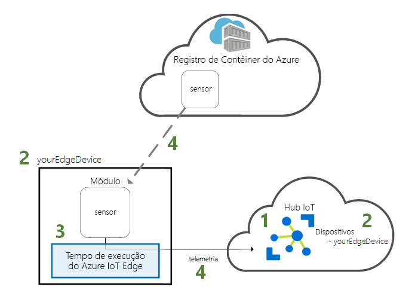
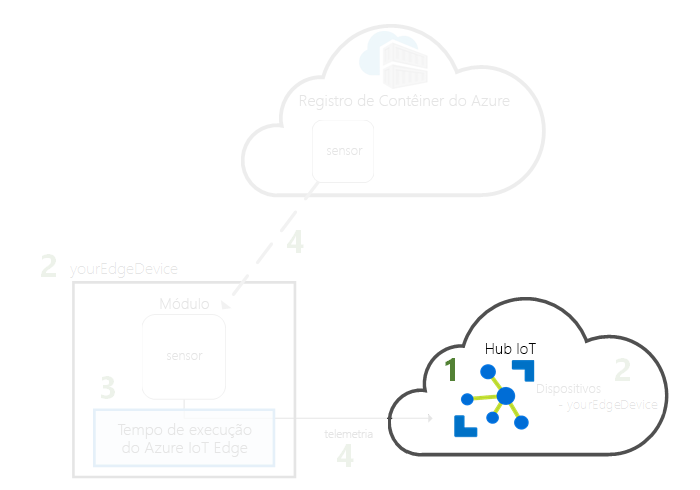
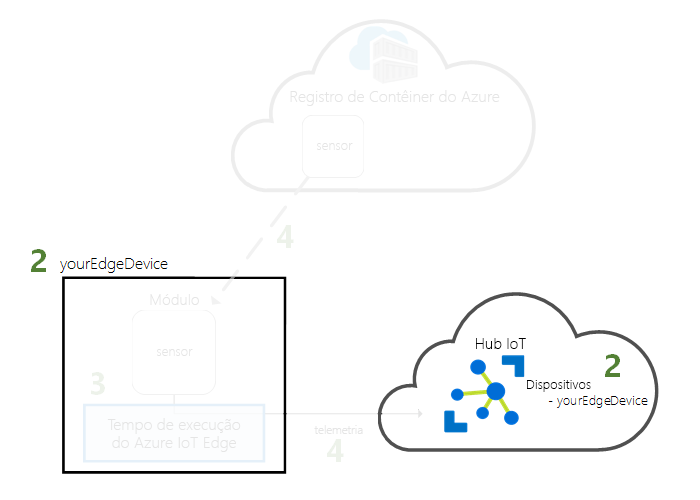
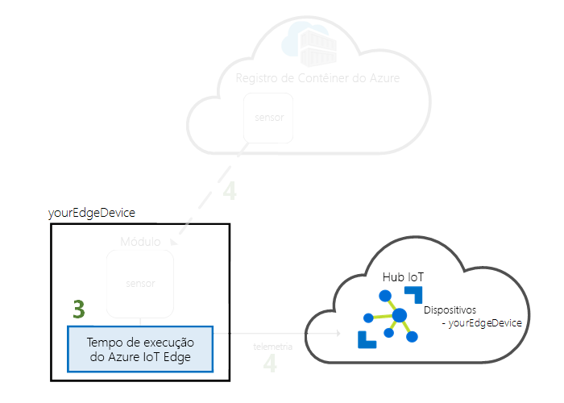
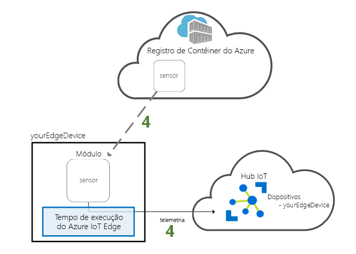

# <a name="quickstart-deploy-your-first-iot-edge-module-to-a-linux-x64-device"></a>Início Rápido: Implantar seu primeiro módulo IoT Edge em um dispositivo Linux x64

O Azure IoT Edge leva o poder da nuvem para seus dispositivos Internet das Coisas. Neste início rápido, aprenda a usar a interface de nuvem para implantar remotamente um código pré-compilado em um dispositivo IoT Edge.

Neste guia de início rápido, você aprende a:

1. Crie um Hub IoT.
2. Registrar um dispositivo IoT Edge em seu Hub IoT.
3. Instale e inicie o tempo de execução do IoT Edge no dispositivo.
4. Implantar um módulo em um dispositivo IoT Edge remotamente.



Este guia de início rápido transforma seu computador máquina virtual Linux em um dispositivo IoT Edge. Em seguida, você pode implantar um módulo do portal do Azure em seu dispositivo. O módulo implantado neste guia de início rápido é um sensor simulado que gera dados de temperatura, umidade e pressão. Os outros tutoriais do Azure IoT Edge se baseiam no trabalho feito aqui com a implantação de módulos que analisam os dados simulados para obter informações de negócios.

Se você não tiver uma assinatura do Azure ativa, crie uma [conta gratuita](https://azure.microsoft.com/free) antes de começar.

[!INCLUDE [cloud-shell-try-it.md](../../includes/cloud-shell-try-it.md)]

Você usa a CLI do Azure para concluir muitas das etapas neste guia de início rápido e o Azure IoT possui uma extensão para habilitar funcionalidades adicionais. 

Adicione a extensão do Azure IoT à instância do shell de nuvem.

   ```azurecli-interactive
   az extension add --name azure-cli-iot-ext
   ```

## <a name="prerequisites"></a>Pré-requisitos

Recursos de nuvem: 

* Um grupo de recursos para gerenciar todos os recursos que você usará neste início rápido. 

   ```azurecli-interactive
   az group create --name IoTEdgeResources --location westus2
   ```

Dispositivo IoT Edge:

* Uma máquina virtual ou dispositivo com Linux para agir como o dispositivo IoT Edge. Se você quiser criar uma máquina virtual no Azure, use o comando a seguir para começar rapidamente:

   ```azurecli-interactive
   az vm create --resource-group IoTEdgeResources --name EdgeVM --image Canonical:UbuntuServer:16.04-LTS:latest --admin-username azureuser --generate-ssh-keys --size Standard_DS1_v2
   ```

   Ao criar uma nova máquina virtual, anote o **publicIpAddress**, que é fornecido como parte da saída do comando create. Use esse endereço IP público para se conectar à máquina virtual mais tarde no início rápido.

## <a name="create-an-iot-hub"></a>Crie um hub IoT

Comece o início rápido criando o Hub IoT com a CLI do Azure.



O nível gratuito do Hub IoT funciona para este guia de início rápido. Se você tiver usado o Hub IoT antes e já tiver um hub disponível criado, você pode usar esse Hub IoT. Cada assinatura pode ter somente um hub IoT gratuito. 

O código a seguir cria um hub **F1** gratuito no grupo de recursos **IoTEdgeResources**. Substitua *{hub_name}* por um nome exclusivo para o Hub IoT.

   ```azurecli-interactive
   az iot hub create --resource-group IoTEdgeResources --name {hub_name} --sku F1 
   ```

   Se você receber um erro porque já exsite um hub gratuito na sua assinatura, altere o SKU para **S1**. Caso você receba um erro que o nome do Hub IoT não está disponível, isso significa que alguém já tem um hub com esse nome. Tente usar um novo nome. 

## <a name="register-an-iot-edge-device"></a>Registrar um dispositivo IoT Edge

Registre um dispositivo IoT Edge no Hub IoT recém-criado.


Crie uma identidade de dispositivo para seu dispositivo simulado para que ele possa se comunicar com o hub IoT. A identidade do dispositivo reside na nuvem e você usa uma cadeia de conexão de dispositivo exclusiva para associar um dispositivo físico a uma identidade do dispositivo. 

Como os dispositivos IoT Edge se comportam e podem ser gerenciados diferentemente de dispositivos IoT comuns, declare essa identidade para ser um dispositivo IoT Edge com o sinalizador `--edge-enabled`. 

1. No Azure Cloud Shell, digite o seguinte comando para criar um dispositivo denominado **myEdgeDevice** no seu hub.

   ```azurecli-interactive
   az iot hub device-identity create --hub-name {hub_name} --device-id myEdgeDevice --edge-enabled
   ```

   Se você receber um erro sobre as chaves de política do iothubowner, verifique se seu cloud shell está executando a versão mais recente da extensão do azure-cli-iot-ext. 

2. Recupere a cadeia de conexão para o seu dispositivo, o que vincula o dispositivo físico à sua identidade no Hub IoT. 

   ```azurecli-interactive
   az iot hub device-identity show-connection-string --device-id myEdgeDevice --hub-name {hub_name}
   ```

3. Copie a cadeia de conexão e salve-a. Você usará esse valor para configurar o tempo de execução de IoT Edge na próxima seção. 

## <a name="install-and-start-the-iot-edge-runtime"></a>Instalar e iniciar o tempo de execução do IoT Edge

Instale e inicie o tempo de execução do Azure IoT Edge no dispositivo IoT Edge. 


O tempo de execução do IoT Edge é implantado em todos os dispositivos IoT Edge. Tem três componentes. O **daemon de segurança do IoT Edge** é iniciado sempre que um dispositivo Edge é iniciado e inicializa o dispositivo inicializando o agente do IoT Edge. O **agente do IoT Edge** facilita a implantação e o monitoramento de módulos no dispositivo IoT Edge, incluindo o hub do IoT Edge. O **hub IoT Edge** gerencia a comunicação entre os módulos no dispositivo IoT Edge e entre o dispositivo e o Hub IoT. 

Durante a configuração do tempo de execução, você precisa fornecer uma cadeia de conexão do dispositivo. Use a cadeia de caracteres que você recuperou da CLI do Azure. Essa cadeia de caracteres associa seu dispositivo físico à identidade do dispositivo IoT Edge no Azure. 

### <a name="connect-to-your-iot-edge-device"></a>Conectar-se ao dispositivo do IoT Edge

Todas as etapas nesta seção ocorrem em seu dispositivo IoT Edge. Se você estiver usando seu próprio computador como o dispositivo do IoT Edge, você poderá ignorar esta parte. Se você estiver usando uma máquina virtual ou um hardware secundário, você deseja se conectar a esse computador agora. 

Se você criou uma máquina virtual do Azure para este início rápido, recupere o endereço IP público que foi a saída do comando creation. Também é possível encontrar o endereço IP público na página de visão geral da máquina virtual no portal do Azure. Use o comando a seguir para se conectar à sua máquina virtual. Substitua **{publicIpAddress}** pelo seu endereço de máquina. 

```azurecli-interactive
ssh azureuser@{publicIpAddress}
```

### <a name="register-your-device-to-use-the-software-repository"></a>Registrar o dispositivo para usar o repositório de software

Os pacotes para executar o tempo de execução do IoT Edge são gerenciados em um repositório de software. Configure seu dispositivo IoT Edge para acessar esse repositório. 

As etapas nesta seção são para dispositivos x64 que executam **Ubuntu 16.04**. Para acessar o repositório de software em outras versões do Linux ou arquiteturas de dispositivo, confira [Instalar o tempo de execução do Azure IoT Edge no Linux (x64)](how-to-install-iot-edge-linux.md) ou [Linux (ARM32v7/armhf)](how-to-install-iot-edge-linux-arm.md).

1. No computador que você está usando como um dispositivo IoT Edge, instale a configuração do repositório.

   ```bash
   curl https://packages.microsoft.com/config/ubuntu/16.04/prod.list > ./microsoft-prod.list
   sudo cp ./microsoft-prod.list /etc/apt/sources.list.d/
   ```

2. Instale uma chave pública para acessar o repositório.

   ```bash
   curl https://packages.microsoft.com/keys/microsoft.asc | gpg --dearmor > microsoft.gpg
   sudo cp ./microsoft.gpg /etc/apt/trusted.gpg.d/
   ```

### <a name="install-a-container-runtime"></a>Instale um tempo de execução do contêiner

O tempo de execução do IoT Edge é um conjunto de contêineres, e a lógica que você implanta em seu dispositivo IoT Edge é empacotada como contêineres. Prepare o dispositivo para esses componentes instalando um tempo de execução do contêiner.

1. Atualize **apt-get**.

   ```bash
   sudo apt-get update
   ```

2. Instale o **Moby**, um tempo de execução de contêiner.

   ```bash
   sudo apt-get install moby-engine
   ```

3. Instale os comandos da CLI para Moby. 

   ```bash
   sudo apt-get install moby-cli
   ```

### <a name="install-and-configure-the-iot-edge-security-daemon"></a>Instalar e configurar o daemon de segurança do IoT Edge

O daemon de segurança é instalado como um serviço do sistema para que o tempo de execução do IoT Edge seja iniciado sempre que o dispositivo é inicializado. A instalação também inclui uma versão de **hsmlib** que permite que o daemon de segurança interaja com a segurança de hardware do dispositivo. 

1. Baixe e instale o Daemon de Segurança do IoT Edge. 

   ```bash
   sudo apt-get update
   sudo apt-get install iotedge
   ```

2. Abra o arquivo de configuração do IoT Edge. Trata-se de um arquivo protegido, assim, talvez seja necessário usar privilégios elevados para acessá-lo.
   
   ```bash
   sudo nano /etc/iotedge/config.yaml
   ```

3. Adicione a cadeia de conexão do dispositivo do IoT Edge. Procure a variável **device_connection_string** e atualize seu valor com a cadeia de caracteres que você copiou após registrar seu dispositivo. Essa cadeia de conexão associa seu dispositivo físico à identidade do dispositivo que você criou no Azure.

4. Salve e feche o arquivo. 

   `CTRL + X`, `Y`, `Enter`

5. Reinicie o daemon de segurança do IoT Edge para aplicar suas alterações.

   ```bash
   sudo systemctl restart iotedge
   ```

>[!TIP]
>Você precisa de privilégios elevados para executar comandos `iotedge`. Depois que você sair da sua máquina e fizer login novamente na primeira vez após instalar o tempo de execução do IoT Edge, suas permissões serão atualizadas automaticamente. Até lá, use **sudo** na frente dos comandos. 

### <a name="view-the-iot-edge-runtime-status"></a>Veja o status do tempo de execução do IoT Edge

Verifique se o tempo de execução foi instalado e configurado com êxito.

1. Verifique se o daemon de segurança do Edge está em execução como um serviço do sistema.

   ```bash
   sudo systemctl status iotedge
   ```

   

2. Se você precisar solucionar problemas do serviço, recupere os logs de serviço. 

   ```bash
   journalctl -u iotedge
   ```

3. Visualizar os módulos em execução no seu dispositivo. 

   ```bash
   sudo iotedge list
   ```

   

Seu dispositivo IoT Edge agora está configurado. Ele está pronto para executar os módulos implantados na nuvem. 

## <a name="deploy-a-module"></a>Implantar um módulo

Gerencie o dispositivo Azure IoT Edge na nuvem para implantar um módulo que enviará dados telemétricos ao Hub IoT.


[!INCLUDE [iot-edge-deploy-module](../../includes/iot-edge-deploy-module.md)]

## <a name="view-generated-data"></a>Exibir os dados gerados

Neste guia de início rápido, você criou um novo dispositivo IoT Edge e instalou o tempo de execução de IoT Edge nele. Em seguida, você usou o Portal do Azure para enviar por push um módulo do IoT Edge para ser executado no dispositivo sem precisar fazer alterações no próprio dispositivo. Nesse caso, o módulo enviado por push cria dados de ambiente que podem ser usados para os tutoriais.

Abra novamente o prompt de comando em seu dispositivo IoT Edge. Confirme se o módulo implantado da nuvem está em execução no seu dispositivo IoT Edge:

   ```bash
   sudo iotedge list
   ```

   

Exiba as mensagens que estão sendo enviadas do módulo tempSensor:

   ```bash
   sudo iotedge logs tempSensor -f
   ```


O módulo de sensor de temperatura poderá estar aguardando para se conectar ao Hub do Edge se a última linha que você vê no log for `Using transport Mqtt_Tcp_Only`. Tente eliminar o módulo e deixar que o agente do Edge o reinicie. Você pode encerrá-la com o comando `sudo docker stop tempSensor`.

Você também pode inspecionar as mensagens chegam ao hub IoT usando a [Extensão do Kit de Ferramentas do Hub IoT do Azure para Visual Studio Code](https://marketplace.visualstudio.com/items?itemName=vsciot-vscode.azure-iot-toolkit) (anteriormente conhecida como extensão do Kit de Ferramentas do Azure IoT). 

## <a name="clean-up-resources"></a>Limpar recursos

Se você deseja prosseguir para os tutoriais do IoT Edge, pode usar o dispositivo registrado e configurado neste guia de início rápido. Caso contrário, é possível excluir os recursos do Azure que você criou e remover o tempo de execução do IoT Edge do seu dispositivo.

### <a name="delete-azure-resources"></a>Excluir recursos do Azure

Se você tiver criado a sua máquina virtual e o Hub IoT em um novo grupo de recursos, é possível excluir esse grupo e todos os recursos associados. Verifique novamente o conteúdo do grupo de recursos para ter certeza de que não haja nada que você queira manter. Caso não queira excluir o grupo inteiro, é possível excluir recursos individuais em vez disso.

Remova o grupo **IoTEdgeResources**.

   ```azurecli-interactive
   az group delete --name IoTEdgeResources 
   ```

### <a name="remove-the-iot-edge-runtime"></a>Remover o tempo de execução do IoT Edge

Se você deseja remover as instalações do dispositivo, use os comandos a seguir.  

Remova o tempo de execução do IoT Edge.

   ```bash
   sudo apt-get remove --purge iotedge
   ```

Quando o tempo de execução do IoT Edge for removido, os contêineres criados por ele são interrompidos, mas ainda existem no seu dispositivo. Visualizar todos os contêineres.

   ```bash
   sudo docker ps -a
   ```

Exclua os contêineres que foram criados no seu dispositivo pelo tempo de execução do IoT Edge. Altere o nome do contêiner tempSensor se você deu um outro nome para ele. 

   ```bash
   sudo docker rm -f tempSensor
   sudo docker rm -f edgeHub
   sudo docker rm -f edgeAgent
   ```

Remova o tempo de execução do contêiner.

   ```bash
   sudo apt-get remove --purge moby-cli
   sudo apt-get remove --purge moby-engine
   ```

## <a name="next-steps"></a>Próximas etapas

Este guia de início rápido é pré-requisito para todos os tutoriais do IoT Edge. Prossiga para um dos outros tutoriais para saber como o Azure IoT Edge pode ajudá-lo a transformar esses dados em informações de negócios na borda.

> [!div class="nextstepaction"]
> [Filtrar dados de sensor usando uma função do Azure](tutorial-deploy-function.md)
