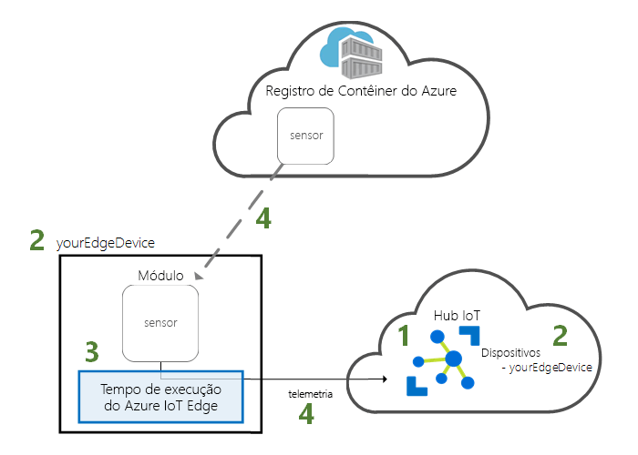
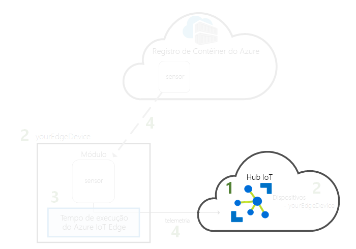
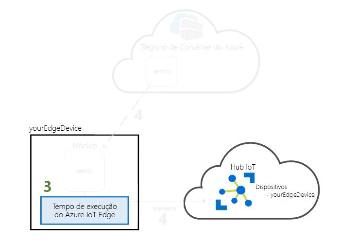
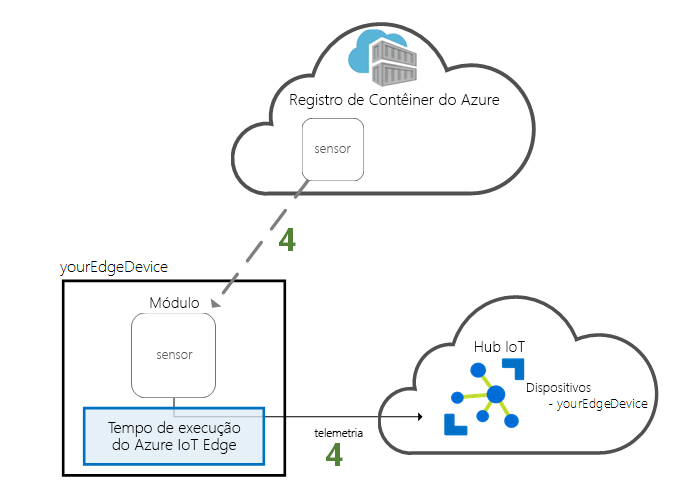

# <a name="quickstart-deploy-your-first-iot-edge-module-from-the-azure-portal-to-a-windows-device---preview"></a>Início Rápido: Implantar seu primeiro módulo IoT Edge do portal do Azure para um dispositivo Windows – versão prévia

Neste guia de início rápido, use a interface de nuvem do Azure IoT Edge para implantar remotamente um código pré-compilado em um dispositivo IoT Edge. Para realizar essa tarefa, primeiro crie e configure uma máquina virtual do Windows para funcionar como um dispositivo IoT Edge e, em seguida, implante um módulo na máquina virtual.

Neste guia de início rápido, você aprende a:

1. Crie um Hub IoT.
2. Registrar um dispositivo IoT Edge em seu Hub IoT.
3. Instale e inicie o tempo de execução do IoT Edge no dispositivo.
4. Implante remotamente um módulo em um dispositivo IoT Edge e envie a telemetria para IoT Hub.



O módulo implantado neste guia de início rápido é um sensor simulado que gera dados de temperatura, umidade e pressão. Os outros tutoriais do Azure IoT Edge se baseiam no trabalho feito aqui com a implantação de módulos que analisam os dados simulados para obter informações de negócios.

> [!NOTE]
> O tempo de execução do IoT Edge no Windows está em [versão prévia](https://azure.microsoft.com/support/legal/preview-supplemental-terms/).

Se você não tiver uma assinatura do Azure ativa, crie uma [conta gratuita](https://azure.microsoft.com/free) antes de começar.

[!INCLUDE [cloud-shell-try-it.md](../../includes/cloud-shell-try-it.md)]

Você usa a CLI do Azure para concluir muitas das etapas neste guia de início rápido e o Azure IoT possui uma extensão para habilitar funcionalidades adicionais.

Adicione a extensão do Azure IoT à instância do shell de nuvem.

   ```azurecli-interactive
   az extension add --name azure-cli-iot-ext
   ```

## <a name="prerequisites"></a>Pré-requisitos

Recursos de nuvem:

* Um grupo de recursos para gerenciar todos os recursos que você usará neste início rápido.

   ```azurecli-interactive
   az group create --name IoTEdgeResources --location westus2
   ```

Dispositivo IoT Edge:

* Uma máquina virtual do Windows para atuar como o dispositivo IoT Edge. É possível criar essa máquina virtual usando o seguinte comando, substituindo *{senha}* por uma senha segura:

  ```azurecli-interactive
  az vm create --resource-group IoTEdgeResources --name EdgeVM --image MicrosoftWindowsDesktop:Windows-10:rs5-pro:latest --admin-username azureuser --admin-password {password} --size Standard_DS1_v2
  ```

  A criação e a inicialização da nova máquina virtual podem levar alguns minutos. Em seguida, você poderá baixar um arquivo RDP para usar ao conectar-se à máquina virtual:

  1. Navegue até a nova máquina virtual do Windows no portal do Azure.
  1. Selecione **Conectar**.
  1. Na guia **RDP**, selecione **Baixar arquivo RDP**.

  Abra esse arquivo com Conexão de Área de Trabalho Remota para conectar-se à máquina virtual do Windows usando o nome do administrador e senha que você especificou com o comando `az vm create`.

## <a name="create-an-iot-hub"></a>Crie um hub IoT

Comece o início rápido criando um Hub IoT com a CLI do Azure.



O nível gratuito do Hub IoT funciona para este guia de início rápido. Se você tiver usado o Hub IoT antes e já tiver um hub disponível criado, você pode usar esse Hub IoT. Cada assinatura pode ter somente um hub IoT gratuito.

O código a seguir cria um hub **F1** gratuito no grupo de recursos **IoTEdgeResources**. Substitua *{hub_name}* por um nome exclusivo para o Hub IoT.

   ```azurecli-interactive
   az iot hub create --resource-group IoTEdgeResources --name {hub_name} --sku F1
   ```

   Se você receber um erro porque já exsite um hub gratuito na sua assinatura, altere o SKU para **S1**. Caso você receba um erro que o nome do Hub IoT não está disponível, isso significa que alguém já tem um hub com esse nome. Tente usar um novo nome.

## <a name="register-an-iot-edge-device"></a>Registrar um dispositivo IoT Edge

Registre um dispositivo IoT Edge no Hub IoT recém-criado.


Crie uma identidade de dispositivo para seu dispositivo simulado para que ele possa se comunicar com o hub IoT. A identidade do dispositivo reside na nuvem e você usa uma cadeia de conexão de dispositivo exclusiva para associar um dispositivo físico a uma identidade do dispositivo.

Como os dispositivos IoT Edge se comportam e podem ser gerenciados diferentemente de dispositivos IoT comuns, declare essa identidade para ser um dispositivo IoT Edge com o sinalizador `--edge-enabled`.

1. No Azure Cloud Shell, digite o seguinte comando para criar um dispositivo denominado **myEdgeDevice** no seu hub.

   ```azurecli-interactive
   az iot hub device-identity create --device-id myEdgeDevice --hub-name {hub_name} --edge-enabled
   ```

   Se você receber um erro sobre as chaves de política do iothubowner, verifique se seu cloud shell está executando a versão mais recente da extensão do azure-cli-iot-ext.

2. Recupere a cadeia de conexão para o seu dispositivo, o que vincula o dispositivo físico à sua identidade no Hub IoT.

   ```azurecli-interactive
   az iot hub device-identity show-connection-string --device-id myEdgeDevice --hub-name {hub_name}
   ```

3. Copie o valor da chave `connectionString` da saída JSON e salve-o. Esse valor é a cadeia de conexão do dispositivo. Você usará essa cadeia de conexão para configurar o tempo de execução do IoT Edge na próxima seção.

   

## <a name="install-and-start-the-iot-edge-runtime"></a>Instalar e iniciar o tempo de execução do IoT Edge

Instale o tempo de execução do Azure IoT Edge no dispositivo IoT Edge e configure-o com uma cadeia de conexão do dispositivo.


O tempo de execução do IoT Edge é implantado em todos os dispositivos IoT Edge. Tem três componentes. O **daemon de segurança do IoT Edge** é iniciado sempre que um dispositivo IoT Edge é iniciado e inicializa o dispositivo inicializando o agente do IoT Edge. O **agente do IoT Edge** gerencia a implantação e o monitoramento de módulos no dispositivo IoT Edge, incluindo o hub do IoT Edge. O **hub do IoT Edge** controla a comunicação entre os módulos no dispositivo IoT Edge e entre o dispositivo e o Hub IoT.

O script de instalação também inclui um mecanismo de contêiner chamado Moby que gerencia as imagens de contêiner no seu dispositivo IoT Edge.

Durante a instalação do tempo de execução, você precisará fornecer uma cadeia de conexão do dispositivo. Use a cadeia de caracteres que você recuperou da CLI do Azure. Essa cadeia de caracteres associa seu dispositivo físico à identidade do dispositivo IoT Edge no Azure.

### <a name="connect-to-your-iot-edge-device"></a>Conectar-se ao dispositivo do IoT Edge

Todas as etapas desta seção ocorrem no dispositivo IoT Edge, portanto, conecte-se à máquina virtual via área de trabalho remota.

### <a name="prepare-your-device-for-containers"></a>Prepare o dispositivo para contêineres

O script de instalação instalará automaticamente o mecanismo Moby no dispositivo, antes de instalar o IoT Edge. Prepare o dispositivo, ativando o recurso Contêineres.

1. Na barra de início, pesquise **Ativar ou desativar recursos do Windows** e abra o programa do painel de controle.
1. Localize e selecione **Contêineres**.
1. Selecione **OK**.

Após as conclusão, será necessário reiniciar o Windows para que as alterações entrem em vigor, mas é possível fazer isso a partir da sessão da Área de Trabalho Remota, em vez de reiniciar a máquina virtual no portal do Azure.

### <a name="download-and-install-the-iot-edge-service"></a>Baixe e instale o serviço do IoT Edge

Use o PowerShell para baixar e instalar o tempo de execução do IoT Edge. Use a cadeia de conexão do dispositivo que você recuperou do Hub IoT para configurar o dispositivo.

1. No seu dispositivo IoT Edge, execute o PowerShell como administrador.

2. Baixe e instale o serviço IoT Edge em seu dispositivo.

   ```powershell
   . {Invoke-WebRequest -useb aka.ms/iotedge-win} | Invoke-Expression; `
   Install-SecurityDaemon -Manual -ContainerOs Windows
   ```

3. Quando solicitado a fornecer uma **DeviceConnectionString**, forneça a cadeia de caracteres que você copiou na seção anterior. Não inclua aspas na cadeia de conexão.

### <a name="view-the-iot-edge-runtime-status"></a>Veja o status do tempo de execução do IoT Edge

Verifique se o tempo de execução foi instalado e configurado com êxito.

1. Verifique o status do serviço do IoT Edge.

   ```powershell
   Get-Service iotedge
   ```

2. Se você precisar solucionar problemas do serviço, recupere os logs de serviço.

   ```powershell
   # Displays logs from today, newest at the bottom.

   Get-WinEvent -ea SilentlyContinue `
    -FilterHashtable @{ProviderName= "iotedged";
      LogName = "application"; StartTime = [datetime]::Today} |
    select TimeCreated, Message |
    sort-object @{Expression="TimeCreated";Descending=$false} |
    format-table -autosize -wrap
   ```

3. Exiba todos os módulos em execução no seu dispositivo IoT Edge. Como o serviço acabou de ser iniciado pela primeira vez, você só verá o módulo **edgeAgent** em execução. O módulo edgeAgent é executado por padrão e ajuda a instalar e iniciar quaisquer módulos adicionais que você implantar em seu dispositivo.

   ```powershell
   iotedge list
   ```

   

Pode levar alguns minutos para a instalação ser concluída e o módulo do agente do IoT Edge iniciar.

Seu dispositivo IoT Edge agora está configurado. Ele está pronto para executar os módulos implantados na nuvem.

## <a name="deploy-a-module"></a>Implantar um módulo

Gerencie o dispositivo Azure IoT Edge na nuvem para implantar um módulo que envia dados telemétricos ao Hub IoT.


[!INCLUDE [iot-edge-deploy-module](../../includes/iot-edge-deploy-module.md)]

## <a name="view-generated-data"></a>Exibir os dados gerados

Neste guia de início rápido, você registrou um dispositivo IoT Edge e instalou o tempo de execução do IoT Edge nele. Em seguida, você usou o portal do Azure para implantar um módulo do IoT Edge para ser executado no dispositivo sem precisar fazer alterações no próprio dispositivo.

Nesse caso, o módulo enviado por push cria dados de exemplo que podem ser usados para teste. O módulo de sensor de temperatura simulado gera dados de ambiente que você pode usar para testar posteriormente. O sensor simulado está monitorando um computador e o ambiente em torno do computador. Por exemplo, esse sensor pode estar em uma sala de servidor, em um chão de fábrica ou em uma turbina eólica. A mensagem inclui a temperatura ambiente e umidade, temperatura do computador, pressão e um carimbo de data/hora. Os tutoriais do IoT Edge usam os dados criados por esse módulo de dados de teste para análise.

Confirme se o módulo implantado da nuvem está em execução no seu dispositivo IoT Edge.

```powershell
iotedge list
```

   

Exiba as mensagens que estão sendo enviadas do módulo sensor de temperatura para a nuvem.

```powershell
iotedge logs SimulatedTemperatureSensor -f
```

   >[!TIP]
   >Ao fazer referência a nomes de módulo, comandos do IoT Edge diferenciam maiúsculas de minúsculas.

   

Você também pode inspecionar as mensagens chegam ao hub IoT usando a [Extensão do Kit de Ferramentas do Hub IoT do Azure para Visual Studio Code](https://marketplace.visualstudio.com/items?itemName=vsciot-vscode.azure-iot-toolkit) (anteriormente conhecida como extensão do Kit de Ferramentas do Azure IoT).

## <a name="clean-up-resources"></a>Limpar recursos

Se você deseja prosseguir para os tutoriais do IoT Edge, pode usar o dispositivo registrado e configurado neste guia de início rápido. Caso contrário, é possível excluir os recursos do Azure que você criou e remover o tempo de execução do IoT Edge do seu dispositivo.

### <a name="delete-azure-resources"></a>Excluir recursos do Azure

Se você tiver criado a sua máquina virtual e o Hub IoT em um novo grupo de recursos, é possível excluir esse grupo e todos os recursos associados. Verifique novamente o conteúdo do grupo de recursos para ter certeza de que não haja nada que você queira manter. Caso não queira excluir o grupo inteiro, é possível excluir recursos individuais em vez disso.

Remova o grupo **IoTEdgeResources**.

   ```azurecli-interactive
   az group delete --name IoTEdgeResources
   ```

### <a name="remove-the-iot-edge-runtime"></a>Remover o tempo de execução do IoT Edge

Se você deseja remover as instalações do dispositivo, use os comandos a seguir.  

Remova o tempo de execução do IoT Edge. Se você planeja reinstalar o IoT Edge, deixe de fora os parâmetros `-DeleteConfig` e `-DeleteMobyDataRoot` para que seja possível reinstalar com a mesma configuração que você acabou de configurar.

   ```powershell
   . {Invoke-WebRequest -useb aka.ms/iotedge-win} | Invoke-Expression; `
   Uninstall-SecurityDaemon -DeleteConfig -DeleteMobyDataRoot
   ```

## <a name="next-steps"></a>Próximas etapas

Neste início rápido, você criou um dispositivo IoT Edge e usou a interface de nuvem do Azure IoT Edge para implantar código no dispositivo. Agora, você tem um dispositivo de teste que gera dados brutos sobre seu ambiente.

Você está pronto para prosseguir para um dos outros tutoriais para saber como o Azure IoT Edge pode ajudá-lo a transformar esses dados em informações de negócios na borda.

> [!div class="nextstepaction"]
> [Filtrar dados de sensor usando uma função do Azure](tutorial-deploy-function.md)
