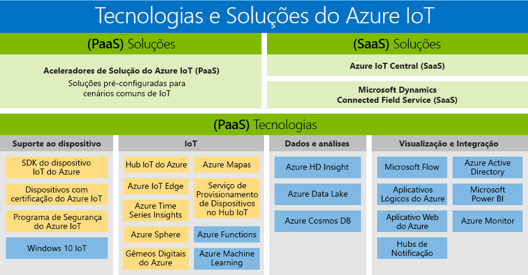

# Soluções e tecnologias de Internet das Coisas (IoT): PaaS e SaaS

A Microsoft criou um portfólio que atende às necessidades de todos os clientes, permitindo que qualquer pessoa tenha acesso aos benefícios de transformação digital. O portfólio de produtos de IoT do Azure é uma visão geral das tecnologias e soluções disponíveis de SaaS/PaaS. Apresenta os dois caminhos que estão disponíveis para criar sua própria solução:

- Plataforma como serviço (PaaS): criar seu aplicativo usando qualquer um dos seguintes serviços.
    - [Aceleradores de solução de Azure IoT](https://www.azureiotsolutions.com/), que são uma coleção de fornecem soluções empresariais pré-configuradas que permitem acelerar o desenvolvimento de soluções personalizadas de IoT, ou 
    - Serviço [Gêmeos Digitais do Azure](https://azure.microsoft.com/services/digital-twins/), que permite que você modele o ambiente físico para criar soluções de IoT reconhecimento contextual usando um grafo de inteligência espacial e modelos de objeto de domínio específico.

- Software como Serviço (SaaS): inicie rápido com o [Azure IoT Central](https://azure.microsoft.com/services/iot-central/), a nova solução de SaaS para desenvolver aplicativos de IoT sem ser exposto à complexidade da solução de IoT. Se a sua organização não tiver os recursos para criar sua própria solução de IoT, o Azure IoT Central será uma solução de IoT sem código que pode criar modelos de dispositivos, painéis e regras em minutos.

## Soluções

Introdução rápida aos aceleradores de solução e ofertas de SaaS. Escolha uma das soluções pré-configuradas que permitem cenários de IoT comuns, como monitoramento remoto, manutenção preditiva e alocador conectado, para criar uma solução totalmente personalizável. Ou use o Azure IoT Central, uma solução de ponta a ponta totalmente gerenciada que habilita cenários de IoT avançados sem exigir experiência em soluções de nuvem.

### Aceleradores de solução do Azure IoT (PaaS)

Os aceleradores de solução do Azure IoT são soluções PaaS personalizáveis que permitem um alto nível de controle sobre sua solução de IoT. Se a sua empresa estiver implementando IoT para operações conectadas ou tiver requisitos específicos de personalização para produtos conectados, os aceleradores de solução do Azure IoT oferecerão o controle necessário. 

As organizações com um grande número de dispositivos ou modelos de dispositivos e os fabricantes que procuram soluções de alocador conectadas são exemplos de empresas podem se beneficiar dos aceleradores de solução de IoT. Criando soluções altamente personalizáveis adaptadas a necessidades complexas, os aceleradores de solução de IoT fornecem: 

- Soluções predefinidas
    - Monitoramento remoto
    - Fábrica conectada
    - Manutenção preditiva
    - Simulação de dispositivo
- Capacidade de implantar em minutos
- Tempo de retorno acelerado
- Soluções que fornecem controle total 
 
### Azure IoT Central (SaaS)

Azure IoT Central é uma solução de SaaS totalmente gerenciada, que permite que você se familiarize rapidamente com experiência mínima em IoT. Se a sua empresa estiver buscando velocidade em vez de personalização, modelos de SaaS poderão ser a escolha ideal para suas necessidades de implementação de IoT. 

Organizações com menos modelos de dispositivos, os mais cenários previsíveis e recursos limitados de IoT/TI agora podem aproveitar os benefícios de IoT por meio de uma abordagem de SaaS. As empresas que anteriormente não tinham o tempo, o dinheiro e a experiência para desenvolver produtos conectados agora podem se familiarizar rapidamente com o Azure IoT Central. A Microsoft é líder de setor no fornecimento de uma solução de SaaS madura que trata os requisitos comuns de implementação de IoT. 

- SaaS de IoT totalmente gerenciado
- Nenhuma experiência em desenvolvimento de solução de nuvem necessária
- Configurável de acordo com suas necessidades
- Ideal para as necessidades de IoT simples

### Comparar os aceleradores de solução do Azure IoT e a Azure IoT Central

Para implementar uma típica [arquitetura de solução de IoT](/azure/iot-fundamentals/iot-introduction), o Azure IoT oferece várias opções, [aceleradores de solução do Azure IoT](/azure/iot-suite) e o [Azure IoT Central](https://www.microsoft.com/internet-of-things/iot-central-saas-solutions), cada uma adequada para diferentes conjuntos de requisitos do cliente.

O [Hub IoT do Azure](https://azure.microsoft.com/services/iot-hub/) é a principal PaaS do Azure usada pela Azure IoT Central e pelos aceleradores de solução do Azure IoT. O Hub IoT permite comunicações bidirecionais confiáveis e seguras entre milhões de dispositivos IoT e uma solução de nuvem. O Hub IoT ajuda a solucionar os desafios de implementação de IoT como:

* Conectividade e gerenciamento de dispositivo de alto volume.
* Ingestão de telemetria de alto volume.
* Comando e controle de dispositivos.
* Imposição de segurança de dispositivo.

Escolher seu produto do Azure IoT é uma parte essencial do planejamento da sua solução de IoT. O Hub IoT é um serviço individual do Azure que, por si só, não fornece uma solução de IoT de ponta a ponta. O Hub IoT pode ser usado como um ponto de partida para qualquer solução de IoT, e você não precisa dos aceleradores de solução do Azure IoT ou do Azure IoT Central para usá-lo. Os aceleradores de solução do Azure IoT e o Azure IoT Central usam o Hub IoT junto com outros serviços do Azure. A tabela a seguir resume as principais diferenças entre os aceleradores de solução do Azure IoT e o Azure IoT Central para ajudá-lo a escolher a opção correta para seus requisitos:

|                        | Aceleradores de solução de IoT do Azure | Azure IoT Central |
| ---------------------- | --------- | ----------- |
| Uso principal | Para acelerar o desenvolvimento de uma solução de IoT personalizada que precisa obter a máxima flexibilidade. | Para acelerar o tempo para colocação no mercado de soluções de IoT simples que não exigem personalização profunda de serviço. |
| Acesso a serviços PaaS subjacentes          | Você tem acesso aos serviços do Azure subjacentes para gerenciá-los ou substituí-los conforme necessário. | SaaS. Solução totalmente gerenciada, os serviços subjacentes não são expostos. |
| Flexibilidade            | Alta. O código para os microsserviços é de código aberto e pode ser modificado da maneira que desejar. Além disso, é possível personalizar a infraestrutura de implantação.| Média. Você pode usar a experiência do usuário baseada no navegador interno para personalizar o modelo da solução e os aspectos da interface do usuário. A infraestrutura não é personalizável porque os diferentes componentes não ficam expostos.|
| Nível de habilidade                 | Médio-alto. Você precisa habilidades no Java ou .NET para personalizar a solução de back-end. Você precisa de habilidades no JavaScript para personalizar a visualização. | Baixa. Você precisa de habilidades de modelagem para personalizar a solução. Nenhuma habilidade de codificação é necessária. |
| Experiência para começar | Os aceleradores de solução implementam cenários comuns de IoT. Podem ser implantados em minutos. | Modelos de aplicativo e de dispositivo fornecem modelos predefinidos. Podem ser implantados em minutos. |
| Preços                | Você pode ajustar os serviços para controlar o custo. | Estrutura de preços simples e previsíveis. |

A decisão de qual produto usar para criar sua solução de IoT acaba sendo determinada por:

* Seus requisitos empresariais
* O tipo de solução que você deseja criar
* O conjunto de habilidades de sua organização para criar e manter a solução no longo prazo

## Tecnologias (PaaS)

Com o portfólio de IoT mais abrangente de serviços de plataforma, as tecnologias de Plataforma como Serviço (PaaS) que abrangem a plataforma Azure permitem facilmente criar, personalizar e controlar todos os aspectos de sua solução de IoT. Estabeleça uma comunicação bidirecional com bilhões de dispositivos IoT e gerencie seus dispositivos de IoT em escala. Em seguida, integre seus dados de dispositivo de IoT aos outros serviços de plataforma, como Azure Cosmos DB e Azure Time Series Insights, para aprimorar os insights na sua solução. 

### Suporte a dispositivos

Comece a trabalhar em seu projeto de IoT com confiança aproveitando os [Kits de início do Azure IoT](https://catalog.azureiotsolutions.com/kits) ou escolhendo um entre as centenas de dispositivos Microsoft Azure Certified para IoT no [catálogo de dispositivos](https://catalog.azureiotsolutions.com/). Todos os dispositivos são independentes de plataforma e testados para permitir uma conexão perfeita ao Hub IoT.
Conecte todos os seus dispositivos ao Azure IoT usando os [SDKs de dispositivo](/azure/iot-hub/iot-hub-devguide-sdks) de código aberto. Os SDKs dão suporte a vários sistemas operacionais, como Linux, Windows e sistemas operacionais em tempo real, bem como a várias linguagens de programação, como [C](https://github.com/Azure/azure-iot-sdk-c), [Node.js](https://github.com/Azure/azure-iot-sdk-node), [Java](https://github.com/Azure/azure-iot-sdk-java), [.NET](https://github.com/Azure/azure-iot-sdk-csharp) e [Python](https://github.com/Azure/azure-iot-sdk-python).

### IoT 
O [Hub IoT do Azure](https://azure.microsoft.com/services/iot-hub/) é um serviço totalmente gerenciado que permite comunicações bidirecionais confiáveis e seguras entre milhões de dispositivos IoT e um back-end da solução. O Serviço de Provisionamento de Dispositivos no Hub IoT do Azure é um serviço auxiliar para o Hub IoT que permite o provisionamento de toque zero, Just-In-Time no Hub IoT correto sem necessidade de intervenção humana, permitindo que os clientes provisionem milhões de dispositivos de modo seguro e escalonável.

### Microsoft Edge
O [Azure IoT Edge](https://azure.microsoft.com/services/iot-edge/) é um serviço de IoT. Este serviço destina-se a clientes que desejam analisar dados em dispositivos, conhecido como "na borda". Movendo partes de sua carga de trabalho para a borda, você experimentará latência reduzida e terá a opção de cenários offline.

### Inteligência espacial
[Gêmeos Digitais do Azure](https://azure.microsoft.com/services/digital-twins/) é um serviço de IoT que permite que você crie um modelo de um ambiente físico. Ele fornece um gráfico de inteligência espacial para modelar as relações entre pessoas, espaços e dispositivos. Ao correlacionar dados no mundo digital e físico, você pode criar soluções de reconhecimento contextual.  

### Dados e análises
Aproveite uma matriz de dados do Azure e as ofertas de PaaS de análise em sua solução de IoT, desde introduzir a inteligência de nuvem na borda com o Azure Machine Learning até armazenar dados de dispositivo de IoT de maneira econômica com o Azure Data Lake e até a visualização de grande quantidade de dados de dispositivos de IoT com [Azure Time Series Insights](https://azure.microsoft.com/services/time-series-insights/).

### Visualização e integração
O Microsoft Azure oferece uma solução completa de nuvem, que combina uma coleção em constante crescimento dos serviços de nuvem integrados com um compromisso líder do setor para a proteção e a privacidade dos seus dados. Saiba mais sobre o [Microsoft Azure](https://azure.microsoft.com/).

## Próximas etapas

Confira a seção [Introdução à documentação do Hub IoT](/azure/iot-hub/iot-hub-get-started) para experimentar os recursos de IoT de modo rápido e fácil. Ou para uma experiência prática mais detalhada, experimente um dos [Tutoriais do IoT Edge](/azure/iot-edge/tutorial-simulate-device-windows).
