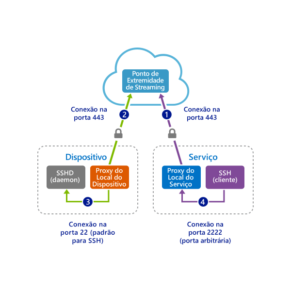
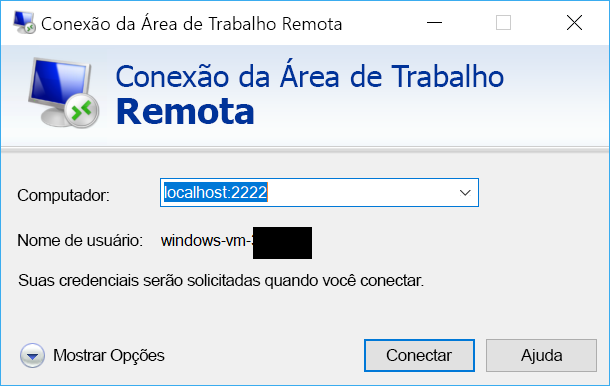

# <a name="quickstart-sshrdp-over-iot-hub-device-streams-using-c-proxy-applications-preview"></a>Início rápido: SSH/RDP em fluxos de dispositivos do Hub IoT usando aplicativos proxy C# (versão prévia)

[!INCLUDE [iot-hub-quickstarts-4-selector](../../includes/iot-hub-quickstarts-4-selector.md)]

Os [fluxos de dispositivos do Hub IoT](./iot-hub-device-streams-overview.md) permitem que aplicativos de serviço e dispositivo se comuniquem de maneira segura e simples para o firewall. Este guia de início rápido envolve dois programas C# que permitem que o tráfego de aplicativo para clientes/servidores (por exemplo, SSH e RDP) seja enviado em um fluxo de dispositivo estabelecido por meio do Hub IoT. Confira [aqui](./iot-hub-device-streams-overview.md#local-proxy-sample-for-ssh-or-rdp) uma visão geral da instalação.

Primeiro, descreveremos a configuração para SSH (com a porta 22). Em seguida, descreveremos como modificar a porta da configuração para RDP. Como os fluxos de dispositivo são independentes de protocolo e de aplicativo, a mesma amostra pode ser modificada para acomodar outros tipos de tráfego do aplicativo. Isso normalmente envolve apenas alterar a porta de comunicação para aquela usada pelo aplicativo pretendido.


## <a name="how-it-works"></a>Como ele funciona?

A figura abaixo ilustra a configuração de como os programas proxy no local do dispositivo e do serviço neste exemplo habilitarão a conectividade de ponta a ponta entre o cliente SSH e o daemon SSH. Aqui, vamos supor que o daemon está em execução no mesmo dispositivo que o proxy no local do dispositivo.



1. O proxy no local de serviço se conecta ao Hub IoT e inicia um fluxo de dispositivos para o dispositivo de destino usando sua ID de dispositivo.

2. O proxy no local do dispositivo conclui o handshake de inicialização do fluxo e estabelece um túnel de streaming de ponta a ponta através do ponto de extremidade de streaming do Hub IoT até o lado do serviço.

3. O proxy no local do dispositivo se conecta ao daemon SSH (SSHD) que escuta na porta 22 do dispositivo (essa porta é configurável, como descrito [abaixo](#run-the-device-side-application)).

4. O proxy no local do serviço aguarda novas conexões SSH do usuário, escutando em uma porta designada – no caso, a porta 2222 (também é configurável, como descrito [abaixo](#run-the-service-side-application)). Quando o usuário se conecta por meio do cliente SSH, o túnel habilita o tráfego de aplicativo a ocorrer entre os programas de cliente e servidor SSH.

> [!NOTE]
> O tráfego SSH que será enviado pelo fluxo será encapsulado através do ponto de extremidade de streaming do Hub IoT, em vez de ser enviado diretamente entre o serviço e o dispositivo. Isso proporciona [esses benefícios](./iot-hub-device-streams-overview.md#benefits).

[!INCLUDE [cloud-shell-try-it.md](../../includes/cloud-shell-try-it.md)]

Se você não tiver uma assinatura do Azure, crie uma [conta gratuita](https://azure.microsoft.com/free/?WT.mc_id=A261C142F) antes de começar.

## <a name="prerequisites"></a>Pré-requisitos

Os dois exemplos de aplicativo executados neste início rápido são escritos usando o C#. É necessário ter o SDK do .NET Core 2.1.0 ou maior no computador de desenvolvimento.

Você pode fazer o download do SDK do .NET Core para várias plataformas a partir do [.NET](https://www.microsoft.com/net/download/all).

Verifique a versão atual do C# no computador de desenvolvimento usando o seguinte comando:

```
dotnet --version
```

Faça o download do projeto de exemplo em C# do https://github.com/Azure-Samples/azure-iot-samples-csharp/archive/master.zip e extraia o arquivo ZIP.


## <a name="create-an-iot-hub"></a>Crie um hub IoT

[!INCLUDE [iot-hub-include-create-hub](../../includes/iot-hub-include-create-hub-device-streams.md)]

## <a name="register-a-device"></a>Registrar um dispositivo

Um dispositivo deve ser registrado no hub IoT antes de poder se conectar. Neste início rápido, você usa o Azure Cloud Shell para registrar um dispositivo simulado.

1. Execute os seguintes comandos no Azure Cloud Shell para adicionar a extensão da CLI do Hub IoT e criar a identidade do dispositivo. 

   **YourIoTHubName**: substitua o espaço reservado abaixo pelo nome escolhido para o hub IoT.

   **MyDevice**: Esse é o nome fornecido para o dispositivo registrado. Use MyDevice, conforme mostrado. Se você escolher um nome diferente para seu dispositivo, você também precisará usar esse nome ao longo deste artigo e atualizar o nome de dispositivo nos aplicativos de exemplo antes de executá-los.

    ```azurecli-interactive
    az extension add --name azure-cli-iot-ext
    az iot hub device-identity create --hub-name YourIoTHubName --device-id MyDevice
    ```

2. Execute os seguintes comandos no Azure Cloud Shell para obter a _cadeia de conexão de dispositivo_ referente ao dispositivo que você acabou de registrar:

   **YourIoTHubName**: substitua o espaço reservado abaixo pelo nome escolhido para o hub IoT.

    ```azurecli-interactive
    az iot hub device-identity show-connection-string --hub-name YourIoTHubName --device-id MyDevice --output table
    ```

    Anote a cadeia de conexão do dispositivo, que se parece com o exemplo a seguir:

   `HostName={YourIoTHubName}.azure-devices.net;DeviceId=MyDevice;SharedAccessKey={YourSharedAccessKey}`

    Você usará esse valor posteriormente no início rápido.

3. Você também precisa de _cadeia de conexão de serviço_ do Hub IoT para habilitar o aplicativo do lado do serviço para se conectar ao Hub IoT e estabelecer um fluxo de dispositivos. O comando a seguir recupera esse valor para o Hub IoT:

   **YourIoTHubName**: substitua o espaço reservado abaixo pelo nome escolhido para o hub IoT.

    ```azurecli-interactive
    az iot hub show-connection-string --policy-name service --hub-name YourIoTHubName
    ```

    Anote o valor retornado, que tem esta aparência:

   `"HostName={YourIoTHubName}.azure-devices.net;SharedAccessKeyName=service;SharedAccessKey={YourSharedAccessKey}"`
    

## <a name="ssh-to-a-device-via-device-streams"></a>SSH para um dispositivo por fluxos de dispositivos

### <a name="run-the-service-side-proxy"></a>Executar o proxy do lado do serviço

Navegue até `device-streams-proxy/service` na pasta do projeto descompactada. Você precisará das informações a seguir:

| Nome do parâmetro | Valor de parâmetro |
|----------------|-----------------|
| `iotHubConnectionString` | A cadeia de conexão de serviço do seu Hub IoT. |
| `deviceId` | O identificador do dispositivo que você criou anteriormente. |
| `localPortNumber` | Uma porta local em que seu cliente SSH vai se conectar. Usamos a porta 2222 neste exemplo, mas você poderia modificar para outros números arbitrários. |

Compile e execute o código conforme segue:

```
cd ./iot-hub/Quickstarts/device-streams-proxy/service/

# Build the application
dotnet build

# Run the application
# In Linux/MacOS
dotnet run $serviceConnectionString MyDevice 2222

# In Windows
dotnet run %serviceConnectionString% MyDevice 2222
```

### <a name="run-the-device-local-proxy"></a>Executar o proxy no local do dispositivo

Navegue até `device-streams-proxy/device` na pasta do projeto descompactada. Você precisará das informações a seguir:

| Nome do argumento | Valor do argumento |
|----------------|-----------------|
| `deviceConnectionString` | A cadeia de conexão do dispositivo que você criou anteriormente. |
| `targetServiceHostName` | O endereço IP em que o servidor SSH escuta (seria `localhost` se fosse igual ao IP no qual o proxy no local do dispositivo está em execução). |
| `targetServicePort` | A porta usada pelo seu protocolo de aplicativo (por padrão, seria a porta 22 para SSH).  |

Compile e execute o código conforme segue:

```
cd ./iot-hub/Quickstarts/device-streams-proxy/device/

# Build the application
dotnet build

# Run the application
# In Linux/MacOS
dotnet run $deviceConnectionString localhost 22

# In Windows
dotnet run %deviceConnectionString% localhost 22
```

Agora, use o programa do cliente SSH e se conecte ao proxy no local de serviço na porta 2222 (em vez do daemon SSH diretamente). 

```
ssh <username>@localhost -p 2222
```

Neste ponto, você verá o prompt de logon do SSH para inserir suas credenciais.

Saída do console no lado do serviço (o proxy do local de serviço escuta na porta 2222):


Saída do console no proxy no local do dispositivo que se conecta ao daemon SSH em `IP_address:22`:

]Texto Alt(./media/quickstart-device-streams-proxy-csharp/device-console-output.png "")Saída de proxy no local do dispositivo")

Saída do console do programa do cliente SSH (o cliente SSH se comunica com o daemon SSH conectando-se à porta 22 na qual o proxy do local de serviço está escutando):


## <a name="rdp-to-a-device-via-device-streams"></a>RDP para um dispositivo por fluxos de dispositivos

A configuração para o RDP é muito semelhante ao SSH (descrito acima). Basicamente, precisamos usar o IP de destino do RDP e a porta 3389 e usar o cliente RDP (em vez do cliente SSH).

### <a name="run-the-service-side-application"></a>Executar o aplicativo do lado do serviço

Navegue até `device-streams-proxy/service` na pasta do projeto descompactada. Você precisará das informações a seguir:

| Nome do parâmetro | Valor de parâmetro |
|----------------|-----------------|
| `iotHubConnectionString` | A cadeia de conexão de serviço do seu Hub IoT. |
| `deviceId` | O identificador do dispositivo que você criou anteriormente. |
| `localPortNumber` | Uma porta local em que seu cliente SSH vai se conectar. Usamos a porta 2222 neste exemplo, mas você poderia modificar para outros números arbitrários. |

Compile e execute o código conforme segue:

```
cd ./iot-hub/Quickstarts/device-streams-proxy/service/

# Build the application
dotnet build

# Run the application
# In Linux/MacOS
dotnet run $serviceConnectionString MyDevice 2222

# In Windows
dotnet run %serviceConnectionString% MyDevice 2222
```

### <a name="run-the-device-side-application"></a>Executar o aplicativo do lado do dispositivo

Navegue até `device-streams-proxy/device` na pasta do projeto descompactada. Você precisará das informações a seguir:

| Nome do argumento | Valor do argumento |
|----------------|-----------------|
| `DeviceConnectionString` | A cadeia de conexão do dispositivo que você criou anteriormente. |
| `targetServiceHostName` | O nome de host ou endereço IP em que o servidor RDP é executado (seria `localhost` se fosse igual ao IP no qual o proxy no local do dispositivo está em execução). |
| `targetServicePort` | A porta usada pelo seu protocolo de aplicativo (por padrão, seria a porta 3389 para RDP).  |

Compile e execute o código conforme segue:

```
cd ./iot-hub/Quickstarts/device-streams-proxy/device

# Run the application
# In Linux/MacOS
dotnet run $DeviceConnectionString localhost 3389

# In Windows
dotnet run %DeviceConnectionString% localhost 3389
```

Agora, use o programa do cliente RDP e se conecte ao proxy local do serviço na porta 2222 (uma porta disponível arbitrária que você escolheu anteriormente).



## <a name="clean-up-resources"></a>Limpar recursos

[!INCLUDE [iot-hub-quickstarts-clean-up-resources](../../includes/iot-hub-quickstarts-clean-up-resources-device-streams.md)]

## <a name="next-steps"></a>Próximas etapas

Neste início rápido, você configurou um Hub IoT, registrou um dispositivo, implantou um programa proxy no local do dispositivo e do serviço para estabelecer um fluxo de dispositivos através do Hub IoT e utilizou os proxies para colocar o tráfego SSH ou RDP em um túnel. O mesmo paradigma pode acomodar outros protocolos de cliente/servidor (em que o servidor é executado no dispositivo, por exemplo, o daemon SSH).

Use os links abaixo para saber mais sobre fluxos de dispositivos:

> [!div class="nextstepaction"]
> [Visão geral dos fluxos de dispositivos](./iot-hub-device-streams-overview.md)
