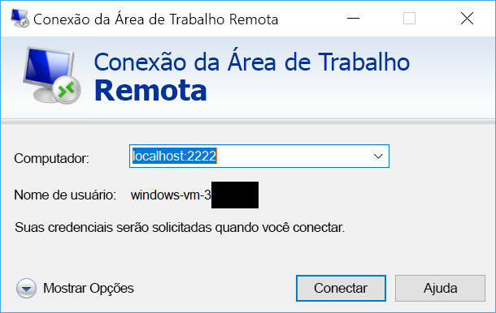

# <a name="quickstart-sshrdp-over-iot-hub-device-streams-using-nodejs-proxy-application-preview"></a>Início Rápido: SSH/RDP em fluxos de dispositivos do Hub IoT usando o aplicativo proxy Node.js (versão prévia)

[!INCLUDE [iot-hub-quickstarts-4-selector](../../includes/iot-hub-quickstarts-4-selector.md)]

Os [fluxos de dispositivos do Hub IoT](./iot-hub-device-streams-overview.md) permitem que aplicativos de serviço e dispositivo se comuniquem de maneira segura e simples para o firewall. Este guia de início rápido descreve a execução de um aplicativo proxy Node.js no lado do serviço para habilitar o tráfego SSH e RDP para envio ao dispositivo por um fluxo de dispositivos. Confira [aqui](./iot-hub-device-streams-overview.md#local-proxy-sample-for-ssh-or-rdp) uma visão geral da instalação. Durante a versão prévia pública, o SDK do Node.js dá suporte somente a fluxos de dispositivos no lado do serviço. Consequentemente, este guia de início rápido contém apenas instruções para executar o proxy local do serviço. Você deve executar um proxy local do dispositivo que acompanha, que está disponível nos guias [início rápido do C](./quickstart-device-streams-proxy-c.md) ou [início rápido do C#](./quickstart-device-streams-proxy-csharp.md).

Primeiro, descreveremos a configuração para SSH (com a porta 22). Em seguida, descreveremos como modificar a configuração para RDP (que usa a porta 3389). Como os fluxos de dispositivos são independentes de protocolo e de aplicativo, a mesma amostra pode ser modificada para acomodar outros tipos de tráfego do aplicativo para clientes/servidores (normalmente, alterando a porta de comunicação).


[!INCLUDE [cloud-shell-try-it.md](../../includes/cloud-shell-try-it.md)]

Se você não tiver uma assinatura do Azure, crie uma [conta gratuita](https://azure.microsoft.com/free/?WT.mc_id=A261C142F) antes de começar.


## <a name="prerequisites"></a>Pré-requisitos

Para executar o aplicativo local do serviço neste início rápido, você precisa do Node.js v4.x.x ou posterior no computador de desenvolvimento.

Você pode fazer o download do Node.js para várias plataformas a partir do [nodejs.org](https://nodejs.org).

Você pode verificar a versão atual do Node.js no computador de desenvolvimento usando o seguinte comando:

```
node --version
```

Caso ainda não tenha feito isso, faça o download do projeto de exemplo do Node.js do https://github.com/Azure-Samples/azure-iot-samples-node/archive/streams-preview.zip e extraia o arquivo ZIP.


## <a name="create-an-iot-hub"></a>Crie um hub IoT

Se tiver concluído o [Início Rápido: enviar telemetria de um dispositivo para um hub IoT](quickstart-send-telemetry-node.md), pode ignorar esta etapa.

[!INCLUDE [iot-hub-include-create-hub](../../includes/iot-hub-include-create-hub-device-streams.md)]


## <a name="register-a-device"></a>Registrar um dispositivo

Se tiver concluído o [Início Rápido: enviar telemetria de um dispositivo para um hub IoT](quickstart-send-telemetry-node.md), pode ignorar esta etapa.

Um dispositivo deve ser registrado no hub IoT antes de poder se conectar. Neste início rápido, você usa o Azure Cloud Shell para registrar um dispositivo simulado.

1. Execute os seguintes comandos no Azure Cloud Shell para adicionar a extensão da CLI do Hub IoT e criar a identidade do dispositivo. 

   **YourIoTHubName**: substitua o espaço reservado abaixo pelo nome escolhido para o hub IoT.

   **MyDevice**: Esse é o nome fornecido para o dispositivo registrado. Use MyDevice, conforme mostrado. Se você escolher um nome diferente para seu dispositivo, você também precisará usar esse nome ao longo deste artigo e atualizar o nome de dispositivo nos aplicativos de exemplo antes de executá-los.

    ```azurecli-interactive
    az extension add --name azure-cli-iot-ext
    az iot hub device-identity create --hub-name YourIoTHubName --device-id MyDevice
    ```

2. Você também precisa de uma _cadeia de conexão de serviço_ para permitir que aplicativos de back-end se conectem ao seu hub IoT e recuperem mensagens. O comando abaixo recupera a cadeia de conexão de serviço para o hub IoT:

    **YourIoTHubName**: substitua o espaço reservado abaixo pelo nome escolhido para o hub IoT.

    ```azurecli-interactive
    az iot hub show-connection-string --policy-name service --hub-name YourIoTHubName
    ```

    Anote o valor retornado, que tem esta aparência:

   `"HostName={YourIoTHubName}.azure-devices.net;SharedAccessKeyName=service;SharedAccessKey={YourSharedAccessKey}"`


## <a name="ssh-to-a-device-via-device-streams"></a>SSH para um dispositivo por fluxos de dispositivos

### <a name="run-the-device-local-proxy"></a>Executar o proxy no local do dispositivo

Como mencionado anteriormente, o SDK do Node.js do Hub IoT dá suporte somente a fluxos de dispositivos no lado do serviço. Para aplicativo local do dispositivo, use os programas de proxy de dispositivo que acompanham, disponíveis nos guias de [início rápido do C](./quickstart-device-streams-proxy-c.md) ou [início rápido do C#](./quickstart-device-streams-proxy-csharp.md). Verifique se o proxy local do dispositivo está em execução antes de prosseguir para a próxima etapa.


### <a name="run-the-service-local-proxy"></a>Executar o proxy local do serviço

Supondo que o [proxy de local do dispositivo](#run-the-device-local-proxy) está em execução, siga as etapas abaixo para executar o proxy local do serviço escrito em Node.js.

- forneça suas credenciais de serviço, a identificação do dispositivo de destino no qual o daemon SSH é executado e o número da porta para o proxy em execução no dispositivo como variáveis de ambiente.
```
  # In Linux
  export IOTHUB_CONNECTION_STRING="<provide_your_service_connection_string>"
  export STREAMING_TARGET_DEVICE="MyDevice"
  export PROXY_PORT=2222

  # In Windows
  SET IOTHUB_CONNECTION_STRING=<provide_your_service_connection_string>
  SET STREAMING_TARGET_DEVICE=MyDevice
  SET PROXY_PORT=2222
```
Altere os valores acima para que coincidam com a cadeia de conexão e de ID do dispositivo.

- Navegue até `Quickstarts/device-streams-service` na pasta de projeto descompactada e execute o proxy do local de serviço.
```
  cd azure-iot-samples-node-streams-preview/iot-hub/Quickstarts/device-streams-service

  # Install the preview service SDK, and other dependencies
  npm install azure-iothub@streams-preview
  npm install

  # Run the service-local proxy application
  node proxy.js
```

### <a name="ssh-to-your-device-via-device-streams"></a>SSH para o dispositivo por fluxos de dispositivos
No Linux, execute o SSH usando `ssh $USER@localhost -p 2222` em um terminal. No Windows, use seu cliente SSH favorito (por exemplo, PuTTY).

Saída do console no local do serviço após o estabelecimento da sessão SSH (o proxy do local de serviço escuta na porta 2222): 


Saída do console do programa do cliente SSH (o cliente SSH se comunica com o daemon SSH conectando-se à porta 22 na qual o proxy do local de serviço está escutando): 


### <a name="rdp-to-your-device-via-device-streams"></a>RDP para o dispositivo por fluxos de dispositivos

Agora, utilize o programa do cliente RDP e se conecte ao proxy de serviço na porta 2222 (uma porta disponível arbitrária que você escolheu anteriormente).

> [!NOTE]
> Certifique-se de que o proxy do dispositivo foi configurado corretamente para RDP e configurado com a porta RDP 3389.




## <a name="clean-up-resources"></a>Limpar recursos

[!INCLUDE [iot-hub-quickstarts-clean-up-resources](../../includes/iot-hub-quickstarts-clean-up-resources-device-streams.md)]

## <a name="next-steps"></a>Próximas etapas

Neste início rápido, você configurou um hub IoT, registrou um dispositivo e implantou um programa de proxy de serviço para habilitar RDP e SSH para um dispositivo IoT. O tráfego RDP e SSH será encapsulado por meio de um fluxo de dispositivo através do Hub IoT. Isso elimina a necessidade de conectividade direta com o dispositivo.

Use os links abaixo para saber mais sobre fluxos de dispositivos:

> [!div class="nextstepaction"]
> [Visão geral dos fluxos de dispositivos](./iot-hub-device-streams-overview.md)
