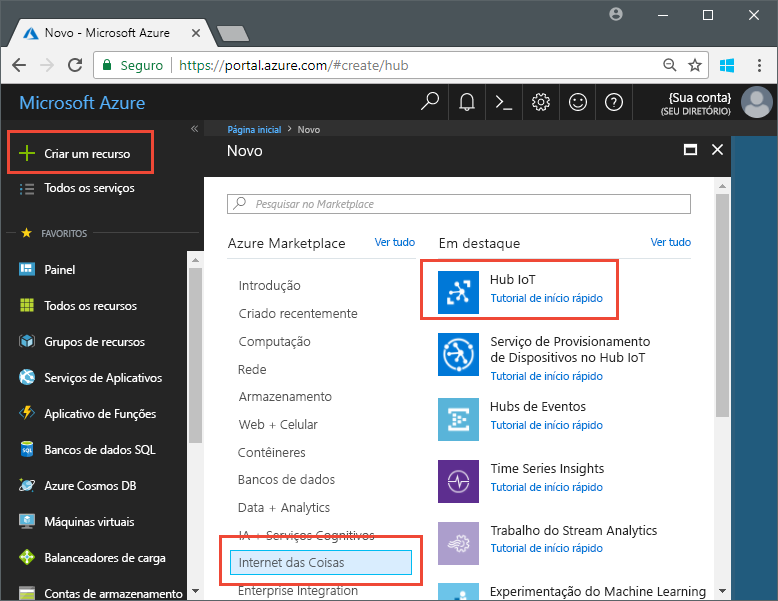
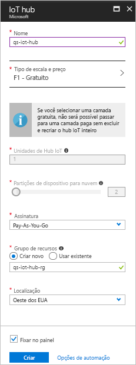

# <a name="send-telemetry-from-a-device-to-an-iot-hub-swift"></a>Enviar telemetria de um dispositivo para um Hub IoT (Swift)

O Hub IoT é um serviço do Azure que permite a ingestão de grandes volumes de telemetria de seus dispositivos IoT pela nuvem para processamento ou armazenamento. Neste artigo, você envia telemetria de um aplicativo de dispositivo simulado para o Hub IoT. Em seguida, você exibe os dados em um aplicativo de back-end. 

Este artigo usa um aplicativo Swift previamente codificado para enviar a telemetria e um utilitário CLI para ler a telemetria do Hub IoT. 

[!INCLUDE [cloud-shell-try-it.md](../../includes/cloud-shell-try-it.md)]

Se você não tiver uma assinatura do Azure, crie uma [conta gratuita](https://azure.microsoft.com/free/?WT.mc_id=A261C142F) antes de começar.

## <a name="prerequisites"></a>pré-requisitos

- Baixe o exemplo de código dos [exemplos do Azure](https://github.com/Azure-Samples/azure-iot-samples-ios/archive/master.zip) 
- A última versão do [XCode](https://developer.apple.com/xcode/) executando a última versão do SDK do iOS. Este início rápido foi testado com o XCode 9.3 e o iOS 11.3.
- A última versão do [CocoaPods](https://guides.cocoapods.org/using/getting-started.html).
- O utilitário CLI iothub-explorer, que lê a telemetria do Hub IoT. Para instalar, primeiro instale o [Node.js](https://nodejs.org) v4.x.x ou superior e execute o seguinte comando: 

   ```sh
   sudo npm install -g iothub-explorer
   ```

## <a name="create-an-iot-hub"></a>Crie um hub IoT

A primeira etapa é usar o portal do Azure para criar um hub IoT na sua assinatura. O hub IoT permite a ingestão de grandes volumes de telemetria de vários dispositivos pela nuvem. O hub, em seguida, permite que um ou mais serviços de back-end em execução na nuvem leiam e processem essa telemetria.

1. Entre no [Portal do Azure](http://portal.azure.com).

1. Selecione **Criar um recurso** > **Internet das Coisas** > **Hub IoT**. 

   

1. Para criar o hub IoT, use os valores na tabela abaixo:

    | Configuração | Valor |
    | ------- | ----- |
    | NOME | Um nome exclusivo para seu hub |
    | Tipo e escala de preço | F1 Gratuito |
    | Unidades do Hub IoT | 1 |
    | Partições de dispositivo para nuvem | 2 partições |
    | Assinatura | Sua assinatura do Azure. |
    | Grupo de recursos | Criar novo. Insira um nome para seu grupo de recursos. |
    | Local padrão | O local mais próximo de você. |
    | Fixar no painel | sim |

1. Clique em **Criar**.  

   

1. Anote os nomes do grupo de recursos e do hub IoT. Você usará esses valores posteriormente neste início rápido.

## <a name="register-a-device"></a>Registrar um dispositivo

Um dispositivo deve ser registrado no hub IoT antes de poder se conectar. Neste início rápido, você usa a CLI do Azure para registrar um dispositivo simulado.

1. Adicione a extensão CLI do Hub IoT e crie a identidade do dispositivo. Substitua `{YourIoTHubName}` por um nome para o hub IoT:

   ```azurecli-interactive
   az extension add --name azure-cli-iot-ext
   az iot hub device-identity create --hub-name {YourIoTHubName} --device-id myiOSdevice
   ```

    Se você escolher um nome diferente para seu dispositivo, atualize o nome de dispositivo nos aplicativos de exemplo antes de executá-los.

1. Execute o seguinte comando para obter a _cadeia de conexão de dispositivo_ do dispositivo que você acabou de registrar:

   ```azurecli-interactive
   az iot hub device-identity show-connection-string --hub-name {YourIoTHubName} --device-id myiOSdevice --output table
   ```

   Anote a cadeia de conexão do dispositivo, que se parece com `Hostname=...=`. Você usará esse valor posteriormente no artigo.

1. Você também precisa de uma _cadeia de conexão de serviço_ para permitir que aplicativos de back-end se conectem ao seu hub IoT e recuperem mensagens do dispositivo para a nuvem. O comando abaixo recupera a cadeia de conexão de serviço para o hub IoT:

   ```azurecli-interactive
   az iot hub show-connection-string --hub-name {YourIoTHubName} --output table
   ```

   Anote a cadeia de conexão de serviço, que se parece com `Hostname=...=`. Você usará esse valor posteriormente no artigo.

## <a name="send-simulated-telemetry"></a>Enviar telemetria simulada

O aplicativo de exemplo é executado em um dispositivo iOS, que se conecta a um ponto de extremidade específico do dispositivo em seu hub IoT e envia telemetria simulada de temperatura e umidade. 

### <a name="install-cocoapods"></a>Instalar CocoaPods

Os CocoaPods gerenciam dependências para projetos do iOS que usam bibliotecas de terceiros.

Em uma janela de terminal, navegue até a pasta Azure-IoT-Samples-iOS que você baixou nos pré-requisitos. Em seguida, navegue até o projeto de exemplo:

```sh
cd quickstart/sample-device
```

Verifique se o XCode está fechado e execute o comando abaixo para instalar os CocoaPods declarados no arquivo **podfile**:

```sh
pod install
```

Além de instalar os pods necessários para o projeto, o comando de instalação também criou um arquivo de espaço de trabalho do XCode que já está configurado para usar os pods para dependências. 

### <a name="run-the-sample-application"></a>Executar o aplicativo de exemplo 

1. Abra o espaço de trabalho de exemplo no XCode.

   ```sh
   open "MQTT Client Sample.xcworkspace"
   ```

2. Expanda o projeto **Exemplo do Cliente MQTT** e a pasta com o mesmo nome.  
3. Abra **ViewController.swift** para edição no XCode. 
4. Pesquise a variável **connectionString** e atualize o valor com a cadeia de conexão do dispositivo anotado anteriormente.
5. Salve suas alterações. 
6. Execute o projeto no emulador de dispositivo com o botão **Compilar e executar** ou a combinação de teclas **Command + R**. 

   

7. Quando o emulador for aberto, selecione **Iniciar** no aplicativo de exemplo.

A captura de tela a seguir mostra alguns exemplos de saída à medida que o aplicativo envia telemetria simulada para o hub IoT:

   

## <a name="read-the-telemetry-from-your-hub"></a>Ler a telemetria do hub

O aplicativo de exemplo que você executou no emulador do XCode mostra dados sobre as mensagens enviadas do dispositivo. Você também pode exibir os dados por meio do hub IoT conforme vão sendo recebidos. O utilitário CLI `iothub-explorer` se conecta ao ponto de extremidade **Eventos** do lado do serviço no Hub IoT. 

Abra uma nova janela de terminal. Execute o comando abaixo substituindo {cadeia de conexão de serviço do hub} pela cadeia de conexão de serviço que você recuperou no início deste artigo:

```sh
iothub-explorer monitor-events myiOSdevice --login "{your hub service connection string}"
```

A captura de tela abaixo mostra o tipo de telemetria mostrada na janela de terminal:


Se você receber um erro ao executar o comando do iothub-explorer, verifique se você está usando a *cadeia de conexão de serviço* para o hub IoT em vez da *cadeia de conexão de dispositivo* para seu dispositivo IoT. As duas cadeias de conexão começam com **Hostname={iothubname}**, mas a cadeia de conexão de serviço contém a propriedade **SharedAccessKeyName** e a cadeia de conexão do dispositivo contém o **DeviceID**. 

## <a name="clean-up-resources"></a>Limpar recursos

Se você planeja continuar testando o Hub IoT com outros artigos, saia do seu grupo de recursos e o hub IoT e reutilize-os posteriormente.

Se você não precisar mais do hub IoT, exclua-o junto com o grupo de recursos no portal. Para isso, selecione o grupo de recursos que contém o Hub IoT e clique em **Excluir**.

## <a name="next-steps"></a>Próximas etapas

Neste artigo, você configurou um hub IoT, registrou um dispositivo, enviou telemetria simulada para o hub de um dispositivo iOS e leu a telemetria do hub. 

Para saber mais sobre como os dispositivos iOS podem trabalhar com o Hub IoT, confira [Enviar mensagens de nuvem para dispositivo com iOS (Swift)](iot-hub-ios-swift-c2d.md)

<!-- Links -->
[lnk-process-d2c-tutorial]: iot-hub-csharp-csharp-process-d2c.md
[lnk-device-management]: iot-hub-node-node-device-management-get-started.md
[lnk-iot-edge]: ../iot-edge/tutorial-simulate-device-linux.md
[lnk-connect-device]: https://azure.microsoft.com/develop/iot/
