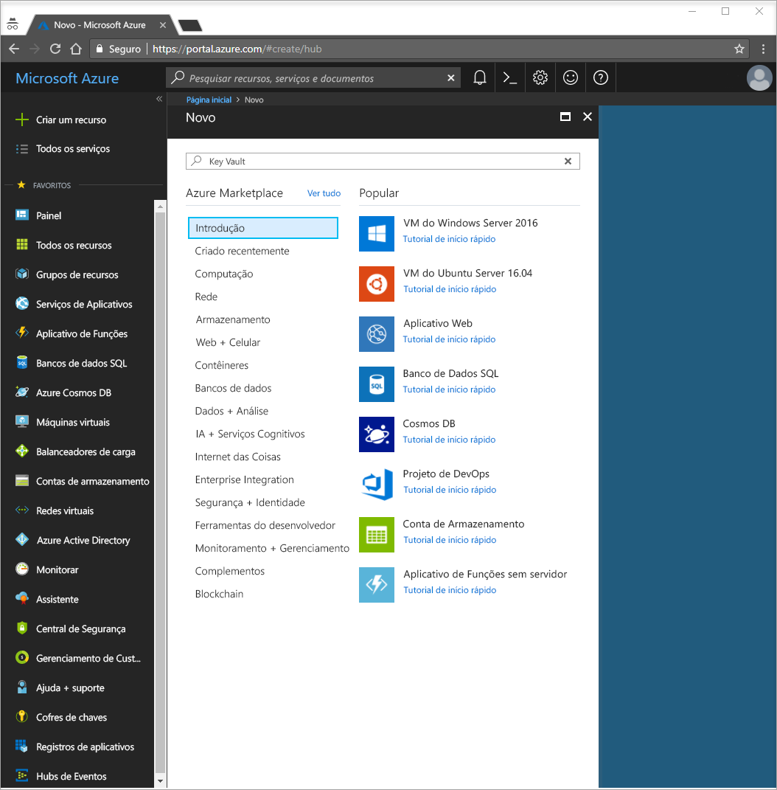
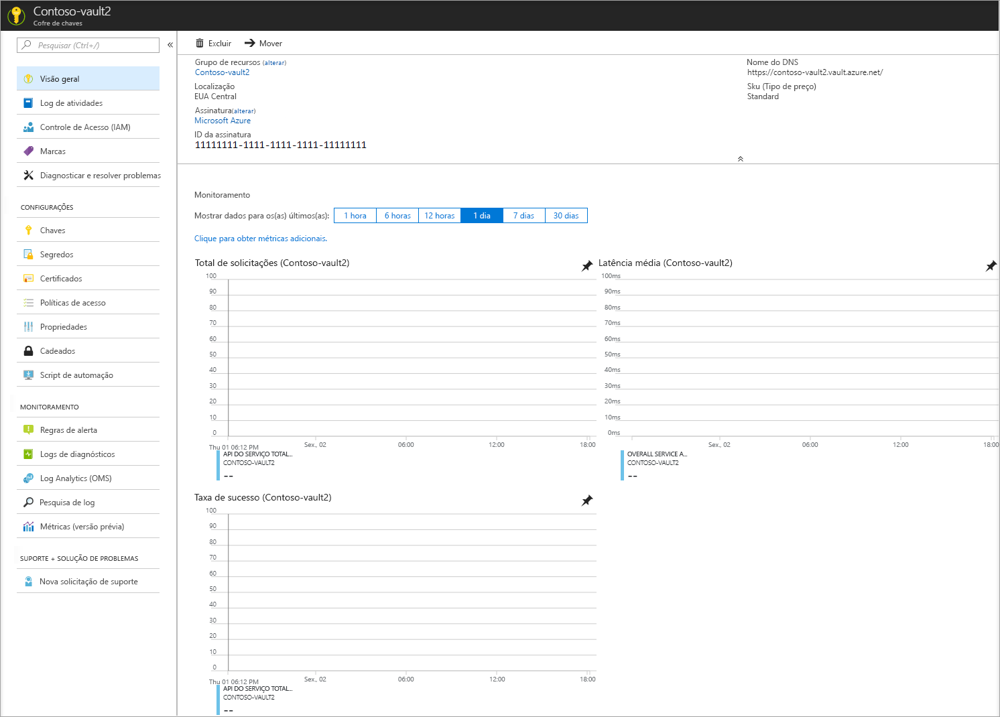
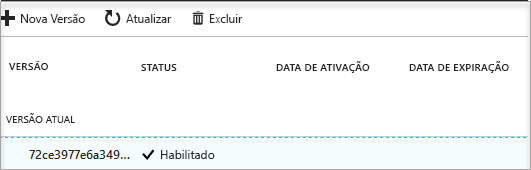

# Início Rápido: Criar um Key Vault usando o Portal do Azure

O Azure Key Vault é um serviço de nuvem que funciona como um repositório de segredos seguro. Você pode armazenar chaves, senhas, certificados e outros segredos com segurança. Para saber mais sobre o Key Vault, reveja a [Visão geral](key-vault-overview.md). Os cofres de chaves do Azure podem ser criados e gerenciados por meio do portal do Azure. Neste guia de início rápido, você criará um cofre de chaves. Depois de concluído, você armazenará um segredo.

Se você não tiver uma assinatura do Azure, crie uma [conta gratuita](https://azure.microsoft.com/free/?WT.mc_id=A261C142F) antes de começar.

## Fazer logon no Azure

Faça logon no Portal do Azure em http://portal.azure.com.

## Criar um cofre

1. Selecione a opção **Criar um recurso** no canto superior esquerdo do portal do Azure

    
2. Digite **Key Vault** na caixa de pesquisa.
3. Na lista de resultados, escolha **Key Vault**.
4. Na seção Key Vault, escolha **Criar**.
5. A seção **Criar cofre de chaves** fornece as seguintes informações:
    - **Nome**: neste início rápido, usamos **Contoso-vault2**. Você deve fornecer um nome exclusivo para o teste.
    - **Assinatura**: escolha a assinatura que você usará neste início rápido.
    - Em **Grupo de Recursos**, escolha **Criar novo** e digite um nome para o grupo de recursos.
    - No menu suspenso **Localização**, escolha uma localização.
    - Marque a caixa de seleção **Fixar no painel**.
    - Deixe as outras opções em seus padrões.
6. Depois de fornecer as informações acima, selecione **Criar**.

Observe as duas propriedades listadas abaixo:

* **Nome do Cofre**: no exemplo, é **Contoso-Vault2**. Você usará esse nome nas outras etapas.
* **URI do cofre**: no exemplo, isso é https://contoso-vault2.vault.azure.net/. Aplicativos que usam seu cofre via API REST devem usar esse URI.

Neste momento, sua conta do Azure é a única autorizada a executar operações nesse novo cofre.

## Adicionar um segredo ao Key Vault

Para adicionar um segredo ao cofre, basta executar algumas etapas adicionais. Nesse caso, adicionamos uma senha que pode ser usada por um aplicativo. A senha é chamada **ExamplePassword**, e armazenamos o valor de **Pa$$w0rd** nele.

1. Na página de propriedades do Key Vault, selecione **Segredos**.
2. Clique em **Gerar/Importar**.
3. Na tela **Criar um segredo**, escolha o seguinte:
    - **Opções de carregamento**: manual.
    - **Nome**: ExamplePassword.
    - **Valor**: Pa$$w0rd.
    - Deixe os outros valores com seus padrões. Clique em **Criar**.

Quando receber a mensagem de que o segredo foi criado com êxito, clique nele na lista. Você pode ver algumas das propriedades. Se você clicar na versão atual, poderá ver o valor especificado na etapa anterior.

## Limpar recursos

Outros tutoriais e inícios rápidos do Key Vault complementam este início rápido. Se você planeja continuar a trabalhar com os tutoriais e inícios rápidos subsequentes, deixe esses recursos onde estão.
Quando não for mais necessário, exclua o grupo de recursos e ele excluirá o Key Vault e os recursos relacionados. Para excluir o grupo de recursos pelo portal:

1. Insira o nome do grupo de recursos na caixa de pesquisa na parte superior do portal. Quando você vir o grupo de recursos usado neste início rápido nos resultados da pesquisa, selecione-o.
2. Selecione **Excluir grupo de recursos**.
3. Na caixa **DIGITE O NOME DO GRUPO DE RECURSOS:**, digite o nome do grupo de recursos e selecione **Excluir**.

## Próximas etapas

Neste início rápido, você criou um Key Vault e armazenou um segredo. Para saber mais sobre o Key Vault e como você pode usá-lo com seus aplicativos, prossiga para o tutorial de aplicativos Web que trabalham com o Key Vault.

> [!div class="nextstepaction"]
> [Usar o Azure Key Vault de um aplicativo Web](key-vault-use-from-web-application.md) Para saber como ler um segredo do Key Vault usando um aplicativo Web com [identidade de serviço gerenciada](/active-directory/managed-service-identity/overview.md), continue com o tutorial a seguir, [Configurar um aplicativo Web do Azure para ler um segredo do Key Vault](tutorial-web-application-keyvault.md)
