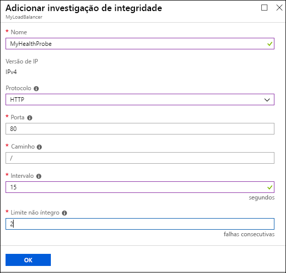
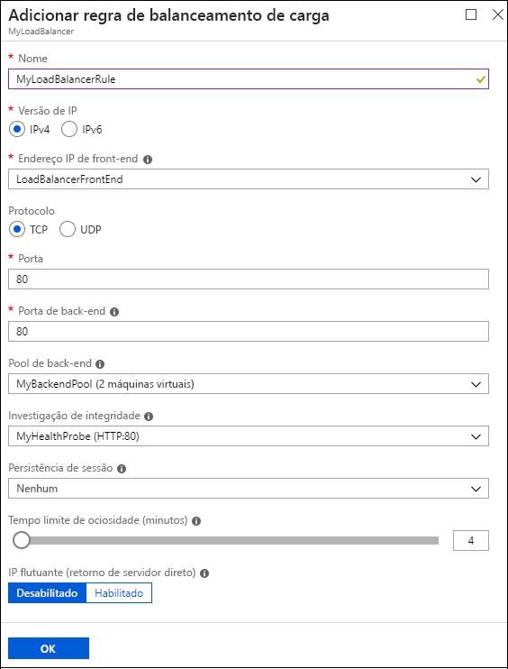

# Criar um balanceador de carga para a Internet usando o Portal do Azure

> [!div class="op_single_selector"]
> * [Portal](../load-balancer/load-balancer-get-started-internet-portal.md)
> * [PowerShell](../load-balancer/load-balancer-get-started-internet-arm-ps.md)
> * [CLI do Azure](../load-balancer/load-balancer-get-started-internet-arm-cli.md)
> * [Modelo](../load-balancer/load-balancer-get-started-internet-arm-template.md)

[!INCLUDE [load-balancer-basic-sku-include.md](../../includes/load-balancer-basic-sku-include.md)]

[!INCLUDE [load-balancer-get-started-internet-intro-include.md](../../includes/load-balancer-get-started-internet-intro-include.md)]

Este artigo aborda o modelo de implantação do Gerenciador de Recursos.

[!INCLUDE [load-balancer-get-started-internet-scenario-include.md](../../includes/load-balancer-get-started-internet-scenario-include.md)]

Isto aborda a sequência de tarefas individuais que precisam ser realizadas para a criação de um balanceador de carga e explica em detalhes o que é feito para atingir essa meta.

## O que é necessário para criar um balanceador de carga para a Internet?

Você precisa criar e configurar os objetos a seguir para implantar um balanceador de carga.

* Configuração de IP de front-end – contém endereços IP públicos para o tráfego de rede de entrada.
* Pool de endereços de back-end – contém NICs (interfaces de rede) para que as máquinas virtuais recebam o tráfego de rede do balanceador de carga.
* Regras de balanceamento de carga – contém regras de mapeamento de uma porta pública no balanceador de carga para uma porta no pool de endereços de back-end.
* Regras NAT de entrada – contém regras de mapeamento de uma porta pública no balanceador de carga para uma porta de uma máquina virtual específica no pool de endereços de back-end.
* Investigações – contém investigações de integridade usadas para verificar a disponibilidade de instâncias de máquinas virtuais no pool de endereços de back-end.

É possível obter mais informações sobre componentes do balanceador de carga com o gerenciador de recursos do Azure em [Suporte do Azure Resource Manager para o Balanceador de Carga](load-balancer-arm.md).

## Configurar um balanceador de carga no portal do Azure

> [!IMPORTANT]
> Este exemplo pressupõe que você tem uma rede virtual chamada **myVNet**. Consulte [Criar rede virtual](../virtual-network/virtual-networks-create-vnet-arm-pportal.md) para fazer isso. Ele também pressupõe que há uma sub-rede dentro de **myVNet** chamada **LB-Subnet-BE** e duas VMs chamadas **web1** e **web2**, respectivamente, no mesmo conjunto de disponibilidade chamado **myAvailSet** em **myVNet**. Consulte [esse link](../virtual-machines/virtual-machines-windows-hero-tutorial.md?toc=%2fazure%2fvirtual-machines%2fwindows%2ftoc.json) para criar VMs.

1. Em um navegador, navegue até o portal do Azure: [http://portal.azure.com](http://portal.azure.com) e faça logon com sua conta do Azure.
2. No canto superior esquerdo da tela, clique em **Novo** > **Rede** > **Balanceador de Carga.**
3. Na folha **Criar balanceador de carga** , digite um nome para o balanceador de carga. Aqui, ele é chamado de **myLoadBalancer**.
4. Em **Tipo**, selecione **Público**.
5. Em **Endereço IP público**, crie um novo IP público chamado **myPublicIP**.
6. Em Grupo de Recursos, selecione **myRG**. Em seguida, selecione uma **Localização** apropriada e clique em **OK**. A implantação do balanceador de carga começará e levará alguns minutos para ser concluída com êxito.

    

## Criar um pool de endereços de back-end

1. Depois que o balanceador de carga for implantado com êxito, selecione-o dentro de seus recursos. Em configurações, selecione Pools de Back-end. Digite um nome para o seu pool de back-end. Em seguida, clique no botão **Adicionar** na parte superior da folha que aparece.
2. Clique em **Adicionar máquina virtual** na folha **Adicionar pool de back-end**.  Selecione **Escolher um conjunto de disponibilidade** em **Conjunto de disponibilidade** e selecione **myAvailSet**. Em seguida, selecione **Escolher as máquinas virtuais** na seção Máquinas Virtuais na folha e clique em **web1** e **web2**, as duas VMs criadas para balanceamento de carga. Verifique se ambas têm marcas de seleção azuis à esquerda, conforme mostrado na imagem abaixo. Em seguida, clique em **Selecionar** nessa folha seguido de OK na folha **Escolher máquinas virtuais** e, em seguida, **OK** na folha **Adicionar pool de back-end**.

    

3. Verifique se as notificações de lista suspensa têm uma atualização relacionada a salvar o pool de back-end do balanceador de carga, além de atualizar o adaptador de rede para ambas as VMs, **web1** e **web2**.

## Criar uma investigação, regra de balanceamento de carga e regras de NAT

1. Crie um teste de integridade.

    Em Configurações do balanceador de carga, selecione Investigações. Na parte superior da folha, clique em **Adicionar** .

    Há duas maneiras de configurar uma investigação: HTTP ou TCP. Este exemplo mostra HTTP, mas TCP pode ser configurado de maneira semelhante.
    Atualize as informações necessárias. Como mencionado, **myLoadBalancer** balanceará a carga do tráfego na Porta 80. O caminho selecionado é HealthProbe.aspx, o Intervalo é de 15 segundos e o Limite não íntegro é 2. Quando terminar, clique em **OK** para criar a investigação.

    Coloque o ponteiro sobre o ícone 'i' para saber mais sobre essas configurações individuais e como elas podem ser alteradas para atender às suas necessidades.

    

2. Crie uma regra de balanceador de carga.

    Clique em regras de balanceamento de carga na seção Configurações do balanceador de carga. Na nova folha, clique em **Adicionar**. Nomeie a regra. Aqui, seu nome é HTTP. Escolha as portas de front-end e back-end. Aqui, o valor 80 é escolhido para ambas. Escolha **LB-backend** como o Pool de back-end e a **HealthProbe** criada anteriormente como a Investigação. Outras configurações podem ser definidas de acordo com suas necessidades. Em seguida, clique em OK para salvar a regra de balanceamento de carga.

    

3. Criar regras NAT de entrada

    Clique em regras NAT de entrada na seção de configurações do balanceador de carga. Na nova folha, clique em **Adicionar**. Em seguida, nomeie a regra NAT de entrada. Aqui, ela é chamada de **inboundNATrule1**. O destino deve ser o IP público criado anteriormente. Selecione Personalizado em Serviço e selecione o protocolo que você deseja usar. Aqui, a opção TCP foi selecionada. Insira a porta 3441 e a Porta de destino, que nesse caso é 3389. Em seguida, clique em OK para salvar essa regra.

    Depois de criar a primeira regra, repita essa etapa para a segunda regra NAT de entrada chamada inboundNATrule2 da porta 3442 para a Porta de destino 3389.

    

## Remover um balanceador de carga

Para excluir um balanceador de carga, selecione o balanceador de carga que deseja remover. Na folha *Balanceador de Carga* , clique em **Excluir** na parte superior da folha. Em seguida, selecione **Sim** quando solicitado.

## Próximas etapas

[Introdução à configuração de um balanceador de carga interno](load-balancer-get-started-ilb-arm-cli.md)

[Configurar um modo de distribuição do balanceador de carga](load-balancer-distribution-mode.md)

[Definir configurações de tempo limite de TCP ocioso para o balanceador de carga](load-balancer-tcp-idle-timeout.md)
