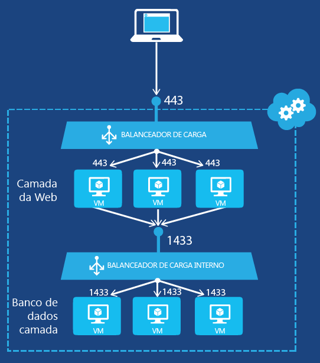
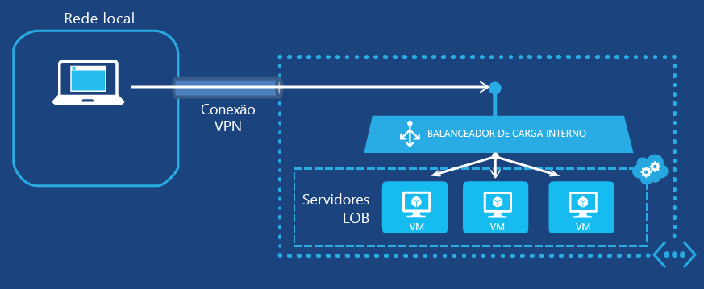

<properties
   pageTitle="Introdução ao balanceador de carga interno | Microsoft Azure"
   description="Configurar o balanceador de carga interno e como implementá-los para máquinas virtuais e implantações de nuvem"
   services="load-balancer"
   documentationCenter="na"
   authors="joaoma"
   manager="adinah"
   editor="tysonn" />
<tags
   ms.service="load-balancer"
   ms.devlang="na"
   ms.topic="get-started-article"
   ms.tgt_pltfrm="na"
   ms.workload="infrastructure-services"
   ms.date="07/10/2015"
   ms.author="joaoma" />

# Introdução à configuração de um balanceador de carga interno

O ILB (Balanceamento de Carga Interno) do Azure fornece balanceamento de carga entre máquinas virtuais que residem em um serviço de nuvem ou em uma rede virtual com escopo regional. Para obter informações sobre o uso e a configuração de redes virtuais com escopo regional, consulte [Redes virtuais regionais](../regional-virtual-networks.md) no blog do Azure. Redes virtuais existentes configuradas para um grupo de afinidade não podem usar o ILB.

## Criando um conjunto de balanceamento de carga interno para máquinas virtuais

Para criar um conjunto de balanceamento de carga interno do Azure e os servidores que enviarão o tráfego para ele, faça o seguinte:

1. Crie uma instância ILB que será o ponto de extremidade do tráfego de entrada a ser balanceado nos servidores de um conjunto de balanceamento de carga.

1. Adicione pontos de extremidade correspondentes às máquinas virtuais que receberão o tráfego de entrada.

1. Configure os servidores que enviarão o tráfego com a carga a ser balanceada para enviar o tráfego para o endereço VIP (IP Virtual) da instância ILB.

### Etapa 1: Criar uma instância ILB

Para um serviço de nuvem existente ou um serviço de nuvem implantado em uma rede virtual regional, você pode criar uma instância ILB com comandos do Windows PowerShell a seguir:

	$svc="<Cloud Service Name>"
	$ilb="<Name of your ILB instance>"
	$subnet="<Name of the subnet within your virtual network>"
	$IP="<The IPv4 address to use on the subnet-optional>"

	Add-AzureInternalLoadBalancer -ServiceName $svc -InternalLoadBalancerName $ilb –SubnetName $subnet –StaticVNetIPAddress $IP

Para usar esses comandos, preencha os valores e remova o < and >. Veja um exemplo:

	$svc="WebCloud-NY"
	$ilb="SQL-BE"
	$subnet="Farm1"
	$IP="192.168.98.10"
	Add-AzureInternalLoadBalancer -ServiceName $svc -InternalLoadBalancerName $ilb –SubnetName $subnet –StaticVNetIPAddress $IP

### Etapa 2: Adicionar pontos de extremidade à instância ILB

Para máquinas virtuais existentes, você pode adicionar pontos de extremidade à instância ILB com os comandos a seguir:

	$svc="<Cloud service name>"
	$vmname="<Name of the VM>"
	$epname="<Name of the endpoint>"
	$lbsetname="<Name of the load balancer set>"
	$prot="tcp" or "udp"
	$locport=<local port number>
	$pubport=<public port number>
	$ilb="<Name of your ILB instance>"
	Get-AzureVM –ServiceName $svc –Name $vmname | Add-AzureEndpoint -Name $epname -LbsetName $lbsetname -Protocol $prot -LocalPort $locport -PublicPort $pubport –DefaultProbe -InternalLoadBalancerName $ilb | Update-AzureVM

Para usar esses comandos, preencha os valores e remova o < and >.

Observe que esse uso do cmdlet [Add-AzureEndpoint](https://msdn.microsoft.com/library/dn495300.aspx) do Windows PowerShell usa o conjunto de parâmetros DefaultProbe. Para obter mais informações sobre conjuntos de parâmetros adicionais, consulte [Add-AzureEndpoint](https://msdn.microsoft.com/library/dn495300.aspx).

Veja um exemplo:

	$svc="AZ-LOB1"
	$vmname="SQL-LOBAZ1"
	$epname="SQL1"
	$lbsetname="SQL-LB"
	$prot="tcp"
	$locport=1433
	$pubport=1433
	$ilb="SQL ILB"
	Get-AzureVM –ServiceName $svc –Name $vmname | Add-AzureEndpoint -Name $epname -Lbset $lbsetname -Protocol $prot -LocalPort $locport -PublicPort $pubport –DefaultProbe -InternalLoadBalancerName $ilb | Update-AzureVM

### Etapa 3: Configurar os servidores para enviar o tráfego para o novo ponto de extremidade ILB

Você deve configurar os servidores, cujo tráfego terá carga balanceada, para usar o novo endereço IP (o VIP) da instância ILB. Este é o endereço no qual a instância ILB escuta. Na maioria dos casos, basta adicionar ou modificar um registro DNS ao VIP da instância ILB.

Se você especificar o endereço IP durante a criação da instância ILB, já terá o VIP. Caso contrário, você poderá ver o VIP por meio dos comandos a seguir:

	$svc="<Cloud Service Name>"
	Get-AzureService -ServiceName $svc | Get-AzureInternalLoadBalancer

Para usar esses comandos, preencha os valores e remova o < and >. Veja um exemplo:

	$svc="WebCloud-NY"
	Get-AzureService -ServiceName $svc | Get-AzureInternalLoadBalancer

Na exibição do comando Get-AzureInternalLoadBalancer, anote o endereço IP e faça as alterações necessárias em seus servidores ou registros DNS para garantir que o tráfego seja enviado para o VIP.

>[AZURE.NOTE]A plataforma Microsoft Azure usa um endereço IPv4 estático e publicamente roteável para uma variedade de cenários administrativos. O endereço IP é 168.63.129.16. Esse endereço IP não deve ser bloqueado por nenhum firewall, já que ele pode causar um comportamento inesperado. Em relação ao ILB do Azure, esse endereço IP é usado por testes de monitoramento do balanceador de carga para determinar o estado de integridade para VMs em um conjunto com balanceamento de carga. Se um grupo de segurança de rede é usado para restringir o tráfego para máquinas virtuais do Azure em um conjunto com balanceamento de carga interno, ou então é aplicado a uma sub-rede de Rede Virtual, certifique-se de que uma regra de segurança de rede seja adicionada para permitir o tráfego em 168.63.129.16.

## Exemplos completos de balanceamento de carga interno

Para percorrer o processo completo de criar um conjunto de balanceamento de carga para duas configurações de exemplo, consulte as seções a seguir.

### Um aplicativo para a Internet de diversas camadas

A Contoso Corporation quer oferecer balanceamento de carga entre um conjunto de servidores Web voltados para a Internet e um conjunto de servidores de banco de dados. Os dois conjuntos de servidores são hospedados em um único serviço de nuvem do Azure. O tráfego do servidor Web para a porta TCP 1433 deve ser distribuído entre três máquinas virtuais na camada de banco de dados. A Figura 1 mostra a configuração.

Figura 1: exemplo de um aplicativo para a Internet de diversas camadas

A configuração consiste em:

- O serviço de nuvem existente que hospeda as máquinas virtuais é denominado Contoso-PartnerSite.

- Os três servidores de banco de dados existentes são denominado PARTNER-SQL-1, PARTNER-SQL-2 e PARTNER-SQL-3.

- Servidores Web na camada Web se conectam aos servidores de banco de dados na camada de banco de dados usando o nome DNS partner-sql.external.contoso.com.

Os comandos a seguir configuram uma nova instância ILB denominada PARTNER-DBTIER e adicionam pontos de extremidade às máquinas virtuais correspondentes aos três servidores de banco de dados:

	$svc="Contoso-PartnerSite"
	$ilb="PARTNER-DBTIER"
	Add-AzureInternalLoadBalancer -ServiceName $svc -InternalLoadBalancerName $ilb

	$prot="tcp"
	$locport=1433
	$pubport=1433
	$epname="DBTIER1"
	$lbsetname="SQL-LB"
	$vmname="PARTNER-SQL-1"
	Get-AzureVM –ServiceName $svc –Name $vmname | Add-AzureEndpoint -Name $epname -LbSetName $lbsetname -Protocol $prot -LocalPort $locport -PublicPort $pubport –DefaultProbe -InternalLoadBalancerName $ilb | Update-AzureVM

	$epname="DBTIER2"
	$vmname="PARTNER-SQL-2"
	Get-AzureVM –ServiceName $svc –Name $vmname | Add-AzureEndpoint -Name $epname -LbSetName $lbsetname -Protocol $prot -LocalPort $locport -PublicPort $pubport –DefaultProbe -InternalLoadBalancerName $ilb | Update-AzureVM

	$epname="DBTIER3"
	$vmname="PARTNER-SQL-3"
	Get-AzureVM –ServiceName $svc –Name $vmname | Add-AzureEndpoint -Name $epname -LbSetName $lbsetname -Protocol $prot -LocalPort $locport -PublicPort $pubport –DefaultProbe -InternalLoadBalancerName $ilb | Update-AzureVM

Em seguida, a Contoso determinou o VIP da instância ILB PARTNER-DBTIER com o comando a seguir:

	Get-AzureService -ServiceName $svc | Get-AzureInternalLoadBalancer

Na exibição desse comando, a Contoso anotou o endereço VIP 100.64.65.211 e configurou o registro de endereço DNS (A) para o nome partner-sql.external.contoso.com a usar esse novo endereço.

### Um aplicativo LOB hospedado no Azure

A Contoso Corporation quer hospedar um aplicativo LOB (linha de negócios) em um conjunto de servidores Web no Azure. Tráfego do cliente para a porta TCP 80 deve ter balanceamento de carga entre três máquinas virtuais em execução em uma rede virtual entre instalações. A Figura 2 mostra a configuração.

Figura 2: exemplo de um aplicativo LOB hospedado no Azure

A configuração consiste em:

- O serviço de nuvem existente que hospeda as máquinas virtuais é denominado Contoso-Legal.

- A sub-rede na qual os servidores LOB estão localizados é denominada LOB-LEGAL e a Contoso escolheu o endereço 198.168.99.145 como o endereço VIP do balanceador de carga interno.

- Os três servidores LOB existentes são denominados LEGAL-1, LEGAL-2 e LEGAL-3.

- Clientes Web intranet conectam-se a eles usando o nome DNS legalnet.corp.contoso.com.

Os comandos a seguir criam uma nova instância ILB denominada LEGAL-ILB e adicionam pontos de extremidade às máquinas virtuais correspondentes aos três servidores LOB:

	$svc="Contoso-Legal"
	$ilb="LEGAL-ILB"
	$subnet="LOB-LEGAL"
	$IP="198.168.99.145"
	Add-AzureInternalLoadBalancer –ServiceName $svc -InternalLoadBalancerName $ilb –SubnetName $subnet –StaticVNetIPAddress $IP

	$prot="tcp"
	$locport=80
	$pubport=80
	$epname="LOB1"
	$lbsetname="LOB-LB"
	$vmname="LEGAL-1"
	Get-AzureVM –ServiceName $svc –Name $vmname | Add-AzureEndpoint -Name $epname-LbSetName $lbsetname -Protocol $prot -LocalPort $locport -PublicPort $pubport –DefaultProbe -InternalLoadBalancerName $ilb | Update-AzureVM

	$epname="LOB2"
	$vmname="LEGAL2"
	Get-AzureVM –ServiceName $svc –Name $vmname | Add-AzureEndpoint -Name $epname -LbSetName $lbsetname -Protocol $prot -LocalPort $locport -PublicPort $pubport –DefaultProbe -InternalLoadBalancerName $ilb | Update-AzureVM

	$epname="LOB3"
	$vmname="LEGAL3"
	Get-AzureVM –ServiceName $svc –Name $vmname | Add-AzureEndpoint -Name $epname -LbSetName $lbsetname -Protocol $prot -LocalPort $locport -PublicPort $pubport –DefaultProbe -InternalLoadBalancerName $ilb | Update-AzureVM

Em seguida, a Contoso configurou o registro DNS A para o nome legalnet.corp.contoso.com usar o endereço 198.168.99.145.

## Adicionar uma máquina virtual ao ILB

Para adicionar uma máquina virtual a uma instância ILB quando ela é criada, você pode usar os cmdlets New-AzureInternalLoadBalancerConfig e New-AzureVMConfig.

Veja um exemplo:

	$svc="AZ-LOB1"
	$ilb="LOB-ILB"
	$vnet="LOBNet_Azure"
	$subnet="LOBServers"
	$vmname="LOB-WEB1"
	$adminuser="Lando"
	$adminpw="Platform327"
	$regionname="North Central US"

	$myilbconfig=New-AzureInternalLoadBalancerConfig -InternalLoadBalancerName $ilb -SubnetName $subnet
	$images = Get-AzureVMImage
	New-AzureVMConfig -Name $vmname -InstanceSize Small -ImageName $images[50].ImageName | Add-AzureProvisioningConfig -Windows -AdminUsername $adminuser -Password $adminpw | New-AzureVM -ServiceName $svc -InternalLoadBalancerConfig $myilbconfig -Location $regionname –VNetName $vnet

## Configurando ILB para Serviços de Nuvem

O ILB dá suporte para Máquinas Virtuais e Serviços de Nuvem. Um ponto de extremidade ILB criado no Serviço de Nuvem fora de uma Rede Virtual Regional só estará acessível dentro do Serviço de Nuvem.

A configuração ILB deve ser definida durante a criação da primeira implantação no Serviço de Nuvem, conforme mostrado no exemplo abaixo.

>[AZURE.IMPORTANT]o pré-requisito para executar as etapas a seguir é ter uma rede virtual já criada para a implantação em nuvem. Será necessário o nome de rede virtual e de sub-redes para criar o ILB.

### Etapa 1

Abra o arquivo de configuração de serviço (.cscfg) para sua implantação de nuvem no visual studio e adicione a seção a seguir para criar o ILB no último item "</Role>" para a configuração de rede.

	<NetworkConfiguration>
	  <LoadBalancers>
	    <LoadBalancer name="name of the load balancer">
	      <FrontendIPConfiguration type="private" subnet="subnet-name" staticVirtualNetworkIPAddress="static-IP-address"/>
	    </LoadBalancer>
	  </LoadBalancers>
	</NetworkConfiguration>
 

Vamos adicionar os valores para o arquivo de configuração de rede para mostrar como ele se parecerá. No exemplo, suponha que você criou uma sub-rede chamada "test_vnet" com uma sub-rede 10.0.0.0/24 chamada test_subnet e um endereço IP estático 10.0.0.4. O balanceador de carga será nomeado testLB.

	<NetworkConfiguration>
	  <LoadBalancers>
	    <LoadBalancer name="testLB">
	      <FrontendIPConfiguration type="private" subnet="test_subnet" staticVirtualNetworkIPAddress="10.0.0.4"/>
	    </LoadBalancer>
	  </LoadBalancers>
	</NetworkConfiguration>

Para saber mais sobre o esquema do balanceador de carga, confira [Adicionar balanceador de carga](https://msdn.microsoft.com/library/azure/dn722411.aspx)

### Etapa 2

Altere o arquivo de definição de serviço (.csdef) para adicionar pontos de extremidade ao ILB. No momento em que uma instância de função é criada, o arquivo de definição de serviço adiciona as instâncias de função ao ILB.

	<WorkerRole name="worker-role-name" vmsize="worker-role-size" enableNativeCodeExecution="[true|false]">
	  <Endpoints>
	    <InputEndpoint name="input-endpoint-name" protocol="[http|https|tcp|udp]" localPort="local-port-number" port="port-number" certificate="certificate-name" loadBalancerProbe="load-balancer-probe-name" loadBalancer="load-balancer-name" />
	  </Endpoints>
	</WorkerRole>

Seguindo os mesmos valores do exemplo acima, vamos adicionar os valores ao arquivo de definição de serviço

	<WorkerRole name=WorkerRole1" vmsize="A7" enableNativeCodeExecution="[true|false]">
	  <Endpoints>
	    <InputEndpoint name="endpoint1" protocol="http" localPort="80" port="80" loadBalancer="testLB" />
	  </Endpoints>
	</WorkerRole>

O tráfego de rede terá a carga equilibrada usando o balanceador de carga testLB com a porta 80 para solicitações de entrada, enviando a instâncias de função de trabalho também na porta 80.

## Remover configuração ILB

Para remover uma máquina virtual como um ponto de extremidade de uma instância ILB, use os comandos a seguir:

	$svc="<Cloud service name>"
	$vmname="<Name of the VM>"
	$epname="<Name of the endpoint>"
	Get-AzureVM -ServiceName $svc -Name $vmname | Remove-AzureEndpoint -Name $epname | Update-AzureVM

Para usar esses comandos, preencha os valores removendo o < and >.

Veja um exemplo:

	$svc="AZ-LOB1"
	$vmname="SQL-LOBAZ1"
	$epname="SQL1"
	Get-AzureVM -ServiceName $svc -Name $vmname | Remove-AzureEndpoint -Name $epname | Update-AzureVM

Para remover uma instância ILB de um serviço de nuvem, use os comandos a seguir:

	$svc="<Cloud service name>"
	Remove-AzureInternalLoadBalancer -ServiceName $svc

Para usar esses comandos, preencha o valor e remova o < and >.

Veja um exemplo:

	$svc="AZ-LOB1"
	Remove-AzureInternalLoadBalancer -ServiceName $svc

## Informações adicionais sobre cmdlets ILB

Para obter informações adicionais sobre cmdlets ILB, execute os comandos a seguir em um prompt do Windows PowerShell do Azure:

- Get-help New-AzureInternalLoadBalancerConfig -full

- Get-help Add-AzureInternalLoadBalancer -full

- Get-help Get-AzureInternalLoadbalancer -full

- Get-help Remove-AzureInternalLoadBalancer -full

## Consulte também

[Configurar um modo de distribuição do balanceador de carga](load-balancer-distribution-mode.md)

[Definir configurações de tempo limite de TCP ocioso para o balanceador de carga](load-balancer-tcp-idle-timeout.md)
 

<!---HONumber=July15_HO4-->