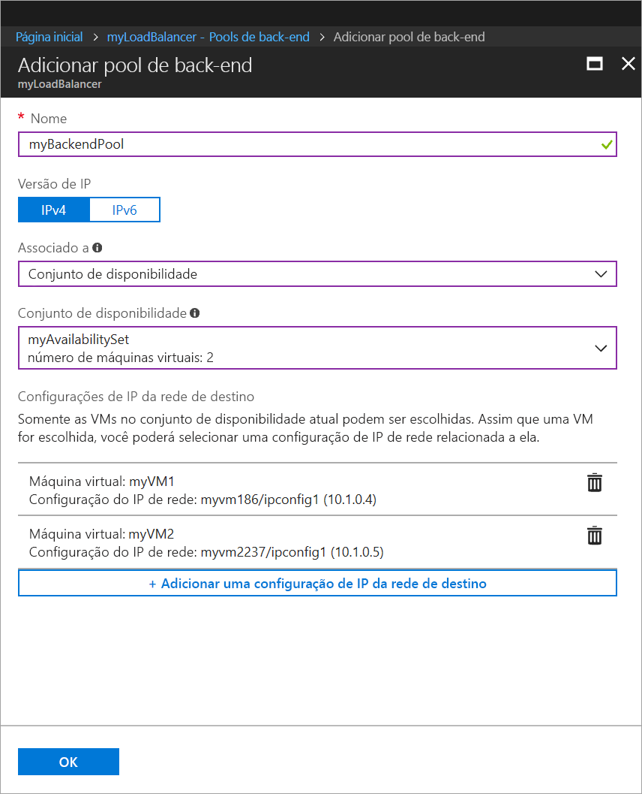
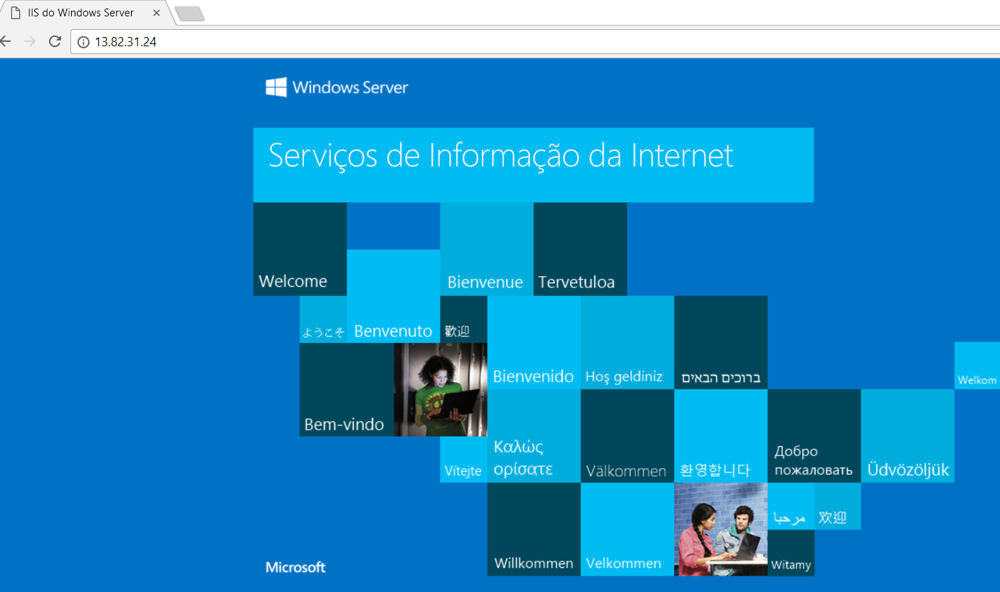

# Início Rápido: Criar um balanceador de carga padrão para VMs usando o Portal do Azure

O balanceamento de carga fornece um nível mais alto de disponibilidade e escala distribuindo as solicitações de entrada entre várias máquinas virtuais. Você pode usar o Portal do Azure para criar um balanceador de carga para balancear a carga de máquinas virtuais (VMs). Este início rápido mostra como carregar a carga de VMs usando um balanceador de carga padrão.

Se você não tiver uma assinatura do Azure, crie uma [conta gratuita](https://azure.microsoft.com/free/?WT.mc_id=A261C142F) antes de começar. 

## Fazer logon no Azure

Faça logon no Portal do Azure em [http://portal.azure.com](http://portal.azure.com).

## Criar um balanceador de carga público

Nesta seção, você criará um balanceador de carga público que ajuda a balancear a carga de máquinas virtuais. Um balanceador de carga padrão só oferece suporte a um endereço IP público padrão. Ao criar um balanceador de carga padrão, você também deve criar um novo endereço IP público padrão configurado como o front-end (nomeado como *LoadBalancerFrontend* por padrão) para o balanceador de carga padrão. 

1. No canto superior esquerdo da tela, clique em **Criar um recurso** > **Rede** > **Balanceador de carga**.
2. Na página **Criar um balanceador de carga**, insira estes valores para o balanceador de carga:
    - *myLoadBalancer* – para o nome do balanceador de carga.
    - **Public** – para o tipo do balanceador de carga.
     - *myPublicIP* – para o **Novo** IP público que você criar.
    - *myResourceGroupSLB* – para o nome do **Novo** grupo de recursos que você selecionar para criar.
    - **westeurope** – para o local.
3. Clique em **Criar** para criar o balanceador de carga.
   
    

## Criar servidores de back-end

Nesta seção, crie uma rede virtual, crie duas máquinas virtuais para o pool de back-end do balanceador de carga e, em seguida, instalar o IIS nas máquinas virtuais para ajudar a testar o balanceador de carga.

### Criar uma rede virtual
1. No canto superior esquerdo da tela, clique em **Novo** > **Rede** > **Rede virtual** e insira estes valores para a rede virtual:
    - *myVnet* – para o nome da rede virtual.
    - *myResourceGroupSLB* – para o nome do grupo de recursos existente
    - *myBackendSubnet* – para o nome da sub-rede.
2. Clique em **Criar** para criar a rede virtual.

    

### Criar máquinas virtuais

1. No canto superior esquerdo da tela, clique em **Novo** > **Computação** > **Windows Server 2016 Datacenter** e insira estes valores para a máquina virtual:
    - *myVM1* - para o nome da máquina virtual.        
    - *azureuser* – para o nome de usuário do administrador.    
    - *myResourceGroupSLB* – para **Grupo de recursos**, selecione **Usar existente** e depois *myResourceGroupSLB*.
2. Clique em **OK**.
3. Selecione **DS1_V2** para o tamanho da máquina virtual e clique em **Selecionar**.
4. Insira estes valores para as configurações da VM:
    - *myAvailabilitySet* – para o nome do novo Conjunto de disponibilidade que você criar.
    -  *myVNet* – verifique se esse valor está selecionado como a rede virtual.
    - *myBackendSubnet* – verifique se esse valor está selecionado como a sub-rede.
    - *myNetworkSecurityGroup* – para o nome do novo grupo de segurança (firewall) de rede que você deve criar.
5. Clique em **Desabilitado** para desabilitar o diagnóstico de inicialização.
6. Clique em **OK**, examine as configurações na página de resumo e, em seguida, clique em **Criar**.
7. Crie uma segunda VM e a nomeie como *VM2* com *myAvailibilityset* como o Conjunto de disponibilidade, *myVnet* como a rede virtual, *myBackendSubnet* e sua sub-rede e **myNetworkSecurityGroup* como seu grupo de segurança de rede usando as etapas de 1 a 6. 

### Criar as regras NSG

Nesta seção, você criará regras NSG para permitir conexões de entrada usando HTTP e RDP.

1. Clique em **Todos os recursos** no menu da esquerda e, depois, na lista de recursos, clique em **myNetworkSecurityGroup**, que está localizado no grupo de recursos **myResourceGroupSLB**.
2. Em **Configurações**, clique em **Regras de segurança de entrada**, depois clique em **Adicionar**.
3. Insira esses valores para a regra de segurança de entrada denominada *myHTTPRule* para permitir conexões de entrada HTTP usando a porta 80:
    - *Service Tag* – para **Fonte**.
    - *Internet* – para **Marca de serviço de fonte**
    - *80* - para os **Intervalos de porta de destino**
    - *TCP* – para **Protocolo**
    - *Allow* – para **Ação**
    - *100* - para **Prioridade**
    - *myHTTPRule* - para nome
    - *Allow HTTP* - para descrição
4. Clique em **OK**.
 
 
5. Repita as etapas 2 a 4 para criar outra regra denominada *myRDPRule* para permitir uma conexão de RDP de entrada usando a porta 3389 com os seguintes valores:
    - *Service Tag* – para **Fonte**.
    - *Internet* – para **Marca de serviço de fonte**
    - *3389* - para os **Intervalos de porta de destino**
    - *TCP* – para **Protocolo**
    - *Allow* – para **Ação**
    - *200* - para **Prioridade**
    - *myRDPRule* - para nome
    - *Allow RDP* - para descrição

### Instalar o IIS

1. Clique em **Todos os recursos** no menu da esquerda e, depois, na lista de recursos, clique em **myVM1**, que está localizado no grupo de recursos *myResourceGroupLB*.
2. Na página **Visão geral**, clique em **Conectar** para o RDP na VM.
3. Faça logon na VM com nome de usuário *azureuser*.
4. Na área de trabalho do servidor, navegue até **Ferramentas Administrativas do Windows**>**Gerenciador do Servidor**.
5. No Gerenciador do Servidor, clique em **Adicionar funções e recursos**.
6. No **Assistente Adicionar Funções e Recursos**, use os seguintes valores:
    - Na página **Selecionar tipo de instalação**, clique em **Instalação baseada em função ou em recurso**.
    - Na página **Selecionar servidor de destino**, clique em **myVM1**
    - Na página **Selecionar função de servidor**, clique em **Servidor Web (IIS)**
    - Siga as instruções para concluir o restante do assistente 
7. Repita as etapas 1 a 6 para a máquina virtual *myVM2*.

## Criar recursos do balanceador de carga

Nesta seção, você definirá as configurações do balanceador de carga para um pool de endereços de back-end e uma investigação de integridade, também especificará as regras do balanceador de carga e NAT.

### Criar um pool de endereços de back-end

Para distribuir o tráfego para as máquinas virtuais, um pool de endereços de back-end contém os endereços IP das NICs virtuais conectadas ao balanceador de carga. Crie o pool de endereços de back-end *myBackendPool* para incluir *VM1* e *VM2*.

1. Clique em **Todos os recursos** no menu esquerdo e depois clique em **myLoadBalancer** na lista de recursos.
2. Em **Configurações**, clique em **Pools de back-end** e clique em **Adicionar**.
3. Na página **Adicionar um pool de back-end**, faça o seguinte:
    - Em nome, digite *myBackEndPool como o nome de seu pool de back-end.
    - Em **Associado ao**, no menu suspenso, clique em **Conjunto de disponibilidade**
    - Em **Conjunto de disponibilidade**, clique em **myAvailabilitySet**.
    - Clique em **Adicionar uma configuração de IP de rede de destino** para adicionar cada máquina virtual (*myVM1* & *myVM2*) que você criou ao pool de back-end.
    - Clique em **OK**.

    

3. Verifique se a configuração do seu pool de back-end do balanceador de carga exibe as máquinas virtuais **VM1** e **VM2**.

### Criar uma investigação de integridade

Para permitir que o balanceador de carga monitore o status de seu aplicativo, use uma investigação de integridade. A investigação de integridade adiciona ou remove dinamicamente VMs da rotação do balanceador de carga com base na resposta às verificações de integridade. Crie uma investigação de integridade *myHealthProbe* para monitorar a integridade das VMs.

1. Clique em **Todos os recursos** no menu esquerdo e depois clique em **myLoadBalancer** na lista de recursos.
2. Em **Configurações**, clique em **Investigação de integridade** e clique em **Adicionar**.
3. Use estes valores para criar a investigação de integridade:
    - *myHealthProbe* – para o nome da investigação de integridade.
    - **HTTP** – para o tipo de protocolo.
    - *80* – para o número da porta.
    - *15* – para o número de **Intervalo** em segundos entre tentativas de investigação.
    - *2* – para o número de **Limite não íntegro** ou falhas de investigação consecutivas que devem ocorrer antes que uma VM seja considerada não íntegra.
4. Clique em **OK**.

   

### Criar uma regra de balanceador de carga

Uma regra de balanceador de carga é usada para definir como o tráfego é distribuído para as VMs. Definir a configuração de IP de front-end para o tráfego de entrada e o pool de IP de back-end para receber o tráfego, junto com as portas de origem e de destino necessárias. Crie uma regra do balanceador de carga *myLoadBalancerRuleWeb* para escutar a porta 80 no front-end *FrontendLoadBalancer* e enviar o tráfego de rede com carga balanceada ao pool de endereços de back-end *myBackEndPool* também usando a porta 80. 

1. Clique em **Todos os recursos** no menu esquerdo e depois clique em **myLoadBalancer** na lista de recursos.
2. Em **Configurações**, clique em **Regras de balanceamento de carga** e em **Adicionar**.
3. Use estes valores para configurar a regra do balanceamento de carga:
    - *myHTTPRule* – para o nome da regra de balanceamento de carga.
    - **TCP** – para o tipo de protocolo.
    - *80* – para o número da porta.
    - *80* – para a porta de back-end.
    - *myBackendPool* – para o nome do pool de back-end.
    - *myHealthProbe* – para o nome da investigação de integridade.
4. Clique em **OK**.
    
    

## Testar o balanceador de carga
1. Localize o endereço IP público para o Load Balancer na tela **Visão Geral**. Clique em **Todos os recursos**, depois clique em **myPublicIP**.

2. Copie o endereço IP público e cole-o na barra de endereços do seu navegador. A página padrão do servidor Web do IIS é exibida no navegador.

      

## Limpar recursos

Quando não forem mais necessários, exclua o grupo de recursos, o balanceador de carga e todos os recursos relacionados. Para isso, selecione o grupo de recursos que contém o balanceador de carga e clique em **Excluir**.

## Próximas etapas

Saiba mais sobre o [Load Balancer Standard](load-balancer-standard-overview.md).
