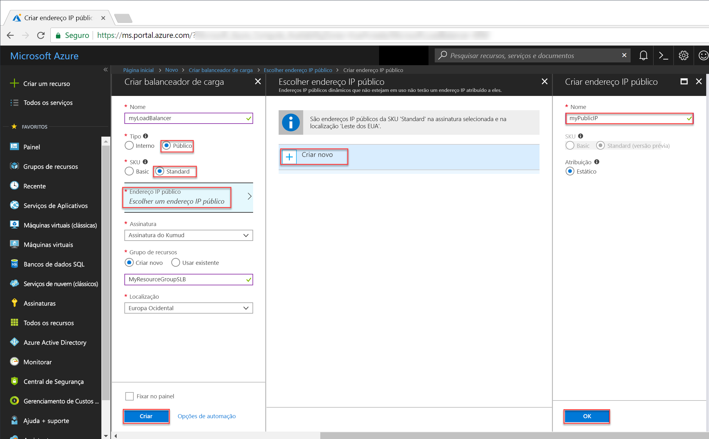
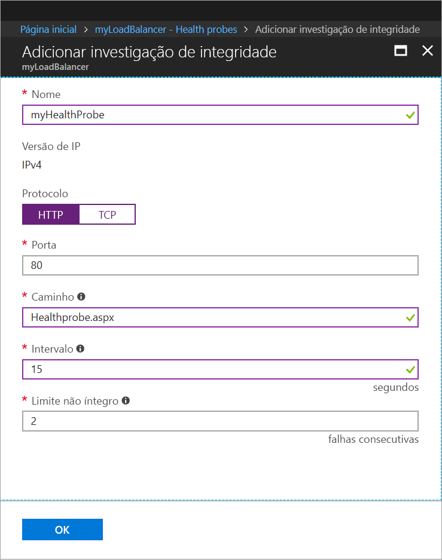
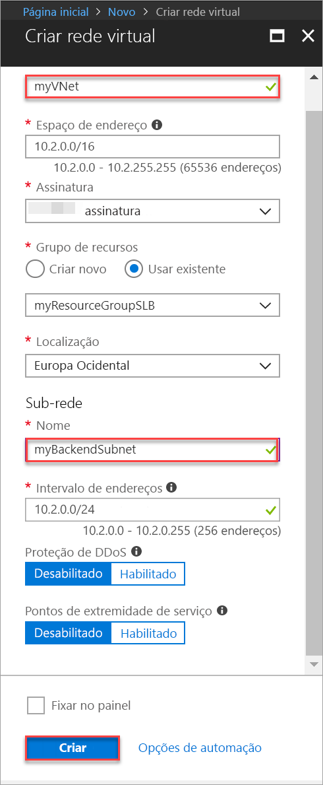

# <a name="tutorial-configure-port-fowarding-in-load-balancer-using-the-azure-portal"></a>Tutorial: Configurar o encaminhamento de porta no Load Balancer usando o portal do Azure

Encaminhamento de porta usando o Azure Load Balancer permite que você se conecte remotamente a VMs na rede virtual do Azure usando o endereço IP público do Load Balancer por meio do número da porta. Neste tutorial, você aprende a configurar o encaminhamento de porta no Azure Load Balancer e como:


> [!div class="checklist"]
> * Criar um balanceador de carga do Azure
> * Criar uma investigação de integridade do balanceador de carga
> * Criar regras de tráfego para o balanceador de carga
> * Criar máquinas virtuais e instalar o servidor IIS
> * Anexar máquinas virtuais a um balanceador de carga
> * Criar regras NAT de entrada do balanceador de carga
> * Visualizar o encaminhamento de porta em ação


Se você não tiver uma assinatura do Azure, crie uma [conta gratuita](https://azure.microsoft.com/free/?WT.mc_id=A261C142F) antes de começar. 

## <a name="log-in-to-azure"></a>Fazer logon no Azure

Faça logon no Portal do Azure em [http://portal.azure.com](http://portal.azure.com).

## <a name="create-a-standard-load-balancer"></a>Criar um Balanceador de Carga Standard

Nesta seção, você criará um balanceador de carga público que ajuda a balancear a carga de máquinas virtuais. Um balanceador de carga padrão só oferece suporte a um endereço IP público padrão. Ao criar um Standard Load Balancer, você também deve criar um novo endereço IP público Standard configurado como o front-end (nomeado como *LoadBalancerFrontend* por padrão) do Standard Load Balancer. 

1. No canto superior esquerdo da tela, clique em **Criar um recurso** > **Rede** > **Load Balancer**.
2. Na página **Criar um balanceador de carga**, insira estes valores para o balanceador de carga:
    - *myLoadBalancer* – para o nome do balanceador de carga.
    - **Standard** – para a versão da SKU do balanceador de carga.
    - **Public** – para o tipo do balanceador de carga.
    - *myPublicIP* – para o **Novo** IP público que você criar.
    - *myResourceGroupSLB* – para o nome do **Novo** grupo de recursos que você selecionar para criar.
    - **westeurope** – para o local.
3. Clique em **Criar** para criar o balanceador de carga.


   
## <a name="create-load-balancer-resources"></a>Criar recursos do balanceador de carga

Nesta seção, você define as configurações do balanceador de carga para um pool de endereços de back-end e uma investigação de integridade, além de especificar as regras do balanceador de carga.

### <a name="create-a-backend-address-pool"></a>Criar um pool de endereços de back-end

Para distribuir o tráfego entre as VMs, um pool de endereços de back-end contém os endereços IP dos NICs virtuais conectados ao balanceador de carga. Crie o pool de endereços de back-end *myBackendPool* para incluir *VM1* e *VM2*.

1. Clique em **Todos os recursos** no menu esquerdo e depois clique em **myLoadBalancer** na lista de recursos.
2. Em **Configurações**, clique em **Pools de back-end** e clique em **Adicionar**.
3. Na página **Adicionar um pool de back-end**, para o nome, insira *myBackEndPool*, como o nome para o pool de back-end e depois clique em **OK**.

### <a name="create-a-health-probe"></a>Criar uma investigação de integridade

Para permitir que o balanceador de carga monitore o status de seu aplicativo, use uma investigação de integridade. A investigação de integridade adiciona ou remove dinamicamente VMs da rotação do balanceador de carga com base na resposta às verificações de integridade. Crie uma investigação de integridade *myHealthProbe* para monitorar a integridade das VMs.

1. Clique em **Todos os recursos** no menu esquerdo e depois clique em **myLoadBalancer** na lista de recursos.
2. Em **Configurações**, clique em **Investigação de integridade** e clique em **Adicionar**.
3. Use estes valores para criar a investigação de integridade:
    - *myHealthProbe* – para o nome da investigação de integridade.
    - **HTTP** – para o tipo de protocolo.
    - *80* – para o número da porta.
    - *15* – para o número de **Intervalo** em segundos entre tentativas de investigação.
    - *2* – para o número de **Limite não íntegro** ou falhas de investigação consecutivas que devem ocorrer antes que uma VM seja considerada não íntegra.
4. Clique em **OK**.

   

### <a name="create-a-load-balancer-rule"></a>Criar uma regra de balanceador de carga

Uma regra de balanceador de carga é usada para definir como o tráfego é distribuído para as VMs. Defina a configuração de IP de front-end para o tráfego de entrada e o pool de IPs de back-end para receber o tráfego, junto com as portas de origem e de destino necessárias. Crie uma regra do balanceador de carga *myLoadBalancerRuleWeb* para escutar a porta 80 no front-end *FrontendLoadBalancer* e enviar o tráfego de rede com carga balanceada ao pool de endereços de back-end *myBackEndPool* também usando a porta 80. 

1. Clique em **Todos os recursos** no menu esquerdo e depois clique em **myLoadBalancer** na lista de recursos.
2. Em **Configurações**, clique em **Regras de balanceamento de carga** e em **Adicionar**.
3. Use estes valores para configurar a regra do balanceamento de carga:
    - *myHTTPRule* – para o nome da regra de balanceamento de carga.
    - **TCP** – para o tipo de protocolo.
    - *80* – para o número da porta.
    - *80* – para a porta de back-end.
    - *myBackendPool* – para o nome do pool de back-end.
    - *myHealthProbe* – para o nome da investigação de integridade.
4. Clique em **OK**.
    
## <a name="create-backend-servers"></a>Criar servidores de back-end

Nesta seção, crie uma rede virtual, crie duas máquinas virtuais para o pool de back-end do balanceador de carga e, em seguida, instalar o IIS nas máquinas virtuais para ajudar a testar encaminhamento de porta usando o balanceador de carga.

### <a name="create-a-virtual-network"></a>Criar uma rede virtual
1. No canto superior esquerdo da tela, clique em **Novo** > **Rede** > **Rede virtual** e insira estes valores para a rede virtual:
    - *myVnet* – para o nome da rede virtual.
    - *myResourceGroupSLB* – para o nome do grupo de recursos existente
    - *myBackendSubnet* – para o nome da sub-rede.
2. Clique em **Criar** para criar a rede virtual.

    

### <a name="create-virtual-machines"></a>Criar máquinas virtuais

1. No canto superior esquerdo da tela, clique em **Novo** > **Computação** > **Windows Server 2016 Datacenter** e insira estes valores para a máquina virtual:
    - *myVM1* - para o nome da máquina virtual.        
    - *azureuser* – para o nome de usuário do administrador.    
    - *myResourceGroupSLB* – para **Grupo de recursos**, selecione **Usar existente** e depois *myResourceGroupSLB*.
2. Clique em **OK**.
3. Selecione **DS1_V2** para o tamanho da máquina virtual e clique em **Selecionar**.
4. Insira estes valores para as configurações da VM:
    -  *myVNet* – verifique se esse valor está selecionado como a rede virtual.
    - *myBackendSubnet* – verifique se esse valor está selecionado como a sub-rede.
    - *myNetworkSecurityGroup* – para o nome do novo grupo de segurança (firewall) de rede que você deve criar.
5. Clique em **Desabilitado** para desabilitar o diagnóstico de inicialização.
6. Clique em **OK**, examine as configurações na página de resumo e, em seguida, clique em **Criar**.
7. Crie outra VM chamada *VM2* com o *myVnet* como a rede virtual, *myBackendSubnet* e sua sub-rede e **myNetworkSecurityGroup* como seu grupo de segurança de rede usando as etapas de 1 a 6. 

### <a name="create-nsg-rules"></a>Criar regras NSG

Nesta seção, você criará regras NSG para permitir conexões de entrada usando HTTP e RDP.

1. Clique em **Todos os recursos** no menu da esquerda e, depois, na lista de recursos, clique em **myNetworkSecurityGroup**, que está localizado no grupo de recursos **myResourceGroupSLB**.
2. Em **Configurações**, clique em **Regras de segurança de entrada**, depois clique em **Adicionar**.
3. Insira esses valores para a regra de segurança de entrada denominada *myHTTPRule* para permitir conexões de entrada HTTP usando a porta 80:
    - *Service Tag* – para **Fonte**.
    - *Internet* – para **Marca de serviço de fonte**
    - *80* - para os **Intervalos de porta de destino**
    - *TCP* – para **Protocolo**
    - *Allow* – para **Ação**
    - *100* - para **Prioridade**
    - *myHTTPRule* - para nome
    - *Allow HTTP* - para descrição
4. Clique em **OK**.
 
 
5. Repita as etapas 2 a 4 para criar outra regra denominada *myRDPRule* para permitir uma conexão de RDP de entrada usando a porta 3389 com os seguintes valores:
    - *Service Tag* – para **Fonte**.
    - *Internet* – para **Marca de serviço de fonte**
    - *3389* - para os **Intervalos de porta de destino**
    - *TCP* – para **Protocolo**
    - *Allow* – para **Ação**
    - *200* - para **Prioridade**
    - *myRDPRule* - para nome
    - *Allow RDP* - para descrição

### <a name="install-iis-on-vms"></a>Instalar IIS em VMs

1. Clique em **Todos os recursos** no menu esquerdo e, em seguida, na lista de recursos, clique em **myVM1**, localizada no grupo de recursos *myResourceGroupSLB*.
2. Na página **Visão geral**, clique em **Conectar** para o RDP na VM.
3. Faça logon na VM com nome de usuário *azureuser*.
4. Na área de trabalho do servidor, navegue até **Ferramentas Administrativas do Windows**>**Windows PowerShell**.
5. Na janela do PowerShell, execute os comandos a seguir para instalar o servidor IIS, remova o arquivo padrão iisstart.htm, e adicione um novo arquivo iisstart.htm que exibe o nome da VM:

   ```azurepowershell-interactive
    
    # install IIS server role
    Install-WindowsFeature -name Web-Server -IncludeManagementTools
    
    # remove default htm file
     remove-item  C:\inetpub\wwwroot\iisstart.htm
    
    # Add a new htm file that displays server name
     Add-Content -Path "C:\inetpub\wwwroot\iisstart.htm" -Value $("Hello World from" + $env:computername)
   ```
6. Feche a sessão RDP com *myVM1*.
7. Repita as etapas de 1 a 6 para instalar o IIS e o arquivo iisstart.htm atualizado em *myVM2*.

## <a name="add-vms-to-the-backend-address-pool"></a>Adicionar VMs ao pool de endereços de back-end

Para distribuir o tráfego para as máquinas virtuais, adicione as máquinas virtuais *VM1* e *VM2* ao pool de endereços de back-end *myBackendPool* criado anteriormente. O pool de back-end contém os endereços IP dos NICs virtuais conectados ao balanceador de carga.

1. Clique em **Todos os recursos** no menu esquerdo e depois clique em **myLoadBalancer** na lista de recursos.
2. Em **Configurações**, clique em **Pools de back-end**, em seguida, na lista de pools de back-end, clique em **myBackendPool**.
3. Na página do **myBackendPool**, faça o seguinte:
    - Clique em **Adicionar uma configuração de IP de rede de destino** para adicionar cada máquina virtual (*myVM1* e *myVM2*) que você criou ao pool de back-end.
    - Clique em **OK**.
4. Verifique se a configuração do seu pool de back-end do balanceador de carga exibe todas as VMs **VM1** e **VM2**.

## <a name="create-inbound-nat-rules"></a>Criar regras NAT de entrada
Com o Load Balancer, é possível criar uma regra NAT de entrada para encaminhar o tráfego de uma porta específica de um endereço IP de front-end para uma porta específica de uma instância de back-end dentro da rede virtual.

Criar regra NAT de entrada para tráfego de encaminhamento de porta das portas do front-end do balanceador de carga para a porta 3389 das VMs do back-end.

1. Clique em **Todos os recursos** no menu esquerdo e depois clique em **myLoadBalancer** na lista de recursos.
2. Em **Configurações**, clique em **Regras NAT de entrada**, em seguida, na lista de pools de back-end, clique em **myBackendPool**.
3. Na página **Adicionar regra NAT de entrada**, insira os seguintes valores:
    - Para o nome da regra NAT, digite *myNATRuleRDPVM1*,
    - Para a porta, digite *4221*.
    - Para **Máquina virtual de destino**, no menu suspenso, selecione *myVM1*.
    - Para **Mapeamento de porta**, clique em personalizar e depois, para **Porta de destino**, digite **3389**.
    - Clique em **OK**.
4. Repita as etapas 2 e 3 para criar regras NAT de entrada denominadas *myNATRuleRDPVM2* para máquinas virtuais *myVM2* usando a porta de front-end *4222*.

## <a name="test-the-load-balancer"></a>Testar o balanceador de carga
1. Localize o endereço IP público para o Load Balancer na tela **Visão Geral**. Clique em **Todos os recursos**, depois clique em **myPublicIP**.

2. Copie o endereço IP público e cole-o na barra de endereços do seu navegador. A página padrão do servidor Web do IIS é exibida no navegador.

      

Para ver o balanceador de carga distribuir tráfego entre todas as três VMs que executam seu aplicativo, você pode forçar a atualização de seu navegador da Web.

## <a name="test-port-forwarding"></a>Testar o encaminhamento de porta
Com o encaminhamento de porta, é possível criar uma conexão de área de trabalho remota para as VMs no pool de endereços de back-end usando o endereço IP do balanceador de carga e o valor da porta de front-end que foram definidos na etapa anterior.

1. Localize o endereço IP público para o Load Balancer na tela **Visão Geral**. Clique em **Todos os recursos**, depois clique em **myPublicIP**.
2. Use o comando a seguir para criar uma sessão de área de trabalho remota com a VM *myVM2* do seu computador local. Substitua `<publicIpAddress>` pelo o endereço IP retornado da etapa anterior.

    ```
    mstsc /v:<publicIpAddress>:4222
    ```
  
3. Abra o arquivo RDP baixado. Se solicitado, selecione **Conectar**.

4. Insira o nome de usuário e senha especificados ao criar a VM (talvez seja necessário selecionar **Mais escolhas**, em seguida, **Usar uma conta diferente**, para especificar as credenciais inseridas ao criar a VM) e selecione **OK**. Você pode receber um aviso do certificado durante o processo de logon. Selecione **Sim** para prosseguir com a conexão.
 
   A conexão de RDP tem êxito, conforme a regra NAT de entrada *myNATRuleRDPVM2*, o tráfego da porta de front-end do balanceador de carga **4222** está configurado para redirecionar para a porta 3389 da máquina virtual *myVM2*.

## <a name="clean-up-resources"></a>Limpar recursos

Quando não forem mais necessários, exclua o grupo de recursos, o balanceador de carga e todos os recursos relacionados. Para isso, selecione o grupo de recursos que contém o balanceador de carga e clique em **Excluir**.

## <a name="next-steps"></a>Próximas etapas

Neste início rápido, você criou um Standard Load Balancer, anexou VMs a ele, configurou a regra de tráfego do balanceador de carga, a investigação de integridade e testou o balanceador de carga. Você também removeu uma VM do conjunto de balanceamento de carga e readicionou a VM ao pool de endereços de back-end. Para saber mais sobre o Azure Load Balancer, continue nos tutoriais do Azure Load Balancer.

> [!div class="nextstepaction"]
> [Tutoriais do Azure Load Balancer](tutorial-load-balancer-standard-public-zone-redundant-portal.md)
