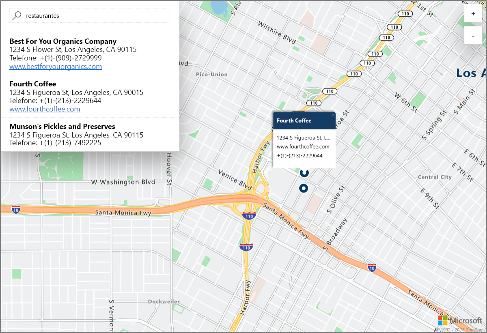

# Iniciar uma pesquisa no mapa interativo de demonstração usando os Serviços do Azure Baseados na Localização (versão prévia)

Este artigo demonstra os recursos dos Serviços do Azure Baseados na Localização (versão prévia), ou LBS, usando uma pesquisa interativa usando Mapas do Azure. Ele também orienta você pelas etapas básicas da criação da sua própria conta do LBS e na obtenção da chave da conta a ser usada no aplicativo Web de demonstração. 

Se você não tiver uma assinatura do Azure, crie uma [conta gratuita](https://azure.microsoft.com/free/?WT.mc_id=A261C142F) antes de começar.

## Faça logon no Portal do Azure

Faça logon no [Portal do Azure](https://portal.azure.com/).

## Criar uma conta dos Serviços Baseados na Localização e obter chave de conta

1. No canto superior esquerdo do [portal do Azure](https://portal.azure.com), clique em **Criar um recurso**.
2. Na caixa *Pesquisar no Marketplace*, digite **serviços baseados na localização**.
3. Em *Resultados*, clique em **Serviços Baseados na Localização (versão prévia)**. Clique no botão **Criar** que aparece abaixo do mapa. 
4. Na página **Criar Conta dos Serviços Baseados na Localização**, insira o *Nome* da sua nova conta, selecione a *Assinatura* a ser usada e insira o nome de um *Grupo de recursos* novo ou existente. Selecione o local para o grupo de recursos, aceite os *Termos de Versão Prévia* e clique em **Criar**.

    

5. Quando a conta for criada com êxito, abra-a e navegue até as **CONFIGURAÇÕES** da conta. Clique em **Chaves** para obter as chaves de assinatura primária e secundária para a sua conta. Copie o valor de **Chave Primária** para a área de transferência local a ser usada na seção a seguir. 

## Baixar o aplicativo de demonstração para Mapas do Azure

1. Baixe ou copie o conteúdo do arquivo [interactiveSearch.html](https://github.com/Azure-Samples/location-based-services-samples/blob/master/src/interactiveSearch.html).
2. Salvar o conteúdo deste arquivo localmente como **AzureMapDemo.html** e abra-o em um editor de texto.
3. Procure a cadeia de caracteres **<insert-key>** e a substitua pelo valor de **Chave Primária** obtido na seção anterior. 

## Iniciar o aplicativo de demonstração para Mapas do Azure

1. Abra o arquivo **AzureMapDemo.html** em um navegador de sua escolha.
2. Observe o mapa mostrado da cidade de Brasília. A cidade é determinada pelo valor do par `[longitude, latitude]` fornecido para a variável de JavaScript chamada **center** no *AzureMapDemo.html*. Você pode alterar essas coordenadas para qualquer outra cidade de sua escolha. Por exemplo, são coordenadas da cidade de Nova York *[-74.0060, 40.7128]*.
3. Na caixa de pesquisa no canto superior esquerdo do aplicativo Web de demonstração, insira qualquer tipo de local ou um endereço que você deseja pesquisar. 
4. Mova o mouse sobre a lista de endereços/locais que aparecem abaixo da caixa de pesquisa e observe como o pino correspondente no mapa mostra informações sobre esse local. Por exemplo, uma inicialização de exemplo deste aplicativo Web e uma pesquisa de *restaurantes* leva ao seguinte. Observe que, para preservar a privacidade de empresas particulares, são mostrados endereços e nomes fictícios. 

    

## Limpar recursos

Os tutoriais entram em detalhes sobre como usar e configurar os Serviços do Azure Baseados na Localização para sua conta. Se você planeja continuar trabalhando com os tutoriais, não limpe os recursos criados neste guia de início rápido. Caso contrário, use as etapas a seguir para excluir todos os recursos criados por este Guia de Início Rápido.

1. Feche o navegador que está executando o aplicativo Web **AzureMapDemo.html**.
2. No menu à esquerda no Portal do Azure, clique em **Todos os recursos** e selecione sua conta do LBS. Na parte superior da folha **Todos os recursos**, clique em **Excluir**.

## Próximas etapas

Neste guia de início rápido, você já criou sua conta do Azure LBS e iniciou um aplicativo de demonstração usando sua conta. Para aprender a criar seu próprio aplicativo usando as APIs dos Serviços do Azure Baseados na Localização, prossiga para o próximo tutorial.

> [!div class="nextstepaction"]
> [Tutorial do Mapa e Pesquisa do Azure para usuário](./tutorial-search-location.md)
